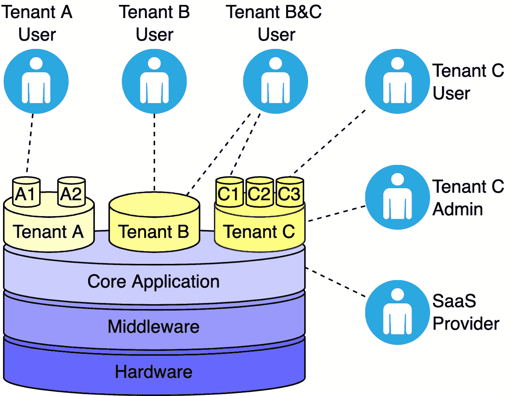
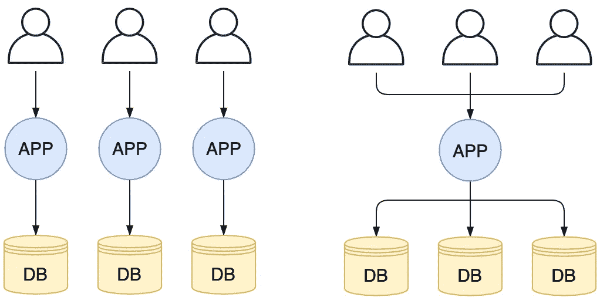
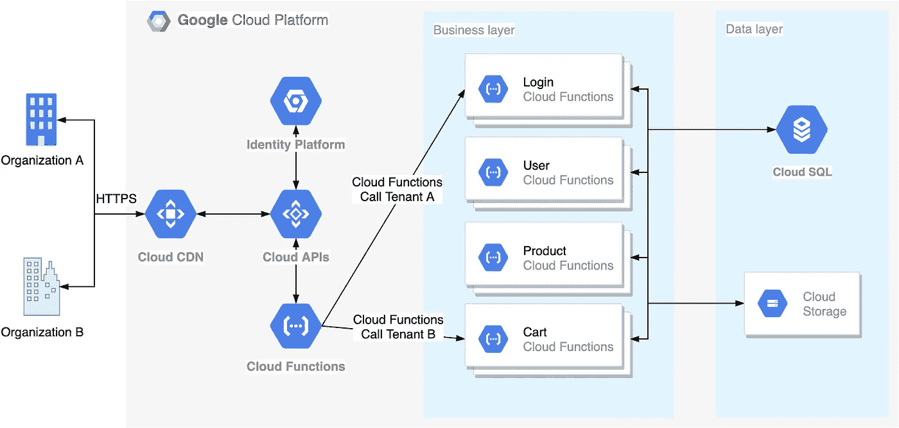

# 多租户应用

> 原文：<https://levelup.gitconnected.com/multi-tenant-application-a29153d31c5a>

*软件架构|*[black thorn . ai](https://blackthorn.ai/)

***多租户*** 概念是指众多用户共享计算、网络和存储资源，但看不到彼此的数据。多租户应用是为每组用户(所谓的 ***租户*** )定制的，而整个架构和核心功能保持不变。多租户是软件即服务(SaaS)供应商的一种典型方法。

多租户应用程序—图片由作者提供。版权所有

听起来像是明智的商业决策？

是的，确实如此。资源利用率增加，因此，项目所有权通常更合理。但它不能用于每个应用程序。让我解释一下多租户是如何工作的，它与单一租户有何不同，以及何时应用它。

# 用例

多租户架构最适合以下类型的应用:

1.  SaaS(软件即服务)或 AaaS(应用即服务)
2.  平台即服务
3.  IaaS(基础设施即服务)
4.  对于多个客户端使用相同算法堆栈的所有其他应用程序。主要功能要么是相同的，要么是模块化的，可以根据客户的任何需求进行定制。

# 多租户与单租户

为了选择典型的架构，我们必须理解两者是如何工作的。

## 1.单租户

每个用户都获得专用的计算、网络和存储资源。每个环境都是单独开发和管理的。本质上，这个选项不允许任何共享。

## **2。多租户**

该模型支持在一个环境中托管多个客户，并重用核心应用程序功能。每个房客都是孤立的，其他人看不见。居民是逻辑上分开的，不是物理上分开的；因此，需要更少的硬件投资。其他优势包括简化的安全支持和更实惠的许可。在许多不同的解决方案上花费更少的时间/精力意味着在核心解决方案上投入更多的时间/精力。在这种情况下，整体质量胜出。

多租户和单租户应用程序—图片由作者提供。版权所有

# 示例解决方案架构

让我们继续看一个简单但真实的多租户解决方案。

这里的数据层由单个共享云 SQL (MySQL)实例和对象存储组成。客户端(租户)使用一系列共享的云功能，这些功能组成了无服务器业务层。

Google Cloud 上的无服务器单数据库多租户架构——图片由作者提供。版权所有

等等……一个数据库？

# **多租户应用中的数据管理**

根据存储数据的方式，可能有不同的多租户数据库解决方案:

## 1.单一数据库+单一模式

=一个数据库模式包含所有租户的数据

在这种情况下，关心租户的数据分离是最重要的。添加像 *TenantID* 或 *ClientID* 这样的数据库索引来划分租户的行。

**好处:**

*   维护一个数据库很容易(与其他选项相比)
*   您可以添加任意数量的新客户(添加就像在表中键入新记录一样简单)。

**陷阱:**

*   对于可能需要不同数据使用模式的不同客户，没有太大的灵活性。当非典型客户到来时，需要进行修补。
*   你冒着浪费时间和精力试图正确分离权限的风险
*   备份和恢复可能会带来额外的问题。因为它包含来自其他客户的数据，所以不容易删除和重新创建表。不得不搜索并覆盖需要的行，这真的是一件痛苦的事情。

**判决:**

对于执行匹配操作的客户来说，这是一个绝佳的选择。

## 2.单个数据库+多个模式

在这个场景中，需要多个表来存储来自不同客户端的数据。模式变成了包含特定表、过程和权限的“名称空间”。

**好处:**

*   模式支持 DBMS 级别的**访问共享**，所以我们不需要做任何进一步的工作(我们节省了精力和金钱，哈利路亚！)
*   更少的数据库—更少的硬件资源。又一次胜利！
*   良好的**延展性**。如果您需要一个新的模式，您可以基于另一个模式构建它。每一次，你都可以随意修改。

**陷阱:**

*   来自几个客户端的数据保存在一起，因为表是逻辑上而不是物理上划分的；
*   备份和恢复都存在问题。我们有一个数据库，如果某个元素失败了，所有东西都可以回滚到以前的状态，这是不可接受的。然后，您可能需要合并新旧信息。容易吗？一点也不，因为这不仅仅是恢复。

**判决:**

对于愿意在共享环境中工作的客户来说，这是一个绝佳的选择。

## 3.独立的数据库

另一种可能的模型是当代码和数据在概念上(也可能是物理上)在客户端之间共享时(通过公共用户界面和业务逻辑)。

**好处:**

*   **扩展性**一键完成。要添加新的客户端，您只需配置新的存储
*   **缩放**很简单。您可以支持不同服务器上的客户端数据库
*   **定制**。您可以更改每个客户端的设置(甚至将存储移动到不同的 DBMS)
*   简单的**备份**。即使一个组件出现故障，其他组件也不会受到影响。

**陷阱:**

*   不便宜。单台服务器支持的存储量是有限的。你可能需要更多的硬件(比所有东西都放在一个地方多得多)。请记住，更多的硬件=更多的管理员、服务器空间和电力开支。
*   还是那句话，不便宜。当您的服务器托管许多位置时，总容量大于 RAM 大小；数据溢出到交换文件中，导致对硬盘的访问非常缓慢。解决方案是购买额外的服务器。

**判决:**

对于安全第一，愿意付钱的客户(比如银行)，这是最好的选择。

# 外卖食品

我希望您已经掌握了足够多的关于多租户的信息，能够根据您的需求做出正确的选择。

以下是这篇文章的要点:

1.  ****多租户环境**托管共享计算、网络和存储资源的独立用户。**
2.  **在多租户模式下运行时，您将从成本节约、资源利用率提高、可重复使用的数据处理元素、简单的版本管理和较低的维护成本中获益。**
3.  **另一方面，你应该准备好面对诸如复杂的开发、高发布风险、有限的个性化、脆弱的安全性、较低的性能和复杂的变更等缺点。**
4.  **在申请多租户场景之前要三思。但是，在为 **SaaS、AaaS、PaaS、IaaS** 以及其他核心功能对所有用户都相同或严格模块化并可轻松满足典型客户需求的应用选择它时，您可以确信无疑。**

**访问[我们的网站](https://blackthorn.ai/)了解更多人工智能解决方案！**

> **版权所有
> Oleksandr(Alex)Gurbych([LinkedIn](https://www.linkedin.com/in/ogurbych/)，[Gmail](mailto:gurbycholeksandr@gmail.com))
> 2022 年 1 月 18 日**