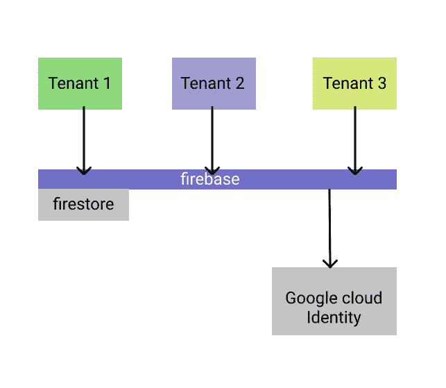
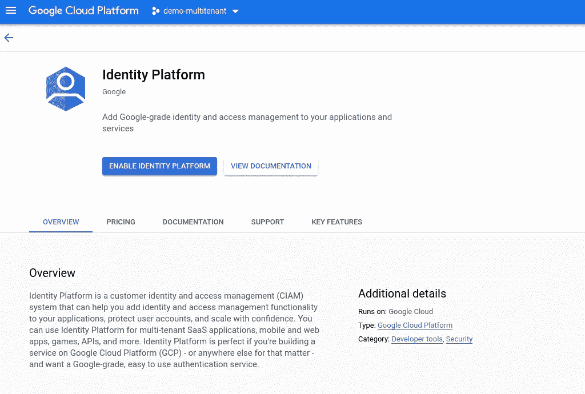
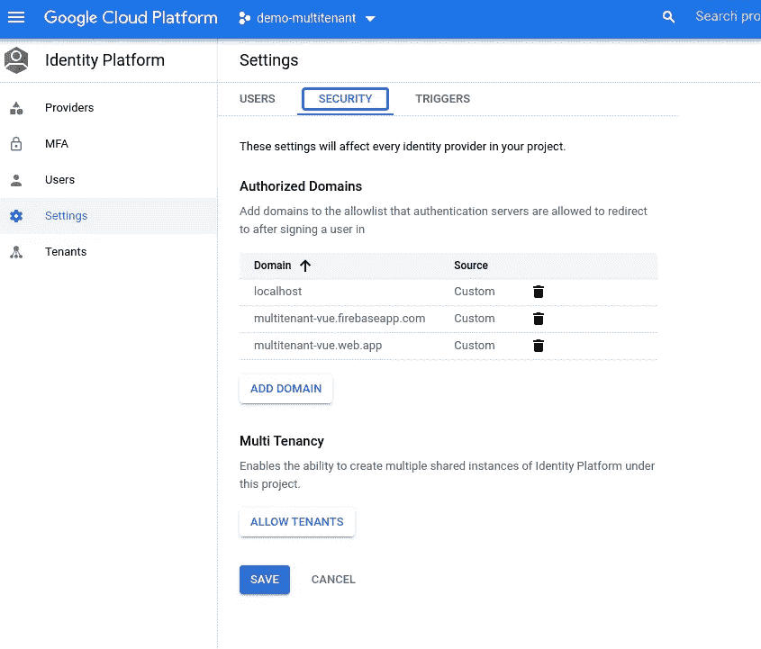
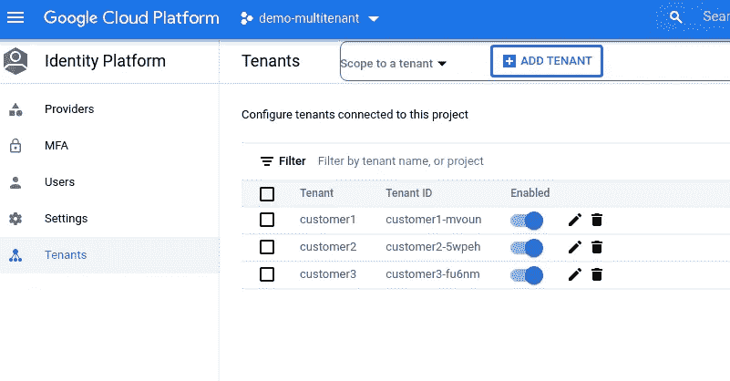
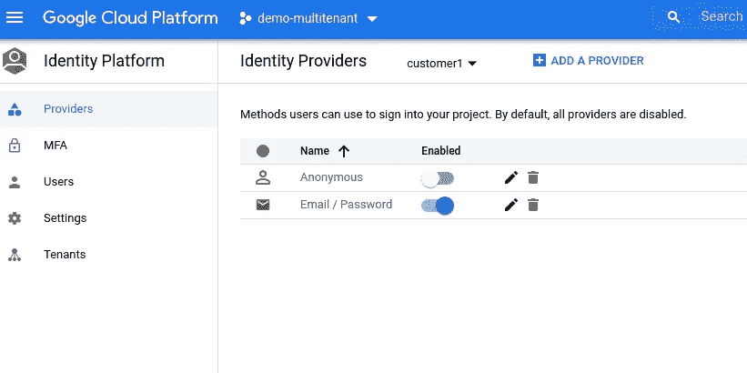
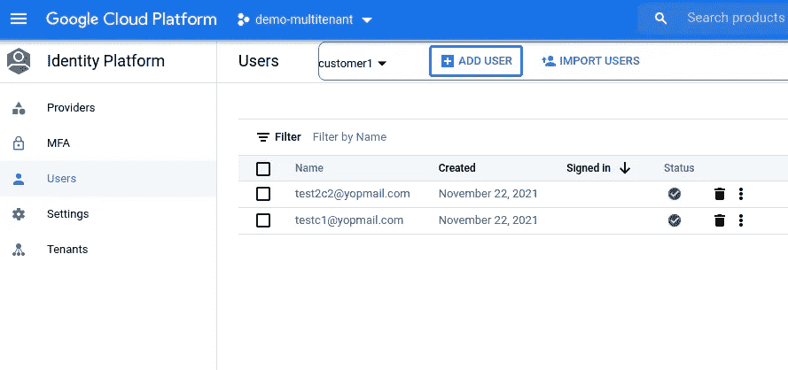
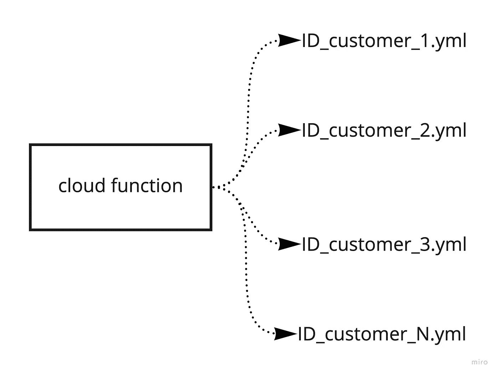

# 具有 firebase 和谷歌云身份的多租户 web 应用程序

> 原文：<https://levelup.gitconnected.com/multi-tenant-web-app-with-firebase-and-google-cloud-identity-f6227f198db6>

由于我正在开发一个 **SAAS** 项目，该项目将由几个共享共同活动但不一定需要相同功能的客户使用，所以我想在本文中分享我是如何管理这个项目的。

在继续这篇文章之前，你必须对 [**firebase**](http://firebase.google.com) 有一个基本的了解。

Firebase 文档建议为每个租户使用单独的项目，以降低安全规则的复杂性并避免数据共享。如果您的项目需要严格的数据分离，那么您应该为每个租户选择一个单独的项目。

您还需要一个谷歌云帐户，以便使用 [**谷歌云身份**](https://cloud.google.com/identity/)

现在让我们开始吧！

## 语境

我们希望构建一个多租户 SAAS 应用程序，供不同的客户使用，他们有自己的用户和自定义配置，但与其他客户有共同的核心功能

## 设置项目

首先，创建您的 Firebase 项目。一旦你这样做了，进入[控制台谷歌云平台](https://console.cloud.google.com/)并搜索你的 firebase 项目。

现在搜索 ***身份平台*** 并启用 API。

身份平台

您将需要一个计费帐户，以便使用身份平台和您的 firebase 项目应该在火焰计划

激活后，转到设置和安全选项卡来激活租户

启用租户后，您将被自动重定向到租户设置。

现在，您可以随意创建多个租户。

对于每个租户，我们将添加提供者，以便在之后创建用户。出于简单的原因，我们将使用电子邮件和密码，但你可以根据你的项目需要添加尽可能多的供应商。

现在，我们可以为每个租户添加用户。用户被一个租户拥有和限制。

现在，您已经完成了租户设置和用户创建。

## 代码结构

现在让我们深入研究代码，看看如何构建它。

我们需要每个租户有一个配置文件，这样就可以很容易地为不同的用例定制项目。

为了做到这一点，我们将把我们的配置文件存储在云函数中，web 应用程序只需要用当前的 tenantId 获取它

云功能—获取租户配置

上面的代码片段使用 yaml 文件作为配置文件

为了简化代码，文件名与租户 ID 相同。

现在让我们来看看为每个租户初始化客户机的代码

这里的配置与 firebase 客户端经典初始化相同。不同之处在于，对于每个租户，您必须在 auth 上显式设置 tenantId。

> ***现在您可以为每个租户实现您的功能。***