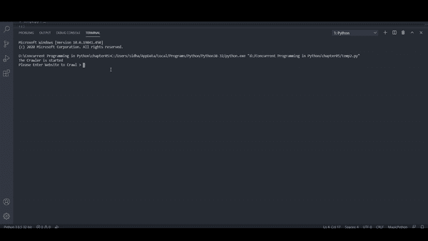

# 多线程的 HTTPS 网页 Python 网络爬虫。

> 原文：<https://levelup.gitconnected.com/multi-threaded-python-web-crawler-for-https-pages-e103f0839b71>

在本文中，我将演示如何构建一个能够处理 https 网页的多线程网络爬虫。

安诺尔·查菲克在 [Unsplash](https://unsplash.com?utm_source=medium&utm_medium=referral) 上拍摄的照片

## 这个网络爬虫将

1.  网络爬虫将利用多个线程。
2.  它将能够抓取一个网站的所有特定网页。
3.  它将能够报告任何 [2XX](https://en.wikipedia.org/wiki/List_of_HTTP_status_codes#2xx_Success) 和 [4XX](https://en.wikipedia.org/wiki/List_of_HTTP_status_codes#4xx_Client_errors) 链接。
4.  它将从命令行接收域名。
5.  它将避免链接的循环遍历。

那么爬虫将如何工作。

因此，让我们通过导入一些构建这个爬虫所需的库来了解它。

*在继续本文之前，我将讨论 SSL 证书，它是如何工作的，以及什么是 SSL 环境。如果你已经知道这一点，你可以跳过这一部分。*

## SSL(安全套接字层):创建加密连接并建立信任。

1.  **什么是安全套接字层(SSL)**

SSL 是在服务器和客户端之间建立加密链接的标准安全技术。更具体地说，SSL 是一种安全协议，它确定链路和传输数据的加密变量。所有浏览器都能够使用 SSL 协议建立到服务器的安全连接。但是，浏览器和服务器需要 SSL 证书才能建立连接。

**2。什么是 SSL 证书。**

SSL 证书通过建立安全连接来创建信任的基础。SSL 证书有一个密钥对:公钥和私钥。这些密钥共同建立加密连接。该证书还包含一个“主题”，即证书或网站所有者的身份。要创建证书，我们必须首先创建证书签名请求或 CSR。这在我们的服务器上创建了一个公钥和私钥。我们将公钥发送给认证机构，如谷歌认证机构。现在，一旦 CSR 被发送到 CA，CA 就创建一个数据结构来匹配我们的私钥，而不会泄露密钥。

任何人都可以创建证书，但是浏览器只信任由可信 CA(如 Google CA)数字签名的证书。

3 **。如何使用 SSL 证书创建安全连接？**

当浏览器试图访问受 SSL 协议保护的网站时，浏览器和 web 服务器使用 SSL 握手过程建立 SSL 连接。有三个键有助于 SSL 连接。

1.  公开密钥
2.  私人密钥
3.  会话密钥

用公钥加密的任何东西只能用私钥解密，反之亦然。这两个密钥仅在 SSL 握手期间使用，在建立安全连接后，会话密钥用于加密所有传输的数据。

现在我们清楚了什么是 SSL 握手和什么是 SSL 证书的一般概念，让我们看看什么是 SSL 上下文。

**SSLContext 定义 1** :是密码、协议版本、可信证书、TLS 选项、TLS 扩展等的集合。由于具有相同设置的多个连接非常常见，因此将它们放在上下文中，然后基于该上下文创建相关的 SSL 连接。创建一个新的连接，你只需要参考上下文，从而节省时间和内存。

**SSL context definition 2**:这个类的实例代表一个安全套接字协议实现(SSL)，它充当安全套接字工厂或 SSL 引擎的工厂。这个类用一组可选的密钥和信任管理器以及安全随机字节源初始化。

**SSL 上下文:**

SSL 上下文保存的各种数据比单个 SSL 连接保存的时间更长，比如
1。SSL 配置。
2。SSL 选项。
3。证书
4。私钥。
它还管理服务器端套接字的 SSL 会话缓存，以加速来自同一客户端的重复连接。

好了，现在让我们开始实现爬虫类。这个类将继承`threading.Thread`类，这样我们就可以创建自己的定制线程。我们的 __init__ 方法将有以下参数。

**base_url** :将用于检查并查看我们还没有离开我们最初打算爬取的站点
。例如，如果[http://www.python.org](http://www.python.org)
是我们的基本 url，那么这个链接将被设置为基本 URL。
我们将能够从该域抓取链接。数据类型:字符串

**error_links** :这是一个列表，将会填充任何
抛出 URLError 的链接。数据类型:list

**links _ to _ crawl**:这是一个 Queue.queue，将被填充尚未被爬网的链接。数据类型:queue . queue

**have _ visited**:这是一个集合()，将包含已访问链接的列表。数据类型:集合

**url_lock:** 我们需要让我们的数据结构线程安全，这样就不会出现竞争情况。数据类型:线程。锁

现在让我们看看 run()函数，它将调用所有的线程。

最后，让我们运行代码。

输出:

完整代码:

 [## kshirsagarsiddharth/python _ cookbook

### 在 GitHub 上创建一个帐户，为 kshiragarsiddharth/python _ cookbook 的开发做出贡献。

github.com](https://github.com/kshirsagarsiddharth/python_cookbook/blob/master/multithreaded_crawler.py) 

参考资料:

 [## 学习 Python 中的并发性

### “十多年来，预言家们一直表示，单台计算机的组织已经达到了它的极限……

www.packtpub.com](https://www.packtpub.com/product/learning-concurrency-in-python/9781787285378)  [## 什么是 SSL(安全套接字层)？DigiCert.com

### 在线业务最重要的组成部分之一是创造一个可信的环境，让潜在客户…

www.digicert.com](https://www.digicert.com/ssl/#:~:text=Secure%20Sockets%20Layer%20%28SSL%29%20is,client%20%28e.g.%2C%20Outlook%29.)  [## 套接字对象的 ssl - TLS/SSL 包装器- Python 3.8.5 文档

### 该模块提供对传输层安全性(通常称为“安全套接字层”)加密和对等…

docs.python.org](https://docs.python.org/3/library/ssl.html#ssl.match_hostname)  [## urllib.request -用于打开 URL 的可扩展库- Python 3.8.5 文档

### 源代码:Lib/urllib/request.py 该模块定义了一些函数和类，它们有助于在…

docs.python.org](https://docs.python.org/3/library/urllib.request.html)  [## urllib.parse -将 URL 解析成组件- Python 3.8.5 文档

### 源代码:Lib/urllib/parse.py 这个模块定义了一个标准接口来中断统一资源定位符(URL)…

docs.python.org](https://docs.python.org/3/library/urllib.parse.html)  [## 美丽的汤文档-美丽的汤 4.9.0 文档

### Beautiful Soup 是一个 Python 库，用于从 HTML 和 XML 文件中提取数据。它与您最喜欢的解析器一起工作…

www.crummy.com](https://www.crummy.com/software/BeautifulSoup/bs4/doc/)  [## 线程化——基于线程的并行性——Python 3 . 8 . 5 文档

### 源代码:Lib/threading.py 这个模块在较低级别的基础上构建了较高级别的线程接口…

docs.python.org](https://docs.python.org/3/library/threading.html) 

https://docs.python.org/3/library/queue.html