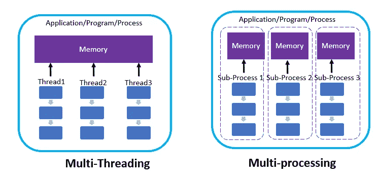
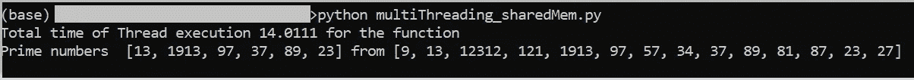
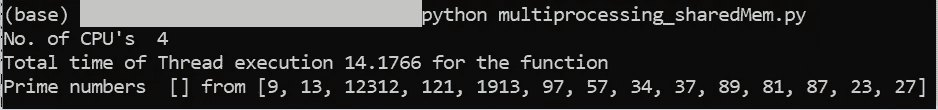
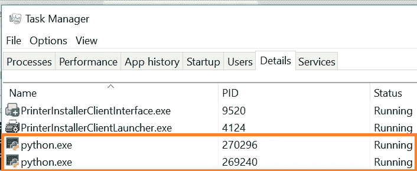
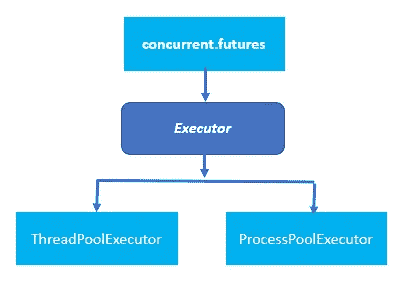
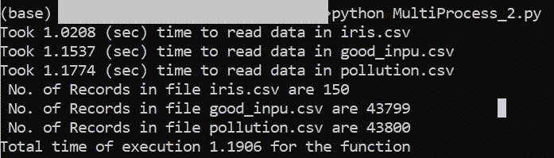

# Python 中的多线程和多重处理

> 原文：<https://levelup.gitconnected.com/multi-threading-and-multiprocessing-in-python-3d5662f4a528>

## 在 Python 中何时以及如何使用多重处理和多线程

在本文中，您将了解到

*   多线程和多处理的区别以及何时使用它们
*   使用 ***多重处理*** 和 ***并发处理*** 在 Python 中实现多重处理


照片由 [Michael Dziedzic](https://unsplash.com/@lazycreekimages?utm_source=unsplash&utm_medium=referral&utm_content=creditCopyText) 在 [Unsplash](https://unsplash.com/s/photos/computer-processor?utm_source=unsplash&utm_medium=referral&utm_content=creditCopyText) 拍摄

## 什么是多重处理？

*   多重处理允许你在一个程序中产生多个进程。
*   它允许你在你的机器上利用多个 CPU 内核
*   **一个程序内的多个进程不共享内存**
*   **避开了 Python** 的 GIL(全局解释器锁)限制，只允许一个线程控制 Python 解释器
*   **用于计算或 CPU 密集型程序**

***那么什么是多线程，什么时候使用？***

**一根线就是**

*   **程序中执行的最小独立命令集**
*   一个应用中的多个线程可以在一个 CPU 上同时执行，称为**多线程**
*   **总是在程序**中运行，不能独立运行
*   **当程序受限于网络或有大量 I/O 操作时使用**
*   **内存在进程**中的多个线程之间共享，因此具有较低的资源消耗



下面的代码演示了多重处理不共享内存，而多线程共享内存。

*在下面这段代码中，我们检查列表中传递的数字是否是质数。我们将同时使用多线程和多处理来实现这一点*

## 使用多线程共享全局变量

我们创建了一个全局列表变量， ***prime_list，*** 来存储所有素数。

遍历所有的 ***list_of_num*** ，检查数字是否为质数。

```
import threading
import timeprime_list=[]
**def get_prime_numbers(numbers):
    for num in numbers:
        time.sleep(1)
        if check_if_prime(num)==True:
            prime_list.append(num)
    return prime_list****def check_if_prime(num):
    if num > 1:
       # check for factors
       for i in range(2,num):
           if (num % i) == 0:
               return False
               break
       else:
           return True

    # if input number is less than or equal to 1,then not a prime
    else:
       return False****def main():**
    start_time=time.perf_counter()
    **list_of_num=[9,13,12312, 121, 1913, 97, 57, 34, 37, 89, 81 , 87, 23, 27]**

    **t1 = threading.Thread(target=get_prime_numbers, args=[list_of_num])
    t1.start()
    t1.join()**
    end_time=time.perf_counter()

    **print(f"Total time of Thread execution {round(end_time- start_time,4)} for the function ")
    print(f'Prime numbers  {prime_list} from {list_of_num}')****if __name__=='__main__':
    main()**
```

***由于线程共享内存或全局变量，所以值是持久的，我们可以在程序的输出中看到这一点。***



## 使用多重处理的共享全局变量

它与上面的功能相同，但是我们使用了 ***多处理*** 库，而不是 ***线程*。**

对于多重处理，创建一个流程实例，并将要执行的函数传递给 target，并将所有参数传递给 args。这与多线程中的情况相同。

使用 ***process.start()启动流程。***

主流程使用 ***join()*** 等待子流程完成

点击[此处](/implementing-threading-in-python-3e2e0858ad07)了解更多关于多线程的信息。

```
**import multiprocessing**
import time**prime_list=[]****def get_prime_numbers(numbers):
    for num in numbers:
        time.sleep(1)
        if check_if_prime(num)==True:
            prime_list.append(num)
    return prime_list****def check_if_prime(num):
    if num > 1:
       # check for factors
       for i in range(2,num):
           if (num % i) == 0:
               return False
               break
       else:
           return True

    # if input number is less than or equal to 1 else  not prime
    else:
       return False**def main():
    start_time=time.perf_counter()
    **list_of_num=[9,13,12312, 121, 1913, 97, 57, 34, 37, 89, 81 , 87, 23, 27]
    print("No. of CPU's ", multiprocessing.cpu_count())
    p1 = multiprocessing.Process(target=get_prime_numbers, args=[list_of_num])
    p1.start()
    p1.join()**
    end_time=time.perf_counter()

    **print(f"Total time of Thread execution {round(end_time- start_time,4)} for the function ")
    print(f'Prime numbers  {prime_list} from {list_of_num}')****if __name__=='__main__':
    main()**
```

***由于每个进程都有其全局变量的副本，我们看到，全局变量 prime_list 是空的***



您还可以转到任务管理器，并在“详细信息”选项卡下查看正在运行的多个 python.exe



显示多个 python 进程的任务管理器

# 进程池执行器

ProcessPoolExector 是一种使用`[**concurrent.futures**](https://docs.python.org/3/library/concurrent.futures.html#module-concurrent.futures)**.**`实现和产生多个进程的简单方法



concurrent.futures 有一个抽象类 Executor，它有两个具体的子类

*   **线程池执行器:用于多线程**
*   **ProcessPoolExecutor:用于多重处理**

在下面，我们使用了***ProcessPoolExecutor***来读取 CSV 文件，然后打印文件中的记录数。

```
import concurrent.futures
import time
import pandas as pd
**def read_data(file):
    t1= time.perf_counter()
    data= pd.read_csv(file)
    #data = data.sort_index(ascending=False)
    time.sleep(1)
    t2= time.perf_counter()
    print(f"Took {round(t2-t1,4)} (sec) time to read data in {file}" )
    return f' No. of Records in file {file} are {len(data)}'****def main():**
    start_time=time.perf_counter()

    **with concurrent.futures.ThreadPoolExecutor() as executor:
        file_list=['pollution.csv', 'good_inpu.csv', 'iris.csv']
        return_results=[executor.submit(read_data, file) for file in file_list]**

  **  for f in concurrent.futures.as_completed(return_results):
        print(f.result())**

    end_time=time.perf_counter()
    **print(f"Total time of execution {round(end_time- start_time,4)} for the function")****if __name__=='__main__':
    main()**
```



## 结论:

对于 I/O 或网络密集型程序，使用多线程使用 ***线程*** 类或***ThreadPoolExecutor***。对于 Python 中的计算或 CPU 密集型程序，为了避开 GIL 限制，使用多处理，使用 ***多处理*** 或 **ProcessPoolExecutor。**