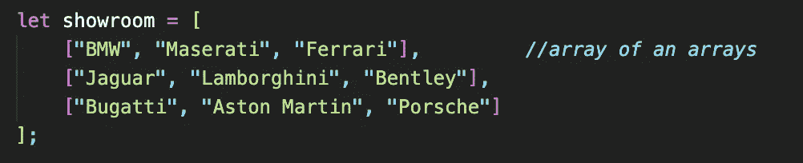
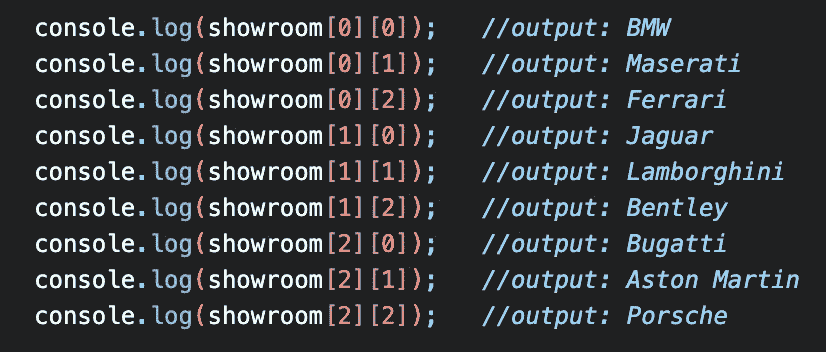
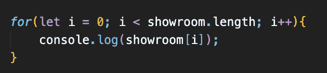
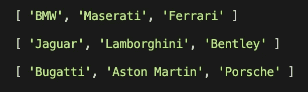
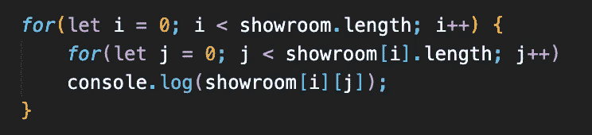
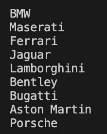
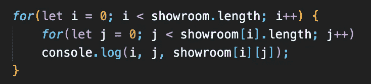
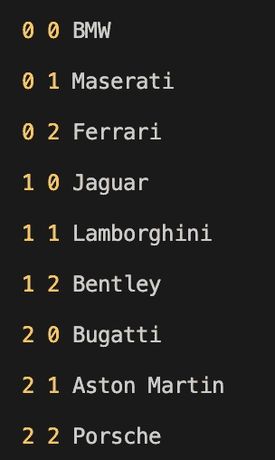

# JavaScript 中的多维数组

> 原文：<https://levelup.gitconnected.com/multidimensional-array-in-javascript-d968a7efe14>

在 [Unsplash](https://unsplash.com?utm_source=medium&utm_medium=referral) 上由 [Faris Mohammed](https://unsplash.com/@pkmfaris?utm_source=medium&utm_medium=referral) 拍摄的照片

JavaScript 本身没有多维数组，要拥有多维数组，我们必须创建一个数组的数组。

多维数组包含一个元素矩阵。

在这个例子中，我们将使用一个汽车陈列室，其中汽车是停放和排列的元素，就像一个具有行和列的网格。

汽车陈列室将是一个独立数组的多维数组，网格中的每一行都是一个矩阵。

要访问多维数组中的元素，需要两个索引，如下例所示。

但是如果我们的数组中有很多元素需要控制台处理，那就不太现实了。因此，我们可以使用“For 循环”和“嵌套 for 循环”，这是循环中的循环

如果我们只使用下面的外部循环:

输出将是每个数组的数组:

为了分别显示每个元素，我们需要使用一个嵌套循环:

输出将是:

最后，我们还可以显示索引以及每个元素:

通过这样做，我们可以看到元素所在的坐标。

现在你有了，JavaScript 中的多维数组…

编码快乐！