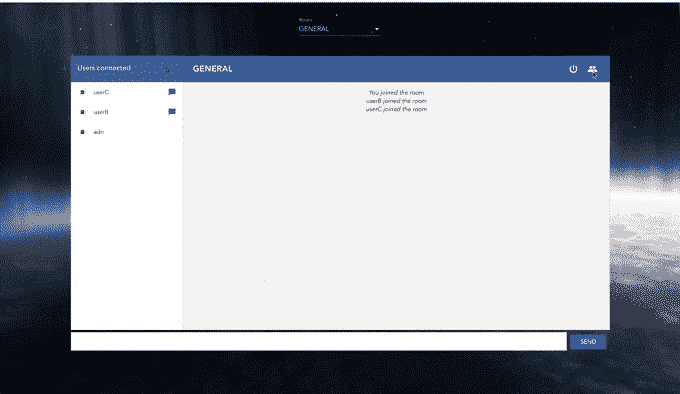
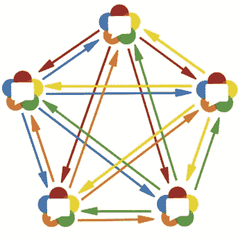
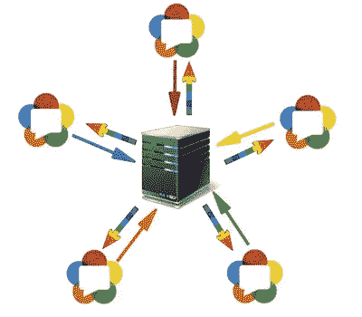
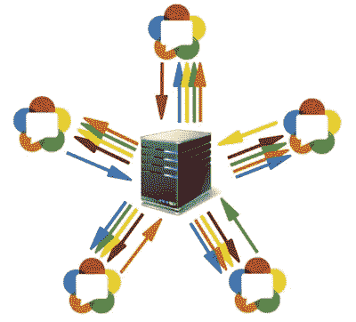
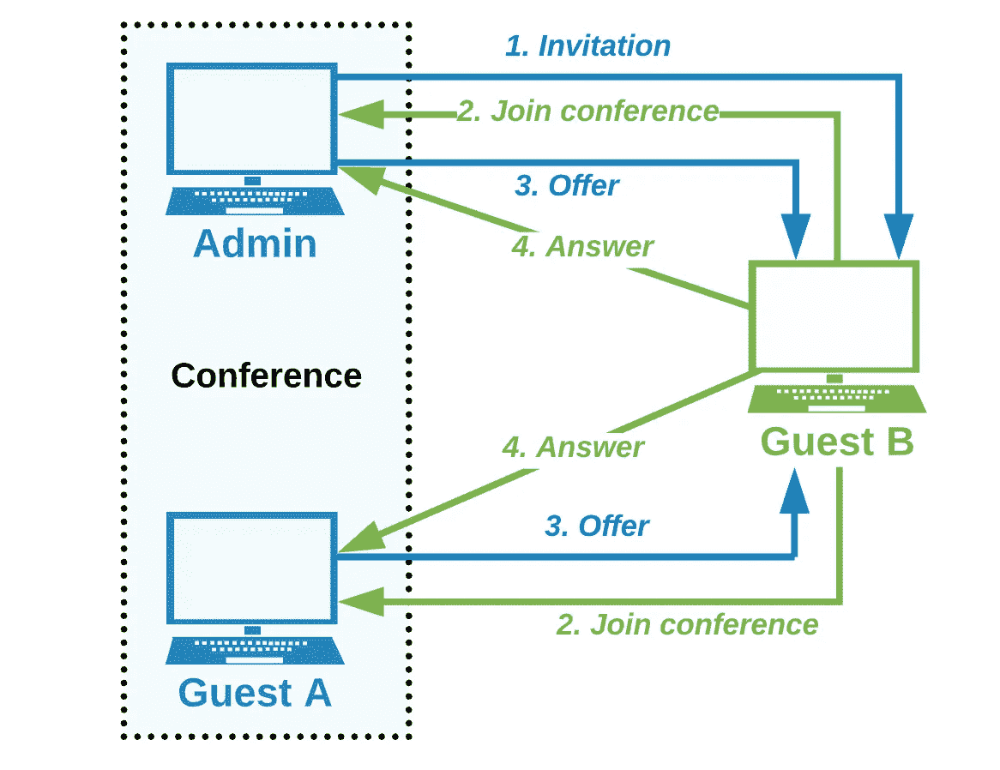
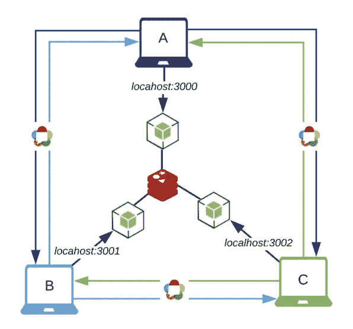
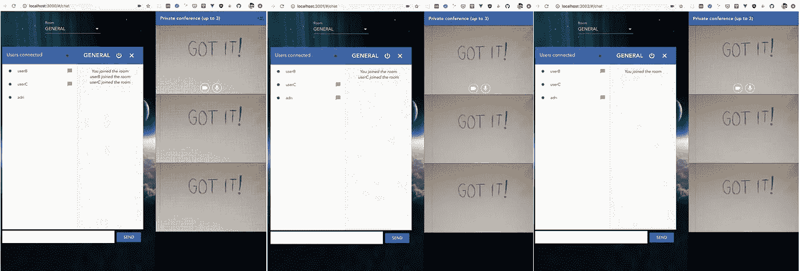
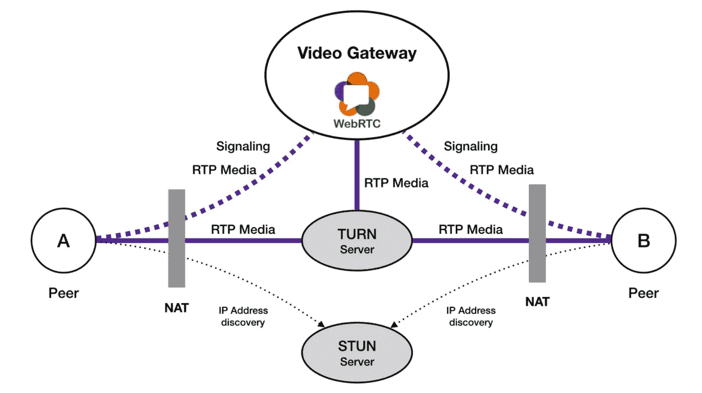

# 使用 Vue、WebRTC、SocketIO、Node 和 Redis 的多方视频会议

> 原文：<https://levelup.gitconnected.com/multiparty-video-conference-using-vue-webrtc-socketio-node-redis-e8c5a059d332>

在过去的几个月里，由于隔离时间的原因，视频会议应用出现了巨大的增长。几乎每个人无论身在何处都能见到自己的朋友，那么我们何不再次尝试构建自己的会议应用，让它更加真实呢？再来一次，让我们开始吧！


缩放应用程序捕获

为了实现这一目标，我们不会从头开始。在我的上一篇文章中，我们通过一对一 视频功能，完成了构建我们自己的带有私人聊天的视频聊天所需的所有步骤。在这里**我们将以此为起点**进行推广，并最终为其添加 ***多对多*** 功能。

[](/build-your-own-video-chat-with-vue-webrtc-socketio-node-redis-eb51b78f9f55) [## 使用 Vue、WebRTC、SocketIO、Node & Redis 构建您自己的视频聊天

### 通过水平缩放构建多房间视频聊天

levelup.gitconnected.com](/build-your-own-video-chat-with-vue-webrtc-socketio-node-redis-eb51b78f9f55) 

> 如果你还没有检查它，我建议你在继续阅读这篇文章之前看一看，因为我们将提到几个已经解释过的概念。

在这种情况下，我们会议的主要特点将是:

*   打开会议的用户将成为其 ***管理员*** *，*是唯一一个能够将更多用户 添加到会议中的用户
*   管理员只能从同一个公共房间 添加 ***用户***
*   无论是开始一个会议还是加入一个会议， ***用户都不能与任何其他人私下交谈***
*   已经在会议 ***中的用户不能同时进行私人聊天*** ，因此 ***没有人能够与他*** 交谈
*   一旦管理员取消会议，所有用户将被自动踢出



测试视频会议功能

但是在深入研究实现细节之前，让我们快速浏览一下在讨论 webRTC 多方架构时的主要方法。

## 网状物

[**网状**](https://webrtcglossary.com/mesh/) 拓扑是最简单的一种。所有对等体相互连接，直接向所有对等体发送它们的媒体。



网状 webRTC 架构

**优点:
。**基本而简单的 webRTC 实现
**。**不需要媒体中央服务器

**Const:**
**。**过度的处理和带宽消耗( ***N-1 上行和下行*** )

**。**无法扩展到大量参与者(*最多 4–6 个同行*)

## 混音和 MCU(多点会议单元)

每个对等体将其媒体发送到中央服务器，并从中央服务器接收媒体。 [**MCU**](https://webrtcglossary.com/mcu/) 充当混合点，接收来自所有对等体的输入媒体，
将它们全部解码并混合，以最终将它们作为单个流发送给所有用户。



MCU 混合架构

**优点:**
**。**客户端的基本 webRTC 实现

**。 *1 上行和下行*每对端**

**缺点:**
**。** MCU 需要高处理能力的服务器端(*解码和编码每个对等体的媒体*

例如[**Kurento**](https://doc-kurento.readthedocs.io/en/6.13.2/index.html)**提供 MCU 媒体服务器来实现视频应用(除了下面提到的 SFU 拓扑)。**

## **路由和 SFU(选择性转发单元)**

**每个对等体将其媒体发送到中央服务器，并从中央服务器接收所有其他对等体的媒体。 [**SFU**](https://webrtcglossary.com/sfu/) 就像一个媒体路由器，接收来自所有用户的输入媒体，然后决定将哪些流发送给哪些用户。**

****

**SFU 路由体系结构**

****优点:**
**。**服务器端的计算成本更低(*比 MCU* 低)**

****。**要求非对称带宽( ***1 上行和 N-1 下行*** )，适用于 ADSL 连接**

****Const:**
**。**服务器端的复杂设计和实现**

**为了路由媒体，SFU 可以采用三种不同的方法:*多单播*、*联播*和 *SVC* 、*(可伸缩视频编码)*。像[机制和配置将完全相同。因此，我们将`**WebRTC.js**`文件中的所有内容隔离为](https://medium.com/u/5448cefded7f#b2b9) [*mixin*](https://vuejs.org/v2/guide/mixins.html) :**

**WebRTC 混合**

**这样，我们就有了一个通用的方法来创建所需的所有步骤***RTCPeerConnection***不可知，因此适当的组件将负责提供和处理 PeerConnection 对象以及流程中所需的所有合适的信息*(远程描述、候选人、报价、答案等等)*。**

> **使用 mixins 时，检查所有的 [**合并策略**](https://vuejs.org/v2/guide/mixins.html#Option-Merging)**

## **视频和控件**

**[视频](https://www.w3schools.com/html/html5_video.asp)相关内容，我们创建了一个通用的`**Video.vue**`组件来简化事情:**

**视频组件**

**在每种情况下，组件将获得正确的[媒体流](https://developer.mozilla.org/en-US/docs/Web/API/MediaStream)以及其余的输入值。**

> **pauseVideo 和 pauseAudio 将是通用的 mixin 媒体方法**

**此外，我们还添加了视频-音频控件(`**AudioVideControls.vue**`)，这样每个对等点将能够分别*暂停/恢复*和*关闭/打开*自己的视频和音频，如下所示:**

```
**// Pause video**
this.ls.getVideoTracks().forEach(*t* *=>* t.enabled = !t.enabled)
**// Pause audio**
this.ls.getAudioTracks().forEach(*t* *=>* t.enabled = !t.enabled)
```

****那个** **不是指每次都恢复 webRTC 连接**，而只是启用/禁用音频/视频本地流轨道。**

## **声音的**

**在之前的版本中有一些讨厌的音频问题，所以我们已经解决了它们，在请求[用户媒体](https://developer.mozilla.org/es/docs/Web/API/Navigator/getUserMedia)时，在通用配置中设置了一些限制:**

```
constraints: {
 audio: {
  echoCancellation: true,
  noiseSuppression: true,
  autoGainControl: false
 }
}
```

> **您可以在[**media track API**](https://developer.mozilla.org/en-US/docs/Web/API/MediaTrackConstraints)中检查所有可用的约束**

**但是这还不够，为了消除回声和噪声，我们还需要将[静音](https://www.w3schools.com/tags/att_video_muted.asp)并将[音量设置为 0](https://www.w3schools.com/tags/av_prop_volume.asp)****本地视频**元素如下:****

```
**// Local video
<video id="localVideo" autoplay="true" **muted**> </video>// Fix volume to 0 **this.myVideo.volume = 0****
```

****请记住**这并不意味着你静音正在进行的音频流** **本身** **而只是本地播放。******

## ****WebRTC 适配器****

****为了处理潜在的浏览器问题，我们将[***webrtc-adapter***](https://github.com/webrtc/adapter)作为粘合剂，将代码粘贴到不同的 WebRTC 浏览器实现中。****

```
****import adapter from ‘webrtc-adapter’***console*.log(`Browser ${adapter.browserDetails.browser} — version ${adapter.browserDetails.version}`)**
```

## ****用户信息****

****如前所述，用户不能同时进行私人聊天和会议，因此我们在用户加入房间(`joinRoom` web socket server listener)时，为存储在 Redis 中的对象添加了一个会议标志，以跟踪用户状态:****

```
**try {
  // add user to the suitable ROOM
  await ChatRedis.addUser(room, userName, { username, status,   
   privateChat: false, 
   **conference: false** 
  })
 *const* users = await ChatRedis.getUsers(room)
  // Notify all the users in the same room   
  namespace.in(room).emit(‘newUser’, { users, username })
} catch (error) {
  *console*.log(error)
}**
```

> ****请注意，我们已经更改了 redis [**hash**](https://redis.io/commands/hset) 模式中的密钥(用户名，而不是以前的 socketId ),现在它对于从任何 web 套接字连接获取任何用户信息都更有用****

# ****正式会议****

****会议将以用户**发起会议** **开始，因此**成为其管理员**。一旦打开，管理员将自动加入由自己的用户名**定义的**会议室。******

> ****请记住，用户名在系统中是唯一的，因此每个 web socket 会议室都是唯一的****

****为此，我们设置了一个新的`**joinConference**`服务器监听器:****

******join conference**web 套接字服务器监听器****

> ****使用`conference: to` **时，同一会议**内的所有对等体将具有**相同的会议标志值**:管理员用户名****

****就前端而言，新的`**Conference.vue**`组件将拥有相关的功能:****

******Conference.vue** 组件****

****`**peers**`对象将跟踪会议中的所有用户:****

```
**peers: {
  userA: {
    username: **// Peer username**
    pc: **// RTCPeerConnection** 
    peerStream: **//Peer media stream**
    peerVideo: **// Peer video element**
  },
  userB: { .. },
  ..
}**
```

****对于每个用户，我们将存储用户名、对等连接对象([*RTCPeerConnection*](https://developer.mozilla.org/es/docs/Web/API/RTCPeerConnection))、为该对等用户定位的视频元素以及连接成功建立后获得的视频流。****

> ****为此，我们也可以使用一个 [**映射**](https://developer.mozilla.org/en-US/docs/Web/JavaScript/Reference/Global_Objects/Map) 作为数据结构。在我们的例子中，对象结构已经足够好了，但是 Map 在存储大型数据集时性能更好(O(1))，所以对于大型会议来说，它可能是一个更好的选择****

****当管理员开始会议时，`Conference`组件被实例化，我们得到媒体并自动加入房间。从那时起，**管理员将通过`**conferenceInvitation**`事件向每个新的对等方**发送邀请:****

****会议邀请 web 套接字服务器侦听器****

****简而言之，管理员和第一个用户之间的机制如下:****

1.  ******管理员(A)** 打开会议并加入房间- `*joinConference*` 套接字事件****
2.  ******A** ***向**用户 B**-**`*conferenceInvitation*`*socket 事件发送邀请**********
3.  ********B** 收到邀请 ***加入会议室*** - `*joinConference*`******
4.  ********A** ***接收******确认*** ， ***添加*** **B** 为会议成员(对其自身的`peers`对象)，创建**发送********
5.  *********B** 得到提议， ***添加* A** 为会议成员(对其自身的`peers`对象)，创建并发送 ***答案*** 给 **A*********

> ******正如我们在[之前](/build-your-own-video-chat-with-vue-webrtc-socketio-node-redis-eb51b78f9f55#397c)所做的，我们已经在父`***Chat.vue***`视图组件中实现了合适的 FE 套接字监听器来处理邀请和确认事件******

******除了相应地管理对等体对象之外，从第 4 点开始，webRTC 机制与上一篇文章中在之前解释的[完全相同，但是现在**会议室将成为会议中所有对等体之间的信令机制。**](/build-your-own-video-chat-with-vue-webrtc-socketio-node-redis-eb51b78f9f55#8700)******

******它的目的保持不变，提供一种方式**与会议中的所有对等方进行通信，以交换通信所需的元数据**。为了简单起见，在这种情况下，我们在我们的`Chat.vue`视图中用相关的监听器方法定义了另一个信令套接字事件`**PCSignalingConference**` :******

```
****PCSignalingConference: *function*({ *desc*, *from*, *to*, *candidate* }) {

 // Rule out message when needed
 if (from === this.$store.state.username || 
    (!!to && to !==  this.$store.state.username)) return if (desc) {
   **// Offer**
   if (desc.type === DESCRIPTION_TYPE.offer)
     this.conference = { 
       …this.conference, 
       offer: { from, desc }, 
       open: true 
     }
   **// Answer**
   else if (desc.type === DESCRIPTION_TYPE.answer)
     this.conference = { 
       …this.conference, 
       answer: { from, desc } 
     } } else if (candidate) {
   **// Candidate**
   this.conference = { 
     …this.conference, 
    candidate: { from, candidate } 
   }
 }
}****
```

******与之前相同，基于通过信令信道发送的信息，我们区分要添加到连接的*提议*、回答*T21 或者新的[候选](https://developer.mozilla.org/en-US/docs/Web/API/RTCPeerConnection/icecandidate_event)。*******

> ******但是，即使遵循相同的过程，管理员和用户 B 到底是如何处理的呢？******

******当 B 确认到达时，管理员激活会议，因此我们将向我们的`**Conference.vue**`组件添加以下内容:******

******对会议中的新用户做出反应******

******对于每个新用户，管理员将启动 webRTC 机制，通过`initWebRTC`方法创建一个要约，方式与我们在私聊中的方式相同，但现在使用 mixin 提供的方法。******

> ******注意，我们使用`**this.$set**`向我们的`peers`对象添加一个新的对等体。这是由于在实例初始化后检测属性添加或删除时的限制。点击阅读更多关于反应性的信息******

******另一方面，用户 B 在得到管理员提议之前不会发起会议，所以我们也将在我们的`**Conference.vue**`组件中进行新的更改:******

******新用户获得优惠******

******一旦接收到提议，新的对等体通过上述相同的逻辑`initWebRTC`创建并发送答案。******

> ******如果会议已经有两个用户，而管理员邀请了第三个用户，该怎么办？******

******上述过程将是相同的，但扩展到更多的用户:******

************

******访客 B 加入具有两个用户现有会议******

******如图所示，在管理员邀请***【1】***之后，会议中的所有用户在得到确认***【2】***后，会立即向新的对等方发送一个要约***【3】***。此后，新对等体将向他们中的每一个回复一个答案 ***(4)*** ，从而建立两个连接 ***(N-1 个上行和下行链路)*********

> ******基于这一点，你可以想象一旦我们想把它扩展到更多的用户，事情会变得有点麻烦******

******请记住，尽管**和**不会同时发生，因此**不会以任何特定的顺序到达新的对等体**，因此`GuestB`需要处理我们的`Conference.vue`组件中缺乏同步性的问题:******

```
****watch: {
   conference: *function*({ *offer* }, *oldVal*) {
     **// New offer**
     if(offer && offer !== oldVal.offer && !!oldVal.offer){
       *const* { from, desc } = offer
       this.init(from, desc)
     }
   }
}****
```

******正如所指出的，第一个报价将启动会议，所以我们需要在那之后发现新的报价。在我们的例子中，我们通过 props `**conference**`对象一次只处理一个 offer，所以在处理几个连续的 offer 时，我们需要小心不要误导对象引用，因此在两种情况下检索 offer 信息时都要创建常量。******

> ******`conference`对象只是一个包含正确信息的对象，这些信息在每种情况下都与提议、回答、ice 候选、远程用户等有关。******

******最后但同样重要的是，当会议结束时，我们离开会议并停止所有媒体:******

```
****beforeDestroy() {
  **// Close all peer connections**
  *Object*.values(this.peers).forEach(*peer* *=>* peer.pc.close())
  this.peers = {}
  **// Leave conference**
  this.$socket.emit(WS_EVENTS.leaveConference, { 
    …this.$store.state,
    from: this.username,
    conferenceRoom: this.conference.room
  })
},****
```

******每个对等体将重置所有对等体连接，并通过`**leaveConference**`事件离开会议，适当地重置会议标志:******

******离开会议 web 套接字服务器侦听器******

******媒体相关，`webRTC` mixin 将在被破坏之前重置本地媒体流:******

```
****beforeDestroy() {
  this.localStream.getTracks().forEach(*track* *=>* track.stop())
}****
```

> ******把所有东西拼凑在一起，我们就可以试一试我们的解决方案了！******

******为了进行测试，我们将为每个用户创建一个应用实例，因此我们将通过`**docker-compose.yml**`文件向[配置](/build-your-own-video-chat-with-vue-webrtc-socketio-node-redis-eb51b78f9f55#e1f4)添加我们应用的第三个副本:******

```
******# Copy 3** chat3:
 build:
  context: .
  args:
   VUE_APP_SOCKET_HOST: localhost
   VUE_APP_SOCKET_PORT: 3002
 ports:
  - 3002:3002
 networks:
  - video-chat
 depends_on:
  - redis
 environment:
  PORT: 3002
  REDIS_HOST: redis
  REDIS_PORT: 6379****
```

******这样，我们将拥有以下本地测试环境:******

************

******本地测试环境******

******现在我们只需要通过`docker-compose`构建并运行我们的容器，瞧！******

************

******3 个对等方的视频会议本地测试(每个用户一个实例)******

******我们将有三个用户连接到不同的实例，并通过对等连接在他们之间进行会议。******

> ******webRTC 应用程序中的错误追踪和解决有时可能有点复杂。有了 Firefox 你可以查看页面**关于:webrtc** 。它将为您提供关于 SDP 会议、ICE 候选人等非常方便的信息。******

> ******请记住，WebRTC 使用 ICE 框架来克服网络复杂性******

******在本地环境中进行测试时，一切都应该运行顺利。在这种情况下，对等体将通过`**host**`候选者交换网络信息，这意味着 ip 地址是远程对等体的真实地址(同一网络内的所有对等体)。查看小型 *UDP 报价*平板的示例:******

```
****a=candidate:0 1 **UDP** 2122121471 198.167.1.138 54056 **typ host**
a=candidate:6 1 **UDP** 2122252543 fd8b:15c5:43b9:9m00:1c89:1vvc:2592:c9c6 54057 **typ host**
a=candidate:18 1 **TCP** 2105393407 192.168.1.130 9 **typ host** tcptype **active******
```

> ******TCP 候选仅在 UDP 不可用或受到限制而不适合媒体流时使用******

******然而在真实环境中，信息交换通常会通过来自 [STUN](https://www.3cx.com/pbx/what-is-a-stun-server/) 服务器的`**srflx**`和`**prflx**`候选者，让双方发现他们的公共 IP 地址和他们背后的 NAT 类型。在大多数情况下，这只是在连接建立期间需要的，因为一旦连接建立，媒体将在对等体和视频网关之间直接流动。******

```
****a=candidate:1 1 UDP 1685921791 212.194.185.191 47355 **typ** **srflx** raddr 192.168.1.130 rport 54056****
```

************

******WebRTC 网络方案******

******但是在其他一些情况下，远程对等体生活在非常严格的网络后面，这将需要使用 [TURN](https://webrtc.org/getting-started/turn-server) 服务器和`**relay**`候选者。中继候选者的 IP 地址是当直接连接失败时 TURN 服务器用来在两个对等体之间转发媒体的地址。******

```
****a=candidate:3 1 UDP 92086015 133.244.182.3 60795 **typ** **relay** raddr 134.219.114.1 rport 60795****
```

******由于它们的性质，你会发现有许多公共眩晕服务器(就像这个[列表](https://gist.github.com/mondain/b0ec1cf5f60ae726202e))但是很少或者没有公共眩晕服务器，因为媒体流过它们意味着带宽消耗💶💶******

******所以请记住**如果你不提供合适的 TURN 服务器配置**(同样，如果你不为其他情况提供正确的 STUN 配置)，限制性网络**后面的所有连接**都将失败。记住你可以在这里[检查任何服务器的连通性。](https://webrtc.github.io/samples/src/content/peerconnection/trickle-ice/)******

> ******如果你对 TURN 服务器感兴趣，有一些像 [**coturn**](https://github.com/coturn/coturn) 这样的开源工具可以让你创建自己的服务器。******

# ******结论******

******这是一个潜在的例子，包含了使用网状架构**建立**多对多**视频会议所需的所有步骤。**理想情况下，对于少于 4 个用户的非常简单的情况，这种拓扑是合理的选择。******

****如果你真的打算大规模构建一些东西，像 *MCU* 和 *SFU* 这样的方法是合适的选择，将大部分精力和责任集中在服务器实现上。****

****您可以在同一个存储库中的处找到源代码[。](https://github.com/adrigardi90/video-chat)****

****我希望你已经发现它很有趣，如果你已经喜欢它并且想要更多相关的内容，请分享并且粉碎👏****

****注意安全！😷****

****[](https://skilled.dev) [## 编写面试问题

### 一个完整的平台，在这里我会教你找到下一份工作所需的一切，以及…

技术开发](https://skilled.dev)****