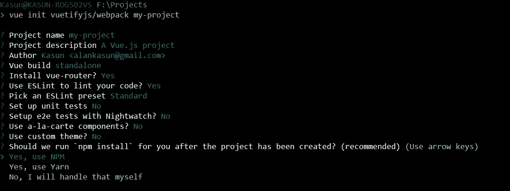
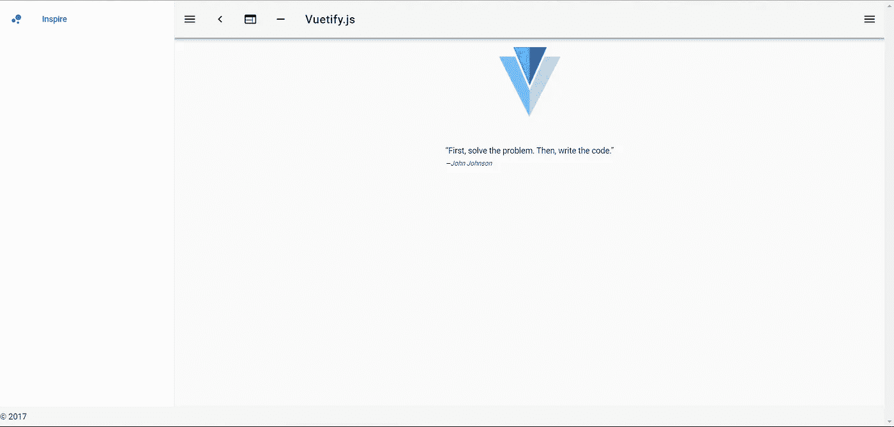
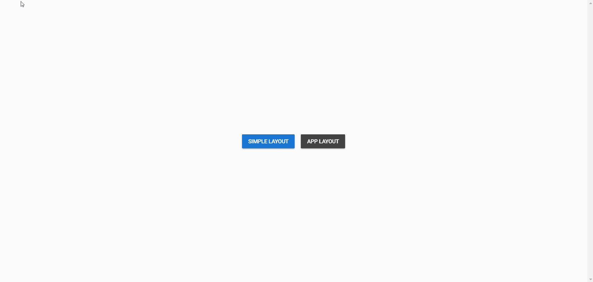

# VueJS 单页应用的多种布局

> 原文：<https://levelup.gitconnected.com/multiple-layouts-for-vue-spa-app-fafda6b2bfc7>

It 甚至一个**的单页面应用**都需要 M 个**多布局**来显示视图，这是一个普遍的问题。例如，登录页面可能不需要不必要的工具栏等。

今天我将向你们展示我是如何用 **VueJS** 克服这一点的。对于本教程，我将假设您了解 **VueJS、VueRouter、**和 **Vuex** 。我们将使用[**VuetifyJS**](https://vuetifyjs.com)**来设计我们的应用程序并简化设置。但是，您可以使用任何其他样式指南来使用这种方法。**

# **我们开始吧**

**首先安装 **vue-cli** 并使用 vue 化模板开始一个全新的 SPA 项目。**

> **对于非资格项目，程序是相同的。**

```
npm install -g vue-cli
vue init vuetifyjs/webpack my-project
cd my-project
npm install
npm run dev
```

****

**使用 **vue-cli** 安装并配置 **vue** 应用程序**

**这些命令将启动您机器上的 ***webpack 开发服务器*** 。为了简单起见，我们忽略设置测试部分。**

**现在你会在你的浏览器上看到这个**

****

**使用**vu entify**模板创建的默认应用程序**

**现在使用安装 [Vuex](https://vuex.vuejs.org/en/)**

```
npm install --save vuex
```

# ****动态组件****

****VueJS** 牛逼。它几乎有你需要的一切。对于我们的任务，我们的目标是使用[动态组件](https://vuejs.org/v2/guide/components.html#Dynamic-Components)。**

****VueJS 允许你使用相同的元素**在组件之间动态切换。**

# **您的布局**

**在我们开始之前，我们需要有一些布局。我们将创建其中的两个。**

*   **简单:简单的布局，顾名思义**
*   **应用程序:应用程序布局，带有漂亮的侧边栏和工具栏**

**继续创建一个文件夹 **src/layouts** 并在其中添加这两个文件**

****src/layouts/simple layout . vue****

**(这看起来可能很复杂，但你可以把路由器视图放在你想放的地方)**

**所以在这两个文件中，你可以看到我放了一个`<router-view></router-view>`元素。这被 **VueRouter** 用来在应用程序上显示路由器视图。**

**现在我们有两种不同的布局。例如显示一个登录页面**可以使用简单布局**。**

# **用 Vuex 保持应用程序状态**

**由于我们的应用程序将会很复杂，我们将在这里使用 Vuex 来管理应用程序的状态。**

**创建 **src/store/index.js** ，并在其中添加以下内容**

**将该文件保存为 **src/store/index.js****

**这是一个非常简单的 Vuex 存储，用来保存应用程序的状态。这里你可以看到布局**有一个状态变量**，它被设置为**简单布局**。这是布局的名称，我们将很快在应用程序中定义它。**

**我们设置了一个名为 **SET_LAYOUT** 的变异来改变布局状态。如您所知，在 Vuex 中，改变状态的唯一方法是使用变异进行提交。**

**我们还定义了一个名为 **layout** 的 getter 来获取这个变量的状态。**

# **显示您的布局**

**现在你需要一种方法来显示你想要的布局。我们有两个，现在我们还有一个 Vuex 存储来跟踪应用程序中的当前布局。**

**为此，打开 **src/App.vue** 并添加以下内容**

****src/App.vue****

**在这里，我们已经导入了我们的布局，并将它们放在脚本中的组件部分下。我们还为每个组件取了一个名字。正如你在**商店**中看到的，我们使用了*简单布局*作为默认，它指的是这里的组件。**

**我们有一个计算属性，也称为布局。该计算属性从 vuex 存储中获取其值。**

**由于计算属性的更改会导致 UI 更新，因此当 store 中的值发生更改时，它也会在该组件中进行必要的 UI 更新。**

**这里最重要的是**

```
<component v-bind:is="layout"></component>
```

**这是 vue 中的一个**动态组件**。它在运行时绑定到一个组件，并使用相同的元素在组件之间切换。**

**如您所见，它被绑定到布局计算属性。所以一旦存储更新了它的值，它也会被传递给`v-bind:is`。现在，这会将传递的组件绑定到标签中。**

# **测试时间到了**

**是时候测试我们的应用程序了。在此之前，我们需要一个测试组件。进入 **src/components** 创建一个名为 **MyComponent.vue** 的新文件，并添加以下简单内容**

****src/components/my component . vue****

**在下面的简单文件中，我们创建了两个在布局之间切换的按钮和一个用于改变布局的方法`setLayout`。**

**`setLayout`是一个简单的方法，它对商店进行提交，改变商店的布局值。**

**正如我们所知，这将触发`App.vue`中的 computed 属性来改变它在动态组件中的布局值**

**最后打开你的 **router/index.js** ，像这样导入这个组件**

**样本路由器文件 **src/router/index.js****

**这只是将`MyComponent`挂载到根中。**

**在你的`main.js`还有一件事要做，导入并使用你的商店**

****src/main.js****

**这是您的应用程序的入口点，现在您的商店已注册。**

**保存所有文件并检查你的浏览器**

****

****工作申请****

# **结论**

**在这里，我使用 **VuetifyJS** 和 **Vuex** 给出了一个完整的应用程序实现。Vuex 用于向您展示如何在整个应用程序中使用这种技术，因此您可以随时随地在应用程序中更改布局。**

**除此之外，概念很简单。都是动态组件。仅此而已。当与 Vuex 结合使用时，我们可以根据需要用任意多的布局来制作我们想要的梦想应用，而不局限于默认布局。**

****现在，您可以让您的 SPA 应用程序同时具有多个布局****

**你可以在这里得到代码**

**[](https://levelup.gitconnected.com)****[](https://gitconnected.com/learn/vue-js) [## 学习 Vue.js -最佳 Vue.js 教程(2019) | gitconnected

### 27 大 Vue.js 教程-免费学习 Vue.js。课程由开发人员提交并投票，使您能够…

gitconnected.com](https://gitconnected.com/learn/vue-js)**