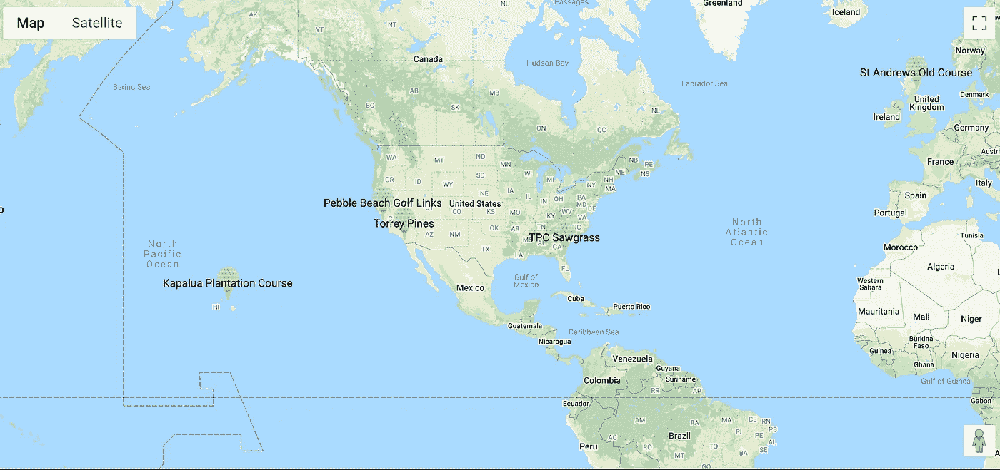

# 谷歌地图上的多个标记

> 原文：<https://levelup.gitconnected.com/multiple-markers-on-google-maps-a894b9a6a708>

在我最近的一篇帖子中，我重点关注了地图上已知数量的标记——发球区、果岭以及两者之间的某处。我在地图组件中放置了三个标记组件。第一个将 GPS 位置(经度和纬度)设置为发球区。第二个设置为绿色 GPS 位置。第三个设置为基于地图上所点击位置的状态中设置的 GPS 位置。如果基于其他选择有未知数量的标记怎么办？

在上面的地图中，我必须为用户添加到他/她的选择中的每个高尔夫球场放置一个标记。每次添加新球场时，地图都会用新的标记刷新。

第一个关键是获得一组 GPS 位置数据。同样，它存储在我们的 Redux 存储中，并由适当的 reducer 管理，以便根据需要添加、更新和删除存储。这在我的上一篇文章中也提到过。现在您有了一个扩展和收缩商店数组的机制，然后我们可以使用商店在地图上放置每个项目。

在这里！我们所需要的就是在 map 组件中使用一个 Map 函数(真是太巧了！).商店中的“桶”包含球场的阵列，每个项目携带球场的 GPS 位置。现在，我们使用 map 函数循环遍历商店数组中的每个条目。对于每个商店商品(b ),我们返回一个标记组件，其中 GPS 位置设置为该商品中的 lat 和 long。我们还可以提供一个在点击标记时执行的函数(onClick)。因为这是 React，我们正在编写 JSX，所以请确保将 map 函数放在{}内，因为我们正在进行插值以动态生成标记组件。

我发现当 Redux 存储中有一组项目需要呈现时，这非常有用。在插值中使用贴图功能可以动态生成共享相同属性的多个组件。在这种情况下，它只是一个简单的标记，但它可以是一个包含许多样式组件的更复杂的组件(如 React Semantic UI)。

快乐映射！