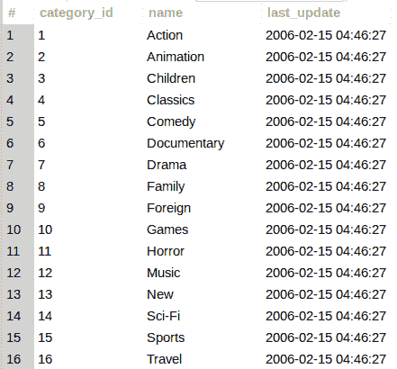
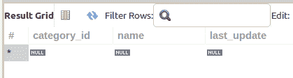
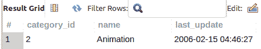

# 使用 MySQL 和逻辑运算符的多个 WHERE 子句条件

> 原文：<https://levelup.gitconnected.com/multiple-where-clause-conditionals-using-the-mysql-and-logical-operator-f74b5fefdbd8>

通常，为了定位特定的数据行，需要在一个`WHERE`子句中使用多个过滤条件。继续阅读这篇博文，学习如何在`WHERE`子句查询中使用`AND`逻辑运算符…


当你[订阅 ***OpenLampTech*** 时事通讯](http://openlamptech.substack.com)时，就能收到一本我的电子书*《给每个人的 10 个 MySQL 技巧】】。*

## 实践数据

对于本帖中的练习查询，我使用著名的 [Sakila 数据库](https://dev.mysql.com/doc/sakila/en/)中的“类别”表:

```
SELECT *
FROM category;
```



## MySQL 和逻辑运算符

如何在`WHERE`子句中使用`AND`逻辑运算符非常简单。只需用`AND`关键字分隔您想要测试的每个单独的条件。

请参见以下查询示例:

知道“category”表中有哪些数据，您认为该查询将返回多少行？

让我想想…



不返回任何行。零…

原因如下…

在这个`WHERE`子句中，有两个由`AND`关键字分隔的条件:

*   category_id = 2
*   name = '喜剧'

为了在此`SELECT`查询中返回任何行,“category_id”列值必须等于 2,“name”列值必须等于“Comedy”。

是的，有一行的“category_id”列值为 2。还有一行的“名称”列值为“喜剧”。

但是，它们不在同一行中。

因此，在使用`AND`逻辑运算符时，您应该理解由 and 分隔的 ***每个条件必须计算为 TRUE*** 才能将任何行包含在返回的结果集中。

让我们看看这个示例`SELECT`查询是什么样子的:



这是“category”表中“category_id”列值为 2(计算结果为`TRUE` ) ***和***“name”列值为“Animation”(也计算结果为`TRUE`)的唯一一行。

## WHERE 子句中的多个逻辑运算符

您完全可以在`WHERE`子句中包含多个`AND`逻辑运算符。如下一个查询示例所示，我现在测试了 3 个条件:

同样，对于要包含在返回的查询结果中的行，每个条件测试必须评估为`TRUE`:


如果任何一个条件测试评估为`FALSE`，该行将不被包括在内:


在这个特定的查询中，条件句`category_id = 2`和`name = ‘Animation’`的计算结果为`TRUE`。

但是，条件语句`DATE(last_update) = ‘2006–02–14’`的计算结果是`FALSE`。因此，该查询不会返回任何行。

加入***【MySQL 学习层】*** 会员，发现优质文章、深度指南、教学视频等等。拥有此会员资格，您可以访问未在任何地方发布的独家内容。随着新内容的不断增加，继续学习任何级别的 MySQL。

[学习 MySQL！](http://ko-fi.com/joshlovescoffee/tiers)

在`WHERE`子句中使用`AND`逻辑运算符使您能够对查询中返回或定位的行设置超级特定的约束。

## 推荐阅读

请访问这些博客文章，了解更多有关如何使用 MySQL 的信息:

*   [用 WHERE 子句限制行数— MySQL 初学者系列](https://joshuaotwell.com/limit-rows-with-the-where-clause-mysql-beginner-series/)
*   [SELECT 子句查询— MySQL 初学者基础系列。](https://joshuaotwell.com/select-clause-queries-mysql-beginner-basics-series/)

感谢您阅读我的内容。如果你愿意，今天就给我一个建议。谢谢大家！🙏🏻

喜欢你读过的？看到什么不正确的吗？请在下面评论，感谢阅读！！！

# 行动的号召！

感谢你花时间阅读这篇文章。我真心希望你发现了一些有趣和有启发性的东西。请在这里与你认识的其他人分享你的发现，他们也会从中获得同样的价值。

访问[投资组合-项目页面](https://wp.me/P28ctb-3KD)查看我为客户完成的博客帖子/技术写作。

咖啡是我最喜欢的饮料！

要在最新的博客文章发表时收到来自本博客(“数字猫头鹰散文”)的电子邮件通知(绝不是垃圾邮件)，请点击“点击订阅！”按钮在首页的侧边栏！(如有任何问题，请随时查看 [Digital Owl 的散文隐私政策页面](https://wp.me/P28ctb-3gI):电子邮件更新、选择加入、选择退出、联系表格等)

请务必访问[“最佳”](https://joshuaotwell.com/where-blog_post-in-digital-owls-prose-best-of/)页面，收集我的最佳博文。

[作为一名 SQL 开发人员和博客写手，Josh Otwell](https://joshuaotwell.com/about/) 热衷于学习和成长。其他最喜欢的活动是让他埋头于一本好书、一篇文章或 Linux 命令行。其中，他喜欢桌面 RPG 游戏，阅读奇幻小说，并与妻子和两个女儿共度时光。

免责声明:本文中的例子是关于如何实现类似结果的假设。它们不是最好的解决方案。所提供的大多数(如果不是全部)示例都是在个人发展/学习工作站环境中执行的，不应被视为生产质量或就绪。您的特定目标和需求可能会有所不同。使用那些最有利于你的需求和目标的实践。观点是我自己的。

***有什么可以帮你的*** ？

*   免费 [MySQL 查询语法口头禅 PDF](https://ko-fi.com/s/3631fc7d00) 备忘单。记住这个咒语的查询语法顺序。
*   你想开一个博客吗？我用 WordPress 写博客。让我们都在提供的计划上省钱。💸
*   通过在 ***OpenLampTech*** 时事通讯中投放可负担得起的分类广告，让您的品牌、产品或服务获得其所需的关注度。
*   需要托管你的下一个网络应用程序或 WordPress 网站吗？我使用并强烈推荐 [Hostinger](https://www.hostg.xyz/aff_c?offer_id=6&aff_id=94641) 。他们有很好的价格和服务。
*   🔒作为一名自学成才的开发人员，我逐渐认识到的 5 个事实
*   今天就在我的 [Kofi 商店](https://ko-fi.com/joshlovescoffee#)发现优质的 MySQL 学习资料吧！

***披露*** :本帖部分服务和产品链接为附属链接。在没有额外费用给你，你应该通过点击其中一个购买，我会收到佣金。

当您[订阅 ***OpenLampTech*** 时事通讯](http://openlamptech.substack.com)时，将收到一本我的电子书*《给每个人的 10 个 MySQL 技巧】****绝对免费*** 。

*原载于 2022 年 5 月 11 日 https://joshuaotwell.com**T21*[。](https://joshuaotwell.com/multiple-where-clause-conditionals-using-the-mysql-and-logical-operator/)