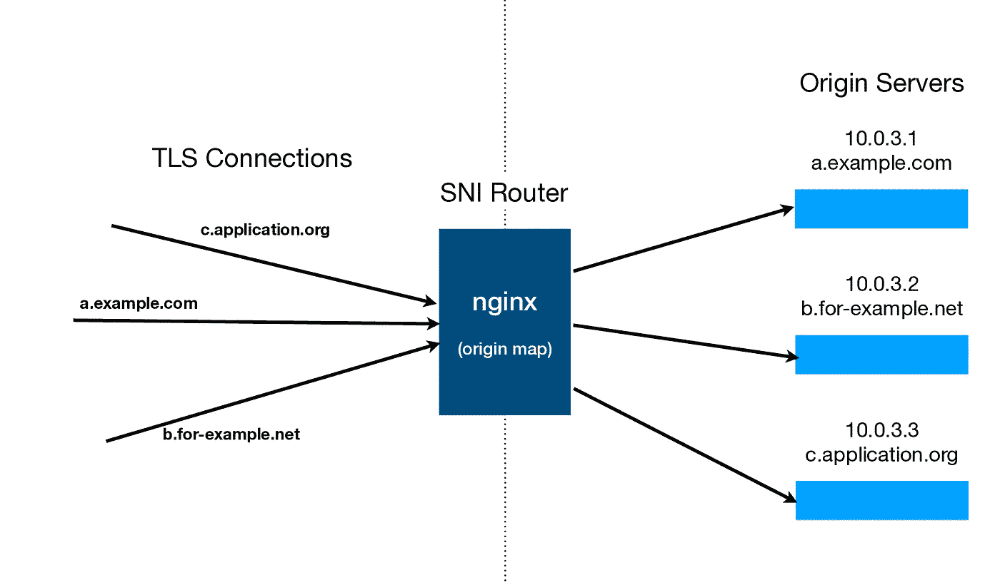
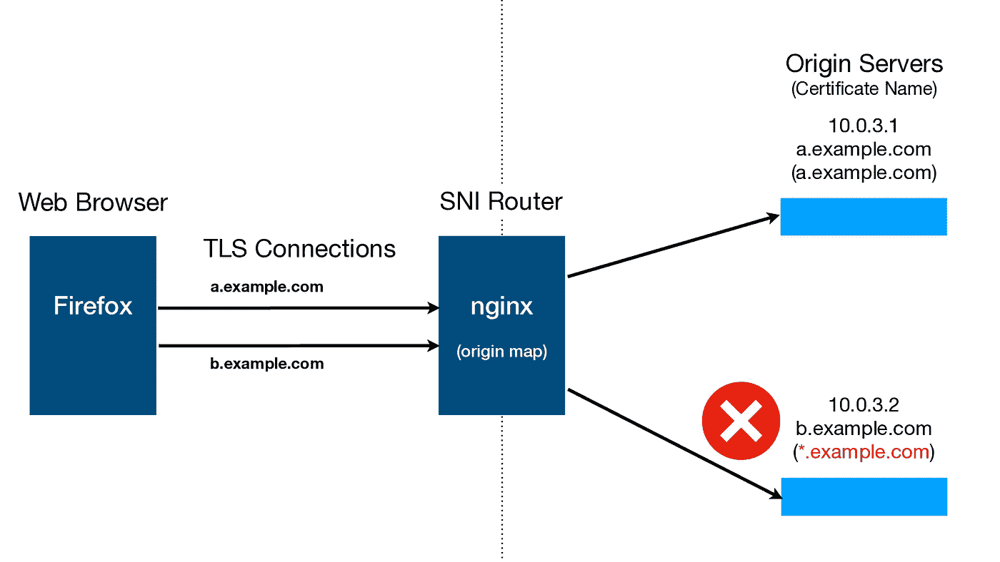

# 使用 SNI 路由复用 TLS 流量

> 原文：<https://levelup.gitconnected.com/multiplex-tls-traffic-with-sni-routing-ece1e4e43e56>

## Nginx 配置和 HTTP/2 合并


在 [Unsplash](https://unsplash.com?utm_source=medium&utm_medium=referral) 上[吉恩·加林](https://unsplash.com/@genefoto?utm_source=medium&utm_medium=referral)的照片

服务器名称指示或 SNI 是一种 TLS 扩展，最初是为单个 web 服务器设计的，为配置了不同 TLS 证书的多个 HTTPS 站点提供服务。例如，当 www.example.com 的*使用 TLS 证书-A，而 www.example.net*的*使用不同的 TLS 证书-B 时，web 服务器可以在 SNI 的帮助下识别该域，并使用正确的证书建立 TLS 会话，以服务于相应的网站。*

因为服务器名是明文的，即。未加密，web 服务器能够选择 TLS 证书来建立安全会话。有趣的是，明文服务器名称有多种使用情形，比如在中间有一个设备用于流量过滤。

# SNI 路由

SNI 的另一个用例是识别服务器名称并将流量路由到不同的源服务器。这允许单个 IP 和端口接收几个网站、应用的流量，并智能地将它们路由到它们相应的源服务器。



上图给出了一个例子，nginx 服务器作为 SNI 路由器，接受 c.application.org*、a.example.com*和 b.for-example.net 的 TLS 连接请求。nginx 服务器可以检查这些请求中的服务器名称，并在原始映射的帮助下，启动到原始服务器的连接并代理数据。

这允许源服务器使用它们自己的 TLS 证书与客户端建立安全的 TLS 会话。而且，这些源服务器可以位于专用网络内部，没有任何公共接口，而 SNI 路由器可以位于边缘。

## nginx 配置

nginx 中的[stream _ SSL _ preread _ module](https://nginx.org/en/docs/stream/ngx_stream_ssl_preread_module.html)用于 SNI 路由器。运行 **nginx -V** 以获取配置参数列表，并确保它包含以下内容:

```
--with-stream_ssl_preread_module
```

下面的示例配置在端口 443 上创建了一个流侦听器，并基于服务器名称到 IP 地址的静态映射代理到源服务器的 TLS 连接。

```
stream {
  map $ssl_preread_server_name $origin_https {
    hostnames;
    default           p8;
    a.example.com     p1;
    b.for-example.net p2;
    c.application.org p3;
  } upstream p8 {
    server 10.0.3.8:443;
  } upstream p1 {
    server 10.0.3.1:443;
  } upstream p2 {
    server 10.0.3.2:443;
  } upstream p3 {
    server 10.0.3.3:443;
  } server {
    listen 443;
    proxy_pass $origin_https;
    ssl_preread on;
  }
}
```

然而，这种方法有一个缺点，源服务器看不到客户端的公共 IP 地址，而是 nginx 服务器的私有 IP 地址。为了避免这种情况，需要一种不同的多路传输 TLS 流量的方法，该方法使用深度数据包检测(DPI)和目的网络地址转换(DNAT)。

# HTTP/2 合并

由于 [HTTP/2 客户端重用连接](https://bugzilla.mozilla.org/show_bug.cgi?id=1363451)的方式，如果 TLS 源服务器证书中的服务器名称(公用名和主题备用名)重叠，SNI 路由可能会出现问题。



在上面的例子中，由于源服务器 10.0.3.2 使用的 TLS 证书有通配符名称 **.example.com* ，Web 浏览器可以与服务器名称【b.example.com】建立 TLS 连接，并使用**相同的连接**用于 **HTTP/2 请求**到*a.example.com*。这可能会导致网站和应用程序中出现未定义的行为。

# 加密 SNI

由于服务器名称没有加密，SNI 有很大的隐私问题和审查问题。加密 SNI (ESNI)试图通过加密服务器名称来解决这些问题。虽然仅仅加密服务器名称不足以解决所有隐私问题，但它可以解决一些其他问题。请注意，这些问题还有其他解决方案。

如果没有替代品，依赖 SNI 的企业产品可能无法完全发挥作用。因此，ESNI 是否会被广泛使用还有待观察。然而，无论如何，这些问题在将来都会有解决的办法。在第 0 根，我们继续遵循这样的解决方案，并采用它们来提高我们产品的安全性。

*我们的产品* [*第 0 根安全网络— 0SNet*](https://www.0snet.com/) *使用 TLS 客户端证书保护组织的内部 web 应用。它易于部署，也可作为映像在*[*AWS*](https://0snet.info/#install.aws)*、*[*GCP*](https://0snet.info/#install.gcp)*和*[*Azure*](https://0snet.info/#install.azu)*上使用。今天就尝试一下吧！*