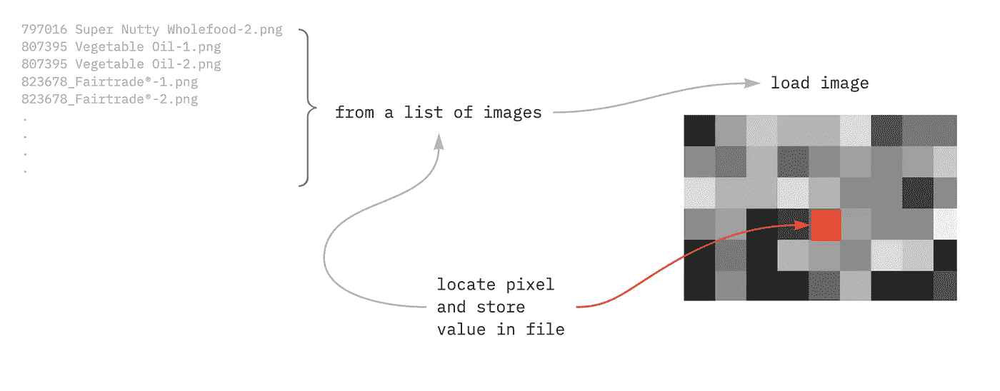
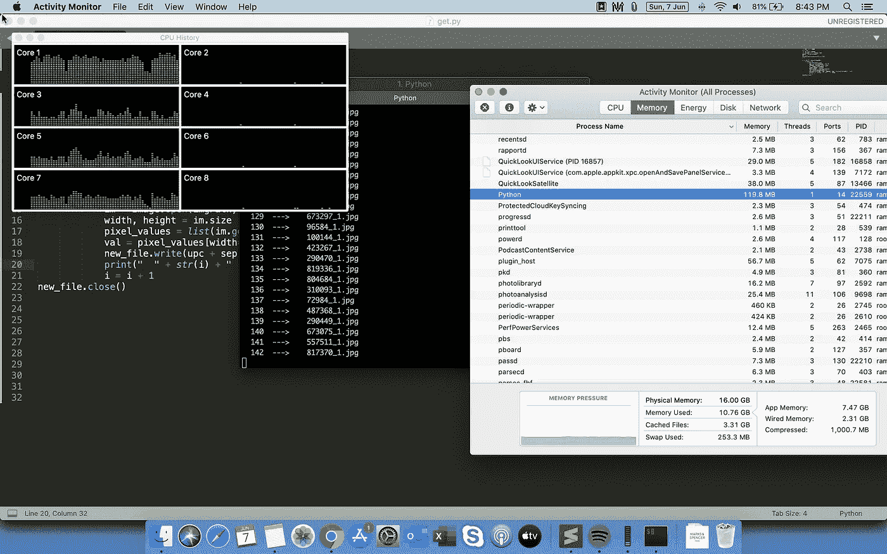
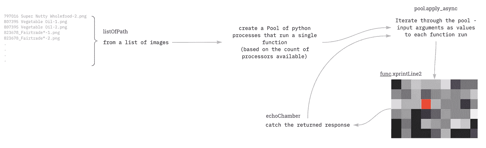
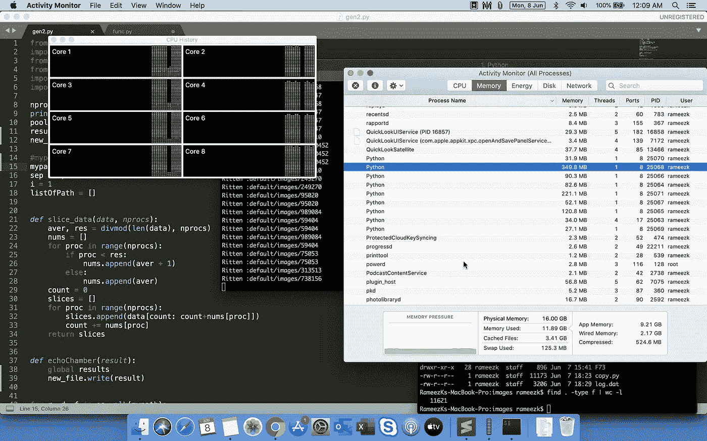
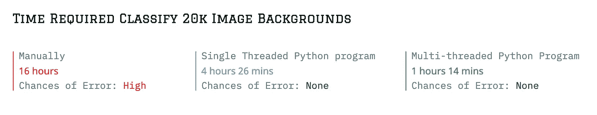

# 使用 mp.pool 的 Python 多线程

> 原文：<https://levelup.gitconnected.com/multithreading-in-python-using-mp-pool-ddf8ddc9cf69>

## Python 中多线程的真实例子

不久前，我们的内容团队将图像上传到我们的图像服务器——将 png 转换为 jpg。不幸的是，由于不正确的配置，PNG 的背景(Alpha = 0，透明)被转换为黑色。花了很多天想办法识别这些图像并替换它们。总共有大约 20，000 张图像，每张图像都存储在一个层叠的文件夹结构中——消除了手工操作的可能性。

所有其他选择都用尽了。

我认为解决这个问题的最好方法是通过 Python。起初，逻辑似乎很简单——因为图像曾经是透明的图像背景，偏移像素读数将揭示背景是黑色还是白色。逻辑很简单:



从一组图像中提取单个像素信息的简单逻辑。

作为代码:

```
###### single-threaded work #########
import os
from os import listdir
from os.path import isfile, join
from PIL import Imagesep = ","
mypath = "default/images"
listOfPath = []
new_file=open("newfile.txt",mode="w")### for creating the list of images with their paths
for r, d, f in os.walk(mypath):
    for file in f:
        if file.endswith(".jpg"):
            listOfPath.append([file,r])#### generating data for each image
for file, r in listOfPath:
 upc = r.replace(mypath + "/","")  ## product ID
 imgPath = os.path.join(r, file) 
 im = Image.open(imgPath, 'r')
 width, height = im.size
 pixel_values = list(im.getdata())
 val = pixel_values[width*5+5]
 new_file.write(upc + sep + imgPath + sep + str(sum(list(val))) + "\n") 
```

我希望在 2016 年的 MBP 上加载和卸载 20k 张图片不会超过 30 分钟。不幸的是，在 15 分钟内，只有 900 张图像被处理，我真的等不了 5 个小时。查看活动监视器，我发现只有 4 个处理器是活动的！



142 幅图像的屏幕上限。为什么没有使用其他处理器？

我知道 MBP 有 4 个物理内核和 8 个逻辑内核，因此只有 4 个物理内核在使用，但我在 Spotify 上流式传输，并在旁边做了一些其他工作…注意，python 进程是单线程。

只有一个工人在工作，其他人都在休息。**无法接受！**

# mp.pool 和缺乏实际解释

我认为 Python 有多处理选项。然而，关于 mp.pool 的实用文档很少——特别是对于我的上下文。

深入挖掘之后，我意识到我要使用 *pool.apply_async* 方法。下面是逻辑流程(带有函数名):



多线程— pool.apply_async

代码如下:

```
######## Multi-thread image processing ########from PIL import Image
import os
from os import listdir
from os.path import isfile, join
import multiprocessing as mp
import func
import timenprocs = mp.cpu_count()
start = time.time()pool = mp.Pool(processes=(nprocs))
results = []
new_file=open("newfile.txt",mode="w")#mypath = "Test"
mypath = "Dev/"
sep = ","
i = 1
listOfPath = []def echoChamber(result):
    new_file.write(result)### listOfPath Extract #####
for r, d, f in os.walk(mypath):
    for file in f:
        if file.endswith(".jpg"):
            ###xprintLine(file,r,i)
            listOfPath.append([file,r])for i, row in listOfPath:
    pool.apply_async(func.xprintLine2, args=(i,row), callback=echoChamber)pool.close()
pool.join()
end = time.time()
print(end - start)######## Close File ################## functions file - func.py #########
import os
from os import listdir
from os.path import isfile, join
from PIL import Imagesep = ","
replacePath = "default/images"def xprintLine2(file,r):
 file = str(file)
 r = str(r)

 upc = r.replace(replacePath + "/","") ## ignore - for internal use

 imgPath = os.path.join(r, file)
 im = Image.open(imgPath, 'r')
 width, height = im.size
 pixel_values = list(im.getdata())
 val = pixel_values[width*5+5]
 #new_file.write(upc + sep + imgPath + sep + str(sum(list(val))) + "\n")
 print("Ritten :" + upc)
 return (upc + sep + imgPath + sep + str(sum(list(val))) + "\n")########### save this part separately #######
```

现在，有几件事你必须注意:

1.  我不以编码为生——因此我的代码打破了常规。不良的编码实践在临时编码类型中泛滥。
2.  这只是 mp.pool 的方式之一，你可以在这里看到更多的
3.  使用这段代码的速度提高了 3.6 倍——在 127 幅图像的样本中，单线程用了 103 秒，而多线程(@ 8)用了 28 秒。这意味着，我们有 4 个处理器来完成这项工作(假设一个处理器完成整个加载/卸载过程需要 0.8 秒，即 103/127 ~ 1.2 毫克/秒)

这是所有处理器启动时的样子:



所有处理器运行！

最终的输出基本上是产品 id、图像 URL 和像素值(0 到 765，因为我们正在合并 RGB 通道值)。我可以写“黑色”或“白色”,但不想假设，因为可能有(5，5)像素携带实际颜色值的图像。

# 摘要



感谢您的阅读！如果这对你有帮助，请告诉我。