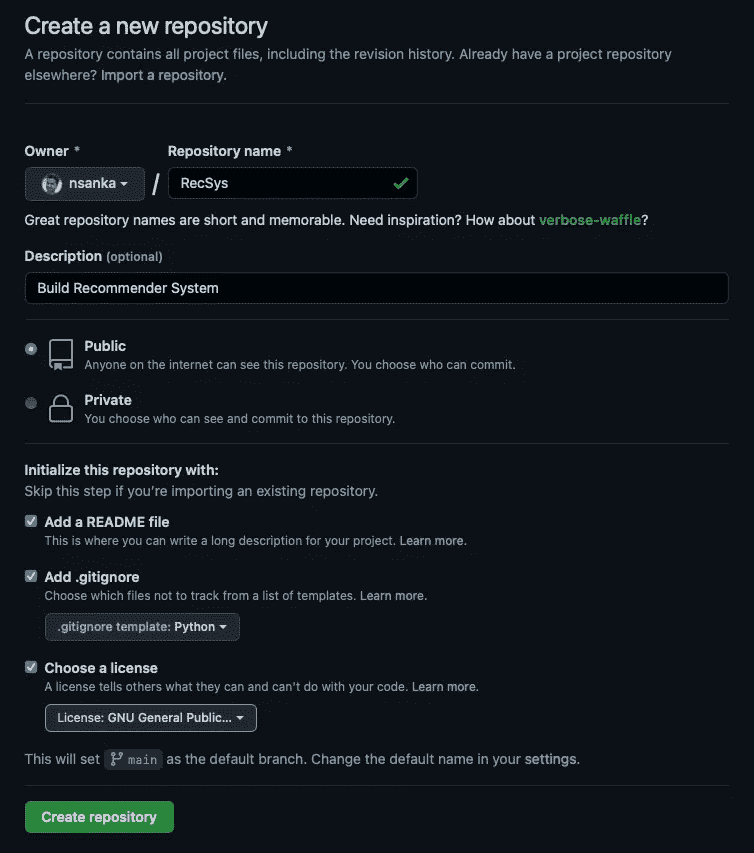
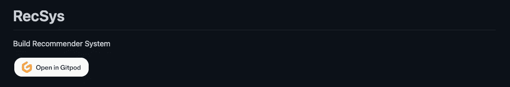
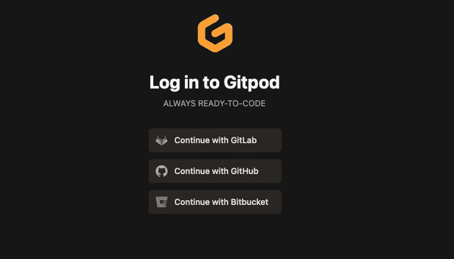
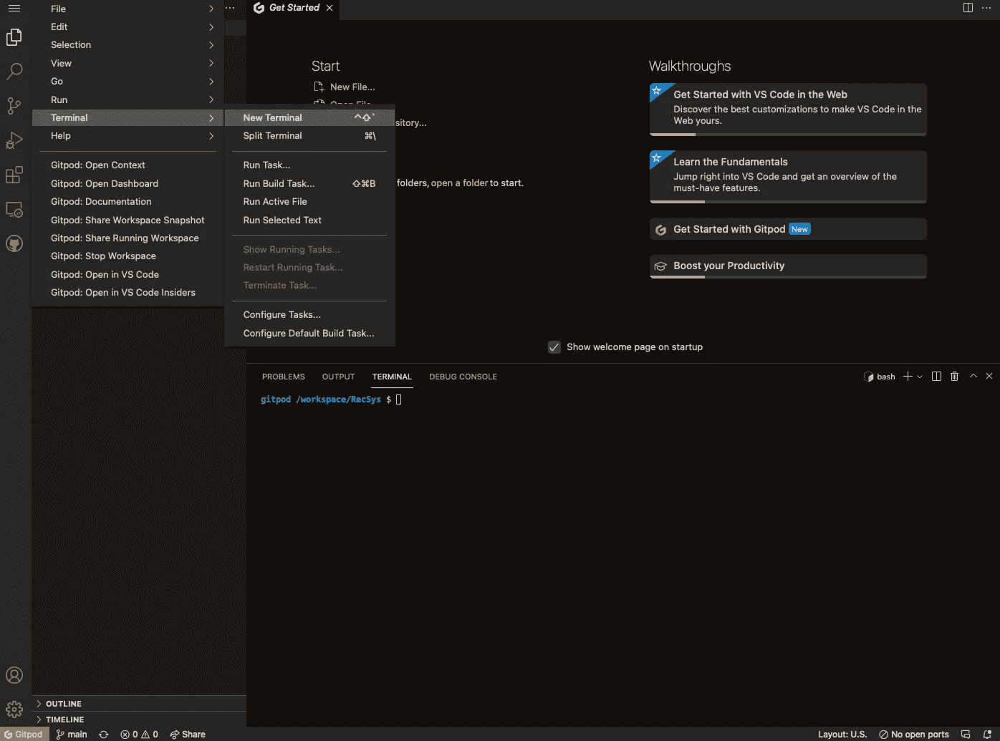

# 音乐推荐系统—第一部分

> 原文：<https://levelup.gitconnected.com/music-recommender-system-part-1-86936d673c31>

利用机器学习创建推荐系统

# 介绍

我们在任何地方都见过许多自动推荐系统，一些著名的有网飞、亚马逊、Youtube、LinkedIn 等。在这个系列中，让我们看看如何从头开始使用机器学习来构建一个推荐系统。作为本系列的一部分，我想展示我们如何创建一个框架，在真实世界的音乐数据集上应用不同的机器学习算法来预测播放列表/歌曲推荐。我们将使用四种主要方法，如基于内容的过滤、协作过滤、基于模型的方法和深度神经网络。

我们构建推荐系统的步骤如下:

*   用必要的库创建开发环境。
*   [获取真实世界的音乐数据集并探索。](https://nsanka.medium.com/music-recommender-system-part-2-ff4c3f54cba3?sk=2ad792ce8d7cf1433a8a50cebf2915e3)
*   [建立和训练机器学习模型。](https://medium.com/@david.de.hernandez/modeling-data-for-a-spotify-recommender-system-3056997a0fc5?sk=7ce613a3d5cbd4a69e73804983d49f91)
*   [评估数据集大小对机器学习模型的影响](https://medium.com/@david.de.hernandez/scaling-the-data-on-an-aws-instance-fa71476e0d7c)
*   使用各种度量标准评估模型。
*   [部署训练好的模型供公众使用。](https://medium.com/@nsanka/music-recommender-system-part-5-4278bf89411c)

在本文中，让我们从创建开发环境和安装所有必需的库开始。

# 第 1 部分:创建开发环境

我们希望避免“在我们的机器上工作”的情况，并试图找到一个对每个人都可用的系统，以便他们可以尝试运行这个项目代码。我在其他项目中使用了 Google Colab，它基本上是一个完全在云中运行的免费 Jupyter 笔记本环境。我也使用 GitHub Codespaces，但我想为这个项目尝试 Gitpod，因为它提供了一个工作空间，其中包括:源代码、带有 root/sudo 的 Linux shell、文件系统、完整的 VS 代码编辑体验，包括扩展、语言支持和所有其他工具以及在 Linux 上运行的二进制文件。如果您想[设置代码空间开发环境](/setting-up-development-environment-in-visual-studio-codespaces-9e003e3ece61)，请单击该链接。下面让我们看看如何创建和配置您的第一个 Gitpod 工作区。

我假设你已经有一个 GitHub 帐户，如果没有注册免费帐户[这里](https://github.com/)。一旦你获得了 GitHub 账号，在浏览器中登录你的 GitHub 账号，创建一个新的资源库，姑且称之为“RecSys”。一旦它被创建，它将带你到那个库的代码页。



创建 RecSys GitHub 存储库

接下来，让我们添加“在 Gitpod 中打开”按钮，通过将“项目 url”替换为 GitHub 存储库 url，使启动该项目的 Gitpod workspace 变得更加容易，如下所示。或者，我们也可以安装 Gitpod 浏览器扩展。

```
[](https://gitpod.io/#<project-url>)Ex: [](https://gitpod.io/#https://github.com/nsanka/RecSys)](https://gitpod.io/button/open-in-gitpod.svg)](https://gitpod.io/#https://github.com/nsanka/RecSys))
```



自述文件中的“在 Gitpod 中打开”按钮

# 项目特定定制

在存储库主文件夹中，单击“添加文件”->“创建新文件”按钮。在文件名框中输入“. gitpod.yml”。这个文件将用于为使用这个特定项目的任何用户应用工作环境的定制。配置 Gitpod 工作区的更多细节可以在[这里](https://www.gitpod.io/docs/config-gitpod-file)找到。

```
# Custom Docker Image
#image:
  #file: .gitpod.Dockerfile# List the start up tasks. 
# Learn more [https://www.gitpod.io/docs/config-start-tasks/](https://www.gitpod.io/docs/config-start-tasks/)tasks:  
  - name: Check Setup
    init: |
      python -m pip install --upgrade pip
      # Add commands to Setup Python Environment
    command: |
      clear
      echo "=============="
      echo "    Welcome   "
      echo "=============="
      pyenv versions
      echo ""# List the ports to expose. 
# Learn more [https://www.gitpod.io/docs/config-ports/](https://www.gitpod.io/docs/config-ports/)
ports:
  # jupyter
  - port: 8888
    onOpen: ignore# Install VSCode Extensions
vscode:
  extensions:
    - ms-azuretools.vscode-docker
    - ms-python.python
```

# 设置 Python 环境

Gitpod 工作空间已经安装了 Python，它也有 pyenv，可以用来[管理 Python 版本](https://realpython.com/intro-to-pyenv/)。我们将在存储库主文件夹中创建一个新文件，并将其命名为“requirements.txt ”,以定义这个项目所需的所有 Python 包。

```
# requirements.txt file
altair==4.1.0
matplotlib==3.5.0
numpy==1.19.5
openTSNE==0.6.1
pandas==1.2.5
pip==21.3.1
plotly==5.4.0
requests==2.25.1
scikit-learn==0.24.2
scipy==1.7.3
spotipy==2.19.0
streamlit==1.2.0
seaborn==0.11.2
tqdm==4.62.3
urllib3==1.26.7
wordcloud==1.8.1
```

我们将以下命令添加到“task->init”部分的“. gitpod.yml”文件中，以使用 pip 安装所需的 Python 版本和“requirements.txt”中提到的必要模块。

```
# Install Python 3.7.2
pyenv install -v 3.7.2
# Set Python 3.7.2 as default
pyenv global 3.7.2
# Install all libraries
python -m pip install -r requirements.txt
```

# 容器特定定制

这一步是可选的。默认情况下，如果我们没有在“. gitpod.yml”文件中指定任何 Docker 文件，Gitpod 会创建一个带有标准 Docker 映像的工作区，名为“Workspace-Full”。这个标准的 docker 映像包括 Docker、Go、Java、Node.js、C/C++、Python、Ruby、Rust、PHP 以及 Homebrew、Tailscale、Nginx 等工具。

如果您想要构建自定义容器，请在您的存储库主文件夹中单击 Add file -> Create new file 按钮。在文件名框中输入“. gitpod.Dockerfile”。您的自定义容器可以包含您想要的任何内容。如果您正在使用标准映像中不存在的框架或 SDK，或者如果您必须安装特定的包，这将非常有用。我推荐使用**标准全工作区图像**作为基础图像，然后在此基础上构建，如下所示。如果您想从不同于标准映像的框架开始，请检查在 [workspace-images](https://github.com/gitpod-io/workspace-images) 存储库中提供的 Gitpod 的预构建容器配置。

```
FROM gitpod/workspace-base:latest# [Optional] Uncomment this section to install additional OS packages.
# RUN apt-get update && export DEBIAN_FRONTEND=noninteractive \
#     && apt-get -y install --no-install-recommends <your-package-list-here>
```

# 打开工作空间

我们已经做好了一切准备，可以启动 Gitpod Workspace 了。单击在 Gitpod 中打开按钮启动 Gitpod 工作区，它会要求您登录 Gitpod 帐户。我们使用 GitHub 作为提供者，你的工作空间将在一个新的标签中打开。



登录 Gitpod

这将需要几秒钟的时间，您将在浏览器中看到您的工作区，如下图所示。它还展示了如何打开终端。



使用 Gitpod 工作区，我们完成了这个项目的开发环境设置，我们可以在预定义的环境中快速打开项目代码，构建并测试它。

# 下一步

在下一篇文章中，我们可以看到如何获取音乐数据集并执行探索性数据分析。

如果你喜欢看我的文章，并想支持我，请考虑注册成为一个媒体成员。每月 5 美元，你可以无限制地阅读媒体上的故事。请注册使用我的链接来支持我:【https://nsanka.medium.com/membership. 