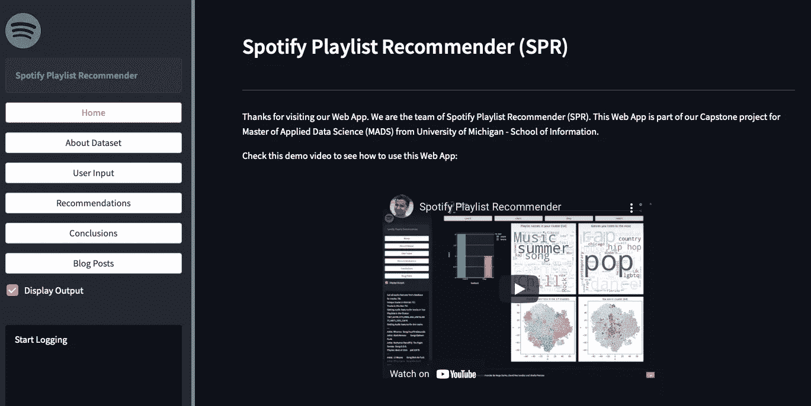
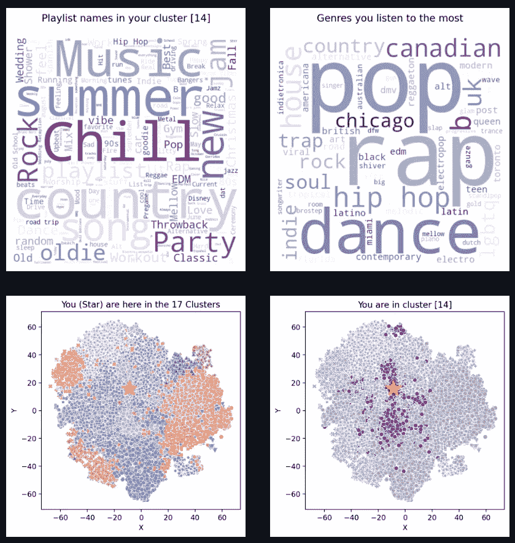
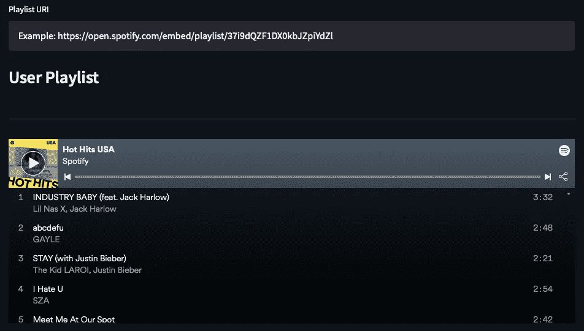
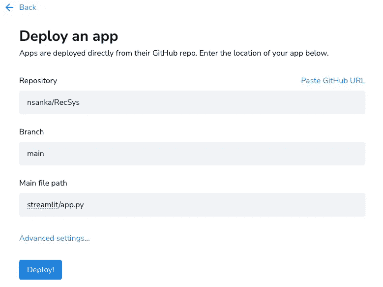

# 音乐推荐系统——第六部分

> 原文：<https://levelup.gitconnected.com/music-recommender-system-part-6-4278bf89411c>

将基于 ML 的推荐系统部署到产品中



Spotify 推荐系统(SPR)

# 概述

在[上一篇文章](https://medium.com/@david.de.hernandez/modeling-data-for-a-spotify-recommender-system-3056997a0fc5?sk=7ce613a3d5cbd4a69e73804983d49f91)中，我们创建了几个机器学习模型，根据用户 Spotify 喜爱的音乐或播放列表找出最佳推荐。

这篇文章记录了我们如何把它们放在一起供公众使用。我们不希望我们的 ML 模型死在 Jupyter 笔记本里。我们希望将我们的模型集成到产品/应用程序中，并提供给任何用户。完整的部署过程包括三个主要步骤。

1.  可以轻松访问机器学习模型的 API。
2.  允许用户访问预测的前端应用程序。
3.  我们将部署应用程序的云/服务器。

# 创建 API 以访问 ML 模型预测

为了通过 web 应用程序访问机器学习模型的结果，首先我们清理了代码，并为我们希望在应用程序中显示的每个任务/结果编写了清理函数。我们决定在 web 应用程序中有两个选项来接受用户的输入。第一个选项是获取任何 Spotify 播放列表，第二个选项是获取用户收藏夹，该选项要求用户使用其 Spotify 凭据自动授权我们的 web 应用程序。对于这两个选项，我们收集歌曲列表并提取每首歌曲的音频特征。然后，我们使用这些音频特征作为我们已经训练好的机器学习模型的测试数据，来预测用户所属的集群。找到聚类后，我们提取与用户播放列表/收藏夹相似或不相似的顶级播放列表。然后，我们显示这些热门播放列表中的热门歌曲作为我们的推荐。完整建模和预测的细节在我们的[上一篇文章](https://medium.com/@david.de.hernandez/modeling-data-for-a-spotify-recommender-system-3056997a0fc5?sk=7ce613a3d5cbd4a69e73804983d49f91)中有解释。

我们创建了一个 SpotifyRecommender Python 类，它将上述所有任务作为独立的函数。我们使用这个类作为前端应用程序的 API。前端应用程序将经过训练的机器学习模型和播放列表 url 或用户名作为输入传递给 API，并且它将接收最受推荐的歌曲作为输出。我们在这个 Python 类中添加了一些函数来创建必要的绘图。示例图如下:



为我们的 Web 应用程序生成的图

# 前端应用程序

现在我们有了干净的模块化代码，我们需要一种简单的方式让任何用户与我们的机器学习模型进行交互。创建一个网站有很多框架，但是我们希望在这一部分花费尽可能少的时间，因为这不是我们项目的强制要求。所以，我们决定使用 Streamlit Python 库。它允许用 Python 创建 web 应用程序，而无需了解任何关于创建网站或复杂 web 框架的知识。他们也有很棒的文档，你可以在这里查看。现在，让我们看看如何为我们的推荐系统创建一个简单的 web 应用程序。

创建网站的第一步是决定布局和功能。在看了几个 [Streamlit 应用程序的例子](https://streamlit.io/gallery)后，我们决定有侧边栏，它将有一些按钮带用户到不同的页面。我们还决定建立页面，其中包括我们使用的数据集的信息、机器学习模型的用户输入、我们的建议、结论以及所有这些博客帖子的链接。

在决定了每个页面的布局和内容后，下一步是安装前端所需的 Streamlit 库。我们已经使用 requirements.txt 文件安装了这个作为[创建开发环境](https://nsanka.medium.com/music-recommender-system-part-1-86936d673c31?sk=4278ddfebc850599db2fca4a5f2a2104)的一部分。如果不是，您可以使用 pip 安装，如下所示:

```
pip install streamlit
```

接下来，我们在 streamlit 文件夹中创建了一个文件 app.py，并在这个文件中编写了所有的前端相关代码。在本文中，我展示了我们在应用中包含的最少代码和重要特性/改进。如果你想看完整的代码，可以在 GitHub repo [这里](https://github.com/nsanka/RecSys)找到。我们还使用 style.css 文件为按钮定义了一些样式，如下所示:

```
body {
color: rgb(45, 49, 45);
background-color: #22222218;
}
.stButton>button {
width: 100%;
display: inline-flex;
align-items: center;
justify-content: center;
background-color: rgb(255, 255, 255);
color: rgb(38, 39, 48);
padding: .25rem .75rem;
position: relative;
text-decoration: none;
border-radius: 4px;
border-width: 1px;
border-style: solid;
border-color: aquamarine;
border-image: initial;
}
.stButton>button:hover {
border-color: rgb(246, 51, 102);
color: rgb(246, 51, 102);
}
.stButton>button:active{
box-shadow: none;
background-color: rgb(246, 51, 102);
color: white;
}
```

从文档中，我们了解到，每次我们与应用程序交互时，Streamlit 都会从头到尾重新运行脚本，并且每次重新运行都是在空白板上进行的。因此，代码中定义的变量不会在运行之间共享。我们发现它提供了一个名为会话状态的选项，这有助于为每个用户会话在重新运行之间共享变量。除了存储和持久化状态的能力之外，Streamlit 还公开了使用来自按钮时钟或输入更改的回调来操作状态变量的能力。我们使用该选项来显示基于所选页面的正确页面信息。示例代码如下所示:

```
import streamlit as st# Sidebar
def spr_sidebar():
   with st.sidebar:
      st.info('**Spotify Playlist Recommender**')
      home_button = st.button("Home")
      blog_button = st.button('Blog Posts')
      if home_button:
         st.session_state.app_mode = 'home'
      if blog_button:
         st.session_state.app_mode = 'blog'def main():
   spr_sidebar()
   if st.session_state.app_mode == 'home':
      home_page()
   if st.session_state.app_mode == 'blog':
      blog_page()
   spr_footer()def spr_footer():
   st.markdown('---')
   st.markdown('© Copyright 2021 - Spotify Playlist Recommender')
```

作为我们 web 应用程序的一部分，我们希望在页面中包含 Spotify web 播放器。为此，我们使用 Streamlit 组件 API 在 iframe 中加载 Spotify 播放列表 URL，如下所示:

```
import streamlit as st
import streamlit.components.v1 as componentsplaylist_uri = '37i9dQZF1DX0kbJZpiYdZl'
uri_link = 'https://open.spotify.com/embed/playlist/' + playlist_uri
components.iframe(uri_link, height=300)
```



嵌入我们应用程序的 Spotify 播放列表

为了优化性能以预测不同用户输入的建议，我们使用 Streamlit 缓存机制加载了机器学习模型，该机制允许应用程序即使在从 web 加载数据、操作大型数据集或执行昂贵的计算时也能保持高性能。这是用`[@st.cache](https://docs.streamlit.io/library/api-reference/performance/st.cache)`装饰器完成的，对所有用户都是全局的。

```
import streamlit as st@st.cache(suppress_st_warning=True)
def load_spr_ml_model():
   st.session_state.ml_model = SPR_ML_Model()
```

我想提到的最后一个更新是关于我们在第 2 部分中定义的 SPOTIPY_CLIENT_ID 和 SPOTIPY_CLIENT_SECRET。我们不想让公众直接看到这些，所以我们创建了”。streamlit”文件夹中，将这些变量添加到如下所示的“secrets.toml”文件中，并将该文件添加到”。gitignore”这样就不会被推送到 GitHub 了。

```
# Spotify Credentials
SPOTIPY_CLIENT_ID = 'Replace with your id'
SPOTIPY_CLIENT_SECRET = 'Replace with your secret'
# Needed for user authorization
SPOTIPY_REDIRECT_URI = '[http://localhost:8080'](http://localhost:8080')
```

在我们的 web 应用程序中，这些变量被视为环境变量，spotipy API 调用工作正常。如果我们需要在 Python 代码中访问它们，我们可以使用 SPOTIPY_CLIENT_ID 作为 ST . secrets[" spot ipy _ CLIENT _ ID "]。

一旦我们完成了所有页面的代码编写，我们在我们的开发环境中进行了彻底的测试，并将所有代码推送到 GitHub 仓库。

# 云/服务器

到目前为止，我们所有的工作都是在我们的开发工作区中进行的。我们有一个前端 web 应用程序在我们的工作区运行，允许我们访问我们的机器学习模型预测。我们希望扩展和每个人都可以访问这个网络应用程序！我们可以使用 Docker 封装我们的应用程序，并部署到任何云提供商，如 AWS、Google Cloud 和 Microsoft Azure。但是，整天运行 Docker 映像需要一些配额/资金。对于这个项目，我们想尝试 [Streamlit Cloud](https://streamlit.io/cloud) ，它提供了一个部署和共享无限公共应用的平台。部署过程非常简单。

我们登录 Streamlit Cloud 并允许它访问 GitHub 库。一旦我们给予回购访问权，点击新的应用程序与现有的回购，并填写如下图所示的详细信息与存储库的详细信息和主文件路径。



使用 Streamlit 云创建应用

然后在“高级设置…”中，我们输入上述“secrets.toml”文件中的信息。要详细了解 Streamlit Secrets 的用法，可以查看这篇[博客](https://blog.streamlit.io/secrets-in-sharing-apps/)。一旦我们按下 Deploy 按钮，Streamlit 就会启动一个实例，从 GitHub 克隆所有代码，并运行“主文件路径”中提到的文件。最后，我们的 web 应用程序已经准备好了[公共 URL](https://share.streamlit.io/nsanka/recsys/main/streamlit/app.py) ，任何人都可以访问。下面是我们最终 web 应用程序的演示视频。

Web 应用程序演示

如果你喜欢看我的文章，并想支持我，请考虑注册成为一个媒体成员。每月 5 美元，你可以无限制地阅读媒体上的故事。请用我的链接注册来支持我:【https://nsanka.medium.com/membership. 