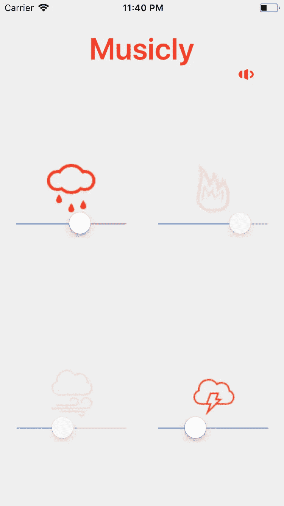

# 我在《反应自然》和《博览会》中创作 Noisli 克隆音乐时学到的东西

> 原文：<https://levelup.gitconnected.com/musicly-noisli-in-react-native-efd14023bd7c>

[本·科尔德](https://unsplash.com/photos/Ajcipx1VDXI?utm_source=unsplash&utm_medium=referral&utm_content=creditCopyText)在[号航天飞机](https://unsplash.com/?utm_source=unsplash&utm_medium=referral&utm_content=creditCopyText)上拍摄的照片

最初，当我听到脸书发布了一个跨平台框架的消息时，正如我们大多数人所知，我也认为这是另一个混合框架。我完全忽略了这个消息，即使它说它相当于一个本机应用程序，因为这是大多数混合框架自我提升的方式。但是几天后，我查看了他们的官方文档，我发现他们真的有一个本地应用程序在幕后工作，使用 Javascript 作为接口语言。这促使我将它保留在我的遗愿清单上。

上周末，我终于得到了宝贵的时间，并决定，与其简单地浏览文档并尝试已经给出的示例，不如实际构建一些东西来进行尝试。

最近，我经常使用[Noisli](https://www.noisli.com/)chrome extend 在工作时集中精力，并且通过过滤外部噪音，我看到了生产力的不断提高。它在冥想和驾驶时也很有用(我在车里试着听它。太棒了。它给了我一种宁静/环境/神圣的感觉。

所以，我决定在 React Native 中构建自己的“Noisli”版本。我称之为“音乐”

在谈论我的 it 经验之前，让我们为那些新来的人描述一下 RN；)

# **进入反应原生**

React Native 是一个跨平台框架(我不会称它为混合框架，因为我给那些将用户界面加载到网络视图中的框架起了这个名字)，用于在 iOS 和 Android 上构建应用程序，它继承了 React 的原理和语法。

P **反应原体的 ROS:**

## **多平台**

它涵盖了主要平台(iOS 和 Android)，这对大多数企业来说已经足够了。大部分代码也可以跨平台重用。

## **更快发展**

这就是 React Native 的卖点。它提供了一些可以插入和播放的现成组件，简化了开发过程。对于 RAD 来说，这是一个福音。

## **热装**

开发人员不必重新加载以反映变化，因此构建时间更短，开发速度更快。想想通过维护应用程序状态来进行小的 UI 更改。这绝对是 BLISS。

## **使用 Javascript 语言**

Javascript 多年来一直是最受欢迎的前端语言。

## **本地控制/组件**

由于它不使用 HTML/CSS 来生成组件，而是只创建一个与原生组件连接的桥梁，用户体验几乎等于一个原生 app。于是下面的下一个亲。

## **小团队或更少人力成本:**

Javascript 跨平台使用，但仍然可能需要本地团队的帮助，这可能是非常次要的，通常用于定制 UI 组件和创建其他不可用的模块。

C **反应原生的 ons:**

## **仍然依赖于本地开发者**

由于 javascript 只是接口语言，它仍然非常依赖于本地代码，因此依赖于拥有 iOS 版 ObjectiveC/Swift 和 Android 版 Java/Kotlin 技能的开发人员。

## **新颖性**

因为 RN 是新的，它还在不断成熟，开源社区还在发展，与 native 相比，没有多少开源组件/模块。

## **延迟的 SDK 更新**

由于每次 iOS 或 Android SDK 获得更新时，React 原生 API 都需要更新，因此升级它们需要多一点时间，并且不是所有的 API 都可以一次更新。

## 脸书规则

你仍然在脸书执照(BDD)的控制之下。

# 【React JS 之间的高级/主要差异& React Native:(针对 web 开发人员)

尼古拉斯·皮卡德在 [Unsplash](https://unsplash.com/?utm_source=unsplash&utm_medium=referral&utm_content=creditCopyText) 上拍摄的照片

*   React JS 使用虚拟 Dom 在浏览器/webviews 中呈现 UI 组件，而 React Native 使用本机 API 作为在移动设备上呈现组件的桥梁。例如:它通过 Objective-C 或 Swift 为 iOS 使用 UIKit 组件/API，并通过 Java 为 Android 使用等效的 UI 组件。
*   React 原生使用<text>、<view>而 React JS 使用

    、</view></text> 

# **输入我——我使用 React Native 的经历**

托马斯·列斐伏尔在 [Unsplash](https://unsplash.com/?utm_source=unsplash&utm_medium=referral&utm_content=creditCopyText) 上的照片

回到我在 React Native 上的经历。

> 构建注册护士应用程序有 3 种方式:
> 
> *1。)CRNA(create-react-native-app 的缩写)或基于 Expo 的 app*
> 
> *2。)世博弹射 app*
> 
> *3。)React Native ('react-native '方式)*

## **1。)CRNA(简称**[**create-react-native-app**](https://facebook.github.io/react-native/docs/getting-started.html#caveats)**)或‘世博 app’方法**

[Expo](https://expo.io/) 是一个框架/工具，充当 React Native &的接口，简化开发过程。它基本上提供了一个 XDE，你可以从字面上控制打包程序，并在模拟器/仿真器上运行你的应用程序。最重要的是，RN 主页上的入门指南建议使用 Expo，因此它也变得有点官方了。

所以，我从默认的建议方式开始。

P **世博 ROS:**

> 提供一个 XDE 来控制打包程序和启动模拟器/仿真器。
> 
> 为 iOS 和 Android 提供 Expo 客户端应用，可用于在真实设备上运行您的应用。
> 
> 发展更快。你只需要启动打包程序，你就可以看到你的应用同时在模拟器和设备上跨平台运行。
> 
> 适用于大多数只显示服务数据的应用程序。
> 
> 注册护士的所有优点。

C **世博会主题:**

> 大多数第三方组件/模块不能使用。
> 
> 不支持在设备上将应用程序作为独立的应用程序进行调试。
> 
> 并非所有设备特定的功能都可以测试。

在我的例子中，我想要一个音频模块，RN 还没有提供，但是开源社区中有第三方模块。但是因为我不能将外部库集成到基于 Expo 的项目中，所以这个选项被排除了。因此，我研究了 Expo API，幸运的是，Expo 提供了它。我将它集成到我的应用程序中，经过一些努力，但该应用程序的主要功能是在后台模式下播放音频，Expo 模块还不支持这一功能。

## **从“基于世博会的应用程序”方法中吸取的经验教训**

开发一个支持本地设备功能的应用是很困难的。过了一会儿，我觉得仅仅是检查将外部模块/组件集成到我的 Expo 应用程序中的可能性就浪费了很多时间。

所以，我跳到了下一个选项/方法。

## **2。)‘世博驱逐 app’方法**

有一个过程叫做“[退出](https://github.com/react-community/create-react-native-app/blob/master/react-native-scripts/template/README.md#ejecting-from-create-react-native-app)”，这就像把你的应用从 XDE 世博会配置中取出来一样。它仍将使用名为 ExpoKit 的东西来继续支持 Expo 模块(因此我使用的音频 API 仍将工作)。

我从 Expo 中弹出了我的应用程序，之后它使用 ExpoKit 来调用/触发我的音频 API。

P **世博 ros 弹出 app:**

> 集成第三方组件/模块。
> 
> 你可以继续使用 Expo APIs。
> 
> 您仍然可以在 Expo 客户端应用上运行您的应用。
> 
> 注册护士的所有优点

C **世博弹射 app ons:**

> 不支持在设备上将应用程序作为独立的应用程序进行调试。
> 
> 并非所有设备特定的功能都可以测试。

## **世博弹射 app 方法的经验教训**

但是，我再次被限制在设备上测试我的应用程序。

因此，Expo Ejected app 方法不会完美地适用于所有具有本机功能的应用程序，因为它会使测试变得困难。

所以我尝试了最后一种方法，这是之前 RN 团队推荐的方法，但出于某种原因，他们使用 CRNA(Create React Native App 的缩写)转而使用 Expo。这可能有点令人困惑。我推荐[这个做个解释](https://docs.expo.io/versions/latest/guides/create-react-native-app.html)。

## **3。)' React Native(**[**)React-Native**](https://facebook.github.io/react-native/docs/getting-started.html#caveats)**' way)'方法**

最后，我准备尝试最后一种方法。

既然 Expo 不再是我的方式，我就可以自由地使用开源社区提供的大量选项。尽管它还不成熟，但有相当多的选择。

由于 Expo 无法通过这种方法获得，我无法使用任何 ExpoKit APIs，所以我决定将我的音频模块改为' [react-native-sound](https://github.com/zmxv/react-native-sound) '，它比 Expo 拥有更多的功能。因为我把我的代码整齐地写在一个单独的组件中，所以对我来说简单地移除 Expo APIs 并集成“react-native-sound”API 更容易。

当我在设备上安装应用程序并关闭应用程序到后台时，我听到它在后台播放。我松了一口气。

照片由[斯潘塞·普](https://unsplash.com/photos/vVatReJ3LPI?utm_source=unsplash&utm_medium=referral&utm_content=creditCopyText)在 [Unsplash](https://unsplash.com/?utm_source=unsplash&utm_medium=referral&utm_content=creditCopyText) 上拍摄

PReact 原生 app 的 ROS:

> 集成第三方组件/模块。
> 
> 所有注册护士的优点。

C **反应原生 app 的 ons:**

> 无法使用世博客户端 app。我想念它。:(
> 
> 我需要 Xcode 和 Android Studio 来运行单独的/native 项目，以便在我的设备上安装和调试。

然后我稍微调整了一下应用程序，以符合我的用户界面口味。这是最终的应用程序:

musicly—React Native nois Li 应用截图

[这里的](https://github.com/saru2020/Musicly/branches)是开源代码，各自在各自的分支中进行相同的回购:

> CRNA(创建-反应-原生-应用程序)或基于 Expo 的应用程序
> 
> Expo 弹出应用
> 
> 本地反应(“本地反应”)

照片由 [Al x](https://unsplash.com/photos/Mm_cz9t0LYc?utm_source=unsplash&utm_medium=referral&utm_content=creditCopyText) 在 [Unsplash](https://unsplash.com/?utm_source=unsplash&utm_medium=referral&utm_content=creditCopyText) 上拍摄

# 结论

毫无疑问，世博会团队做了出色的工作。他们还在增加更多的功能，这太棒了。

Expo 仍然适用于大多数应用程序，特别是快速应用程序开发迭代。在我看来，它还没有为主流做好准备，需要快速增强，以便所有主要玩家开始使用它。

我发现第三种方法最简单，因为我不受任何限制。这实际上取决于开发人员的态度，我确实更喜欢在一个更无边界、更灵活的环境中工作。当我可以灵活地添加或修改任何我想要的东西时，感觉真好。最重要的是，该项目非常接近原生项目，这将权力放在开发人员手中，这使它成为我的 Musicly 应用程序的最佳选择。

> 这就是我要说的。如果你觉得这很有用，那么请不要犹豫鼓掌，这样它就可以传递给其他可能觉得有用的人。

世博迷们，请在评论中痛打我！

照片由 [Quino Al](https://unsplash.com/photos/H0xA8nGo9_s?utm_source=unsplash&utm_medium=referral&utm_content=creditCopyText) 在 [Unsplash](https://unsplash.com/?utm_source=unsplash&utm_medium=referral&utm_content=creditCopyText) 上拍摄