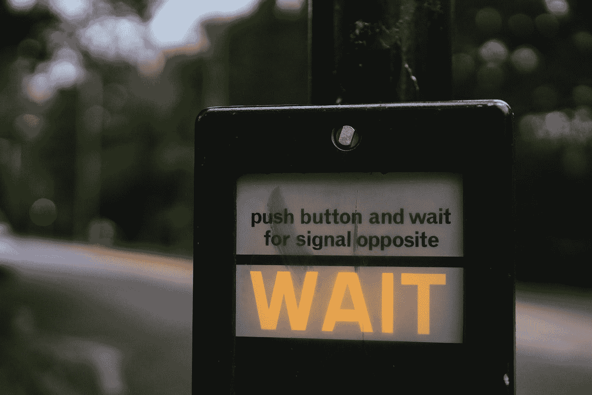

# 优秀开发人员的必备技能:“耐心”

> 原文：<https://levelup.gitconnected.com/must-have-skills-for-awesome-developers-patience-c0fe64788403>

在 [Unsplash](https://unsplash.com?utm_source=medium&utm_medium=referral) 上由 [Aron 视觉](https://unsplash.com/@aronvisuals?utm_source=medium&utm_medium=referral)拍摄的照片

## 系列介绍

我努力思考哪些话题是必须谈论的:反应？Javascript ES2050 特性？当然，这些都是性感的话题，但事实是，它们只会持续几个月，如果不是几周的话🤦🏻

在与一位亲爱的朋友简短讨论后，他告诉我回到最基本的问题:是什么让一个人成为优秀的开发人员？什么东西需要付出那么多的努力和时间去永远学习和提高？

在收集这些文章的要点时，我们想到的大多数技巧都是个人的，而不是技术的。

所以，这是关于高水平技能的系列文章的第一部分，这些高水平技能与技术技能一样重要(甚至更重要)。

经过超过 11 年的专业工作经验，我可以自信地说:

> 我宁愿和一个技术一般的好同事/经理一起工作，而不是和世界上最有经验的傲慢、粗鲁、好斗或不可信的人一起工作。每一个。单身。时间。

我的观点是软技能或个人技能比技术技能更重要**。随着你成长为领导角色，软技能变得更加重要。如果人们不能和你一起工作，你的技术再好也没用。**

# 要坚持。动机被高估了。

Sam mgrdichan 在 [Unsplash](https://unsplash.com?utm_source=medium&utm_medium=referral) 上拍摄的照片

我努力思考哪项技能应该获得我清单上的金牌🥇

耐心获胜的原因如下:

> 如果你没有耐心，你甚至不会读完这篇文章！

动力是美妙的，但它是有限的资源。开始一件事是好的，但是没有耐心你不会**完成**。

我热爱编程，大半辈子都在做，为了乐趣，为了收益。也就是说，如果我说我没有生产力、自信和动力跌至谷底的日子，那我就是在撒谎。我经常想辞掉工作，在某个偏远的村庄开办一个养鸭场(还在考虑中，如果我真的这么做了，我会及时通知你的)🦆).

没有坚持，你不会申请 100 家公司来得到你梦想中的工作，你也不会在 T4 漫长的招聘过程中幸存下来，在那里你只会度过充满压力的几个星期，在最后一步被拒绝。

> 好日子用动力，坏日子用坚持。

# 专注于基础。

micha Parzuchowski 在 [Unsplash](https://unsplash.com?utm_source=medium&utm_medium=referral) 上拍摄的照片

我看到的大三学生最常犯的一个错误是，在想要感觉“快”和“高效”的压力下，他们跑去学习 React，然后学习 JavaScript，或者学习 Rails，然后学习 Ruby，等等。

一个公正而通情达理的学长不应该以一个学弟的速度来评判他。他们应该评估自己的态度、自力更生、坚持不懈、追求质量和提出正确的问题。

用大三的时间为你的“叠积木”知识之塔打好基础。

我知道在现实生活中，公司会把你推向极限。继续阅读，了解如何在这样做的同时保持你的生产力；)

# 不要走捷径。

迪米特里·卡拉斯泰列夫在 [Unsplash](https://unsplash.com?utm_source=medium&utm_medium=referral) 上拍摄的照片

基于前一点，当你面临新的挑战或错误时，你有两个选择:做你知道的**快速破解**来“取悦”你的经理，或者把它作为一个机会**了解更多关于这个话题的**。我想你知道哪个是正确答案。

当你撞上一堵墙时，你要么爬上去，要么退回去，在你的余生里继续躲避它。现在，你有一个惊人的机会，你是一个“低年级生”，所以你有权利“花更长的时间来完成”，“问很多问题”和“犯更多的错误”，所以在它从你身边被夺走之前，使用这个特权。

像其他任何事情一样，平衡是必需的，所以有时你将没有其他选择，只能走 hacky 的路。只要确保“hacky”不是你默认的做事方式！还有，没有什么是非黑即白的。“hacky”有这么多层次，所以设置一些底线到你的绝对最小值，并随着你获得经验而不断提高。

# 把难相处的人当成挑战。

瑞安·弗兰科在 [Unsplash](https://unsplash.com?utm_source=medium&utm_medium=referral) 上拍摄的照片

在不同的公司(甚至国家)工作，你会遇到各种各样的人。

有些人在技术上和个人上都很棒，你会在余生中感激他们。另一方面，有些人在某一方面不那么伟大(或者上帝不允许:两者都是🙈).
你会不同意一些人，讨厌一些人，甚至因为一些人而辞职。

然而，随着年龄的增长和智慧的增加，你可能会意识到:

> 哦$h**，**我**是这种情况下最难对付的人！

不管谁是困难的:学会**把它当成一个挑战**并专注于**提升自己。有问题的人最终会离开，或者你会离开，但最终，你会成长。**

# 不要跑得太快。

照片由[菲尔在](https://unsplash.com/@philhearing?utm_source=medium&utm_medium=referral) [Unsplash](https://unsplash.com?utm_source=medium&utm_medium=referral) 上听到

你应该什么时候辞职？

要知道答案，你需要先问自己:

对你来说什么更重要？

许多人最在乎钱，所以即使他们在一个糟糕的公司工作，但报酬很高，他们也会接受。有些人更关心友好的同事和舒适的环境，有些人追求卓越的技术。

列出你自己的清单。如果你的公司没有提供清单上的任何东西，那么是时候让你去别处发展了。

为什么在“耐心”下面会提到这个？因为你通常不会每天都得到完整的列表。有些日子你会有高于平均水平的工作量。在其他日子里，你可能会与你的经理或同事发生冲突。也许你和新来的同事相处得不好。无论你做什么决定，确保你的决定是基于逻辑，而不仅仅是感觉(尤其是消极的，暂时的感觉！).

就是这样！我希望你没有失去耐心。我错过了什么吗？我很想在评论中听到你的意见。

关注我就知道下一篇文章什么时候好了。你也可以在这里跟踪我:[艾哈迈德.洛克斯](http://ahmed.rocks)

在那之前:要有耐心😉

# 分级编码

感谢您成为我们社区的一员！在你离开之前:

*   👏为故事鼓掌，跟着作者走👉
*   📰查看[升级编码出版物](https://levelup.gitconnected.com/?utm_source=pub&utm_medium=post)中的更多内容
*   🔔关注我们:[Twitter](https://twitter.com/gitconnected)|[LinkedIn](https://www.linkedin.com/company/gitconnected)|[时事通讯](https://newsletter.levelup.dev)

🚀👉 [**加入升级达人集体，找到一份惊艳的工作**](https://jobs.levelup.dev/talent/welcome?referral=true)