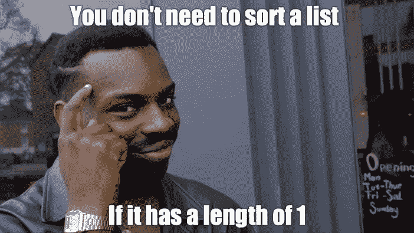

# 编码面试的必备算法

> 原文：<https://levelup.gitconnected.com/must-know-algorithms-for-coding-interviews-937d807064e0>

如果你喜欢看我的 YouTube 视频，你可以在这里看:

在许多采访中，我被要求要么只实现一个通用算法，要么实现一个更大的解决方案的一部分。你在数据结构和算法课上学到的典型算法在编码面试中非常常见。不理解这些算法可能会让你丢掉工作，所以我想分享一些编码面试必须知道的算法。如果这篇文章对你有帮助，请考虑[订阅我的 YouTube 频道](http://bit.ly/sub2rahul)或者在 medium 上关注我以获得更多类似的内容！如果你正在寻找学习这些算法的好资源，我推荐你去拿一本[破解编码访谈](https://amzn.to/2YBZWJ3)，里面会详细介绍所有这些内容！

> 免责声明:这篇文章是基于我寻找实习和入门级(新毕业生)角色的经验而写的。在任何时候，如果我说你需要知道一个算法，这意味着你应该能够理解它在算法上是如何工作的(包括时间/空间的复杂性，并且能够用一个例子来展示你的知识)，并且能够用你选择的语言来实现它。此外，在亚马逊上破解编码采访的链接是一个附属链接，如果你使用我的链接在亚马逊上购买任何东西，我都会收到佣金。现在我们已经解决了这个问题，让我们来看看列表吧！

# 1.树遍历算法

这些算法允许你以结构化的顺序访问树中的每个节点。它们主要是为二叉树设计的，但是您可以修改这些概念来访问任何树中的所有节点。学习这些算法还将帮助您理解如何递归遍历树中的所有节点。

你应该重点关注的三个算法是**前序、按序和后序遍历**。其中每一个的不同之处在于它们访问树的节点的顺序。我建议了解他们在二叉查找树中访问值的顺序。

# 2.图形搜索算法

这些工作在树，有顶点和边的图，以及图的任何编码上。这些算法采用不同的方法将您从起始节点带到目的节点。

该类中的算法有**深度优先搜索(DFS)、广度优先搜索(BFS)、**和 **Dijkstra 的算法**。如果你有额外的时间，我建议你也学习一下 **A*** 算法。

# 3.搜索算法

这是一类真正只有一个重要算法的算法:**二分搜索法**。传统的搜索是 O(n)算法，因为你一次访问一个元素。如果您有一个已排序的输入列表，那么您可以利用二分搜索法实现 O(log(n))运行时。我经常被要求将二分搜索法作为我面试问题解决方案的一部分，所以我强烈建议了解这个。如果你想了解更多的算法，我有一篇关于二分搜索法的[文章](/binary-search-cbc0c4ed72f5)和[视频](https://www.youtube.com/watch?v=KuPCADTy2mM)(例子、Java 代码和采访建议)!

# 4.排序算法

冒泡排序、插入排序、选择排序等。所有这些都是你应该理解并能够实现的标准算法，但是对于一般情况下的算法，这些都是 O(n)。面试中最重要的排序算法是 O(n*log(n))算法。这个类中最常见的两个算法是**合并排序**和**快速排序**。重要的是你至少知道其中一个，最好两个都知道。我建议从合并排序开始，因为它的最坏时间复杂度为 O(n*log(n))，而快速排序的最坏时间复杂度为 O(n)。

我希望你发现这个故事内容丰富！如果你喜欢这个帖子/视频，请随意留下掌声/喜欢，并关注/订阅我的媒体和 YouTube 账户[以获得更多类似的内容。另外，](http://bit.ly/sub2rahul)[在 Twitter](https://twitter.com/sabnis_rahul) 上关注我，了解我何时发布新内容。如果你有任何其他建议，请在评论中分享，这样读者就可以从这个故事中获得最大的收获！此外，如果你还没有，确保你拿起一本[破解编码面试](https://amzn.to/2YBZWJ3)，因为它确实是学习这些算法和开始准备编码面试的最佳资源之一！

 [## 掌握编码面试| Skilled.dev

### 一个完整的平台，在这里我会教你找到下一份工作所需的一切，以及…

技术开发](https://skilled.dev)