# 必读:CSS Flexbox 响应式多栏布局讲解

> 原文：<https://levelup.gitconnected.com/must-know-css-flexbox-responsive-multi-column-layout-explained-42b3b6b96dc2>

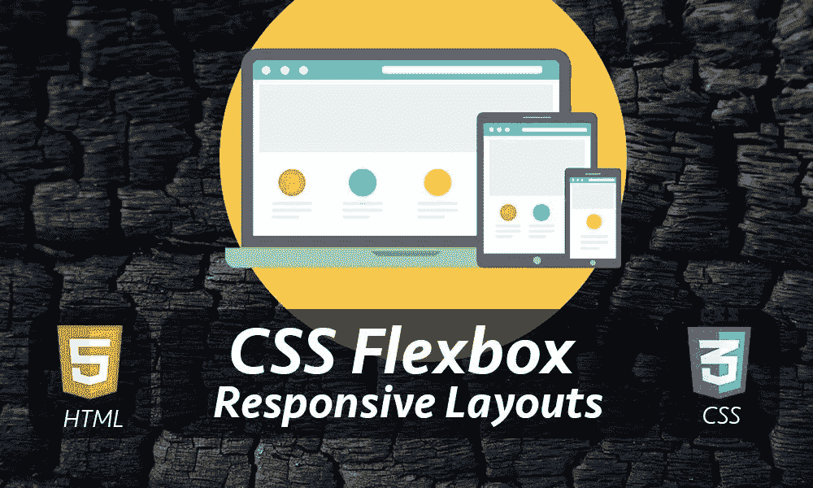

在本文中，我将向您展示如何使用 CSS Flexbox 轻松创建响应式多栏移动友好布局。

如果你有一个 Shopify 商店，这篇文章将帮助你设计你的产品描述页面，这样你就不必为这样的应用支付每月订阅费。

我们在建造什么？

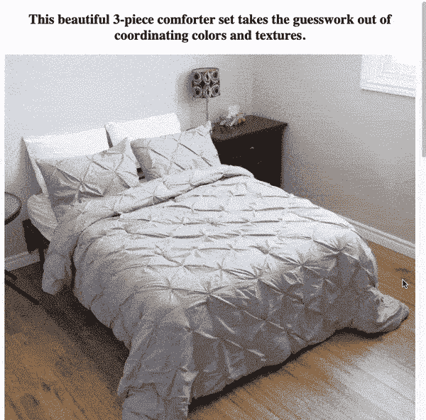

要涵盖的内容很多，所以让我们开始吧！

*   单列布局
*   两列柔性盒布局
*   两列反向柔性盒布局
*   两列移动布局
*   三列 Flexbox 布局
*   三列移动布局

# 单列布局

单列的 HTML 代码非常简单。

```
!-- SINGLE COLUMN -->
<section class="one-column">
  <h2>This beautiful 3-piece comforter set takes the guesswork out of coordinating colors and textures.</h2>
  
</section>
```

该部分是顶级元素，有三个子元素:

*   `**section**` →是水平跨越其父元素宽度的块级元素，在本例中为`<body>`。
*   `**h2**` →也是块级元素，有标题内容。
*   `**img**` →是一个元素，我从 URL 中提取了一个图像，并设置了它的 src 属性(有时图像具有固定的宽度和高度，可能会超出其父宽度)。

要使图像适合其父宽度，请将以下几个属性添加到 img CSS 选择器中:

*   宽度:100% →将图像调整到其父宽度。
*   高度:自动→将调整图像的高度与其宽度成比例。

```
/* ONE COLUMN */
.one-column {
  text-align:center;
}img {
  width:100%;
  height:auto;
}
```

并且单栏布局马上就能工作，如下图所示，即使在没有使用 Flexbox 的移动视图中也是如此。

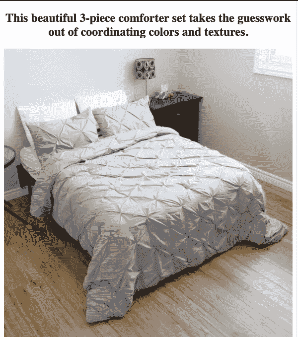

真好！

现在让我们看看如何使用 Flexbox 创建两列布局。

> 推荐
> 使用 CSS 制作 Div 全屏的 3 种方法

# 两列柔性盒布局

两列 HTML 标记有一个顶级 section 元素，类名为 two-column，当然还有两个 div，分别表示左列和右列。

```
<section class="two-column">
  <div>1</div>
  <div>2</div>
</section>
```

如您所知，div 是一个块级元素，所以上面代码的输出如下图所示。

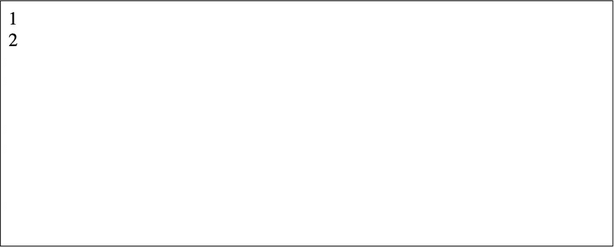

要进行两列布局，请使两个 div 并排显示，而不是在另一个 div 的下方。

传统上，我们使用内联块或浮点来实现这一点。

> 推荐
> [3 种使用 CSS 制作 Div 全屏的方法](https://softauthor.com/css-make-a-div-height-full-screen/)

有了 Flexbox，我们可以通过几个 CSS Flexbox 属性做到这一点:

*   显示器:flex
*   flex-direction:row →是一种默认行为，您通常不需要。它把它的孩子放在一起，这正是我们想要的两列。

```
/* TWO COLUMN FLEXBOX */
.two-column {
  display:flex;
  flex-direction:row;
}
```

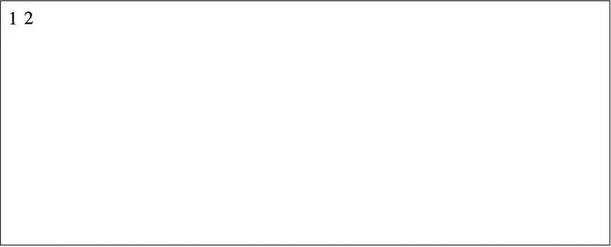

这个管用。

现在，让我们均匀分布这两个 div，以水平填充其父宽度。

为此，向内部 div 添加 flex:1 css 规则。

```
/* TWO COLUMN FLEXBOX */
.two-column div {
  flex:1;
  border:1px solid blue;
}
```

我还为它们添加了边框，只是为了便于查看。

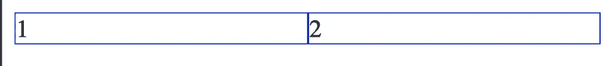

现在，让我们在左栏添加一些内容，在右栏添加一个图像。

```
<section class="two-column">
   <div>
      <h2>Comfy &amp; Cozy</h2>
      <p>The ultra-soft <strong>300 GSM </strong>hypoallergenic microfiber filling will keep you warm  for a better sleep during  cold nights.
      </p>
   </div>
   <div> 
     
   </div>
</section>
```

版面马上就这样了！

而且还不错…

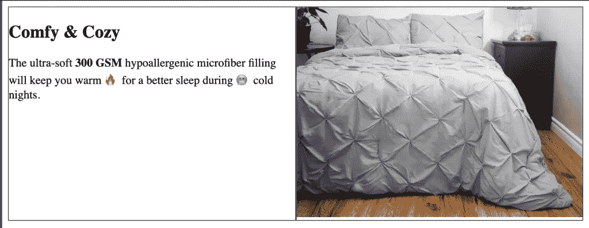

现在，让我们使用 Flexbox[将内容水平和垂直](https://softauthor.com/css-how-to-center-a-div-horizontally-vertically/)居中。

为此，我们需要将这三个 Flexbox CSS 规则添加到内部 div:

*   显示器:flex
*   Justify-content:居中；
*   对齐-项目:居中；

```
/* TWO COLUMN FLEXBOX */
.two-column div {
  border:1px solid blue; 
  flex:1;   display:flex;
  justify-content:center;
  align-items:center;
}
```

> 如你所见，我使用嵌套的 Flexbox，这在使用 Flexbox 时更常见。

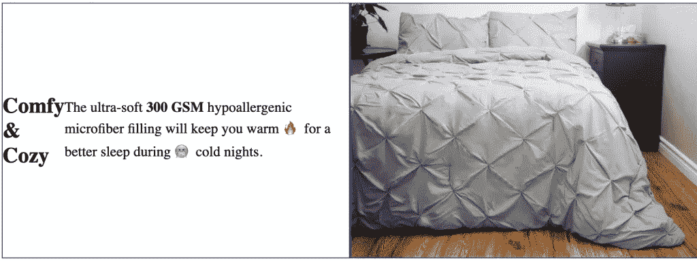

等等…

有些事情搞砸了。

标题和段落都试图水平和垂直地位于 div 的中间。

然而，我们想要的是让它们一个在另一个下面，可能是标题在上面，段落在下面。让我们在将它们居中之前先这样做。

为此，用 span 元素包装这两个元素。

这样，Flexbox 属性将应用于 span 元素，而不是其中的标题和段落。

```
<section class="two-column">
   <div>
    <span>
      <h2>Comfy &amp; Cozy</h2>
      <p>The ultra-soft <strong>300 GSM </strong>hypoallergenic microfiber filling will keep you warm  for a better sleep during  cold nights.
      </p>
     </span>
   </div>
   <div> 
     
   </div>
</section>
```

接下来，让标题和段落文本居中。

```
/* TWO COLUMN FLEXBOX */
two-column div {
  ...
  text-align:center;
}
```

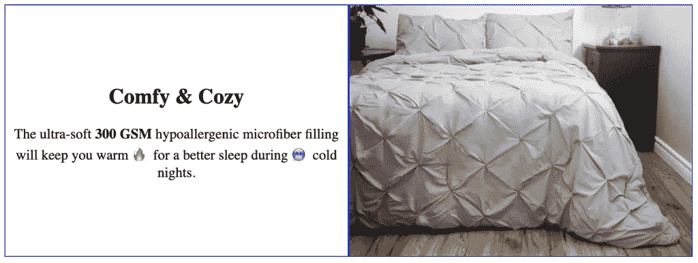

这个看起来不错！

如果您查看任何登录页面布局，第二个两列布局将在左侧显示图像，在右侧显示内容，依此类推。

让我们来看看如何做到这一点。

> 推荐
> [如何在 HTML 中创建页眉/横幅& CSS](https://softauthor.com/html-css-create-a-simple-header-banner/)

# 两列反向柔性盒布局

让我们添加一个新的内容和图像的两列标记，与之前的代码完全相同。

```
<!-- TWO COLUMN -->
<section class="two-column">
  <div>
    <span>
      <h2>Stylish Pinch-Pleated Desig</h2>
      <p>The ultra-soft <strong>300 GSM </strong>hypoallergenic microfiber filling will keep you warm  for a better sleep during  cold nights.
      </p>
    </span>
  </div> <div> 
    
  </div>
</section>
```

输出会是这样的。

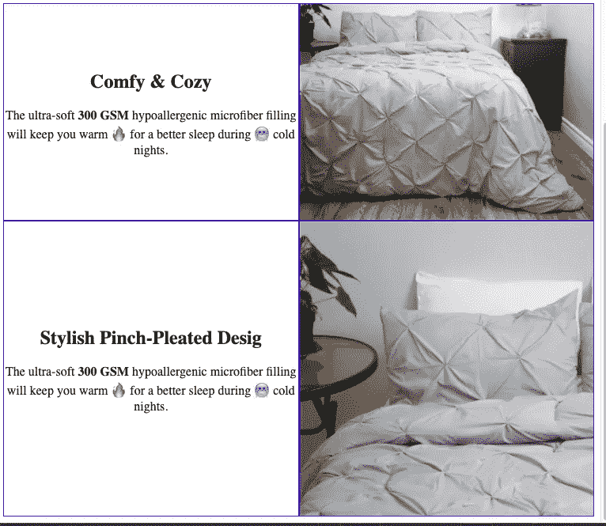

我们所要做的就是翻转 sections 块中的内容和图像 div。

```
<!-- TWO COLUMN -->
<section class="two-column">
  <div> 
    
  </div>
  <div>
    <span>
      <h2>Stylish Pinch-Pleated Desig</h2>
      <p>The ultra-soft <strong>300 GSM </strong>hypoallergenic microfiber filling will keep you warm  for a better sleep during  cold nights.
      </p>
    </span>
  </div>
</section>
```

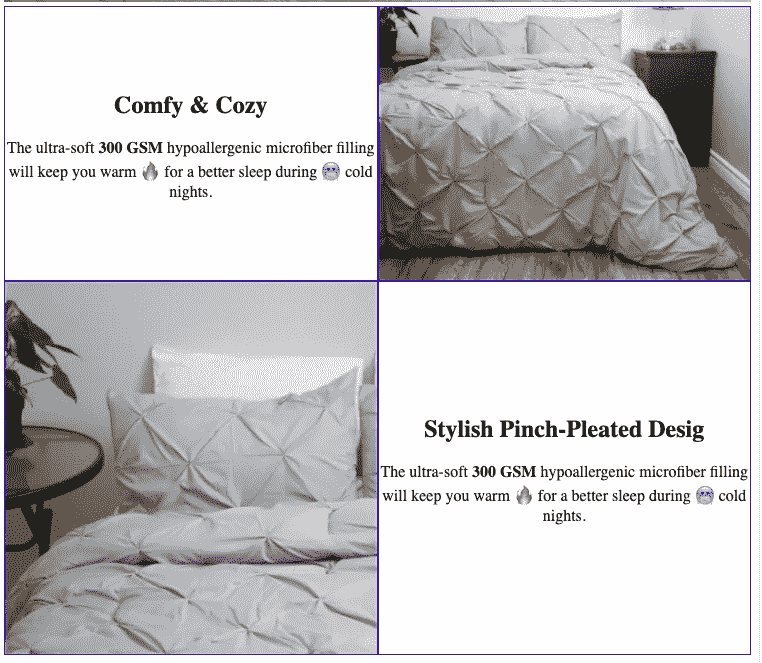

这是可行的，但还有更好的方法。

不改变 HTML 标记顺序，而是创建一个名为`reverse`的 CSS 修饰符类。

将它附加到需要在列之间交换内容的任何两列 section 元素。这比移动一整块 HTML 内容要容易处理得多。

```
.two-column.reverse {
  flex-direction: row-reverse;
}
```

属性 flex direction 决定了元素在该部分中出现的顺序。值 row-reverse 将水平翻转元素。

最后，将该类附加到 section 元素。

```
<section class="two-column reverse">
 ...
 </section>
```

注意:修改时接触的代码越少，意味着错误越少！

我们得到了同样的结果。


那么，我如何知道如何正确地创建一个初始的 HTML 标记，我可以使用 CSS 类轻松地修改它呢？

我建议你的 HTML 标记顺序应该看起来像它在移动布局中的样子。

这就是你总是想先创建移动布局的原因。

出于演示目的，我在本文中使用了从桌面到移动的方法。

现在，你可能会想…

在这一点上它是移动友好的吗？

答案是否定的，但这很容易做到。

> 推荐
> [用 HTML & CSS](https://softauthor.com/registration-form-design-in-html-css-with-code/) 设计酷炫的注册表单

# 两列移动布局

当我挤压我的浏览器时，布局将看起来像这样…而且它肯定不友好。

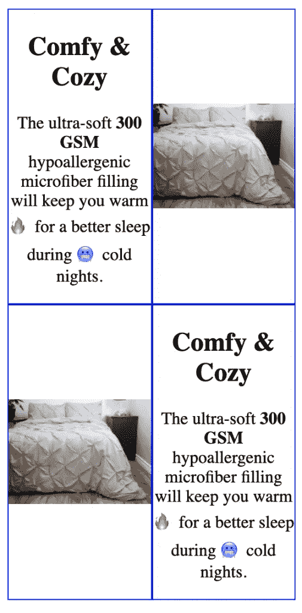

当浏览器屏幕小于 600 px 时，将两列布局更改为单列，并将各列上下堆叠。

为此，让我们为它添加一个 CSS 媒体查询断点块。

```
@media only screen and (max-width: 600px) {
}
```

要将行更改为列，我们所要做的就是使用`flex-direction`属性并将其值设置为`column`。

因此，section 块中的 div 元素位于下方，而不是彼此相邻。

```
@media only screen and (max-width: 600px) {
  .two-column, .two-column.reverse {
    flex-direction:column;
  }
}
```

信不信由你…

移动布局到此为止！

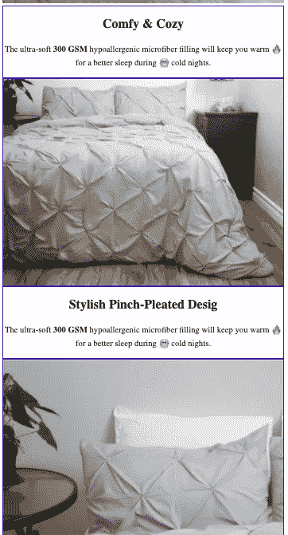

在这个阶段，这两列看起来很棒！

如果我们想要三列或更多列。

接下来让我们看看如何创建它们。

> 推荐(全程)
> [用 HTML5 和 CSS3](https://click.linksynergy.com/deeplink?id=nsrC6aUWa3g&mid=39197&murl=https%3A%2F%2Fwww.udemy.com%2Fcourse%2Fdesign-and-develop-a-killer-website-with-html5-and-css3%2F) 构建响应式真实世界网站

# 三列 Flexbox 布局

正如我前面提到的，我将根据我希望内容和图像在移动视图上的外观来制作 HTML 标记顺序。

所以，我想首先是标题，然后是段落，然后是图像。

```
<!-- THREE COLUMN -->
<section class="three-column">
  <div>
    <h2>No Vaccum SEAL</h2>
    <p>Shipped  in a vinyl bag - not vacuum sealed, so it arrives in ready to use <strong>fluffy </strong>condition! No extra work needed.
    </p>
    
  </div>
  <div>
    <h2>Wrinkle/Fade Resistant</h2>
    <p>The durable polyester fabric has a natural resistance to wrinkles and will retain its original color. 
    </p>
    
  </div> <div>
    <h2>Machine Washable</h2>
    <p>Easily cleaned  with a trip through the washing machine and dryer. Machine wash cold  separately and tumble dry low. </p>
    
  </div>
</section>
```

让我们使用 Flexbox 在一行中创建一个三列布局

```
.three-column {
  display:flex;
}.three-column div {
  flex:1;
  border:1px solid;
}
```

而且看起来很棒！

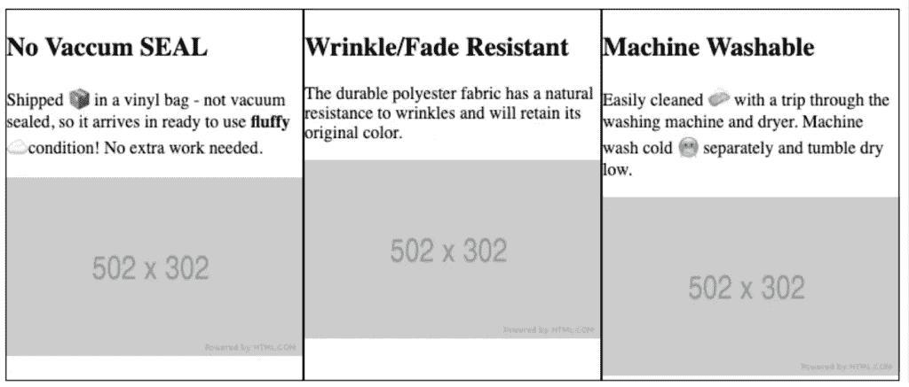

在桌面视图中，我希望图像在顶部，然后是标题和描述。

为此，我将在 div 内部使用 flex-direction:column-reverse 垂直反转元素的顺序。

```
.three-column div {
  flex:1;
  border:1px solid; display:flex;
  flex-direction:column-reverse;
}
```

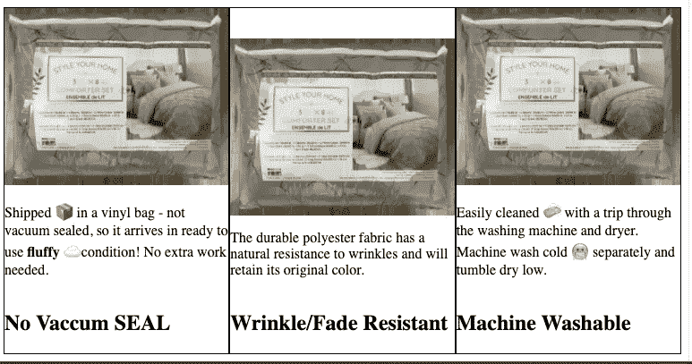

那很容易！

但是图像的顶部对齐不正确。

要解决这个问题，向 columns div 添加`justify-content:flex-end;`属性。

```
.three-column div {
  ...
  justify-content:flex-end;
}
```

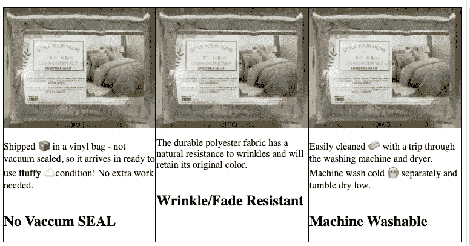

图像对齐很好。

但是，标题在描述下面。

为了让标题始终位于描述的正上方，我们需要用 span 元素将它们包装起来，就像我之前对两列所做的那样。

```
<!-- THREE COLUMN -->
<section class="three-column">
  <div>
    <span>
      <h2>No Vaccum SEAL</h2>
      <p>Shipped  in a vinyl bag - not vacuum sealed, so it arrives in ready to use <strong>fluffy </strong>condition! No extra work needed.
      </p>
    </span>
     
  </div>
 .....
</section>
```

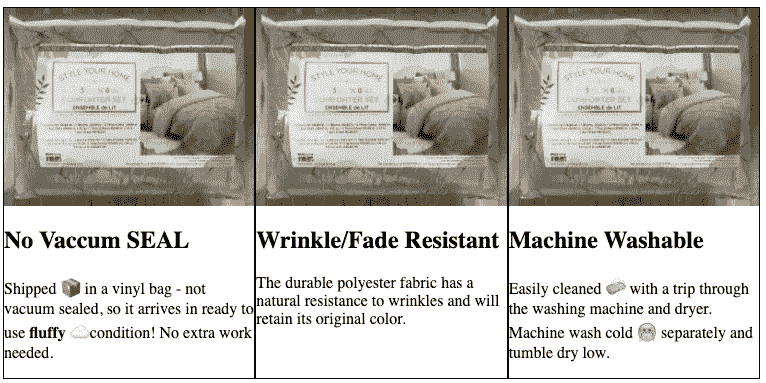

而且看起来和我们想要的一模一样！！！

> 推荐(全程)
> [网页设计初学者:HTML 中的真实世界编码& CSS](https://click.linksynergy.com/deeplink?id=nsrC6aUWa3g&mid=39197&murl=https%3A%2F%2Fwww.udemy.com%2Fcourse%2Fweb-design-for-beginners-real-world-coding-in-html-css%2F)

# 三列移动布局

类似于我们对两列布局所做的，当屏幕尺寸小于 600 像素时，我们需要改变列的伸缩方向。

这将使每列位于下方，而不是彼此并排。

```
@media only screen and (max-width: 600px) {
  .three-column {
    flex-direction:column;
  }
}
```

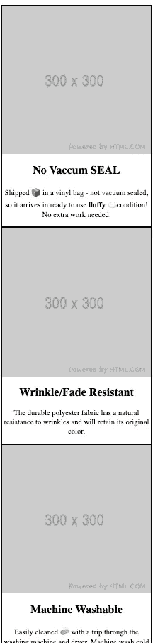

这看起来不错，但不符合单列和两列移动布局，因为它们的标题和描述就在图片上方。

要移动上面的标题和描述，请将 flex-direction:column 也设置为列 divs。

```
@media only screen and (max-width: 600px) {
  .three-column, .three-column div {
    flex-direction:column;
  }
}
```

现在，您可以看到在移动视图中所有的列都是一致的。


# 结论:

您可以看到，在没有任何 CSS 框架的情况下，创建一个响应式多栏布局是多么容易。

你已经学会了如何创造:

*   单列布局
*   两列柔性盒布局
*   两列反向柔性盒布局
*   两列移动布局
*   三列 Flexbox 布局
*   三列移动布局

点击获取完整源代码[！](https://softauthor.com/download-css-flexbox-responsive-multi-column-layout-cod/)

想了解更多关于 Flexbox 的知识，请看下面我推荐的课程。

[CSS—2020 年完整指南(包括 Flexbox、Grid & Sass)](https://click.linksynergy.com/deeplink?id=nsrC6aUWa3g&mid=39197&murl=https%3A%2F%2Fwww.udemy.com%2Fcourse%2Fcss-the-complete-guide-incl-flexbox-grid-sass%2F)

# 分级编码

感谢您成为我们社区的一员！在你离开之前:

*   👏为故事鼓掌，跟着作者走👉
*   📰查看更多内容请参见[升级编码刊物](https://levelup.gitconnected.com/?utm_source=pub&utm_medium=post)
*   🔔关注我们:[Twitter](https://twitter.com/gitconnected)|[LinkedIn](https://www.linkedin.com/company/gitconnected)|[时事通讯](https://newsletter.levelup.dev)

🚀👉 [**加入升级人才集体，找到一份神奇的工作**](https://jobs.levelup.dev/talent/welcome?referral=true)