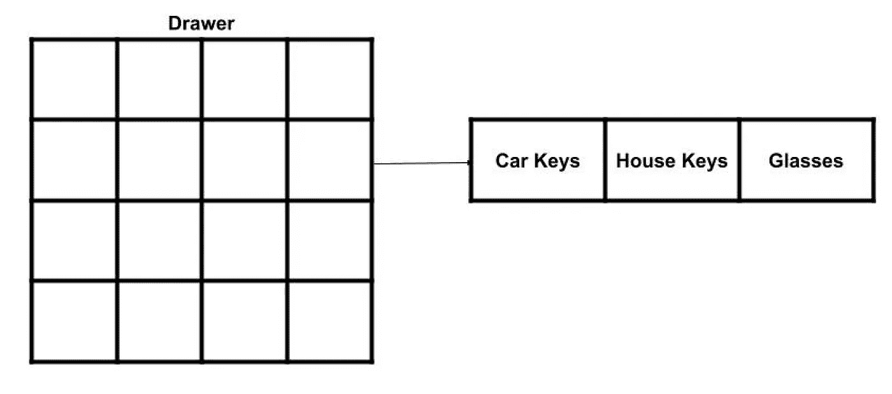
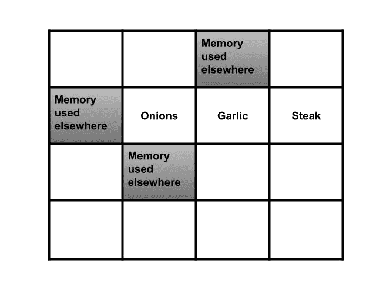
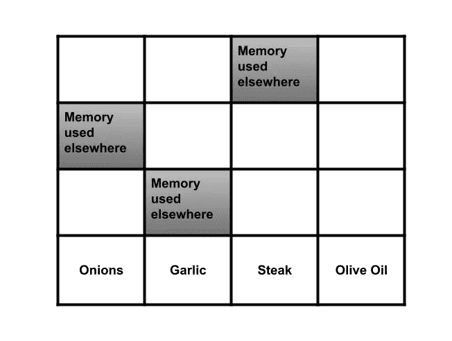
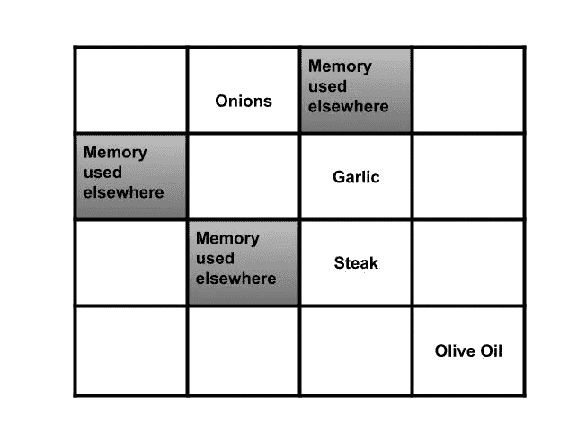
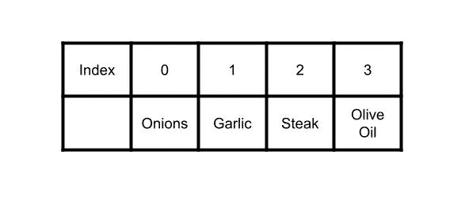
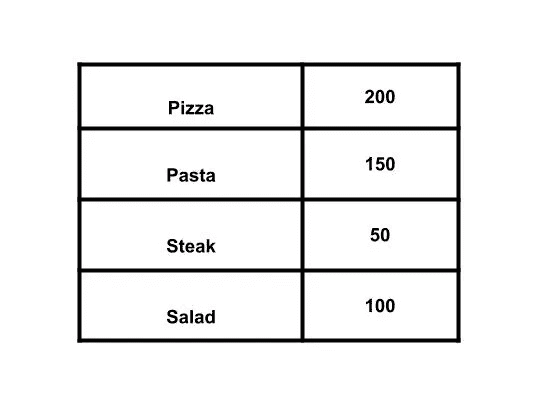
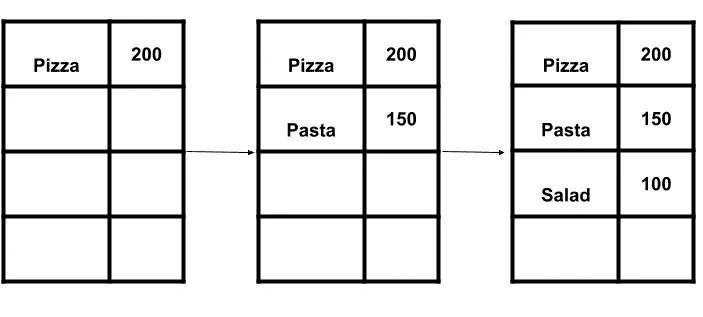

# 必须知道的数据结构和选择排序算法概述

> 原文：<https://levelup.gitconnected.com/must-know-data-structures-and-a-brief-overview-of-selection-sort-algorithm-f4b5975781bf>

## 数组和链表的区别是什么

迈克尔·泽兹奇在 [Unsplash](https://unsplash.com/photos/aQYgUYwnCsM) 上的照片

在本文中，我将介绍数组和链表，因为作为一名开发人员或试图获得第一份开发工作的人，它们是您应该了解的两种数据结构。我们还会看一下选择排序算法，这也是一个很好的算法。

尽管不需要知道所有的数据结构和算法，但是有些数据结构和算法你可能更愿意花时间去研究。如果你还没有，我推荐你看一下我以前关于大 O 符号和二分搜索法算法的文章，因为它会帮助你完全理解这篇文章的主题。

 [## 大 O 符号和二分搜索法——作为开发人员，你为什么要关心它们

### 大 O 符号是开发人员理解的基础，因为它分析算法的成本和它有多快…

levelup.gitconnected.com](/big-o-notation-and-binary-search-why-should-you-care-about-them-as-a-developer-8da90778988b) 

## 当我们在内存中存储数据时会发生什么

想象一下，我们有一个抽屉柜，每个抽屉里都有一个元素。

如果衣柜抽屉是我们的记忆，我们可以使用它的三个抽屉来插入我们想要的数据，如车钥匙、房子钥匙和眼镜。基本上发生的是，我们向计算机请求一些空闲空间，它返回给我们一个可以存放数据的地址。如果你想存储不止一个条目，正如我们上面所做的，你需要使用*数组*或*链表*，这并没有一个正确的方法，它只是取决于你想用这些数据做什么。因此，下面我们将比较这两者，并查看两者的使用案例。

## 看看数组和链表

让我们想象一下，现在这不是一个抽屉，而是你做的一个美食 app，你可以在里面放上你做特定一道菜需要的食材。

那么，如果我们忘记了一种成分，需要添加一种新的成分，会发生什么呢？不幸的是，你需要找到四个连续的地方来容纳所有四个元素，因此不得不移动最初的三个。

好吧，酷，我们已经。移动了最初的三种成分，我们添加了新的成分。但是现在如果我们想添加另一个，同样的事情，这是一个问题，那么有什么解决办法呢？

你可以向电脑要 10 个插槽。然而，在这种情况下，你要么不使用所有的内存，从而浪费它。

—或者你仍然需要 10 个以上的位置，你仍然需要移动所有的元素。

因此，虽然这种变通办法有时可能被证明是有效的，但它也有缺点。不过没关系，*链表*在这里给出一个解决方案:

## 链表

链表允许你的元素在内存中的任何位置，就像这样:

你怎么这么问。好吧，证据在布丁里(或者在“链接”这个词里)。这些成分以这样一种方式链接，即每一项存储下一项的地址。

这就像你下面的线索，一条通向另一条。因此，与向数组中添加元素相比，添加新的成分要容易得多，因为*链表*不需要移动所有的成分。相反，它会在任何地方添加新的成分，并将它的地址存储在列表的最后一个元素中。

所以*链表*在插入新元素方面要好得多，并且不需要数据一个挨着一个存储。那么*阵列*有什么用呢？

## 数组

在说数组有什么用之前，想象一下你正在读一本书，你想直接跳到第 50 页，但是你不能，你需要在看到你想看的那一页的内容之前，把之前的 49 页都读完。嗯，*链表*就有这个问题。因为*链表*中元素的地址不是连续的，为了找到最后一个元素的值，你需要遍历所有其余的元素来找到最后一个元素的地址。

但是*数组*是不同的——你知道数组中每一项的地址。所以如果你想读最后一条，你不需要事先读完前面的所有内容。

类似地，如果你想在一个列表的中间插入一些东西，你需要用数组来移动元素，这会比较慢，如果你删除一个元素也是一样。

## 不同的使用案例

既然*列表*看起来如此优越，为什么还要费心使用*数组*。虽然*列表*在插入和删除方面更好，但是数组在读取数据方面更好，因为它们提供了随机访问。

假设你想登录 Youtube。他们有很多用户名，所以最快确定你输入的用户名是否正确的方法是使用二分搜索法算法——如果你不熟悉二分搜索法，你可以阅读我之前的文章。

 [## 大 O 符号和二分搜索法——作为开发人员，你为什么要关心它们

### 大 O 符号是开发人员理解的基础，因为它分析算法的成本和它有多快…](/big-o-notation-and-binary-search-why-should-you-care-about-them-as-a-developer-8da90778988b) 

但是二分搜索法要求随机访问，所以*链表*不是一个选项。

然而，如果我们在餐馆工作，订单排着队进来，厨师一个接一个地把它们拿走。嗯，厨师不需要随机访问，所以你会去名单。

## 选择排序算法

最后，我们可以使用上面提到的所有方法来组合选择排序算法。

假设我们拥有一家餐馆，我们希望根据包含特定食物的订单数量列出人们点的食物类型，如披萨、意大利面、牛排或沙拉。

一种方法是找到最大的数字并将其添加到一个新的列表中，然后对其余的数字重复这个过程。

所以你要检查 n 次来找到集合中最大的数，然后做 n 次来得到最终结果，这意味着需要的时间是 O(n2)。

就这么简单，但选择排序并不真的很快，这就是快速排序的用武之地，但我们不会在本文中讨论它。

## 结论

数组和列表是两种基本的数据结构，虽然很多算法和数据结构在你开始工程生涯时可能并不需要，但这两种数据结构是非常基本的，值得了解。因为它们是基本的，当你学习更复杂的主题时，你还会需要它们。

我希望你喜欢这篇文章，如果有什么不清楚或者可以做得更好的地方，我会非常感谢你在评论中的反馈。