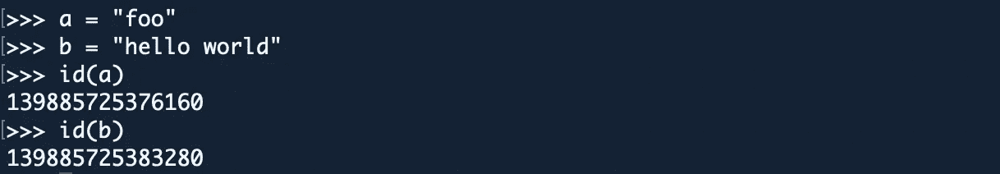
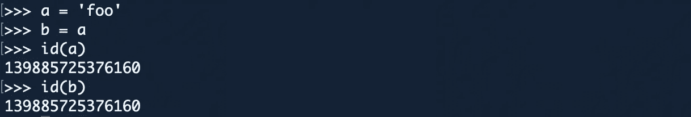
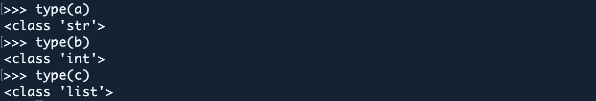
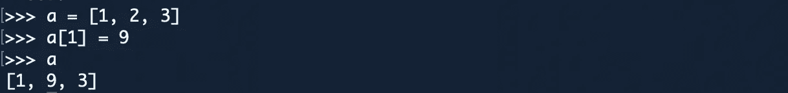
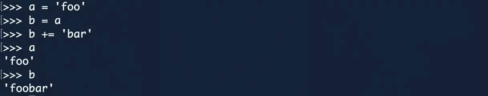
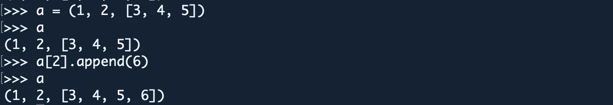
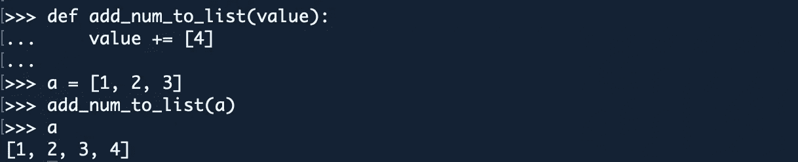
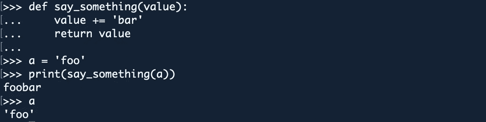

# 可变的，不可变的…一切都是对象！

> 原文：<https://levelup.gitconnected.com/mutable-immutable-everything-is-an-object-898490075bce>


Python 最强大的特性之一就是一切都是对象，包括函数。Python 中的函数是一级对象。这也意味着每个实体都有一些元数据(称为属性)和相关的功能(称为方法)。

不同的编程语言以不同的方式定义**对象**。在某些情况下，它意味着所有对象都必须有属性和方法；在其他情况下，这意味着所有对象都是可子类化的。

在 Python 中，定义更宽松；有些对象既没有属性也没有方法，而且不是所有的对象都是可子类化的。但是一切都是对象，因为它可以被赋给一个变量或者作为一个函数的参数传递。

一些对象是:

*   整数
*   用线串
*   列表
*   功能
*   等等。(全部)

我们可能认为是一个**变量**，而不是认为它是一个**名称**。当我们给一个变量赋值时:

```
<name> = <object>
```

我们实际上是将一个名为的绑定到一个对象上。这意味着一个对象可以绑定多个名字。

# id 和类型

为了了解为什么 Python 中的一切都是对象，我们有了函数 T0 和 T1。

**id()** —是 Python 中的内置函数，接受一个参数，用于返回对象的身份。

`id`语法:

```
id(object)
```

`id`举例:



在生命周期中，身份必须是唯一的和不变的。具有非重叠生存期的两个对象可能具有相同的 id()值。



如果我们把它和 C 联系起来，那么它们实际上是内存地址，在 Python 中是唯一的 id。

**type()** —是 Python 中的内置函数，是返回作为参数传递的对象的类类型的方法

`type`语法:

```
type(object)
```

`type`举例:



从上面的代码中，我们得到了不同的类型`a`是类的类型*字符串*，`b`是类的类型 *int* 而`c`是类的类型*列表*。

# 可变和不可变对象

原来 Python 有两种对象性质:`mutable`和`immutable`。

**可变对象的值在创建后可以被改变**。**不可变对象的值不能是**。

一个`list`是一个**可变对象**。您可以创建一个列表，添加一些值，然后列表就会被更新。



可变对象

一个`string`是一个**不可变的对象**。一旦创建了字符串，就不能更改其值。



不可变对象

当你改变一个字符串时，你实际上是将它重新绑定到一个新创建的字符串对象上。原始对象保持不变，即使有可能不再引用它。

即使我们正在使用`+=`并且*看起来*我们正在修改字符串，我们实际上只是得到了一个包含更改结果的新字符串。

不可变变量在创建后不能更改。如果你想改变一个不可变的变量，比如一个字符串，你必须创建一个新的实例，并将变量绑定到新的实例。可变变量可以就地改变。

警告 **:** 一个不可变的元组可以包含可变元素，比如 list ex: `(1, 2, [3, 4, 5])`。元组中对列表的引用可以保持不变，即使列表的内容被修改。



修改元组内的列表

# 关键要点

一个*可变*对象表现出时变行为。通过绑定到可变对象的所有名称，可以看到对可变对象的更改。

一个*不可变的*对象不会表现出随时间变化的行为。不可变对象的值在创建后不能修改。它们*可以*用于计算**新**对象的值

如果我们将可变对象传递给一个函数，那么被传递的对象(原始对象)的值可能会被修改



将可变对象传递给函数

在另一种情况下，如果我们将不可变的对象传递给一个函数，被传递的对象仍将保持其原始值



将不可变对象传递给函数

## 资源:

[](https://jakevdp.github.io/WhirlwindTourOfPython/03-semantics-variables.html) [## 基本 Python 语义:变量和对象

### 在 Python 中给变量赋值就像把一个变量名放在等号(=)的左边一样简单:这可能看起来…

jakevdp.github.io](https://jakevdp.github.io/WhirlwindTourOfPython/03-semantics-variables.html)  [## Python:一切都是对象，有些对象是可变的

### Python 作为一种易于读写的语言而享有盛誉，这是当之无愧的。它有很棒的文档和…

medium.com](https://medium.com/@larmalade/python-everything-is-an-object-and-some-objects-are-mutable-4f55eb2b468b) [](https://jeffknupp.com/blog/2013/02/14/drastically-improve-your-python-understanding-pythons-execution-model/) [## 大幅改进您的 Python:理解 Python 的执行模型

### 刚接触 Python 的人经常会对自己代码的行为感到惊讶。他们期待一个但是，似乎没有任何理由…

jeffknupp.com](https://jeffknupp.com/blog/2013/02/14/drastically-improve-your-python-understanding-pythons-execution-model/) [](https://www.geeksforgeeks.org/id-function-python/) [## Python - GeeksforGeeks 中的 id()函数

### 简介 id()是 Python 中的一个内置函数。语法:id(object)正如我们所看到的，该函数接受单个…

www.geeksforgeeks.org](https://www.geeksforgeeks.org/id-function-python/) [](https://stackoverflow.com/questions/865911/is-everything-an-object-in-python-like-ruby) [## python 中的一切都是像 ruby 一样的对象吗？

### 感谢贡献一个堆栈溢出的答案！请务必回答问题。提供详细信息并分享…

stackoverflow.com](https://stackoverflow.com/questions/865911/is-everything-an-object-in-python-like-ruby) [](https://jeffknupp.com/blog/2013/02/14/drastically-improve-your-python-understanding-pythons-execution-model/) [## 大幅改进您的 Python:理解 Python 的执行模型

### 刚接触 Python 的人经常会对自己代码的行为感到惊讶。他们期待一个但是，似乎没有任何理由…

jeffknupp.com](https://jeffknupp.com/blog/2013/02/14/drastically-improve-your-python-understanding-pythons-execution-model/)