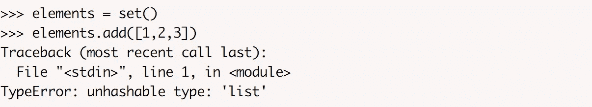
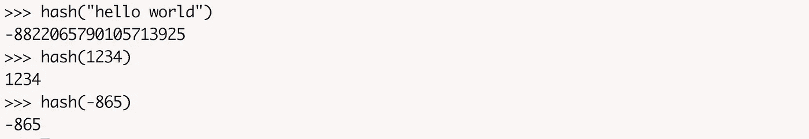
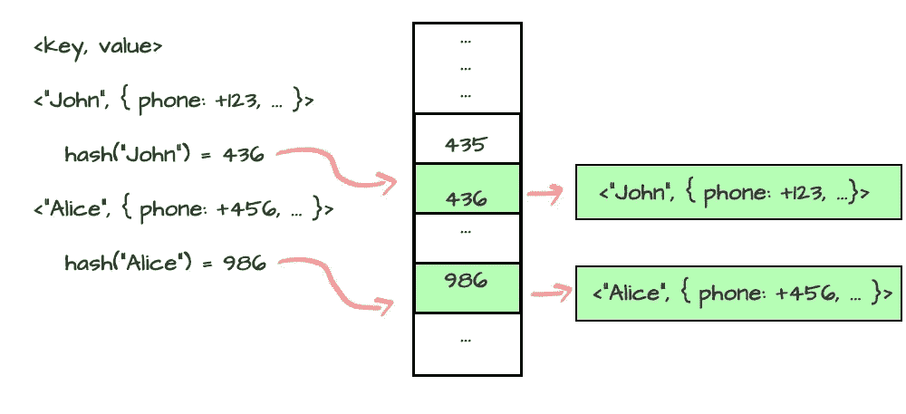
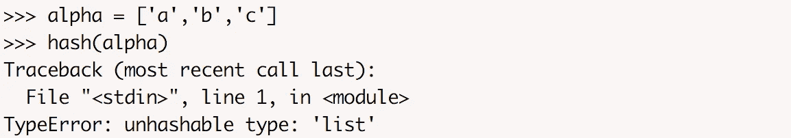
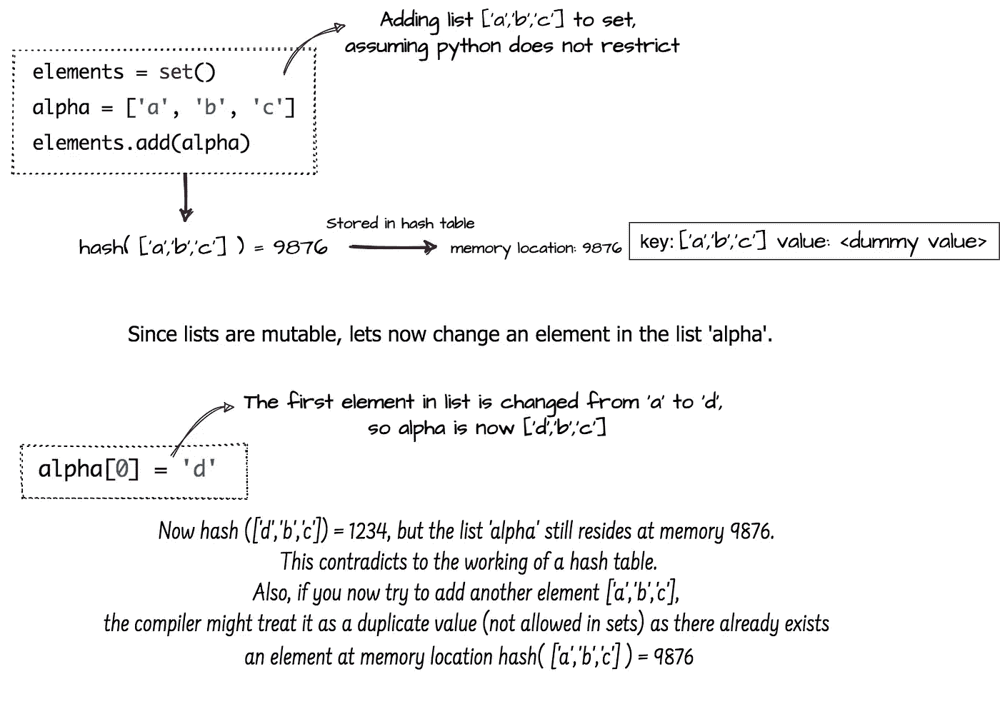
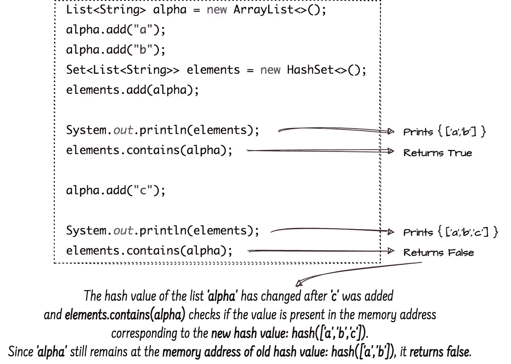

# 集合中的可变元素:Python 与 Java

> 原文：<https://levelup.gitconnected.com/mutables-in-a-set-python-vs-java-e1293536abe9>

## Java 中在集合中使用可变变量的副作用以及 Python 对此加以限制的原因

Set 是 Python 和 Java 中都有的内置数据类型，但是这两种语言对 set 中的元素的处理方式不同。
尽管 set 的底层实现在两种语言中是相同的， ***Java 允许你添加可变的对象，比如一个列表到 set 中，而 Python 不允许。***

# Python 限制向集合中添加列表

在 python 中，当您尝试将整个列表添加到集合中时，编译器会抛出一个错误:

Python 限制向集合中添加列表

Python 限制向集合中添加列表，因为*‘list’*是一个*不可销毁的类型。*为了更好地理解这一点，我们先来谈谈*哈希值*和*哈希表*。

## 散列值

哈希是使用哈希函数分配给对象的唯一值。如果两个对象相等，那么它们的散列将是相同的，反之亦然。您可以通过以下方式检查 python 中任何对象的哈希:

## 哈希表

哈希表是存储键值对的数据结构。对于任何键-值对，hashtable 使用 hash 函数计算键的*散列，并使用那个*散列值作为存储地址*来存储数据。在通过关键字查找数据的过程中，*关键字被散列*，并且得到的散列值指示相应数据存储的位置。*

通过计算关键字的哈希值将数据存储在哈希表中

一个 ***集合使用一个散列表*** 作为其底层数据结构，并将我们添加到集合中的元素存储为一个键-值对，将 ***键*作为集合元素**，将 ***值*作为某个空值**。计算添加到集合中的元素键的散列，并将数据存储在哈希表中的这个内存地址。

## 只有不可变的对象可以被散列

Python 有两种数据类型:*可变*和*不可变*。可变对象可以改变它的内容，而不可变对象不能。

> **可变类型:** *列表、字典、集合、字节数组*
> 
> **不可变类型:** *int，float，complex，string，tuple，冻结集，bytes*

在 python 中，对象拥有哈希值有一个条件:

> 对于一个可散列的对象，它必须是不可变的。

一个可变的列表不能被散列。

这是因为，一旦对象的散列被计算出来，它应该在其整个生命周期中保持不变。但是如果一个对象的值可以改变，也就是说，如果它是*可变的*，那么当值改变时，散列也会改变，并且会导致意外的行为。因此，python 只允许不可变对象的哈希值。

## 如果可变对象可以被散列并添加到集合中，会出现什么意外行为？

假设我们将一个列表添加到一个集合中，并假设我们可以计算这个可变列表的哈希。下图描述了修改添加到集合中的列表将如何破坏哈希表的实现。

因此，如果*集合*中的值是可变的，那么当对象被修改或更新时，内存位置地址和散列将会不匹配。 ***因此，在 python 中，只有不可变的对象，如整数、字符串或元组，才可以被散列，并可以用作集合中的元素或字典的键，即使集合或字典本身是可变的。***

# Java 里会发生什么？

尽管 Java 在内部使用 hashmaps 来存储 HashSet，但核心实现与 Python 中的基本相同。但是和 Python 的情况一样，Java **不限制**向集合中添加可变对象，并且**可变对象也可以有一个哈希值**。

但是，如果您将一个可变对象添加到集合中，并且如果该对象改变了它的状态，那么集合实现可能会导致一些混乱的行为。如果您遍历该集合，该对象将仍然存在，但是如果您使用 **contains()** 方法查询该集合，它可能看起来不存在。下面的代码演示了这一点。

当将一个类的对象添加到一个集合中时，如果您更改该类中任何字段的值，将会产生相同的副作用，这有助于该类的 hash code()(在该类使用*身份哈希代码*而不是 hashCode()的任何重写实现的情况下，不会遇到这种情况)。 ***因此，在 Java 中，如果修改后的元素对其 hashCode()有贡献，那么在修改后移除并重新插入集合中的元素总是更安全的。***