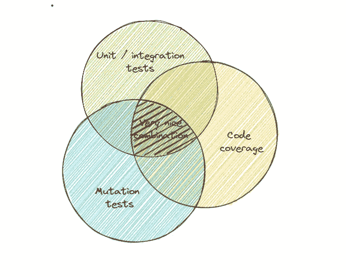
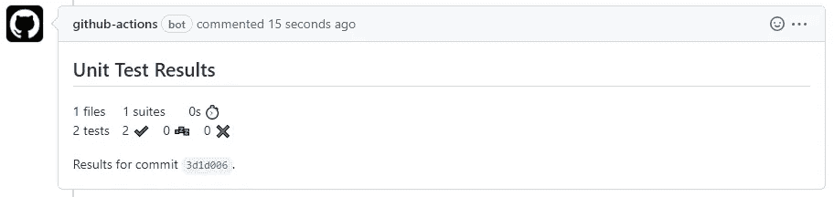
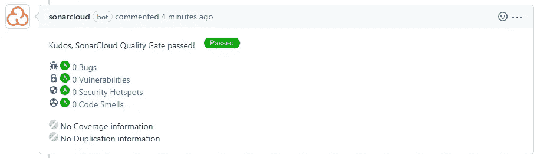
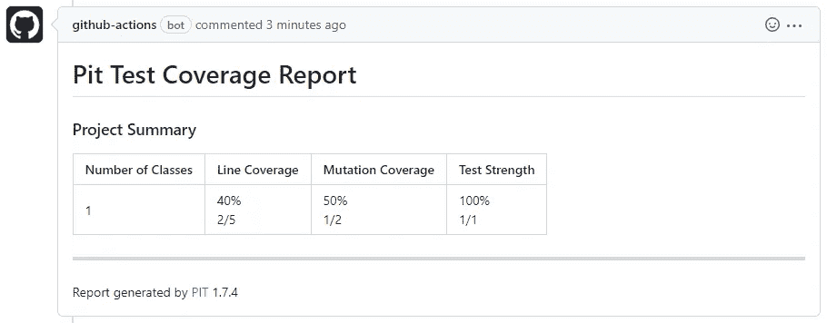

# 突变测试作为对依赖库的更健壮的检查

> 原文：<https://levelup.gitconnected.com/mutation-testing-as-a-more-robust-check-of-dependent-libraries-ca13af2a27ec>

有效的测试金字塔形状和良好的测试覆盖率只是遵循 TDD 实践的副作用。这个话题在[之前的文章](/test-pyramid-as-a-measurable-code-metric-b2363e95ebe8)中有详细介绍。

遵循“测试优先”的范例也有助于以一种更加用户友好的方式定义模块 API，因为测试实际上成为了公开的组件访问点的早期采用者。

但是，您对无意的 API 误用和有意的错误使用的保护有多全面呢？TDD 是否足以确保有一个可接受的覆盖组件行为的级别，并且没有暴露关键的漏洞？

## 关于测试的✍传奇

> “我所知道的大多数测试人员都很反常，如果你告诉他们通过应用程序的‘快乐之路’，那是他们最不愿意做的事情。”
> **释放它！:设计和部署生产就绪软件**

我相信这种说法不仅可以被测试人员所接受，也可以被许多软件工程师所接受，这些工程师试图在他们的应用程序中采用一个外部库，而这个库所涵盖的用例范围并不包括他们的特定用例。


错误的形状

这在软件工程中是一个非常常见的问题，因为库是为解决特定需求而构建的，而您的需求并不总是在本库旨在涵盖的范围内。因此，工程师需要不时地采用与他们的情况最接近的最合适的库。

因为已经获得了经验，所以通常在周围地区使用单一用途的库。因此，采用它作为通用组件比使用更专业的组件更容易。一个很好的例子是当 Selenium 成为事实上的通用测试平台时，包括 API 和性能测试领域。

## 关于共享图书馆的✍传奇

公共库是封装不同应用程序之间共享逻辑的一种方式。当所有服务都基于单一设计规则或重用公共工作流时，这是确保服务之间行为一致性的好解决方案。

显然，支持一个有效的共享库依赖图是另一个需要考虑的架构挑战，所以要小心重载这个图。这个话题在本帖中[已经很好的覆盖了，就不多停了。](https://medium.com/codex/what-i-was-doing-wrong-dependency-management-and-monorepo-816c698ab9f)

使用公共库的另一个原因是为复杂的特性提供高层次的抽象，通过利用 OOP 封装隐藏实现并保护它不被覆盖。

独立模块与整个服务具有相同的体系结构，因为它有自己的消费者(其他模块或服务)、自己的功能路线图、部署周期等。

唯一的区别是，它不是一个对最终用户隐藏的黑盒，而是另一段注入到现有体系结构中的代码，具有完全的读取权限。那么，如何确保模块仅限于由模块创建者定义的一组用例，并且没有不正确使用的后门呢？


不仅是公共模块，公司私有库也应该从这个角度进行修改。不正确的库使用或未记录功能的使用可能会产生意想不到的副作用。并不总是故意的，而是由于缺乏文档或技术专业知识。

听起来像一个完全不确定的任务？可能是的，但是也许我们可以定义一些阈值，这样任何低于这条线的结果都表明我们还不能推荐这个库进一步使用。

所以让我们把这个挑战性的问题分解成子问题:

1.  如何保证库不公开无证 API？
2.  如何确保文档 API 只覆盖一组定义的用例，并且不恰当的 API 使用不会产生严重的副作用？

## ⛅检查现有 API 可能的副作用

从开发人员的角度来看，有哪些意想不到的副作用？当设计的 API 对不期望的输入变得敏感，并基于该输入提供扩展功能或意外行为时，我会感到不舒服。

我们如何证明 API 只做规定的工作并且做得正确？正确，包括单元代码、集成和服务测试。

我们如何证明测试是完整的，并且不仅检查成功路径，而且检查所有可能的条件流特性支持？正确，通过分析它的覆盖范围。

我们能确保足够好的测试覆盖率(例如 90+ %)解决我们在执行过程中检测所有可能的信息流的问题，并防止意外的副作用吗？不幸的是，没有。它需要调味汁中的第三种成分——确保我们的测试也涵盖所有可能的数据突变。



这里的“突变”是什么意思？这是一个特定的度量，以确保测试检查实际行为，而不仅仅是代码执行流，它对边缘情况很敏感，并且它不仅仅是为了通过代码质量关而编写的。

这三种配料的结合产生了非常浓的调味汁:

*   **单元测试** + **覆盖率** =测试场景的🗹丰满度
*   **覆盖** + **变异测试**覆盖代码的=🗹丰满度，当应用变异时，它可以发出错误信号
*   **单元测试** + **突变测试** =被检查场景的🗹丰满度

## ⚽:让我们在实践中检验一下

源代码:[https://github.com/donvadicastro/docker-monitoring-stack](https://github.com/donvadicastro/docker-monitoring-stack)

我们将在每个验证阶段使用以下工具:

*   ⚡ **JUnit** 进行单元和集成测试
*   ⚡[**sonar cube**](https://www.sonarqube.org/)用于测量由 [**sonarcloud.io**](https://sonarcloud.io/) 管理的测试覆盖率
*   ⚡ [**PITest**](https://pitest.org/) 用于执行变异测试
*   ⚡ [**GitHub 动作**](https://github.com/features/actions) 自动验证

我们的目标是从所有三个角度检查发布的代码(在拉请求审查期间):测试通过，测试的数量足以证明质量，测试检查实际行为，而不仅仅是流程完成。

如果这些检查中至少有一项没有通过，我们希望整个 CI 构建失败。

## 🗹 **配置单元测试门**

这是一个足够简单的步骤，因为 JUnit 已经广泛集成到开发文化中，所以市场上有许多开源和第三方插件，无需额外的代码就可以实现需求。首先是将测试运行作为 CI 流程的一部分:`gradle test`稍后检查执行结果，以做出关于阶段结果的决定，并将其提交给 PullRequest

```
- name: Report unit tests
  uses: dorny/test-reporter@v1
  if: always()
  with:
    name: Gradle Tests
    path: '**/build/test-results/test/TEST-*.xml'
    reporter: java-junit
    fail-on-error: true

- name: Publish Unit Test Results
  uses: EnricoMi/publish-unit-test-result-action@v1
  if: always()
  with:    files: "**/build/test-results/test/TEST-*.xml"
```

步骤完成后，将发布新的注释，以提取正在验证的请求。示例:



## 🗹 **配置代码覆盖门**

我们可以使用自托管的 SonarQube 以及公共项目的免费云版本。在本练习中[**Sonar cloud . io**](https://sonarcloud.io/)**使用的是声纳云版本，但是 docker 提供的声纳在 [docker-compose 配置](https://github.com/donvadicastro/docker-monitoring-stack/blob/master/docker-compose.yml)中声明。**

**此外，声纳服务器和额外的工作空间信息需要添加到项目配置文件。示例:**

```
systemProp.sonar.host.url=https://sonarcloud.io/
systemProp.sonar.login=
systemProp.sonar.projectKey=
systemProp.sonar.projectName=
```

**配置完成后，将发布另一条注释，以提取正在验证的请求。示例:**

****

## **🗹 **配置变异测试门****

**添加对运行变异测试的支持作为验证管道的一部分，需要实施以下步骤:**

*   **在项目中注册 **pitest****

```
plugins **{
**   id 'info.solidsoft.pitest' version '1.7.4'
**}**
```

*   **配置新任务“pitest”**

```
pitest **{** junit5PluginVersion = '0.15'
   outputFormats = ['XML', 'HTML', 'CSV']
**}**
```

*   **配置 CI 步骤以运行测试**

```
- name: Mutation tests
  run: gradle :application-backend:pitest
```

*   **配置 CI 步骤以发布结果**

```
- name: Comment PR
  uses: machine-learning-apps/pr-comment@master
  env:
    GITHUB_TOKEN: ${{ secrets.GITHUB_TOKEN }}
  with:
    path: <path_to_report>
```

**配置完成后，将发布另一条注释，以提取正在验证的请求。示例:**

****

**希望你的持续集成管道是产生关于特性质量决策的唯一信任来源。这是进一步实现全自动化生产部署管道的先决条件。**

**感谢您的反馈。**