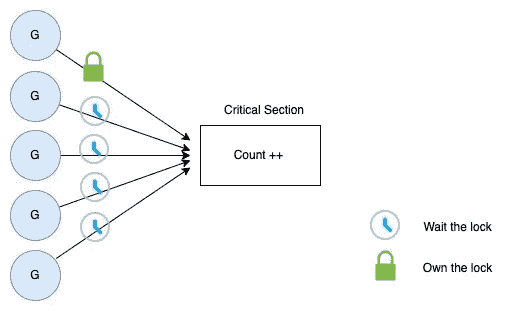
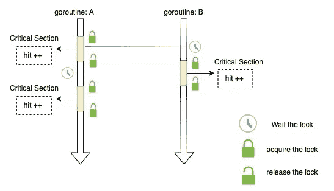
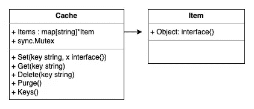

# Go 中的互斥示例

> 原文：<https://levelup.gitconnected.com/mutex-examples-in-go-ad7c440461a4>

## 使用示例更好地理解 Go 中的互斥体


Muhammad Zaqy Al Fattah 在 [Unsplash](https://unsplash.com?utm_source=medium&utm_medium=referral) 上拍摄的照片

在围棋中，频道是奇妙的，你可以用它们在围棋程序之间进行交流。然而，为了方便起见，在某些情况下您可能想使用`sync.Mutex`。

这些情况如下:

*   **保护内部状态**
*   **缓存问题**
*   **为了获得更好的性能**

在本帖中，我将列举三个 Go 互斥的例子，希望它们能让你更好地理解 Go 互斥的实现。

# 简单的柜台

在这个例子中，我们实现了一个可以安全并发使用的**计数器**。具体来说，我们使用五个 goroutines 将计数器递增 100，000 次。然后，我们打印最终计数。



Go 中的互斥示例(计数器)

以下是完整的源代码:

最终结果应该是

```
500000
```

解释:

*   `Counter`是一个包含一个`count`变量和一个`Mutex` 字段 ***的结构。*** 前一个变量存储正在递增的值，后一个变量确保递增正确进行，没有[数据竞争](https://en.wikipedia.org/wiki/Race_condition#Data_race)问题。
*   `Inc`是一种将计数器加 1 的方法。在该方法中，`c.count++`是[临界段](https://en.wikipedia.org/wiki/Critical_section)。mutex 中的`Lock`和`Unlock`方法用于确保一次只有一个 goroutine 可以执行临界区的代码。
*   函数`main`创建一个新的计数器并启动五个 goroutines。goroutines 将并发运行，每个将执行 100，000 次。`waitgroup`用于在主函数返回之前等待所有 goroutines 完成。

# 乒乓球游戏

在这个例子中，程序使用两个 goroutines 来模拟两个玩家。每个球员击球十次。该程序使用互斥体来确保一次只有一个 goroutine 可以访问球并打印命中数。



围棋中的互斥示例(乒乓)

以下是完整的源代码:

最终结果应该是

```
playerB 1
playerA 2
playerB 3
playerA 8
playerA 9   // notice here
...
playerB 18
playerA 19
playerB 20
```

解释:

*   `Ball`类型是一个具有`hit`字段和`mutex`字段的结构。前者用于统计球被击中的次数，后者确保一次只有一个 goroutine 可以访问球。
*   `b.hit++`是临界段。锁定和解锁方法确保只有一个 goroutine 可以执行临界区。
*   在 main 函数中，我们创建了一个球和一个等待组。然后我们创建两个 goroutines。他们用球员的名字、球和等待组来调用球员函数。最后，我们为两个 goroutines 调用等待组的 wait 方法来完成。

两名球员比赛击球。然而，我们不保证球以交替的顺序击中。

为了实现这一点，我们可以使用一个通道来协调这两个角色。因为通道最适合下列情况

*   **传递数据所有权**
*   **分配工作单元**
*   **交流异步结果**

以下是渠道版本的代码:

# 最简单的缓存



Go 中的互斥示例(简单缓存)

此缓存有以下方法；它们都受到互斥体的保护。

*   `Set`:添加或更新缓存中的项目
*   `Get`:从缓存中获取一个项目。
*   `Delete`:从缓存中删除一个项目。
*   `Keys`:获取缓存中的所有键
*   `Purge`:删除缓存中的所有项目

# 摘要

**互斥**和**通道**是两种不同的解决数据竞争问题的工具。互斥对资源的顺序访问。另一方面，通道是用于协调 goroutines 之间的计算。

用哪个？

**用最有表现力最简单的！**