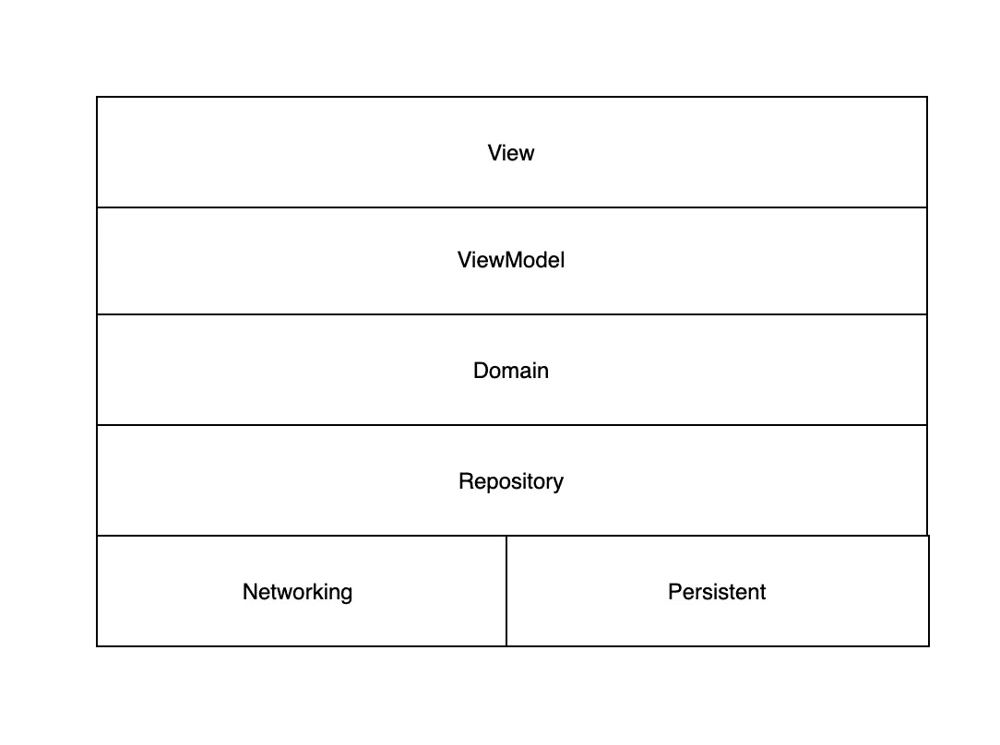

# MVC，MVP 和 MVVM:比较

> 原文：<https://levelup.gitconnected.com/mvc-mvp-and-mvvm-comparations-d2bddb467e11>

## 干净的代码促进了 iOS 中的现代架构

MVC、MVP 和 MVVM 是 iOS 开发和 Android 等其他平台的三大架构。这些都是好的架构，这完全取决于开发者的选择。苹果在推广 MVC。大多数开发人员都在使用 MVP。MVVM + RxSwift 成为应用程序开发中处理异步请求的现代架构。这三种架构更像是一个从 MVC、MVP 到 MVVM 的演进过程。但是它总是坚持一个原则:

> 使代码具有可读性、可伸缩性和可靠性

在这篇文章中，我将介绍和比较这三种模式，并解释一下我的个性化架构。

# MVC(模型—视图—控制器)

## 视角

视图应该只关注与客户的交互，而没有任何业务逻辑。我们可以很容易地用故事板和笔尖做到这一点。在这一层中，它只包含:

*   子类:从基本的`UIView`到复杂的用户界面控件。
*   属于 UIKit/AppKit 的类。
*   核心动画。
*   核心图形。

## 模型

模型层更加通用，包括所有的网络、持久性、常量和扩展代码。它还包含服务于业务逻辑的所有模型。

就个人而言，我希望将网络和持久性类转移到存储库层。其他的，比如常量、管理器和扩展，将被移动到支持层。模型层仅用于数据模型。因此，对于这一层，它是可定制的。

## 控制器

在 iOS 中，视图控制器是一个处理视图交互的类。它通常包含许多委托/数据源(TableViewDataSource 和 TableViewDelegate 等)。)和查看生命周期(ViewDidLoad、ViewDidAppear 和 ViewWillAppear 等)。).对于用户来说，这是一个很好的设计，可以在特定时间处理不同类型的交互。

然而，我们的委托越多，我们在每个函数中需要的逻辑就越多。这很快增加了 ViewController 的大小。如果一个视图控制器有成千上万行难以维护的代码，你会经常看到这种情况。

由于控制器层不是 MVC 中的最佳实践，我们肯定可以做些什么来清理这一层。最好的方法是将控制器中的大部分逻辑提取到其他层，如 Presenter 和 ViewModel 层。然后，我们定义了演示者/视图模型和控制器之间的通信模式。我们迎来了 MVP 和 MVVM。

# MVP(模型-视图-演示者)

正如我在 MVC 中提到的，MVP 和 MVC 看起来很相似。MVP 更好的原因是它有一个包含所有业务逻辑的表示层。它使用委托和闭包与视图层通信。

在视图层，它包括 MVC 中引入的视图元素。此外，它还包括该层中的 ViewControllers。因此，处理生命周期和视图委托的 UIView 代码和 ViewController 代码应该被视为视图代码。

# MVVM(模型-视图-视图模型)

MVVM 和 MVP 是相似的:所有的视图层和模型层都是一样的。ViewModel 和 Presenter 持有大部分业务逻辑。区别在于视图和业务逻辑之间的交流。

如果我们对大量异步代码使用 MVP，我们必须在 ViewController 中使用大量委托，或者在异步结果返回之前使用大量闭包将值保存在内存中。此外，我们可能需要大量 dispatchqueue.main.async 样式的代码来将结果传递给主线程。

MVVM 就是为了解决这个问题而诞生的。

使用 MVVM，ViewModel 中的变量被绑定到 UI 元素。

ViewModel 中发生的任何更改都会自动传递到视图中。来自视图的任何交互都直接反映了视图模型。因此，不需要委托和闭包等。代码看起来干净多了。

# 最后的想法

总的来说，对于这三种架构，我们关注的是业务逻辑。我们应该把它放在哪里，以及我们如何处理通信。无论我们如何改变它，只有一个规则——让代码更干净(可读和可伸缩)。所以，我想分享一下我一直用的架构。希望对你有帮助。

正如您从本文中了解到的那样，没有必要讨论视图、视图模型。让我们扩展模型层。

网络层和持久层由存储库层管理，所有数据都必须经过存储库层。通过这样做，逻辑层不必担心数据来自哪里。

域是从视图模型中提取的可重用逻辑，它具有单一的职责并且是可重用的。ViewModel 只关注它所服务的视图，并提供相应的只服务于视图的变量和函数。

我希望这篇文章对你自己的应用程序架构有所启发。欢迎你对这篇文章留下任何意见。我感谢任何建议。