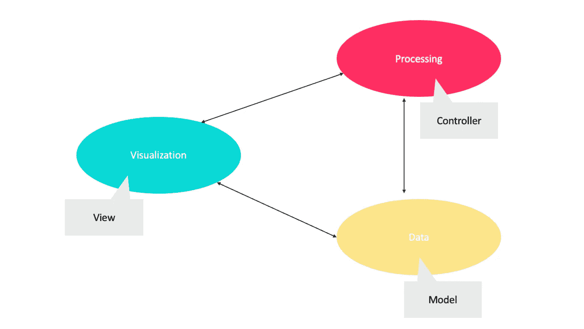
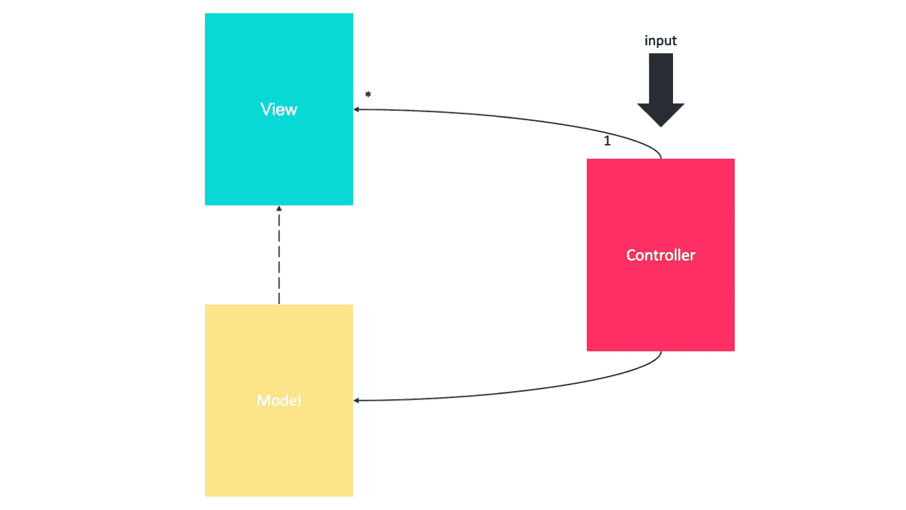
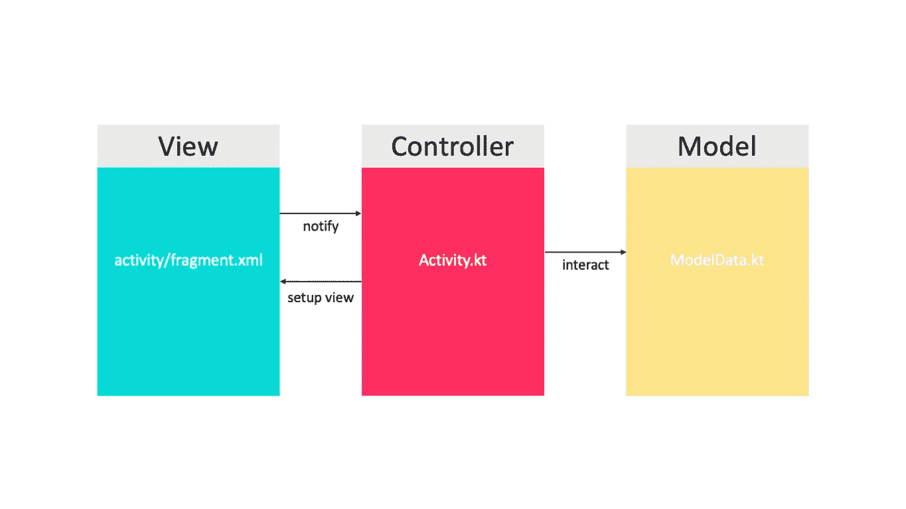
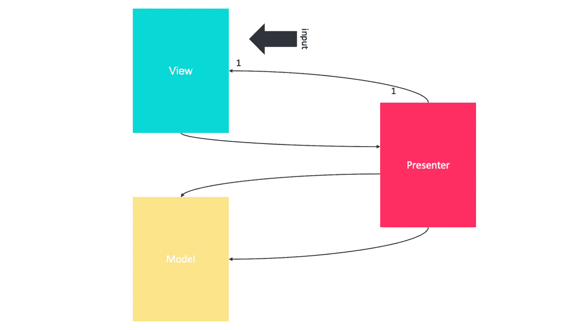
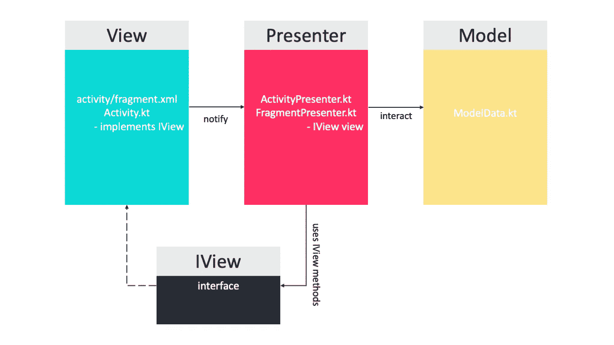
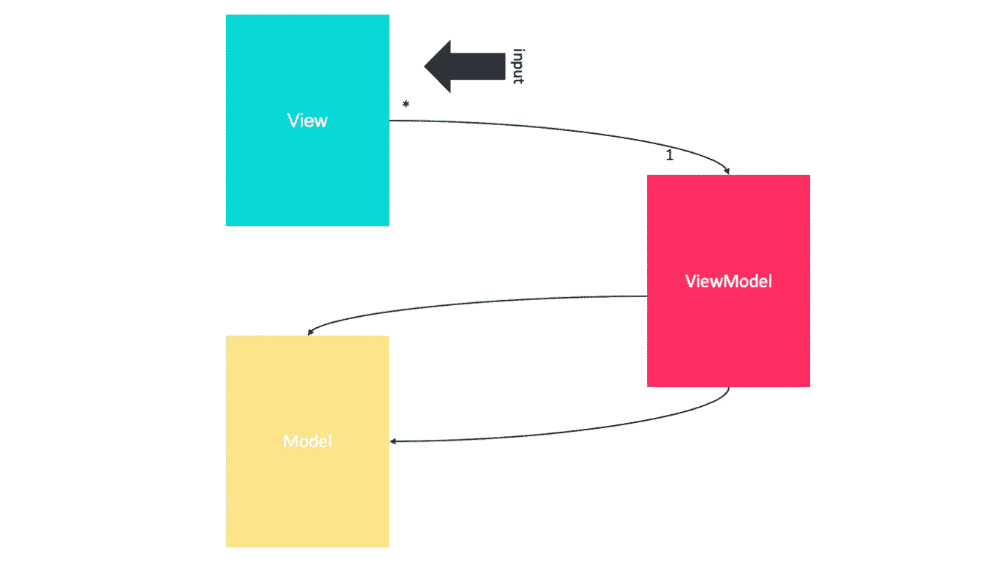
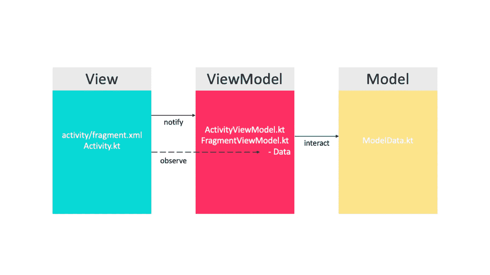
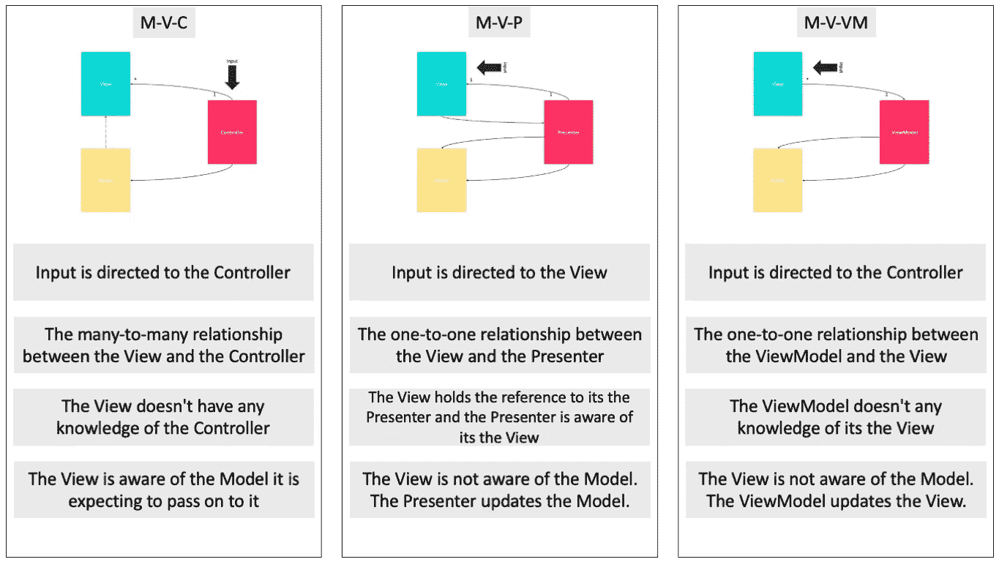
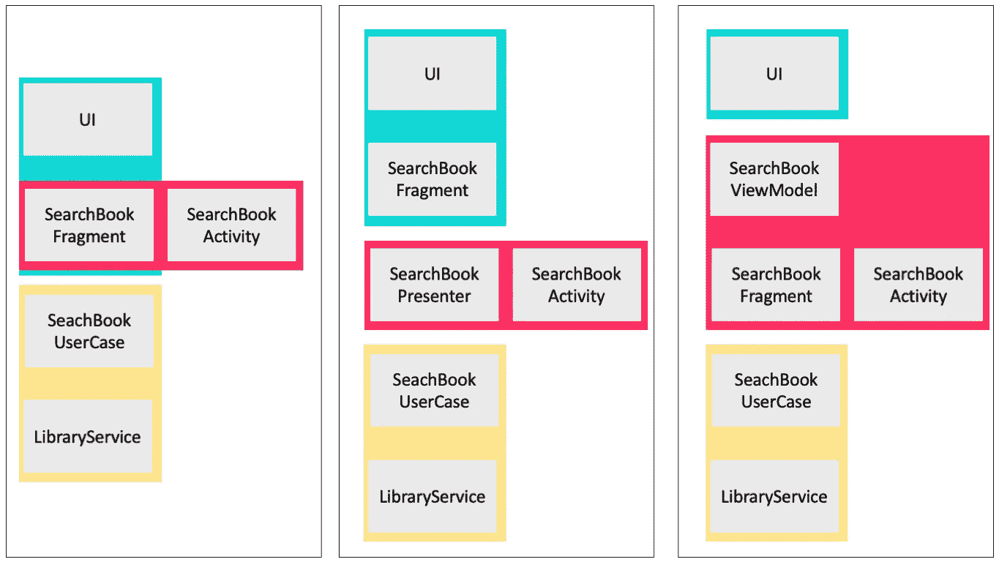

# MVC vs MVP vs MVVM

> 原文：<https://levelup.gitconnected.com/mvc-vs-mvp-vs-mvvm-35e0d4b933b4>

## [思维程序员](https://medium.com/tag/thought-programmer)

## 它们之间有什么不同？

由[埃德温·安德拉德](https://unsplash.com/@theunsteady5?utm_source=medium&utm_medium=referral)在 [Unsplash](https://unsplash.com?utm_source=medium&utm_medium=referral) 上拍摄

如今，当谈到架构设计模式时，我们有许多选择。在使用模型-视图-视图模型(MVVM)、模型-视图-演示者(MVP)和模型-视图-控制器(MVC)开发了许多应用程序后，我终于觉得有资格谈论它们之间的差异了。为了更容易理解，我们可以使用一个简单的例子，比如在 **BookSearch** 应用程序中开发一个搜索书籍的屏幕。

让我们现在开始吧…！

# MV(X)要点

首先，在深入研究 MVC、MVP 和 MVVM 体系结构之前，我们需要简单地理解它们。

## 为什么是模型-视图-(C 或 P 或 VM)？

这些架构的目的是分离 UI 应用程序的可视化、处理和数据管理的职责。

分离可视化、处理和数据管理的职责

他们的目标是增加。

*   模块性
*   灵活性
*   易测性
*   可维护性

# 模型-视图-控制器

或者简称为 MVC，是一种广泛用于构建软件应用程序的设计模式。该模式最初是由 Trygve Reenskaug 在 Smalltalk-80 (1979)工作期间设计的，最初被称为模型-视图-控制器-编辑器。MVC 在 1994 年的[“设计模式:可重用的面向对象软件的元素”](https://www.amazon.co.uk/Design-patterns-elements-reusable-object-oriented/dp/0201633612)(GoF 的书)中被深入的描述，这对推广它的使用起到了作用。该模式将应用程序分成三个部分。

*   ***模型*** —负责应用程序的业务逻辑。它管理应用程序的状态。这还包括读取和写入数据、保持应用程序状态，甚至可能包括与数据管理相关的任务，如联网和数据验证。
*   ***视图*** —该组件有两个重要任务:向用户呈现数据和处理用户交互。
*   ***控制器*** —视图层和模型层通过一个或多个控制器粘合在一起。

Android 上的 MVC

# 模型-视图-演示者

MVP 是 MVC 设计模式的衍生物，它专注于改进表示逻辑。它起源于 20 世纪 90 年代早期一家名为 [Taligent](http://Model-view-presenter (MVP) is a derivative of the MVC design pattern which focuses on improving presentation logic. It originated at a company named Taligent in the early 1990s while they were working on a model for a C++ CommonPoint environment.) 的公司，当时他们正在开发一个 C++公共点环境的模型。

虽然 MVP 是 MVC 的派生物，但它们确实有细微的区别。

*   ***模型*** —模型表示一组描述业务逻辑和数据的类。它还定义了数据的业务规则，即如何更改和操作数据。
*   ***视图*** —视图用于与用户进行交互，如 XML、活动、片段。它与流程中要实现的逻辑无关。
*   ***Presenter***—Presenter 从视图中获取输入，在模型的帮助下处理数据，并在处理完成后将结果传回视图。

Android 上的 MVP

# 模型-视图-视图模型

MVVM 最初由微软定义，用于 Windows Presentation Foundation(WPF)和 Silverlight，由 John Grossman 于 2005 年在一篇关于 Avalon(WPF 的代号)的博客文章中正式宣布。这种基于 MVC 和 MVP 的模式试图更清晰地将 UI 的开发与应用程序中的业务逻辑和行为分离开来。

它有如下三个主要组成部分。

*   **模型**—MVVM 使用的模型类似于 MVC 中使用的模型，由运行软件所需的基本数据组成。
*   **视图** —视图是用户和设计模式之间的图形界面，类似于 MVC 中的视图。它显示已处理数据的输出。
*   **视图模型** —视图模型一方面是视图的抽象，另一方面提供了要链接的模型数据的包装。也就是说，它包含一个被转换成视图的模型，并且它还包含视图可以用来影响模型的命令。

安卓上的 MVVM

# MVC vs MVP vs MVVM

让我们找出 MVC Vs MVP Vs MVVM，主要的区别点。

**性能评估** —当我们测试 UI 性能时，MVP 被证明是渲染帧时可靠性最高、障碍最小的一个。MVVM 中的数据绑定会产生额外的过载，这可能会在执行复杂任务时严重影响其性能。

**兼容性** —当根据兼容性测试模式时，MVVM 是最好的，因为它的数据绑定产生了积极的影响。MVP 比 MVC 表现更好，MVC 有严重的重复问题。

**可修改性** —当我们谈论设计模式时，很明显它应该是可修改的，因为这给了我们在应用程序中添加新功能和策略的选择。

*   基于这些因素，我们观察到 MVP 和 MVVM 的变化很小，MVVM 对可维护性贡献很大。
*   在大多数情况下，MVC 倾向于增加变更的数量。

**引用** —在 MVC 中，视图没有对控制器的引用，而在 MVP 中，视图有对演示者的引用，而在 MVVM 中，视图有对视图模型的引用。

**入口点** —对于 MVC，应用程序的入口点是控制器，而对于 MVP 和 MVVM，入口点是视图。

# 通过各种架构实现示例

您可以通过使用下图所示的三种架构之一来实现 BookSearch 应用程序。

图书搜索应用程序的 MVC、MVP 和 MVVM 实现

很简单，对吧？能自己实现吗？