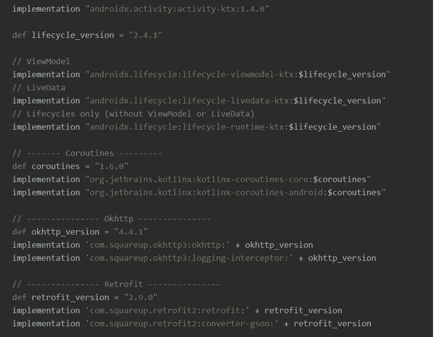
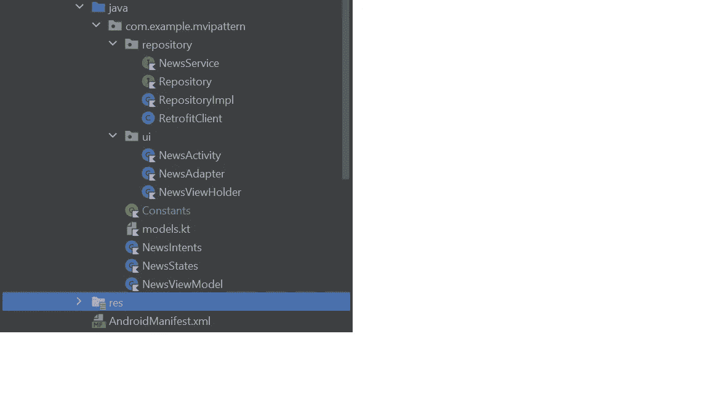

# Android 中的 MVI 模式

> 原文：<https://levelup.gitconnected.com/mvi-pattern-in-android-d4b274ec7a7b>


照片由[克里斯蒂娜·莫里洛](https://www.pexels.com/@divinetechygirl/)在[的像素](https://www.pexels.com/)上拍摄

**什么是 MVI？**

MVI 是模型-视图-意图。在这种情况下，意图只不过是基于用户交互触发的动作。**模型**由我们的业务和数据层组成，负责根据触发的**意图**向**视图** (UI)提供数据。

*没有更多的故事了’我们将从一个例子开始学习。*

**我们要做什么？**

我们将开发一个简单的新闻应用程序，使用 MVI 模式显示新闻文章列表。我们将使用 Retrofit2 来处理网络调用，使用 StateFlow 来管理 UI 的状态。

**从哪里开始？**

在模块级 *build.gradle* 文件中添加以下依赖项



或者，你可以通过[点击这里](https://github.com/jarinrocks/Android-MVI-Architecture-Example-Retrofit-Coroutines/blob/master/app/build.gradle)来复制/粘贴依赖关系。

通过在模块级 *build.gradle* 文件中添加以下代码来启用视图绑定

```
android {
    ...
    buildFeatures {
        viewBinding true
    }
}
```

1.  **创建如下所示的包和文件**



**2。在 activity_news.xml 中完成如下 UI**

```
<?xml version="1.0" encoding="utf-8"?>
<androidx.constraintlayout.widget.ConstraintLayout
    xmlns:android="http://schemas.android.com/apk/res/android"
    android:layout_width="match_parent"
    android:layout_height="wrap_content"
    android:background="@drawable/item_background"
    android:padding="8dp"
    android:layout_marginBottom="8dp"
    xmlns:app="http://schemas.android.com/apk/res-auto">

    <TextView
        android:id="@+id/title"
        android:layout_width="wrap_content"
        android:layout_height="wrap_content"
        android:textColor="@color/black"
        android:textSize="18sp"
        app:layout_constraintTop_toTopOf="parent"
        app:layout_constraintLeft_toLeftOf="parent"/>

    <TextView
        android:id="@+id/description"
        app:layout_constraintTop_toBottomOf="@+id/title"
        app:layout_constraintLeft_toLeftOf="@+id/title"
        android:layout_marginTop="8dp"
        android:textSize="16sp"
        android:layout_width="wrap_content"
        android:layout_height="wrap_content"/>

</androidx.constraintlayout.widget.ConstraintLayout>
```

在 drawable 文件夹下创建一个名为 item_background.xml 的文件，复制/粘贴下面的代码。

```
<?xml version="1.0" encoding="utf-8"?>
<shape xmlns:android="http://schemas.android.com/apk/res/android">
    <solid android:color="@color/teal_200" />
    <corners android:radius="16dp"/>
</shape>
```

在 drawable 文件夹下创建一个名为 news_item.xml 的文件，复制/粘贴下面的代码。

```
<?xml version="1.0" encoding="utf-8"?>
<androidx.constraintlayout.widget.ConstraintLayout
    xmlns:android="http://schemas.android.com/apk/res/android"
    android:layout_width="match_parent"
    android:layout_height="wrap_content"
    android:background="@drawable/item_background"
    android:padding="8dp"
    android:layout_marginBottom="8dp"
    xmlns:app="http://schemas.android.com/apk/res-auto">

    <TextView
        android:id="@+id/title"
        android:layout_width="wrap_content"
        android:layout_height="wrap_content"
        android:textColor="@color/black"
        android:textSize="18sp"
        app:layout_constraintTop_toTopOf="parent"
        app:layout_constraintLeft_toLeftOf="parent"/>

    <TextView
        android:id="@+id/description"
        app:layout_constraintTop_toBottomOf="@+id/title"
        app:layout_constraintLeft_toLeftOf="@+id/title"
        android:layout_marginTop="8dp"
        android:textSize="16sp"
        android:layout_width="wrap_content"
        android:layout_height="wrap_content"/>

</androidx.constraintlayout.widget.ConstraintLayout>
```

**3。来自 API 的响应如下所示。**

```
{
  "totalArticles": 288478,
  "articles": [
    {
      "title": "Tata IPL 2022 DC vs MI Live",
      "description": "Delhi Capitals vs Mumbai Indians live score streaming",
      "content": "Delhi Capitals vs Mumbai Indians Live update - Tata IPL 2022 DC vs MI Live cricket score , 2nd IPL Match Live Coverage: Mumbai Indians post 177/5! ",
      "url": "[https://www.firstpost.com/.html](https://www.firstpost.com/firstcricket/sports-news/dc-vs-mi-live-cricket-score-tata-ipl-2022-match-scorecard-live-update-delhi-capitals-vs-mumbai-indians-indian-premier-league-live-streaming-today-10490411.html)",
      "image": "[https://images.firstpost.com/40_Sportzpics.jpg](https://images.firstpost.com/wp-content/uploads/2022/03/Pant-Rohit-640_Sportzpics.jpg)",
      "publishedAt": "2022-03-27T11:48:18Z",
      "source": {
        "name": "Firstpost",
        "url": "[https://www.firstpost.com](https://www.firstpost.com)"
      }
    }
  ]
}
```

我们将为这个响应编写数据类

```
data class NewsData(val totalArticles: Int, val articles: List<Articles>)

data class Articles(val title: String,val description: String,val content: String, val url: String,
    val image:String, val publishedAt: String, val source: Source)

data class Source(val name:String, val url: String)
```

**4。我们将为意图和状态创建密封类。**

```
sealed class NewsIntents {
    object TopHeadlinesIntent : NewsIntents()
}sealed class NewsStates {
    data class Success(val news: NewsData) : NewsStates()
    data class Error(val errorMessage: String) : NewsStates()
    object Loading : NewsStates()
}
```

**5。接下来我们将创建网络层**

让常量类包含我们的 BASE_URL 和 API_KEY

```
object Constants {
  const val API_KEY : String = "api-key" //Replace with your api key
  const val BASE_URL : String = "https://gnews.io/api/v4/"
}
```

创建用于处理 API 调用的改进客户端

```
import com.example.mvipattern.BuildConfig;
import com.example.mvipattern.Constants;

import okhttp3.OkHttpClient;
import okhttp3.Request;
import okhttp3.logging.HttpLoggingInterceptor;
import retrofit2.Retrofit;
import retrofit2.converter.gson.GsonConverterFactory;

public class RetrofitClient {

    private static final OkHttpClient.Builder *httpClient* =
            new OkHttpClient.Builder();
    private static RetrofitClient *instance* = null;
    private static NewsService *service* = null;
    private static final HttpLoggingInterceptor *logging* =
            new HttpLoggingInterceptor();

    private RetrofitClient() {
        *httpClient*.interceptors().add(chain -> {
            Request originalRequest = chain.request();
            Request.Builder builder = originalRequest.newBuilder()
                    .method(originalRequest.method(), originalRequest.body());
            return chain.proceed(builder.build());
        });

        if (BuildConfig.*DEBUG*) {
            *logging*.setLevel(HttpLoggingInterceptor.Level.*BODY*);
            // add logging as last interceptor
            *httpClient*.addInterceptor(*logging*);
        }
        Retrofit retrofit = new Retrofit.Builder().client(*httpClient*.build()).
                baseUrl(Constants.*BASE_URL*)
                .addConverterFactory(GsonConverterFactory.*create*())
                .build();
        *service* = retrofit.create(NewsService.class);
    }

    public static RetrofitClient getInstance() {
        if (*instance* == null) {
            *instance* = new RetrofitClient();
        }
        return *instance*;
    }

    public NewsService getApiService() {
        return *service*;
    }

}
```

为 API 调用创建端点

```
interface NewsService {

    @GET("top-headlines?lang=en&token=${Constants.API_KEY}")
    suspend fun getTopHeadlines() : Response<NewsData>

}
```

现在是我们的存储库层的时候了

```
interface Repository {
    suspend fun getTopHeadlines() : Flow<NewsStates>
}class RepositoryImpl : Repository {

    override suspend fun getTopHeadlines() = *flow* **{** emit(NewsStates.Loading)

            val response = RetrofitClient.getInstance().*apiService*.getTopHeadlines()
            if (response.*isSuccessful*){
                emit(NewsStates.Success(response.body()!!))
            }else{
                emit(NewsStates.Error(response.errorBody().*toString*()))
            }

        **}** }
```

**6。我们将实现 MVI 最重要的部分 ViewModel。**

*ViewModel 从视图中获取意图，处理它们，然后将状态赋予视图。*

你还记得我们为意图和状态创建了密封类吗？我们将在视图模型中使用它们。

我们使用协程组件通道和状态流来处理意图和状态。

了解更多关于这些访问的信息

*   [密封类](https://kotlinlang.org/docs/sealed-classes.html)
*   [通道](https://kotlinlang.org/docs/channels.html)
*   [状态流](https://kotlin.github.io/kotlinx.coroutines/kotlinx-coroutines-core/kotlinx.coroutines.flow/-state-flow/)

```
class NewsViewModel : ViewModel() {

    val newsChannel = *Channel*<NewsIntents>()

    private val _newsState = *MutableStateFlow*<NewsStates>(NewsStates.Loading)
    val newsStates : StateFlow<NewsStates> get() = _newsState

}
```

> 我们有两个对象来保存状态，一个是可变的，一个是不可变的。我们将只把不可变的对象暴露给我们的视图(活动/片段)。这防止了从视图中改变状态，并且只有视图模型可以改变状态。这是一个很好的做法。

我们将看到如何处理意图和管理状态。

```
 init {
        handleIntents()
    }

    private fun handleIntents() {
        *viewModelScope*.*launch* **{** newsChannel.*consumeAsFlow*().collect**{** when(**it**){
                    NewsIntents.TopHeadlinesIntent ->         getTopHeadlines()
                }
            **}
        }** }

    private suspend fun getTopHeadlines() {
       RepositoryImpl().getTopHeadlines().collect **{** _newsState.value = **it
       }** } 
```

viewmodel 的完整代码如下。

```
class NewsViewModel : ViewModel() {

    val newsChannel = *Channel*<NewsIntents>()

    private val _newsState = *MutableStateFlow*<NewsStates>(NewsStates.Loading)
    val newsStates : StateFlow<NewsStates> get() = _newsState

    init {
        handleIntents()
    }

    private fun handleIntents() {
        *viewModelScope*.*launch* **{** newsChannel.*consumeAsFlow*().collect**{** when(**it**){
                    NewsIntents.TopHeadlinesIntent -> getTopHeadlines()
                }
            **}
        }** }

    private suspend fun getTopHeadlines() {
       RepositoryImpl().getTopHeadlines().collect **{** _newsState.value = **it
       }** }
}
```

**7。我们已经到了最后一步。我们已经完成了所有的设置，让我们在 UI 中实现它们。**

创建用于在 RecyclerView 中显示新闻文章的适配器类

```
class NewsAdapter : RecyclerView.Adapter<NewsViewHolder>() {

    private var articles = *listOf*<Articles>()

    override fun onCreateViewHolder(parent: ViewGroup, viewType: Int): NewsViewHolder {
        val itemBinding = NewsItemBinding.inflate(LayoutInflater.from(parent.*context*), parent, false)
        return NewsViewHolder(itemBinding)
    }

    override fun onBindViewHolder(holder: NewsViewHolder, position: Int) {
        holder.bind(articles[position])
    }

    override fun getItemCount(): Int {
        return articles.size
    }

    fun addArticles(articles : List<Articles>){
        this.articles = articles
        notifyDataSetChanged()
    }

}
```

取景框

```
class NewsViewHolder(private val newsItemBinding: NewsItemBinding) : RecyclerView.ViewHolder(newsItemBinding.*root*) {

    fun bind(article : Articles) {
        newsItemBinding.title.*text* = article.title
        newsItemBinding.description.*text* = article.description
    }
}
```

打开 NewsActivity 并创建以下对象

```
private val newsViewModel : NewsViewModel by *viewModels*()

private val newsAdapter = NewsAdapter()

private lateinit var binding: ActivityNewsBinding
```

根据我们的实际情况实现视图绑定

```
binding = ActivityNewsBinding.inflate(*layoutInflater*)
val view = binding.*root* setContentView(view)
```

设置 RecyclerView

```
binding.rvNews.*apply* **{** *layoutManager* = LinearLayoutManager(*context*)
    setHasFixedSize(true)
    *adapter* = newsAdapter
**}**
```

激发意图和管理状态

```
*lifecycleScope*.*launch* **{** newsViewModel.newsChannel.send(NewsIntents.TopHeadlinesIntent)
**}** *lifecycleScope*.*launch* **{** *lifecycleScope*.launchWhenStarted **{** newsViewModel.newsStates.collect **{** when(**it**){
                is NewsStates.Success -> {
                    binding.progressBar.*visibility* = View.*GONE* newsAdapter.addArticles(it.news.articles)
                }
                is NewsStates.Error -> {
                    binding.progressBar.*visibility* = View.*GONE* }
                is NewsStates.Loading -> {
                    binding.progressBar.*visibility* = View.*VISIBLE* }
            }
        **}
    }
}**
```

新闻活动的完整代码如下

```
class NewsActivity : AppCompatActivity() {

    private val newsViewModel : NewsViewModel by *viewModels*()

    private val newsAdapter = NewsAdapter()

    private lateinit var binding: ActivityNewsBinding

    override fun onCreate(savedInstanceState: Bundle?) {
        super.onCreate(savedInstanceState)

        binding = ActivityNewsBinding.inflate(*layoutInflater*)
        val view = binding.*root* setContentView(view)

        binding.rvNews.*apply* **{** *layoutManager* = LinearLayoutManager(*context*)
            setHasFixedSize(true)
            *adapter* = newsAdapter
        **}** *lifecycleScope*.*launch* **{** newsViewModel.newsChannel.send(NewsIntents.TopHeadlinesIntent)
        **}** *lifecycleScope*.*launch* **{** *lifecycleScope*.launchWhenStarted **{** newsViewModel.newsStates.collect **{** when(**it**){
                        is NewsStates.Success -> {
                            binding.progressBar.*visibility* = View.*GONE* newsAdapter.addArticles(**it**.news.articles)
                        }
                        is NewsStates.Error -> {
                            binding.progressBar.*visibility* = View.*GONE* }
                        is NewsStates.Loading -> {
                            binding.progressBar.*visibility* = View.*VISIBLE* }
                    }
                **}
            }
        }** }
}
```

如果你喜欢这篇文章，请一定要鼓掌，如果你更喜欢它，请多鼓掌。

使用下面的链接可以在 GitHub 上找到完整的源代码

[](https://github.com/jarinrocks/Android-MVI-Architecture-Example-Retrofit-Coroutines) [## GitHub-jarinrocks/Android-MVI-架构-示例-翻新-协程:MVI android clean…

### 此时您不能执行该操作。您已使用另一个标签页或窗口登录。您已在另一个选项卡中注销，或者…

github.com](https://github.com/jarinrocks/Android-MVI-Architecture-Example-Retrofit-Coroutines) 

如果你想运行应用程序，请访问 [GNews API](https://gnews.io/) 网站，创建你自己的 API 密钥，并在常量文件的 API_KEY 字段中替换它。

# 分级编码

感谢您成为我们社区的一员！在你离开之前:

*   👏为故事鼓掌，跟着作者走👉
*   📰查看[升级编码出版物](https://levelup.gitconnected.com/?utm_source=pub&utm_medium=post)中的更多内容
*   🔔关注我们:[Twitter](https://twitter.com/gitconnected)|[LinkedIn](https://www.linkedin.com/company/gitconnected)|[时事通讯](https://newsletter.levelup.dev)

🚀👉 [**加入升级人才集体，找到一份神奇的工作**](https://jobs.levelup.dev/talent/welcome?referral=true)