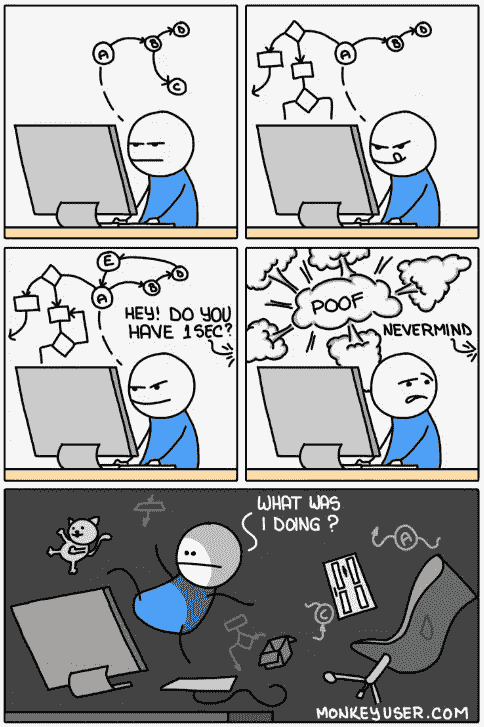
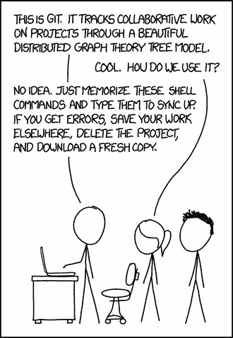
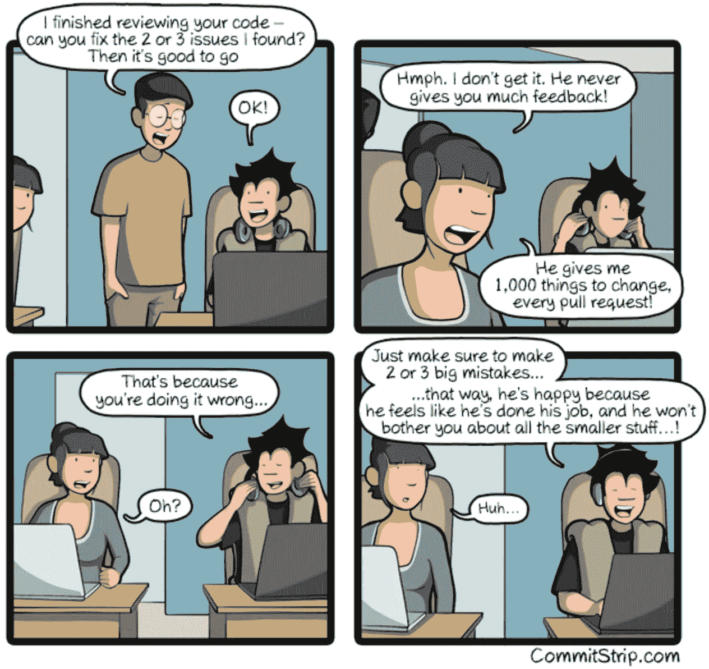
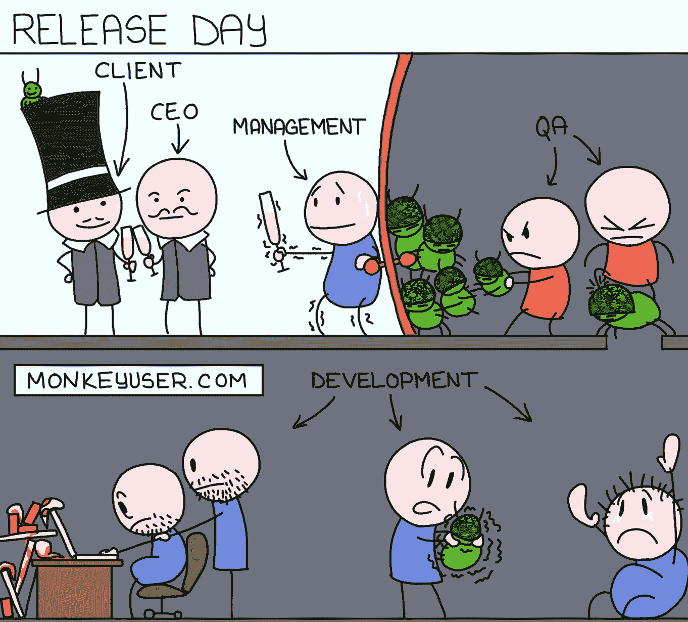
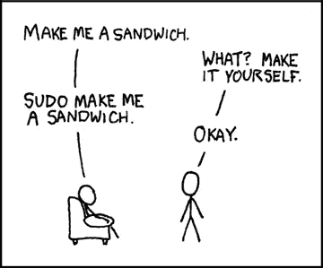
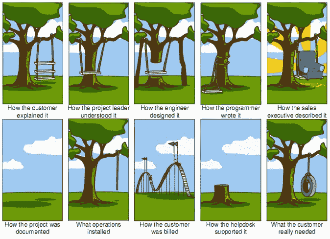

# 我有史以来最喜欢和最相关的 10 部网络开发漫画

> 原文：<https://levelup.gitconnected.com/my-10-favorite-relatable-web-dev-comics-of-all-time-cc1cee1cb499>

## 你可能在生活中至少经历过几次这样的事情。

啊，科技漫画的世界。我看过的几乎每部科技漫画在某种程度上都是有关联的。这几乎就像有人每天看着我工作，并获得涂鸦的想法。

每当我偶然发现一个好的漫画，我往往会花一个小时浏览作者的其他漫画，并微笑着(有时甚至在内心哭泣！)漫画的纯粹关联性，以及普通人可能会觉得它们一点也不好笑。

在 [Unsplash](https://unsplash.com/s/photos/laughing-office?utm_source=unsplash&utm_medium=referral&utm_content=creditCopyText) 上由 [Austin Distel](https://unsplash.com/@austindistel?utm_source=unsplash&utm_medium=referral&utm_content=creditCopyText) 拍摄的照片

但是今天，我要和你分享一些我最喜欢的网络漫画，并愿意分享一些快乐。你可能已经知道这里的一些作者，但是一篇关于 web dev 漫画的文章不能没有 XKCD(兰道尔·门罗绝对是一个天才！)，所以是这样的:

# #0:一位母亲的壮举

可怜的学校管理者，至少他们从中学到了一些东西。

来源: [XKCD](https://imgs.xkcd.com/comics/exploits_of_a_mom.png)

这给我带来了一个极好的资源，可以帮助确保你永远不会被一个中性的邪恶妈妈抓住。查看这个[网站](https://bobby-tables.com/)出来！

# #1:专注

这是我看过的最有关联的漫画之一。这种情况每天在工作中发生太多次，即使我们大多数人在家工作，懈怠和电子邮件通知往往会确保你在获得启示之前分心(该死的，臭虫！🐛).

来源:[MonkeyUser.com](https://www.monkeyuser.com/)

# #2:程序员最重要的工具:GIT

Git 被低估了，我倾向于确保每个加入我们团队的新手都知道他们的 git 命令。知道 Git 到底是如何工作的是只有少数人才能获得的知识，如果你找到他们并向他们询问 Git，请确保你等待几分钟“这真的很简单，只要把分支想象成…”然后你最终会学会修复一切的 Git 命令。

来源: [XKCD](https://xkcd.com/)

# #3:成功的代码审查

是的，这是一个重要的问题。编写完美的代码从来都不是一件容易的事情，当你花了几个小时编写代码，然后你得到了一百个关于如何正确做事的建议，这是很痛苦的。CommitStrip 分享了一个很好的技巧，可以确保你的下一次代码审查不会让你抓狂。

来源: [CommitStrip](https://www.commitstrip.com/en/2021/04/09/the-secret-of-a-successful-code-review/)

# #4:大日子

这一天不仅是一个大日子，对一些人来说，也可能是漫长的一天。我记得我第一次参与一个项目的启动。哦，我的上帝，压力，和最终的恐惧，系统可能只是关闭时，客户端打开页面。这是一种我永远不会忘记的感觉。

来源:MonkeyUser.com

# #5:万圣节

这是我每次看到都会忍俊不禁的漫画之一。将 CSS 想象成一种服装的纯粹努力是令人兴奋的。

就我个人而言，我会穿上昆虫服，给自己贴上特色标签！😆 😆

来源:[巴勃罗·史丹利](http://www.stanleycolors.com/)

# #6:须藤

啊，我的另一个最爱。我意识到 xkcd 在制作像样的、有趣的网络漫画时发挥了巨大的作用。我希望我们能在现实生活中这样做。🙁

来源: [XKCD](https://xkcd.com/149/)

# # 7:10 倍的开发人员

我见过很多公司找 rockstar 的开发者，或者 10x 的开发者，我觉得这个概念是有极大缺陷的。你不能指望每个人都是冠军，因为那样的话，没有人是冠军。

这是大多数 10x 开发者的现实。如果公司一直专注于让一个人做 10 个人的工作，这个人很快就会筋疲力尽。

来源:[呆伯特](https://dilbert.com/strip/2008-09-12)

# #8:每个项目

每个项目都有一个美好的开端，承诺遵循系统并在客户预算内交付他们需要的产品。但结果会是那样吗？一旦你发誓忠于你的规则，事情就会迅速变化，最终产品看起来与最初讨论/要求的完全不同。

来源:未知

# #9:编译！

这是迄今为止最相关的，绝对真实的网络漫画。我们，程序员，倾向于非常努力地工作，有时为了让事情运转起来而不吃饭不娱乐。但是当我们点击“编译”时，我们突然得到了时间的礼物，这份礼物我们有时带得太远了。

来源: [XKCD](https://xkcd.com/303/)

唷，我写这篇文章的时候很开心。这让我有机会看了一整天的网络漫画，并大声笑出前 10 名的最爱！我希望你也能被他们逗得开怀大笑！

干杯！