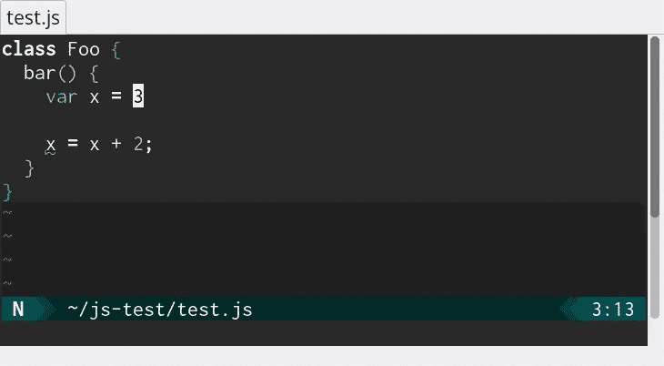
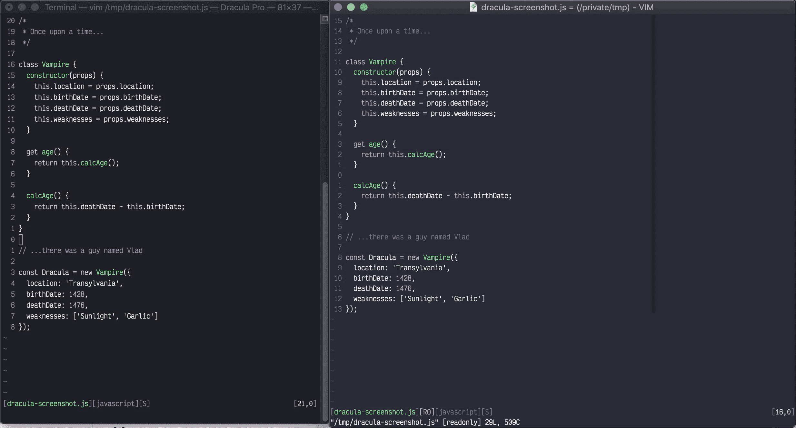

# 我最喜欢的 11 个 Vim 插件

> 原文：<https://levelup.gitconnected.com/my-11-favourite-vim-plugins-761adf4003df>


虽然这些天我大部分时间都在 WebStorm 上写 JavaScript，但我仍然经常使用 Vim。随着时间的推移，我发现了一些很棒的插件，扩展了 Vim 来处理数量惊人的东西。

我应该注意到这些本质上都是通用插件。一些特定于语言的工具非常好用，但是除非你使用的是那种特定的语言，否则它们不会那么有用。

任何截图都取自插件网站，而不是我抓取的，除非明确注明。

## 插头

这是一切开始的地方。它使用起来非常简单——我想我从来没有改变过设置。

一旦你将插件部分添加到你的`.vimrc`中，添加一个新的插件就很简单了，尤其是在 Github 上:

```
call plug#begin("~/.vim/plugged")
	Plug 'foo/bar'
call plug#end()
```

(它也可以处理任意的 Git 服务器。)

`Plug`负责下载和安装插件。如果一个插件需要几个选项，那也很容易处理。

```
Plug 'junegunn/fzf', { 'dir': '~/.fzf', 'do': './install --all' }
```

一旦你安装好了，只需`:PlugInstall`安装插件，然后`:PlugUpgrade`升级。简单，就是我喜欢的方式。

[此处获取插头](https://github.com/junegunn/vim-plug)。

## 一般功能。

这些插件“作为一个整体”覆盖了 Vim——它们将改善你的整个 Vim 体验。

## 启动

Startify 有一个简单的目标——在启动时，它会显示最近使用的文件和会话列表。

我最近才开始使用它，它非常有用——我可能会单独将它用于`SSave`和`SLoad`函数(将 Vim 会话存储在专用的会话目录中)。作为一个额外的奖励，它甚至可以识别出在你启动它的目录中是否存在一个现有的`Session.vim`文件，并提供一个额外的选项。


[从这里开始](https://github.com/mhinz/vim-startify)。

## 纳特树

NERDTree 是一个更好的文件侧边栏。它使得删除/添加/重命名文件和目录变得容易，改变 Vim 工作目录(对于启动诸如`grep`之类的工具很有用)，并且容易在文件结构中导航。如果你重命名一个文件或目录，并且你已经用旧的名字打开了缓冲区，它会用新的名字重新打开缓冲区，这是一个非常好的方法。


它提供了集成的帮助——我不必求助于阅读精美的手册。我唯一的麻烦是帮助是通过`?`访问的，这完全合理，但是破坏了树中的反向搜索。

(当然，手册很可能给出了改变这种情况的方法。也许我应该读一下……)

[在此获取 nerd tree](https://github.com/preservim/nerdtree)。

## 困扰

蒂姆波普的插件之一，这应该是所有你需要知道它的质量。一旦在编辑会话中启动，`Obsession`会自动将任何窗口/缓冲区/布局更改保存到会话文件中。

当与 Startify 一起使用时，它会产生非常平滑的流动。保存会话文件一次，然后打开执念——之后你可以通过 Startify 菜单缓冲区加载它，一切都按照你上次退出时的方式设置好了。

(不再有忘记在自动`:qa` …)之前保存会话的问题)

[在这里得到执念](https://github.com/tpope/vim-obsession)。

## markdown-preview.nvim

老实说——这比我预期的 Vim 预览版要好得多。启动后，它会打开一个浏览器窗口，然后在您编辑文档时自动重新加载内容。


[获取 markdown-preview.nvim](https://github.com/iamcco/markdown-preview.nvim) 。

## 编码

这些插件有助于编码，而不是外观或一般的文本编辑。

## 完工证明书

集成了对 VS Code、IntelliJ、Sublime Text 和 co 使用的[语言服务器](https://microsoft.github.io/language-server-protocol/)的支持，语言服务器让编辑器快速准确地自动完成，建议类型兼容的完成。

基本上——如果你用 Vim 写代码，你需要这个插件。


[获取 CoC](https://github.com/neoclide/coc.nvim) 。

## Vimagit

这是 Emacs `magit`扩展的一个移植(或者说“受其启发而重写”)。虽然它只执行`magit`的一个子集——例如，它不执行推/拉/取之类的远程操作——但它使添加和提交回购变得非常容易。我特别喜欢这样一个事实，你可以把整个文件或单个的大块放在舞台上。


[在此获取 VI magit](https://github.com/jreybert/vimagit)。

## 麦芽酒

ALE 是异步 Lint 引擎。它提供了 Vim 最新版本中的后台林挺、语法检查和语义错误，因此在您编辑时会标记这些错误。这让您可以在代码静止时修复它们(真的！)记忆犹新，而不是等着下次运行`lint`或者静态检查器。



[在此获取麦芽酒](https://github.com/dense-analysis/ale)。

## 出现

最后，我们来看看改变 Vim 外观的插件。

## 航空公司

航空公司在每个 Vim 窗口的底部添加一个状态行。没有任何调整，它会显示:

*   模式(正常/可视，诸如此类)
*   VCS 信息
*   文件名，文件类型
*   文件编码

它是非常可配置的——你可以让它显示你感兴趣的任何东西。它还可以很好地与其他工具配合使用——例如，上面的 ALE 可以集成到 Airline 中，以在状态行中标记警告/错误。

试一试——如果你第二天就把它调整到你满意的程度，不要怪我。

[在这里乘坐](https://github.com/vim-airline/vim-airline)的航班。

## 主题

我发现我会根据我的心情、我正在做的事情以及我周围的环境来切换主题——例如，浅色背景的纸张颜色通常比日晒的更具可读性。

幸运的是，这是 Vim，很容易编写几个宏在它们之间切换，并在亮暗之间设置背景。

对于主题，我只是从他们的主页上添加一个截图——除了我发现它们的颜色很好的平衡之外，我真的没有什么可以说的。

## 纸张颜色

浅色模式下的纸张颜色:


[在此获取 Papercolor】。](https://github.com/NLKNguyen/papercolor-theme)

## 使过度曝光

光照模式下的日光照明 8:


[在这里晒 8](https://github.com/lifepillar/vim-solarized8)。

## 德拉库拉



[在这里获得德古拉](https://github.com/dracula/vim)。

## 有用的键映射

## 主题和背景

```
nnoremap <leader>tp :colorscheme PaperColor<CR>
nnoremap <leader>ts :colorscheme solarized8<CR>
nnoremap <leader>td :colorscheme dracula<CR>

nnoremap <leader>bd :set background=dark<CR>
nnoremap <leader>bl :set background=light<CR>
```

## 其他东西

打开和关闭 NERDTree 我不得不承认，这些天我大多只是打开它，但有这个简单的选项也不错。

```
nnoremap <leader>n :NERDTreeToggle<cr>
```

这些我用得太多了，因为我一直摆弄我的`.vimrc`。(为了胜利的人造生产力！)

```
nnoremap  ,v :edit   $MYVIMRC<CR>
nnoremap  ,u :source $MYVIMRC<CR>
```