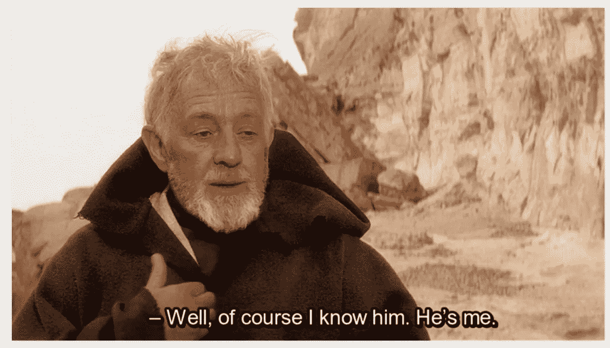

# 作为软件开发人员，我最大的三个失败

> 原文：<https://levelup.gitconnected.com/my-3-biggest-failures-as-software-developer-6c16a171eaaf>

作为程序员，我们都知道 rockstar 开发者的故事。她很小就开始编程，11 岁时就有了第一个盈利网站。16 岁上大学；17 岁的 LLC23 岁成为亿万富翁。我们爱这些故事，这些英雄；他们以其丰富的编程和引领潮流的方式激励着我们。在解决 NP 复杂问题和在首轮融资中筹集数百万资金之间，他们似乎从未失策。

现实是:每个开发者，甚至是摇滚明星，都会把事情搞砸，克服挫折。唯一的区别在于规模；当我们搞砸了，数据库记录就会被破坏。当他们搞砸了，T2 就会犯下数十亿美元的错误。为什么我们集体如此害怕犯错？错误是好的；没有什么比失败更好的老师。然而，它带有污名。没有人谈论它。没有人想被视为天才房间里的傀儡。

这种压制是有后果的。当开发人员犯错误时，这被认为是个人的失败。他们感到羞耻，经常受到指责。“Mike 忘记更新发布文档”或“Bill 挑选了错误的分支”。这将适得其反。失败在本质上几乎总是系统性的。因此，它们是识别和纠正业务缺陷的绝佳机会。没有比失败更好的老师了，我们不应该害怕谈论失败。本着这种精神，下面我坦率地挖掘出我作为一个初露头角的软件开发人员犯的三个最严重的错误。**然后我继续解释我是如何成长的，并感谢他们每一个人。**

# 删除了一千个网址

在一家大型金融机构工作时，我开发了一个系统来清除 F5 网络层中未使用的路由。F5 路由池在被堵塞之前只能支持大约 5000 个 URL。我的系统自动监控这些 URL 的流量，通知未使用资源的所有者，并最终清除它们，从而防止 F5 系统崩溃，并将操作从不间断的手动干预中解放出来。

该系统进展顺利，已经成功地用于删除低环境中的几十条路线。然而，一个星期天，我醒来发现一个电子邮件链，前一天晚上有 1000 个路由被删除，用户抱怨这些是活跃的/实时的 URL！

破坏了每个人的周末，我们的团队突然开始行动。原来是一个老。YAML 配置文件已经与应用程序容器一起部署，它删除了 1 周而不是 1 个月没有活动的路由。谢天谢地，我设置了故障保险来防止删除生产资源，但是这些仍然很严重。如果我的程序实际上移除了活动的资源，那么高度使用的、公司范围的应用程序中断是可能的。

结果是，大多数不活动 1 周的资源会持续 1 个月；换句话说，重要的应用程序不会一周不活动。所以最终损失是可控的；在被删除的 1000 个网址中，只有少数几个团队抱怨。然而，这给我和我的经理们带来了巨大的压力，尤其是在损失规模尚不可知的早期。因此，我们基本上建立了一个作战室，将整个团队的资源转移到准备好手动重新创建这些丢失的资源。

**怎么会这样！？**

起初，我觉得这都是我的错(我的经理同意了也没什么帮助)。但事后看来，这也是一个系统性的失败。首先，现有的 F5 路由管理系统无法满足业务需求，也没有清晰的备份/回滚策略，这是一个大问题。此外，旧的配置文件被搁置是因为不必要的复杂部署过程。它过于官僚，容易犯这样的错误。最后，这个关键任务交给了我一个人(即。没有代码审查/团队参与)并且有一个非常乐观的期限，这是一个灾难的处方。我们从来没有把这件事当作头等大事来对待，用更多的经验来回顾，结果似乎是必然的。

**我是如何成长的**

我从未如此感激我的同事，他们挺身而出，把我们从我制造的混乱中解救出来。与此同时，当我的经理和最资深的开发人员告诉我，他们对我作为一名工程师失去了信心，不允许我继续我们重要的项目时，我感到前所未有的专业崩溃。换句话说，他们无法相信我做了如此愚蠢的事情，也不信任我继续从事这个或其他关键项目(他们最终收回了自己的话)。

如果你没有经常流泪，你真的是软件工程师吗？([图像来源](https://www.123rf.com/photo_68490295_deadline-technology-and-people-concept-sad-stressed-software-developer-with-computer-at-home-office.html))

虽然承认这一点很尴尬，但我真的为此哭了。后来，一个队友带我去喝啤酒。当我向他转述这段对话时，他说这是极其不公平和不酷的，并告诉我他和团队的其他成员是多么欣赏我。在被击垮了整整一个星期后，我神经紧张，听到有人说这太过分了。我的主要经理还带我出去吃了午饭，帮我度过了难关。这两个手势伴随了我很多年。

这教会我的是，虽然代码得到了很好的控制，但基础设施和数据却常常不能。使用 DB 迁移工具，如 [DBMate](https://github.com/amacneil/dbmate) 和 [Terraform](https://www.terraform.io/) 来管理系统的这些组件，并把它们视为等同于应用程序代码(如果不是比应用程序代码更重要的话),这是绝对重要的。

限制对生产环境的访问也非常重要。例如，我甚至没有在我的 IDE 上保留一个本地主分支，而更喜欢在整个团队范围内锁定所有对非特性分支的直接推送。默认情况下，数据库和云帐户应该是只读的，并且应该有明确的备份和恢复策略。例如，在我的下一份工作中，一名开发人员意外删除了 prod S3 存储桶中的文件。如果不是因为 [S3 版本控制策略](https://docs.aws.amazon.com/AmazonS3/latest/userguide/Versioning.html)，我会在一周前安装(默认关闭——wtf Amazon！)，我们可能已经永久失去了。

最后，我学到的最后也是最重要的一课是换位思考。犯这样的错误已经够糟了，所以让管理层来推波助澜是毁灭性的，也是不必要的。类似的事情最近发生在我的一个队友身上:他将错误的代码投入生产，我们不得不手动纠正一些数据。他内疚地谈到这件事。我借此机会清楚地解释了发生这种情况的原因是因为我们的部署数据迁移流程不合格。这是我们团队的失败，不是他的，这是必然会发生的。我还提醒他，他已经推出了一些很棒的功能，这些功能对我们和我们的业务有多么重要。他的错误只是提醒他重新审视我们的工具/流程，并激励他为解决方案做出贡献。**错误就是机会。**

# 公司外部的电子邮件代码

离职前，我给自己发邮件写代码。我花了将近一年的时间开发 Spring 库，在这个过程中，我创建了一些非常好的测试模式。我不想忘记所有这些伟大的想法，并计划创建一系列关于它们的媒体帖子。

大约一个月后，在我新工作的第一天，我收到了我一生中最令人沮丧的短信。“老兄，我们的队伍正处于水深火热之中。有人在公司外通过电子邮件发送代码，法律部门参与其中。你知道是谁吗？”

我立即打电话给我以前的经理。没有回答。打电话给我的同事。没有回答。法律部门已经介入并指示他们与我断绝联系。这太可怕了。我的新经理感觉到有些不对劲，就问了我这件事。作为一名前律师，他告诉我请律师以防万一。我紧急打电话给我妻子的家庭律师，我们讨论了各种情况。因为这是实用程序代码，所以他们不太可能“跟踪我”，但这仍然是可能的。

那天老婆来接我，心情特别好。她问我第一天过得怎么样，我回答说“我想我搞砸了”。她的表情融化了。当我告诉她发生了什么时，她表现得像个冠军。告诉我，虽然很蠢，但我们会熬过去的。接下来的一周，我一直生活在迷雾中，直到我之前公司的法律团队找到我，告诉我如果我签署协议立即删除这段代码，他们就不会起诉我。

**怎么会这样！？**

我的视野狭窄——简单明了。虽然这看起来像一些邪恶的阴谋，但简单的事实是，我真的为我构建的模式和实用程序感到自豪，我认为如果我失去了它，我作为一个开发人员也会失去一些东西。我有一些宏伟的想法，认为这会导致一些有趣的博客文章，不知何故，在我一根筋的头脑中，好处超过了风险。

直到今天，我仍然对这件事影响了我的前队友感到很糟糕。这个错误 100%是我的，但他们肯定要处理后果。团队的声誉可能会受损，处理审计对每个人来说肯定都是一个大麻烦。它损害了我的职业声誉，并可悲地烧毁了许多桥梁。

**我是如何成长的**

最重要的是，我对公司的电子邮件和内部交流变得非常谨慎。我的新工作还不到一周，就有几名员工因为在 Slack DMs 上的不当谈话而被解雇。这是一件相当混乱的事情——他们都被解雇了，最终我们剩下的人不得不接受强制性的人力资源培训，以应对工作场所的骚扰。尽管你公司的技术人员多么无能，**你应该总是假设他们完全了解你的私人通信**。

另一个重要的教训是我的妻子和父母如何团结在我周围。我对这种情况感到沮丧，无法清醒地思考，他们的冷静和理解把我带回了现实。我正处于生存危机的边缘——我怎么可能拥有博士学位并在这个领域工作，但同时又如此粗心和愚蠢？我刚刚毁了我的未来吗？如果没有一个强大的支持系统，我可能会失控，并使整个情况变得更糟。他们关于请律师的建议和指导阻止了我让情况变得更糟。

YAGNI(你不会需要它)不仅仅是软件的一个原则。我真的会再看一遍那段代码吗？即使它确实导致了一些博客文章，这证明了风险的合理性吗？当然不是。当你离开一份工作，或者生命中的任何一个阶段，离开就是了。不要带走任何东西；不要看后视图；向前看。

# **在 Covid** 期间丢了工作

2019 年，我在一家相对成功的初创公司工作，对路面维护流程进行现代化改造。我们的主要收入来源是地方政府，我们也有风险投资的支持。这两个来源都在 2020 年 3 月突然消失了。我们公司在几个月的时间里成功地驾驭了 Covid 浪潮，迅速转向解决客户优先事项的变化，并通过小企业救济基金获得了一些资金。

然而，到了 7 月，很明显我们需要收缩或下沉。11 点 30 分，首席执行官私下给我发了一条短信，不祥地要求我在 12 点打电话。12 点 15 分，我被解雇了。套用一句:“亚当，我们让你立即生效。我们觉得你表现得很好；然而，由于目前的气候，我们正在裁员”。我是那天 15 个左右被随意解雇的人之一——没有警告，没有解雇，甚至没有 5 分钟的时间和我的团队说再见(在通话中 Slack 账户被禁用)。

我和妻子六个月前刚刚搬进我们的第一所房子，没有稳定的收入，我们的经济状况无法维持太久。

接下来的几个月是残酷的；我在任何地方都找不到工作。市场上充斥着同病相怜的质量工程师。见鬼，我不能得到失业补偿，这变得如此令人沮丧，以至于我写了一整篇关于此事的[博客文章](/you-have-to-become-a-hacker-to-get-unemployment-compensation-de7b384d640e)。

**怎么会这样！？**

Covid 是一记重拳，直接导致了裁员和严峻的就业市场。但是这里有一个惨痛的教训——我被解雇是因为我不是关键人物。没有我，生意照样做得很好。他们保留的工程师技术非常强，但更重要的是，他们在核心业务系统上工作。让他们走可能会彻底搞垮公司。这就是我的主要失误。

作为一名相对较新的雇员，他们让我参与一些很酷的新项目。我在 Jupyter 从事 ML 管道和数据分析工作。然而，我们的核心系统是普通的烧瓶应用程序。没有人真的把我推进这些系统，所以我保持距离。他们有 bug 的时候，我没有解决。他们慢的时候，我不支持；没有人要求我这样做，所以我没有。我在做很酷的新东西——公司的未来！事实证明，这些系统以及建造和支持它们的工程师对公司来说比我更有价值。回头看，现在清楚了。考虑到 CEO 必须做出的艰难选择，他做出了正确的选择，让我离开！

**我是如何成长的**

七月至九月是艰难的；我找了一份又一份工作。特别令人崩溃的是，我差一点就能在一家影音公司得到我梦想的工作，却在最后一步被拒绝(连续第二年)。最终，我在一家无聊的公司找到了一份无聊的 T4 Java 工作。我很快了解到，无聊的软件只是花花公子。无聊软件有直截了当的需求和专注的用户。像“这个按钮不起作用”这样的事情很容易解决，不需要博士学位，也不需要多年的计划。实际上，为一个标准的 web 应用程序敲出唾手可得的果实，并让真实的人告诉你他们有多么感激，这是非常令人满意的！

做无聊的事情也会让你变得挑剔。我志愿参加了大量的核心工作，从建立基础设施到开发硬功能。虽然我的目标不是成为系统本身的一部分(即我还是想自动离开自己)，这应该会让我更难离开。

此外，我不再担心工作面试或失去工作。我们只能尽力而为，剩下的就不是我们能控制的了。也许你没有得到那份工作是因为另一个应聘者在某项技术上更有经验。也许他们已经出价了。或者也许你没有下一个人好。丢掉自我，坦然面对所有这些原因，恐惧就会消失。意识到你可能不是，也永远不会是一个摇滚明星开发者，这没关系。

最后，**我学到的最后一件事就是要求不断的反馈**。我做得怎么样？为什么我在 X 上工作——X 对公司的成功至关重要吗？如果不是，那是什么？不要太依恋你的工作。通常我们害怕反馈，因为它会挫伤我们的自尊，但是接受反馈是快速前进的方式。另外，如果你是众多拒绝给申请人反馈的公司之一，你真该感到羞耻。

所有这些的要点是，失败和障碍不仅是不可避免的，而且是必要的。个别的失败很少仅仅是个人的错。失败是一个机会——一个了解自己和周围人的机会。你的老板是把你拉下还是拉上来？你的朋友和家人支持你吗？这是一个停下来，反思和改正的好时机。

# 分级编码

感谢您成为我们社区的一员！ [**订阅我们的 YouTube 频道**](https://www.youtube.com/channel/UC3v9kBR_ab4UHXXdknz8Fbg?sub_confirmation=1) 或者加入 [**Skilled.dev 编码面试课程**](https://skilled.dev/) 。

 [## 编写面试问题+获得开发工作

### 掌握编码面试的过程

技术开发](https://skilled.dev)