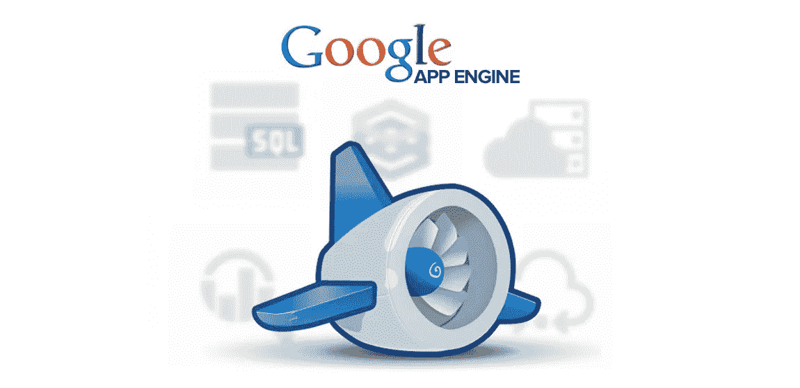
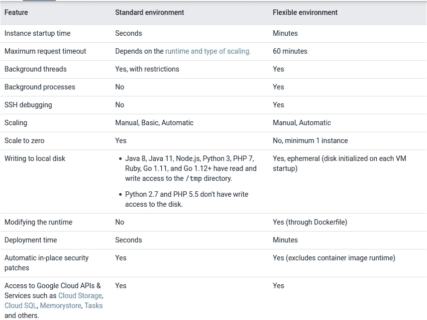
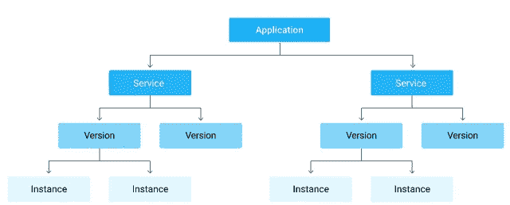
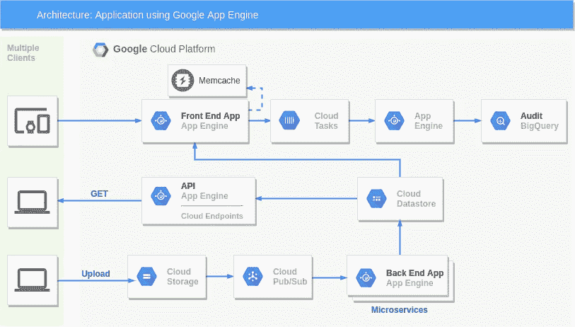
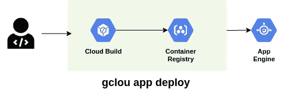
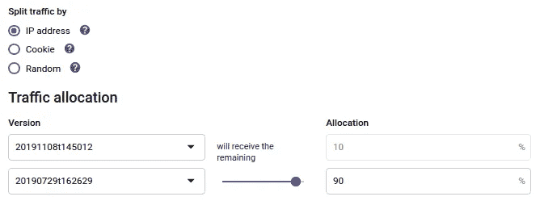
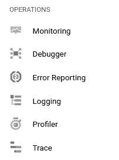

# 我在谷歌云应用引擎(Python 2 和 Python 3)3 年的经验

> 原文：<https://levelup.gitconnected.com/my-3-years-experience-in-google-cloud-app-engine-python-2-python-3-ad9af7d87ff8>

## 谷歌云的首个无服务器计算服务。



# 介绍

**谷歌**云一直相信无服务器的愿景，于 2008 年推出谷歌应用引擎，即**第一个** **完全** **无服务器**计算服务。从那以后，谷歌在应用开发和分析方面开发了更多的无服务器产品。

我于 2017 年 5 月开始在谷歌应用引擎工作，我将与 GAE 分享我的经验。

> *我们选择 Google App Engine 的原因是它完全可管理、可扩展、灵活、易于使用、可快速构建并在生产中部署代码。*

多亏了 GAE，我们以敏捷的方式工作，每两周向生产交付一次微服务。

这是谷歌提供的令人着迷的独特服务。

***这是在引入云功能和云运行之前。***

# App Engine 的特性

*   **完全受管:**完全受管的环境让您可以专注于代码
*   **应用版本**:轻松托管不同版本的应用。
*   **流量分流**:将传入的请求路由到不同的应用版本，进行 A/B 测试，并进行增量功能部署。
*   **应用安全:**通过 IAP(识别感知代理)保护应用
*   **服务生态系统:**与不同谷歌服务的出色集成。

# 应用程序引擎类型

您可以使用 App Engine Standard 或 App Engine Flexible 环境运行应用程序。

我们将我们的应用拆分为微服务，主要使用标准环境，当没有流量时，标准环境可以缩减到零个实例。这节省了很多钱(这是客户想要的)。我们的开发和测试环境几乎不会产生成本。

根据谷歌选择环境。



[https://cloud . Google . com/app engine/docs/the-app engine-environments](https://cloud.google.com/appengine/docs/the-appengine-environments)

# App Engine 标准环境

标准环境基于运行在 Google 基础设施上的容器实例，并且预先配置了可用的运行时。因为我们使用 Python2.7 和 Python 3.7 编程语言，所以我们可以使用标准环境。

实例类:我们使用 F1 实例(256 MB 内存，600 MHz CPU)。

# 应用引擎灵活的环境

接收稳定流量、经历定期流量波动或满足逐渐扩大和缩小的参数的应用程序。

它运行在 docker 容器上，所以你可以选择任何编程语言。

# 服务和版本

App Engine 工作在微服务架构上。每个应用程序被分成多个服务。因此，您可以在单个服务中运行整个应用程序，也可以设计和部署多个服务作为一组微服务运行。



App Engine 的好处是您部署的所有东西都有特定的版本。每个版本都可以在*https://<version>-dot-<app-id>. appspot . com .*访问

在每个服务中拥有多个版本的应用程序，可以让您在不同版本的应用程序之间快速切换，以进行回滚、测试或其他临时事件。

您的服务中的版本运行在一个或多个*实例*上。默认情况下，App Engine 会缩放您的应用以匹配负载。您的应用程序将扩大正在运行的实例数量以提供一致的性能，或者缩小规模以最大限度地减少空闲实例并降低成本。

## 缩放类型

Google 通过三种缩放类型来控制如何创建实例。

自动:根据要求动态变化。您可以指定空闲实例。

基本:根据要求动态变化。

手动:常驻。
详细对比在[中提到的](https://cloud.google.com/appengine/docs/standard/python3/how-instances-are-managed)环节

app.yaml

## 服务帐户

创建 App Engine 应用程序后，将创建 *App Engine 默认服务帐户*，并将其用作 App Engine 服务的标识。App Engine 默认服务帐户与您的云项目相关联，并代表在 App Engine 中运行的应用执行任务。

默认情况下，App Engine 默认服务帐户在项目中具有编辑者角色。这意味着任何拥有足够权限将更改部署到云项目的用户帐户也可以运行代码，并对该项目中的所有资源具有读/写访问权限。

下面是我们使用谷歌应用引擎开发应用程序的样本参考架构。



# 集成

我们已经将谷歌应用引擎与谷歌的许多服务整合在一起。

## 数据存储/ Firestore

该数据存储是一个专有的 NoSQL 数据库，完全由谷歌管理。早期，数据存储与 Google App Engine 紧密结合。

## 谷歌云存储

源系统将文件上传到 bucket。当文件上传时，应用程序被触发。

## 云任务

通过使用云任务，您可以将一个带有有效负载的新任务加入队列。不需要自定义重试代码，云任务会处理。

## 发布/订阅

发布/订阅服务允许应用程序可靠、快速、异步地交换消息。我们有多个订阅者。

这允许您在独立的应用程序之间发送和接收消息。

## BigQuery

[BigQuery](https://cloud.google.com/bigquery/) 是一个数据仓库即服务，由 Google 管理。您可以导入数 Pb 的数据，并通过定制的查询语言进行分析。

## 内存缓存(Python2)

在 App Engine 上存储数据的另一个重要方法是 Memcache。默认情况下，您会得到一个*共享的* Memcache *。*只要用`@Cache`注释一个实体，它就会在数据存储之前询问 Memcache，并首先保存那里的每个实体。这可能会对性能产生巨大影响。通常 Memcache 会在大约 5 ms 内响应，这比数据存储要快得多。

N 注:对于 Python3，Memcache 不可用。你需要为 redis 设置 Memorystore。

## API 端点

Cloud Endpoints 是一个 API 管理系统，可以帮助您保护、监控、分析和设置 API 的配额。

我们已经使用 ESP/V1 在 App Engine 灵活环境上配置和部署了 API 运行服务。

## 部署

部署到应用引擎非常容易。

```
 gcloud app deploy
```

该命令使用**云构建**服务自动构建容器映像，将其推送到 **Google 容器注册表**，然后将映像部署到 **Google 应用引擎。**



## —金丝雀释放

即使你发布的 pipeline 被所有的单元测试和集成测试完全自动化，你也不能检测到所有与发布相关的缺陷，直到真正的流量到达服务。测试环境与生产环境不是 100%相同，测试可能不会覆盖 100%的可能场景。

Google App Engine 中简单的 canary 部署正在新版本之间分流流量。



部署新版本和分流流量后，您可以监控日志。

## —蓝绿色部署

蓝/绿部署维护系统的两个实例:一个为流量服务(绿色)，另一个准备好为流量服务(蓝色)。在 blue 环境中部署新版本后，您可以将流量转移到该环境中。这种转换不需要停机，而回滚只是路由器更换的简单逆转。

## 监控/操作

谷歌云控制台带来了许多功能来诊断你的应用程序在生产中的行为。



云监控收集应用程序的指标、日志和跟踪。

它还提供内置的现成仪表板和视图来监控应用程序。

它还提供了警报和通知规则功能。

调试器允许您在任何代码位置检查应用程序的状态，而无需停止或减慢它。调试器使查看应用程序状态变得更加容易，而无需添加日志记录语句。

# 结论

快速将产品或服务推向市场是每个企业最重要的事情。在快速部署产品时，刺激应用程序的开发和维护至关重要。在谷歌应用引擎的帮助下，你可以两者兼得。

N 注:现在，我们已经开始使用云功能和云运行来快速交付产品，但谷歌应用引擎一直是我们的最爱……

# 参考

[](https://cloud.google.com/appengine) [## App Engine 应用平台|谷歌云

### 发送反馈 Google Cloud Next '20: OnAir |从 7 月 14 日起每周二按需探索精选内容…

cloud.google.com](https://cloud.google.com/appengine)