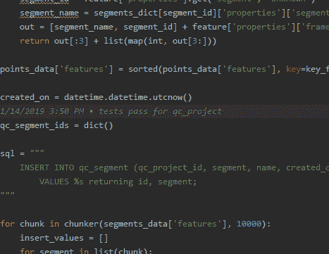
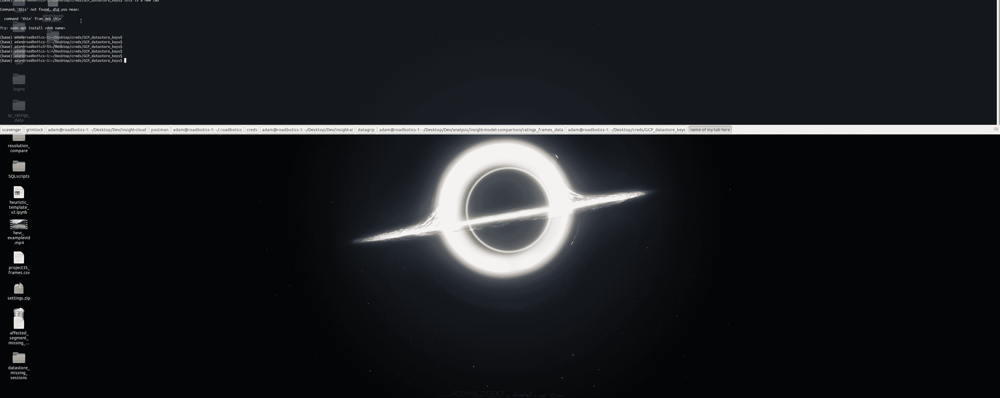
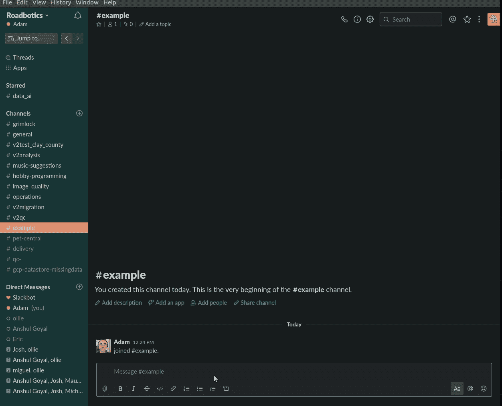
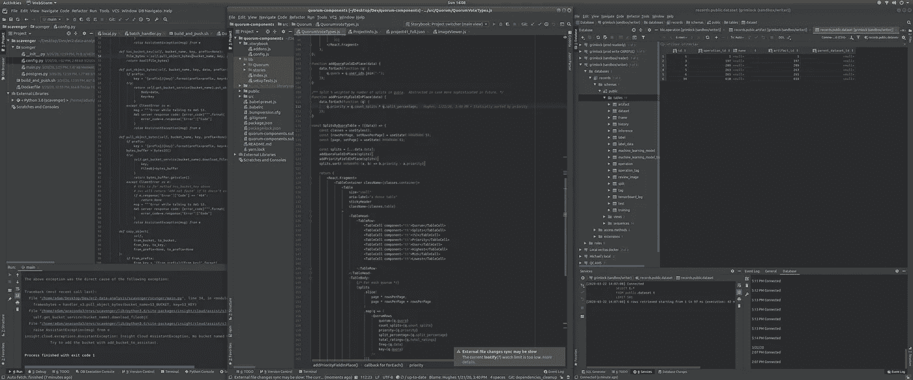
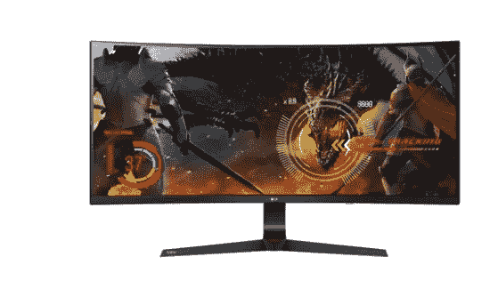
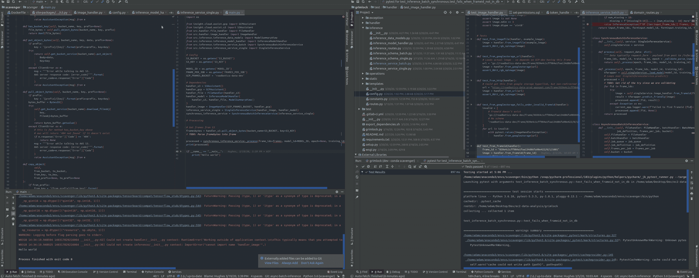

# 我最喜欢的 7 个软件开发人员生产力工具

> 原文：<https://levelup.gitconnected.com/my-7-favorite-software-developer-productivity-tools-a4c13b0fc0af>

## 快速提高生产力的快速技巧

我们只和我们的工具一样好

我从事软件开发已经有五年了，我意识到软件开发人员就像人一样，他的工具有多好就有多好。虽然我们每天都在不断地做得更好，但这里有 7 个技巧和工具可以保证让我们的工作效率大幅度提高。

1.  **Vimium/Acejump(键盘跳转)**

我讨厌鼠标，倾向于学习 ide 和操作系统提供的每一个键盘快捷键。也许我很极端，但是过度使用鼠标让我患上了慢性肩痛。虽然有许多很好的快捷方式可以学习，但在浏览网页或在 IDE 中轻松跳跃时，我总是能找到回到鼠标的方法。直到我发现 JetBrains IDEs 的 [Acejump](https://plugins.jetbrains.com/plugin/7086-acejump) 和 Chrome 的 [Vimium](https://vimium.github.io/) 。

这些简单的插件让你可以在屏幕上的任何地方跳转，点击链接，前后翻页，上下滚动等等，所有这些都可以在舒适的家中进行。在。下面是 gif(check out[LiceCap](https://www.cockos.com/licecap/)或 [Peek](https://github.com/phw/peek) 制作这些)，我打开一个启用了 Vimium 的 Chrome 浏览器，只用键盘导航。

*   按下`B`会调出一个易于搜索的书签索引。
*   按下`F`会在页面上的每个超链接上放置一个字母(按下字母点击链接)
*   `j`和`k`上下滚动，H 返回。
*   `/`搜索文字[(那么如果你真的是 1337，剪辑一下)](https://superuser.com/questions/1236864/how-to-use-vimium-to-select-text-from-a-page)

同样，让我们毫不费力地在任何 JetBrains IDE 中跳跃。

JetBrains 的 AceJump 插件。ctrl+分号跳转到任何匹配的单词。shift+Ctrl+分号跳转到行尾。

**2。用于远程桌面的 any desk**

在工作中，我有一台 32GB 内存的 Ubuntu 台式机和一台 1080 gtx——我喜欢它的一切，但我也喜欢在家工作……*在我和妻子共用的一个缓慢的 windows 盒子上！试图在不同的机器上保持一个同步的编程环境很糟糕——这很耗时，而且几乎不可能。花了 3 个小时设置好 Python 虚拟环境？太糟糕了，你必须在家再做一次，即使你的家用电脑和你的工作电脑很相似。是的，我可以只使用笔记本电脑，但是它们的功能比较弱，实际上我已经把它们从我的车里偷出来了——一点也不好玩。*

嗯，我想我可以在工作中设置一个 VNC 服务器，让 IT 人员打开一个防火墙端口，让我通过一个安全的隧道服务进行远程访问……哦，等等，现在不是这样的了！得益于 AnyDesk 和 TeamViewer 等应用，从任何远程桌面连接到您的工作电脑都变得非常简单。

**温馨提示:**

*   如果可能，请将您的远程显示器分辨率设置为与您的家庭显示器相同。
*   设置安全性，以便您只信任来自您家用 PC 的 AnyDesk 地址的连接(即白名单)—这可以防止外部流量请求远程访问。
*   将 AnyDesk 设置为在远程机器上启动时启动，这样您就可以远程重启，并且仍然能够登录。
*   将远程 PC bios 配置为[在局域网上唤醒](https://www.pointdev.com/en/faq/faq-ideal-remote-wakeup-remote-computer-station-wake-on-lan-wol-id-943.html)
*   工作时关掉显示器——你的同事看到它处于僵尸模式会吓坏的！

**3。瓜克(仅限 Linux】**

Guake 是一个用于 Linux 的类似地震的下拉终端管理器，它可以同时打开几个终端，而不占用屏幕空间。使用`F12` 切换下拉菜单，使用`F11`切换全屏模式。它有令人敬畏的键盘快捷键，用于调整窗口大小、标签和透明度，以及打开、关闭、重新排序和重命名标签。

Guake —直观下拉菜单中的多个选项卡。

**奖励:**感谢评论者[几周后，我的经理想了解更多，所以我们将他添加到频道中。他现在可以访问整个对话历史和所有文件；不需要电子邮件或叙旧。](https://medium.com/u/d36a14a21dbb#新想法</em>并放入一些附件(图片、代码等等)。</li><li id=)

*   [各种插件使频道与日常事件保持同步，如会议(Google 日历插件)、代码更改/部署(Firebase/Gitlab 插件)和许多其他事件，使状态更新过时。](https://medium.com/u/d36a14a21dbb#新想法</em>并放入一些附件(图片、代码等等)。</li><li id=)*   [完成后，频道会自动存档和搜索。](https://medium.com/u/d36a14a21dbb#新想法</em>并放入一些附件(图片、代码等等)。</li><li id=)

[最重要的是，`/giphy`插件让我们通过模因进行交流。](https://medium.com/u/d36a14a21dbb#新想法</em>并放入一些附件(图片、代码等等)。</li><li id=)

。</li><li id=)

[松弛表情和 gif](https://medium.com/u/d36a14a21dbb#新想法</em>并放入一些附件(图片、代码等等)。</li><li id=)

[**6。统一 IDEs**](https://medium.com/u/d36a14a21dbb#新想法</em>并放入一些附件(图片、代码等等)。</li><li id=)

[IDE 是高效开发人员最重要的工具，但是可供选择的工具太多了。我们就开门见山吧:**使用**](https://medium.com/u/d36a14a21dbb#新想法</em>并放入一些附件(图片、代码等等)。</li><li id=) [**JetBrains 或者 VSCode**](https://dev.to/mokkapps/why-i-switched-from-visual-studio-code-to-jetbrains-webstorm-939) **，句号**。这些是跨语言的 ide，你只需学习一次，然后所有的键盘快捷键、菜单、工具栏和怪癖在不同的语言之间或多或少都是相同的。

我是 JetBrains 的超级粉丝；我喜欢他们的产品，因为电池内置的感觉和怪异的智能感知。他们为大多数主流编程语言甚至数据库提供服务。一旦你掌握了一个 JetBrains IDE，开发者的体验就会反映在他们的产品套件中——包括诸如主题和键盘快捷键等设置。

三个 JetBrains IDEs 并排:(左)python 的 PyCharm，(中)javascript/react 的 WebStorm，(右)PostgreSQL 的 Datagrip。

VSCode 也很棒(而且 100%免费！).它从一个闪电般快速的文本编辑器开始，通过无数的插件来支持语言和框架。虽然我更喜欢 JetBrains，但 VSCode 是可以无限定制的，并且吸引了那些喜欢修补和定制编辑器各个方面的人。

**7。键盘快捷键和曲面显示器将所有功能整合在一起**

在研究生院，我是 1337，使用 3 个显示器和一个奇特的符合人体工程学的鼠标。现在我使用一台显示器和一个 10 美元的鼠标。这其中的关键是前面提到的 kine sis 2[LG 34in 超宽](https://www.walmart.com/ip/LG-34-Class-21-9-UltraWide-Full-HD-IPS-Curved-LED-Gaming-Monitor-with-G-SYNC/951672288?wmlspartner=wlpa&selectedSellerId=6907&adid=22222222227097176963&wl0=&wl1=g&wl2=c&wl3=214569029198&wl4=pla-411419670437&wl5=9005884&wl6=&wl7=&wl8=&wl9=pla&wl10=115781154&wl11=online&wl12=951672288&veh=sem&gclid=Cj0KCQjwmdzzBRC7ARIsANdqRRlWGXXdk6KeBapvaC6-OVqKAOD9VZWcJZqzLIhdboT7GzjtzQbJE9EaAo9OEALw_wcB)，并且只在万不得已的情况下才使用鼠标。**显示器必须是曲面的，因为这样才能提供足够的视野，容纳两台显示器相同的内容。**我强烈推荐三星的 34 英寸超过 32 英寸，因为它们太垂直，不适合并排的代码标签。

虽然曲面显示器在游戏中很受欢迎，但它可以让你在不转动脖子的情况下分割屏幕，就像两个屏幕一样。

为了充分利用可用的屏幕空间，要善于使用键盘快捷键。我很爱分析并学习它们，但是到目前为止最有价值的是窗口捕捉(**窗口键+箭头**)和跳转( **atl+tab** )。这些操作系统快捷方式结合其他提到的工具，如 Guake、Vimium 和 JetBrains，让我可以在很大程度上不用鼠标的情况下工作，如下所示。

免提 Nav: Alt+Tab 在 IDE 和 chrome 之间切换；浏览器的 VimiumJetbrains 快捷键和 Alt+Shift+Down/Up (ubuntu)来切换桌面。

 [## 编写面试问题

### 掌握编码面试的过程

技术开发](https://skilled.dev)