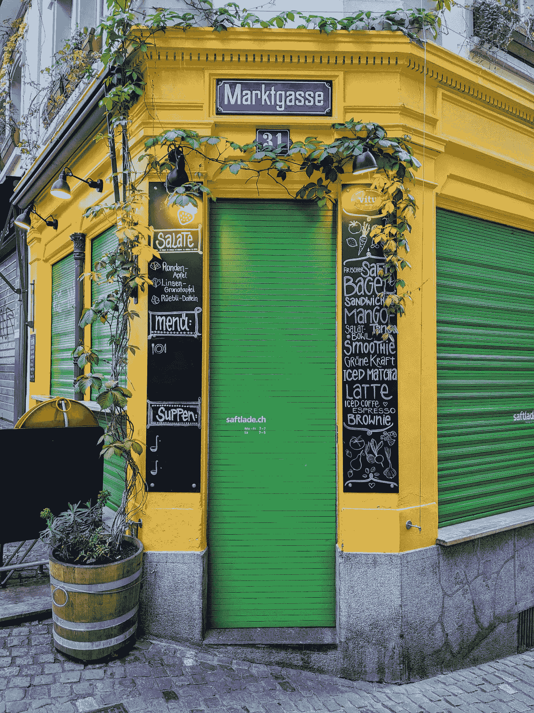

# 我的亚马逊 SDE II 面试经验和一些有用的技巧

> 原文：<https://levelup.gitconnected.com/my-amazon-sde-ii-interview-experience-with-some-useful-tips-5ee925a54d3>

关于我在亚马逊的软件工程面试经历的端到端讨论。

杰里米·恩斯在 [Unsplash](https://unsplash.com?utm_source=medium&utm_medium=referral) 上的照片

# 敲门声

去年 10 月，我在 LinkedIn 上受到了亚马逊招聘人员的打击。它是关于亚马逊软件工程的机会。

巧合的是，当时我愿意搬到一个不同的国家，搬出新加坡。长期的 covid 限制让我付出了代价，我想*够了！我要离开这里！*

所以，当我得到招聘人员的消息时，我决定去参加面试。除了亚马逊，我还面试了其他几家公司。但是今天，让我们来谈谈亚马逊对 SDE II 角色的面试经历，以及我个人的一些建议。在帖子的最后，我也会简单分享一下我的面试准备策略。

# 招聘人员来电

这个过程的第一步是打电话给招聘人员。得知我的兴趣后，招聘人员没有花时间安排电话。它简短扼要。她问了一些典型的介绍性问题，比如我目前的角色和职责，我对亚马逊的兴趣，以及我什么时候可以开始工作。

谈完典型的东西后，她问了几个关于数据结构和算法的基本问题。我从电话里没想到会这样。我猜动机是为了减少浪费面试官时间的机会！

在电话结束时，招聘人员告诉我，她会给我发一个**在线评估****【OA】**的链接，这是一个臭名昭著的亚马逊在线测试，内容是编码、领导原则和系统设计。打完电话后，我就收到了带有测试链接的电子邮件。我有一周的时间来完成测试。

> **💡小贴士:在像这样的初次电话中，有时招聘人员会询问期望的薪水。尽量避免回答这个问题。记住，现在讨论赔偿还为时过早。你可以一直说你还没有做任何研究。所以最好在以后的某个时间点讨论这个话题。**

# 在线评估

几天后我参加了 OA 考试。它长达一个半小时。我在家里找了一个安静的角落，排除所有干扰，点击了“开始”按钮。

以下是评估中值得注意的几点

*   有三个部分——编码、系统设计和领导原则。
*   编码部分有两个问题。第一个问题就像 LeetCode 一样简单，但是下一个问题的最优解在中等难度范围内。我认为第二个问题可以很容易地用于现场回合。
*   系统设计部分有几道选择题。没什么好惊讶的。就难度而言，对于对大规模系统设计有基本了解的人来说，这些应该很容易。
*   最后一部分是关于领导原则的问题。这是一组你更喜欢哪个的问题。你的任务是展示你的喜好。当然，没有正确或错误的答案。

关于领导原则的部分是最令人惊讶和疲惫的部分。是的，我知道这些原则对亚马逊来说就像圣经，那里的工程师就是以这些原则为生的。但在我看来，在网上评估中提出与领导力相关的问题会给这个过程增加一点价值。当面对面讨论时，这样的问题是有意义的。在在线测试中，你没有办法评估候选人在想什么。也没有进行深入讨论的空间。

> ***💡提示***
> 不要期望在线评估会很简单，而要期待惊喜。这将有助于你避免在考试中放松警惕。

只是为了分散读者的注意力；我拍的照片。

# (虚拟)现场巡视

第二周，我和招聘人员通了电话。她向我解释了接下来的步骤。理想情况下，下一步是电话面试一名工程师。但对我来说，他们决定直接去现场查房。

在几封来回的电子邮件后，我的现场工作被安排在三周后。这是一个由四个采访组成的循环，历时两天，每天两轮。采访将通过亚马逊的内部交流平台 Chime 进行。

下面简单讨论一下每个面试环节。

## 第一轮

按时间顺序，这一轮是这样的

*   快速介绍。
*   关于领导原则的问题。
*   对前面问题的后续讨论。
*   需要 DFS 的编码问题。这很容易。

介绍持续了大约 5 分钟。关于领导原则的讨论持续了大约 20 分钟。对于编码部分，我们有半个小时。

面试的一件趣事是面试官让我写伪代码。他不关心语法正确的代码，因为人们总是可以找到它。我没有多费口舌，按照他的要求做了。

关于领导原则的问题引发了一场关于我过去经历的愉快对话。采访者能够和我谈论的很多事情联系起来。就我个人而言，我喜欢讨论。

## 第二轮

同样，这一轮也很简单

*   介绍。
*   关于领导原则的问题与讨论。
*   再次需要 DFS 的中等难度编码问题。

在这一轮中，三个部分的时间安排与上一轮几乎相同。

## 第三轮

不幸的是，这一轮并不顺利

*   前十分钟我断线四次。
*   当我第五次加入时，面试官看起来真的很生气——问我是否想重新安排面试，对此我说*不*。
*   幸运的是，在接下来的采访中，它没有再下降。
*   就像其他面试一样，面试官问了我几个关于领导原则的情景问题，然后转向一个编码问题。
*   令人惊讶的是，这也是一个 LeetCode 中等难度的 DFS 问题。

由于这一轮有打嗝，我们有大约 15 分钟的时间来解决编码问题。这不是一个非常理想的情况。但说实话，不可预测性是面试游戏的一部分。

> *💡* ***提示***为你的面试安排一个稳定的互联网连接。最重要的是，无论你的网络有多强大，都要有备份！

## 第 4 轮

最后一轮是系统设计，如下所示

*   与面试官的快速介绍。这一轮有两个面试官，其中一个是影子面试官。但他也提出了问题。
*   关于领导原则的讨论。
*   一个典型的系统设计问题。

在 5 分钟的介绍和 25 分钟的领导相关讨论之后，我们有大约半个小时的时间进行系统设计。不幸的是，它没有太多的互动。采访者只是听了我要说的话，点点头。他们最后问了 2-3 个问题，但几乎没有时间讨论任何事情。

在我看来，这样一轮应该会有更广泛的制度设计讨论。

在所有现场讨论中，关于领导原则的讨论相当广泛，有时有些重复。这些讨论占用了每一轮的大量时间，从而减轻了技术部分的负担。

根据我的经验，与我参加过的所有其他公司的面试相比，亚马逊的面试是科技含量最低的。但是只要这个方法对他们有效，就是正当的。

> *💡* ***小贴士***准备好**讲述你的工作和经历的故事**。最好是回忆一下你做过的事情。记住面试官也是工程师，和你一样。如果你给他们讲好故事，他们会和你的经历联系起来。

# 准备工作

在结束帖子之前，我先简单分享一下我的准备情况。非常简单——

*   对于编码，我从 LeetCode 解决问题。我订阅了一个月，这很有用。
*   对于系统设计，我的主要资源是 Alex Xu 的[系统设计访谈:知情人指南](https://blog.pragmaticengineer.com/system-design-interview-an-insiders-guide-review/)、[这个优秀的 YouTube 频道](https://www.youtube.com/c/codeKarle)以及不同公司的博客，如[、](https://netflixtechblog.com/)、[、](https://eng.uber.com/)、 [Twitter](https://blog.twitter.com/engineering/en_us) 、 [Discord](https://discord.com/blog) 等。
*   对于领导原则，我遵循了最流行的技巧——为每项领导原则创建一个至少有两个例子的电子表格，在面试前将表格看几遍，并在脑海中保留一张地图。

> *💡* ***提示***不要为自己的准备聚集太多的资源。它可能会让你不知所措。列一个简明的备考材料清单，完整的过一遍。不要浪费时间频繁地在不同的材料之间跳来跳去，这会分散你的注意力。

# 结束了

在接下来的一周里，我得到了招聘人员的肯定答复。但由于手头有更好的报价，我们分道扬镳。

总的来说，这是我在亚马逊的经历。在接下来的文章中，我将与其他公司分享类似的经验，以及我的准备策略。

非常感谢你的阅读！

如果你喜欢这篇文章，考虑订阅我推荐的媒体！【https://medium.com/subscribe/@mottakin】