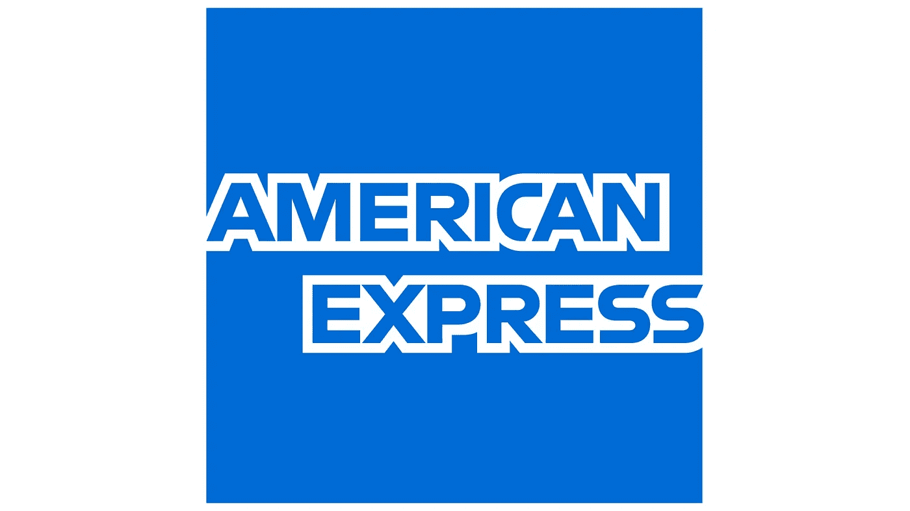

# 我的美国运通面试经历[精选]

> 原文：<https://levelup.gitconnected.com/my-american-express-interview-experience-264bedff4403>

你好，世界！在这篇文章中，我将分享我在美国运通实习 6 个月的面试经历。**【美国运通】**在我心中永远有一个特殊的位置，同样的原因你会在最后知道。

2021 年，美国运通组织了一次 AmExpert 活动，只有特定的大学被允许参加，幸运的是，我的大学是其中之一！招聘过程从一轮编码开始(更像是一次黑客马拉松)，然后是一系列面试。现在，我将分享整个过程的细节，以及一些技巧和旅行，让你开始。

## 第一轮—在线编码评估

这一轮与我们通常的编码评估非常不同。令人费解的是，编码问题来自大多数信用卡公司通常面临的真实生活场景以及相关的风险缓解。我们得到了所有问题的原始输入数据，这些数据将在跳到您的逻辑之前进行预处理。基本上，编码回合更像是一场黑客马拉松，给定的问题陈述判断你现实生活中解决问题的技能。共有五个中等难度的编码问题。

这一轮对我来说很顺利，我进入了美国运通面试的候选名单。

## 第 2 轮—技术面试

这是一个完全技术性的回合，我被问了两个基于地图和比较函数的编码问题。我还被问到与 Python 相关的问题，因为我在简历中提到过。面试官深入检查了我的 CS 基础知识。他问了我一些问题，比如 ACID 属性、IPv4 与 IPv6 以及操作系统中的分页。我还被要求为给定的问题语句编写几个 SQL 查询。然后面试官继续讨论我在简历中提到的项目。最后，他想知道我是否读过美国运通及其业务。

**指出注意事项**——为你在简历中提到的一切做好准备。美国运通时刻关注你的简历。你的简历会被彻底检查。此外，你必须准备好回答一些关于美国运通公司的基本人力资源问题。

## 第 3 轮—技术+人力资源面试

这一轮面试是我一生中接受过的最精彩的面试之一。面试官是美国运通的一名董事，非常支持。为了热身，他问了我三个谜题来检查我的认知能力。我能够解答所有三个谜题，面试官对此非常高兴。然后，他问了一些与 CS 基础知识、我的技术兴趣和基本系统设计相关的问题。他还讨论了我简历上的项目。最后，他问了我几个基本的人力资源问题，只是为了检验我是否适合这个职位和这个组织。就这样，我的第二轮面试以一个非常积极的基调结束了。

**一个快速提示—** 当你计划面试美国运通时，要为这些难题做好准备。谜题是美国运通面试的重要组成部分。常见谜题可以参考→ [谜题](https://www.geeksforgeeks.org/puzzles/)。

## 结果

同一天，大约晚上 11 点左右，我被告知 ***我被“选中”在美国运通进行为期 6 个月的能力实习生*** ❤️ **哇哦哦哦！！！！面对如此多的拒绝，这是我的第一次选择，这也是为什么美国运通在我心中永远有一个特殊的位置。难怪，第一次总是特别的！**

最后，我希望你们都保持动力，继续尽最大努力。你永远不知道，你会有什么样的未来！在 LinkedIn 上保持活跃，建立一些良好的关系，尽可能多地参与。

祝你好运，如果你有任何问题，请告诉我！

**随时通过**[**LinkedIn**](https://www.linkedin.com/in/taniya-gupta-675645180/)❤️联系我