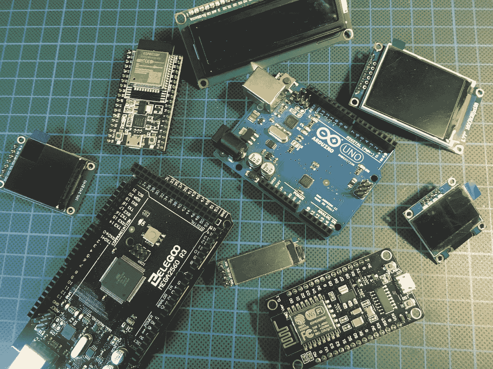
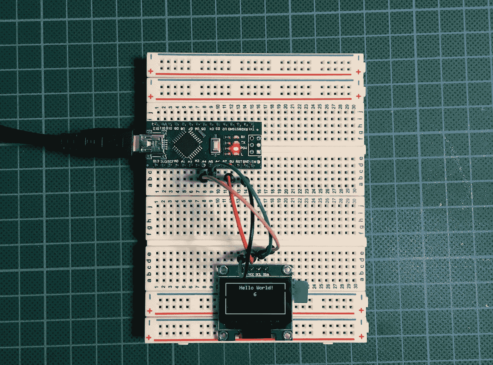

# 适用于您的 Maker 项目的 My Arduino/ESP 显示草图集

> 原文：<https://levelup.gitconnected.com/my-arduino-esp-display-sketch-collection-for-your-maker-projects-ed6b2ffaffef>

## 我已经为电路板和显示器创建了一个代码和引脚的概要

照片由[作者](https://medium.com/@the_tech_maker)拍摄

迟早我们需要一个展示我们的创客项目。尽管它们很容易获得并且价格合理，但是文档通常很难找到。
所以很快就出现了一个大问题，需要什么样的引脚，需要什么样的库，以及如何编程？

这种情况在我身上发生过几次。对于我想在项目中使用的每一个显示器，我都必须进行寻宝游戏。我不记得上次找到的信息存放在哪里了。通常都是无处可寻，所以我又去网上找找看能不能再挖出来。我又一次浪费时间在数百万的点击中筛选，直到我找到正确的信息。

# **Arduino ESP 显示器概要**

因为我已经花了很多时间试图为一个简单的任务找到正确的信息，所以我决定为我所有的显示器和展板创建一个概要。为了节省您的时间，让您的生活更轻松，我想与您分享以下收藏:

## [**ArduinoESPDisplayCompendium**](https://github.com/TheTechMaker/ArduinoESPDisplayCompendium.git)

集合组织在不同的子目录中

*   阿尔杜伊诺
*   Attiny85
*   ESP32
*   ESP8266

在这些目录中，您可以找到连接和编码各种显示器的草图。

所有草图都以描述硬件固定和其他信息的注释开始。随后是库、引脚定义、设置代码和一个循环，其中计数器递增，其值打印在显示器上。

图片作者[作者](https://medium.com/@the_tech_maker)

# 示例:将 I2C 有机发光二极管 128x64 连接到 Arduino 主板

此集合是连接和编程我的项目的显示的快捷方式。这也是检查显示器是否损坏的快速方法。
只需上传草图，你就可以开始了。

关于源代码的一句话，它可以在互联网上找到。我只是花时间把它放在一个地方，以便于访问。
非常感谢所有为我们的创客社区提供作品的人。

所以，请随意下载[你的项目需要的任何东西。
快乐制造！](https://github.com/TheTechMaker/ArduinoESPDisplayCompendium)