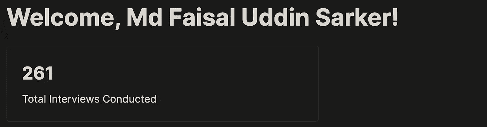

# 不要用 Java 进行编码面试。

> 原文：<https://levelup.gitconnected.com/my-candidate-used-java-for-the-coding-interview-and-failed-because-of-it-668c48ee2cb8>

## 你应该是愚蠢的或愚蠢的好用 Java 编码面试


Andrea Piacquadio 的照片:[https://www . pexels . com/photo/photo-of-man-touching-his-head-3752834/](https://www.pexels.com/photo/photo-of-man-touching-his-head-3752834/)

技术面试的主要目的是测试应聘者解决问题的能力。

但是选择正确的语言非常非常关键。有时候会成为高压 45 分钟面试中最重要的因素。

而且，根据我的经验，Java 可能是现场编码中最糟糕的语言。

但首先，让我解释一下。

# 我有什么资格评判？

我在业余时间参加技术面试，到目前为止，我已经参加了大约 260 次面试。所以我是字面上的法官:P

考生使用多种语言，但 Java、Python、C++是最常用的。



a 迄今为止的面试总数。

面试持续 45 分钟，要解决的问题尽量多。

各个公司的招聘标准不同，但在大多数情况下，解决两个问题就足够了。

# 首要问题

第一个真的很简单。对于这个问题

预期的输出是一个 hashmap，其中的键是一个用户 id，值是一个数组。

类似这样的。

```
{
  user1: [1,2],
  user2: [3,4]
}
```

为了简单起见，我将只向您展示这个实现的两个非常简单的部分。

*   构建结果数组
*   打印结果数组。

# 将值插入地图

对于 java，代码看起来像这样。

```
Map<String, List<Integer>> map = new HashMap<>();

if(map.containsKey(user)){
     map.get(user).add(time);
}else{
     map.put(user, new ArrayList<>());
     map.get(user).add(time);
}
```

这里发生了什么事？

*   我们正在检查哈希表中是否已经存在一个值。
*   然后在此基础上，我们初始化一个数组并插入它。

这里没有错。据我所知，这是我们在 Java 中的做法。

但是，让我们看看如果候选人使用 Python，代码会是什么样子。

```
map = defaultdict(list)
map[user].append(time)
```

你看到这有多简单了吗？

*   我们不需要考虑声明复杂类型`Map<String, List<Integer>>`
*   我们可以使用 Python 的`defaultdict`来避免检查键的存在。
*   我们不需要初始化一个空数组，因为`defaultdict`已经为我们做了。

底线是你已经在这里节省了至少一分钟。无论是在键入的字符数量方面还是在考虑所有事情的开销方面。

# 打印结果

现在，这是我经历过的最沮丧的事情。

用 Java 打印东西是如此的不必要的复杂，以至于在这些面试中，当我看到应聘者编写下面的代码来打印散列表时，我会在脑海中尖叫。

同样，**这是候选人写的实际代码**，

```
Map<String, int[]> result = new HashMap<>();

result = user_sessions(logs1);

for(String key : result.keySet()){
   System.out.print(key + " " + result.get(key)[0] + " " + result.get(key)[1]);
}
```

但是在 python 中同样的事情会是

```
print(user_sessions(logs1))
```

现在，老实说，我不是 java 专家。

所以，可能你们中的一些人会告诉我一个更好的方法来轻松地打印这些值，并告诉我这是候选人的错，他不知道如何做。

# 但这正是我的观点。

如果有更简单的方法来做这些事情，那么**为什么大多数 java 开发人员不知道它们**？

我只能想象这么多编码面试浪费在这种事情上的时间有多少。

平均来说，编码周期是 45 分钟，所以即使损失 2-3 分钟也会增加。

# 当你需要调试的时候

你大概也是人，所以自然而然，你会犯一些错误。

想象一下，每当你想打印一些东西的时候，调试你的代码并输出这些`System.out.println()`。

```
System.out.println("Something")
```

相对

```
print("something")
```

试图打印一个数组是另一回事。它会直接打印出你的内存位置

# 但是…

但是我也见过一些优秀的候选人使用 Java 轻松完成这些编码练习。

> 但是为什么他们这么少呢？

这可能是因为 Java 是为单独的用例而构建的。另一方面，Python 是一种脚本语言。所以更有意义。

所以，如果你是那些只写 Java 代码的候选人中的一员，那么恭喜你！

# 那么我学到了什么？

如果您在工作中使用 Java，那就没问题。要牛逼。

但是对于编码面试来说，

> 求你了。请..请…学习 Python

它会为你节省很多时间，我甚至无法形容。看到那么多优秀的考生因为这些小事而功亏一篑，太伤我心了。

# 这是一个双赢的局面

反正 Python 是一门很棒的语言，对吧？所以学这个没有错。

我见过太多优秀的候选人仅仅因为这个就功亏一篑。

以至于我已经开始刷新我的 Python 知识，尽管我是一名 Javascript 开发人员。

# 我们的人怎么了？

他在概念方面游刃有余，并清晰地描述了预期的解决方案。

我认为他明明在 5 分钟内解决了问题，却没能及时完成。

我并不是说他只是因为使用 Java 而失败。如果他更了解 Java 的话，他本可以及时完成这道题的。

但是我的观点是，精通 Java 比精通其他语言要难得多。

# 我的建议

我们都知道**经济不好**，现在要找工作，你必须掌握自己的技能。

因此，如果你正在准备你的第一份工作或打算换工作，**大胆尝试，使用最好的工具。**

不管你喜欢它还是讨厌它，Java 是不会消失的。但是用 Java 来编码面试可能不是一个好主意。

这是我对这个话题的看法。请在评论中告诉我你对此的看法。

祝你有美好的一天！

您可以通过 [**LinkedIn**](https://www.linkedin.com/in/56faisal/) 或我的 [**个人网站**](https://www.mohammadfaisal.dev/blog) 联系我

[](https://javascript.plainenglish.io/story-of-a-failed-react-project-f32177479bdf) [## React 项目失败的故事

### 这给我们的创业带来了灾难。

javascript.plainenglish.io](https://javascript.plainenglish.io/story-of-a-failed-react-project-f32177479bdf) [](https://betterprogramming.pub/21-best-practices-for-a-clean-react-project-df788a682fb) [## 清洁 React 项目的 21 个最佳实践

### 提高代码质量的实用建议

better 编程. pub](https://betterprogramming.pub/21-best-practices-for-a-clean-react-project-df788a682fb) [](https://betterprogramming.pub/22-best-practices-to-take-your-api-design-skills-to-the-next-level-65569b200b9) [## 22 个最佳实践，让您的 API 设计技能更上一层楼

### 设计 REST APIs 的实用建议

better 编程. pub](https://betterprogramming.pub/22-best-practices-to-take-your-api-design-skills-to-the-next-level-65569b200b9) 

# 分级编码

感谢您成为我们社区的一员！在你离开之前:

*   👏为故事鼓掌，跟着作者走👉
*   📰查看[级编码出版物](https://levelup.gitconnected.com/?utm_source=pub&utm_medium=post)中的更多内容
*   🔔关注我们:[推特](https://twitter.com/gitconnected) | [LinkedIn](https://www.linkedin.com/company/gitconnected) | [时事通讯](https://newsletter.levelup.dev)

🚀👉 [**加入升级人才集体，找到一份惊艳的工作**](https://jobs.levelup.dev/talent/welcome?referral=true)