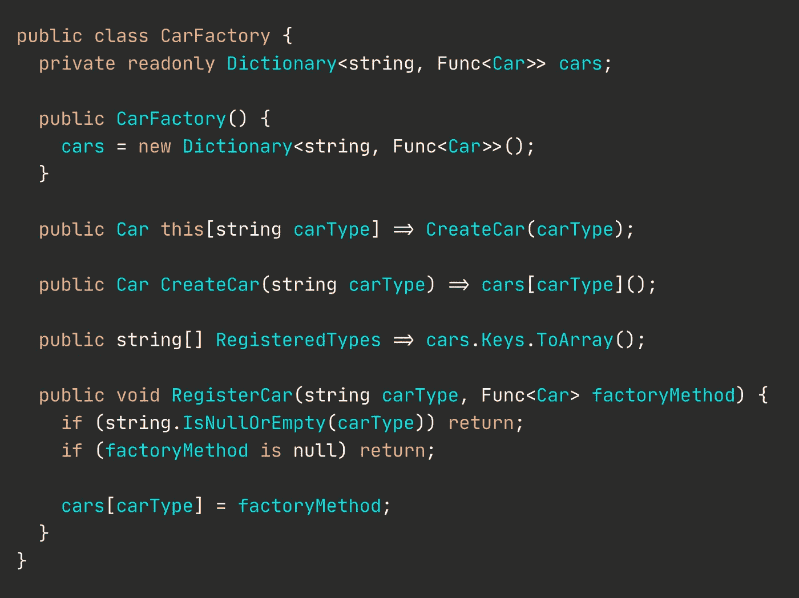

# 我的代码很糟糕，但没关系

> 原文：<https://levelup.gitconnected.com/my-code-stinks-and-thats-ok-6b15118bfdff>

## 慷慨激昂地为“代码味道”辩护，以及为什么技术博客变得疯狂


图片由 Unsplash 提供

我们都看了那些文章。你知道我说的那些。**那些**的。简单、简化的标题，如“递归不好”或“我们需要停止使用 IF/ELSE ”,来自刚刚发现函数式编程的人。看，对事物有不同的看法是好的，包括代码风格，但是有一个从迂腐到教条的界限。老实说，这有点失控了。所以我决定，有人需要站出来捍卫“代码味道”，这是真实的、实际的产品代码如何工作的基本构件。

# If/Else 可以

我已经看到太多的文章鼓吹`if/then` 语句的邪恶，以及如何总是有更好的方法来做事，比如`switch` 语句之类的。是的，对某些事情来说，`switch`或`select`是合适的。例如，在 Go 中，当你想检查一个通道是否有任何东西在等待时，你应该使用一个`select`，这样就不会阻塞主线程。

```
ch := make(chan bool)
select {
  case x <- ch:
     // do something with the channel
  default:
     // do something else
}
```

如果你有一个值，并且你想根据大量的条件检查这个值，那么一个`switch`语句可能是最好的方法。在这种情况下，性能和可读性会更好(通常情况下)。但是像 Python 这样没有`switch`或者`select`的语言呢？嗯，你有点坚持使用`if/else`了，不是吗？**你能编写或导入某种库来重新实现`switch`或做一些其他类型的评估吗？当然可以。但是你可以很容易地使用`if`。我认为:**

```
def my_function(x):
    if x == 0:
       # do something
    elif x == 1:
       # do something
    else:
       # catch all
```

和这个一样易读(如果不是更易读的话):

```
function my_function(x) {
    switch(x) {
       case 0:
          // do something
       case 1:
          // do something
       default:
          // catch all
    }
}
```

是的，如果可能的话，你想避免使用嵌套的`if`,但是有时候你就是需要这样做，这也没关系。重要的是你的代码是可读的，可跟踪的，并且只需要有多复杂就有多复杂。

# For 循环是代码的基础，这没关系

这大概是我最喜欢的，也是这次反驳的真正启发。我看过[博客讨论](https://medium.com/swlh/all-loops-are-a-code-smell-6416ac4865d6)如何不应该使用`for`，而应该使用像`forEach`和`map`这样的函数。如果你知道任何事情，这是相当可笑的，因为你只是把`for`卸载到一个函数中。这些方法中没有魔法可以绕过一个基本的循环。事实上，循环是软件设计中最基本的部分之一。没有某种循环机制的编程语言不是真正的编程语言，否则它就不是图灵完整的。所有这些都没有解决一个简单的事实，即大多数语言没有类似`forEach`的函数，但它们都有`for`或`while`。仅仅因为它对 JavaScript 有好处并不意味着它对其他任何东西都有好处——大多数东西**不能**在 JS 上运行(感谢上帝)。

在 Python 中，有几种循环方式，其中一些在不同的时候比其他的更合适。就我个人而言，我是理解的粉丝，但它们并不构成最可读的代码，在你编写的代码可能由别人而不是你自己来维护或改进的情况下，你必须考虑这一点。

```
[{x: int(y)**2} for x,y in my_dict.items()]
```

与相同

```
result = []
for x,y in my_dict.items():
    result.append({x: y**2})
```

但是第二种可能更容易让普通开发人员掌握，而不必钻研 Python 3 文档和参加理解速成班。理解起来可能有点快，但是 CPU 现在很便宜，除非你正在做一些实时的时钟-时间-是必要的类型的操作，那么你可以多花一毫秒或两毫秒，并有可维护的代码。

# Switch 语句也可以

但是等等，你不是刚说完用`if/else`代替 switch 就可以了吗？为什么我们又在说`switch`了？嗯，[因为这堆代码存在](https://medium.com/swlh/factory-pattern-without-switch-this-is-how-it-should-be-done-cd895e356f44)。

如果你不想冒险阅读链接的文章，TL；dr 是用工厂代替交换机。哪个…呃。为什么？为什么？为什么 YYYY？



这肯定比 switch 语句更容易阅读…..对吗？对吗？

为什么我们需要进行这些对话？为什么，出于对一切神圣事物的热爱，你会使用类和工厂来实现一个简单的`switch`和一个复杂的 OOP 范例呢？如果你想从 JavaScript 中获得毫秒级的性能，那么也许是时候学习一种新的语言了，一种不是 JIT 编译和解释的语言，比如 Rust 或 Go 或 C++或 C#或 Erlang，或者…你明白我的意思。需要在浏览器中运行？WASM 支持你。

# 我们都很好

我可能开了点小玩笑，有时还会忘乎所以，但我们不都是这样吗？我的意思是，这篇文章的一些灵感肯定有。但是如果有一件事我想强调的话，那就是:代码风格和约定都是主观的(在某种程度上)。如果你不能让自己去写工厂而不是基本的流量控制，那么尽一切办法，做你能做的。我们很好。你的代码会很好，你也会很好，宇宙不会因为再多一个`if/else`而崩溃。无论你在开发过程中处于哪个阶段——从刚刚学习什么是功能的菜鸟到寻找方法故意迷惑实习生并编写根本不存在的代码的老前辈——只要尽力而为，不断学习，忽略狂热者。因为说到底，就像飞行员和着陆一样，任何成功启动的应用都是好的。我会坚持我的臭码。

**我错过了什么吗？请在评论中告诉我！**