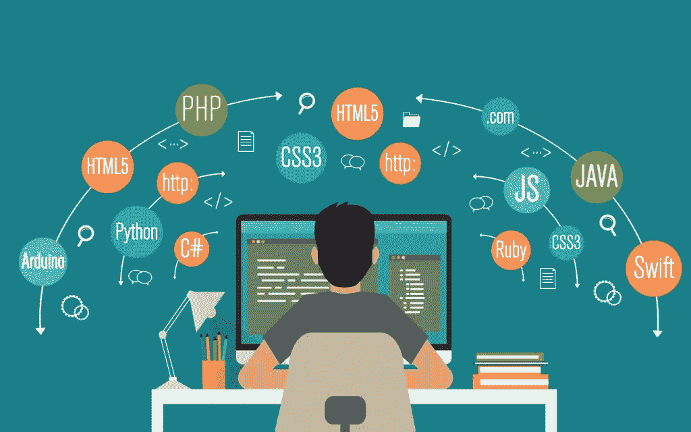
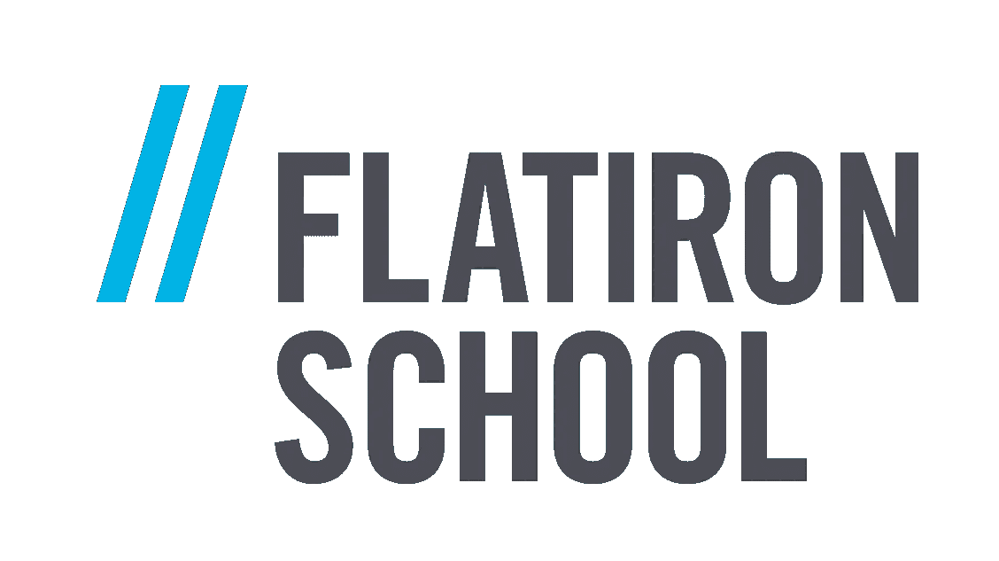
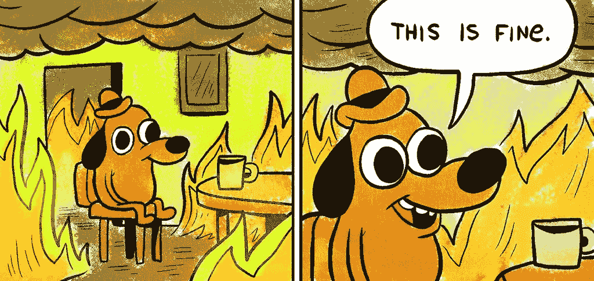
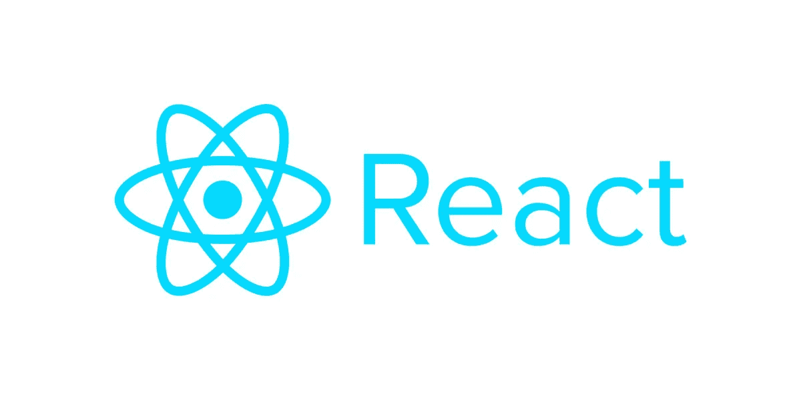
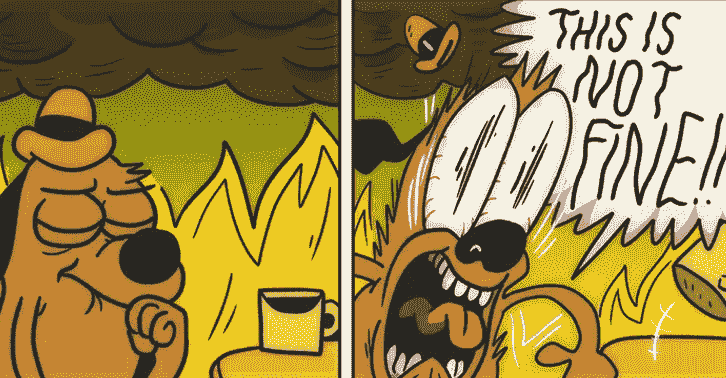

# 我在新冠肺炎的编码训练营经历

> 原文：<https://levelup.gitconnected.com/my-coding-bootcamp-experience-through-covid-19-69264f5e1d1a>

回到 2020 年 3 月，由于新冠肺炎，我失去了奢侈品零售销售工作。自 2015 年大学毕业以来，我一直在学习，试图进入医学或医师助理学校。在医院工作了许多年并获得了 MCAT 奖(两次)之后，我认为我年纪越来越大了，医学院/公共管理学院对我来说不是一个好的选择。我的父母和朋友知道我喜欢创造东西，他们建议我如果在医学院不成功，就去看看软件工程。

一想到要转向不同的研究领域，我就害怕。我在医学道路上投入了无数年的研究和经验，放弃这些年似乎是一种浪费。然而，在那些年里，我学到了许多生活经验，如果没有经历这些事情，我就不会成为今天的我。在接受了我的职业转变后，我申请了熨斗学校的编码训练营，全力以赴地学习代码！

我写的第一行代码是在 2020 年 4 月。Flatiron School 提供免费课程，你甚至可以在申请这个教你 JavaScript 和 Ruby 基础知识的项目之前就开始学习。我首先做了免费课程，作为一个试金石，看看我是否真的喜欢编码，我是否擅长它。如果我真的不喜欢某件事，我就不想承诺。经过几次实验后，我注意到时间过得更快了，当我的代码行实际工作时，我很兴奋。于是我申请了新兵训练营，通过了面试，开始做开学前学校给我们的准备工作。

我新兵训练营的开始日期是 2020 年 6 月 1 日。大约在四月中旬，我被学校录取了。离开学校几年后，我想重新开始学习更长的时间。所以我每天花 8-10 个小时编码，很早就完成了前期工作。还剩一个月左右的时间，我决定在上课前多学一些 HTML，CSS，JavaScript。我使用的资源有:[interneting shard](https://www.internetingishard.com/)和 J [avascript.info](http://javascript.info) 。我还用 Ruby 在 [Codewars](http://codewars.com) 上演练了算法问题(简单难度),帮助我开始思考一个程序员会怎么做。到了上课的时候，我觉得自己已经准备好了，对未知的东西也不那么害怕了。

这是我在“编码”。

熨斗学校将其课程分为 5 个模块。每个单元包括 3 周。模块的第一周是我所说的“学习”周。一周中的每一天，我们都会在早上上课，然后在晚上进行配对编程实验。家庭作业实验室通常会在一周开始时布置给我们，作为对我们学习的补充。就我个人而言，我会试着在我们上课前完成所有的实验/课程。我觉得这种方式对我有用，我能更好地记住信息。在模块的第二周，在接近周末的时候会有一个代码测试，测试我们是否知道我们正在学习的语言的基础知识。如果我们未能通过代码质询，将在第三周再次进行代码质询。如果你重考失败，那么这个学生通常会被推迟到下一批或者退学。最后，模块的第三周是项目周。这是我们利用前两周学到的知识，用它来建立一个项目的地方。在第三周结束时，我们向同学/导师展示我们的项目。

模块 1 是学习适应不同的学习方式。当我读大学的时候，我习惯于记忆大量的信息，然后在笔试中背诵这些知识。编程不仅仅是测试你记住了什么，更重要的是能够用你所知道的基础知识逻辑地构建应用程序。当我刚开始学习如何编码时，我并不尊重代码。我的意思是，某些语言有某些方法或途径来解决问题。一旦你学会了每种语言的复杂性，学习就会变得容易得多。我学会做的另一件事是学习如何很好地阅读文档和堆栈溢出。我们的导师告诉我们要做的第一件事就是，如果我们遇到困难，就用谷歌搜索我们的问题。起初，关于栈溢出和文档的一切看起来真的很复杂，这让我感到困惑而不是帮助。然而，一旦我能够舒服地阅读文档，我就能够自己解决大部分问题。

项目周是我在项目期间最焦虑的一周。我之所以如此焦虑，是因为我觉得自己对构建应用程序了解得还不够。对我帮助很大的是在项目周前的周末阅读了大量的文章，帮助我为即将到来的一周做准备。我和我的搭档每天都计划我们想要完成的事情，给自己一个达到这些目标的现实时间表，并且一次开发一个功能。到周末，我们已经构建了一个功能齐全的命令行应用程序！(看这里演示:[https://youtu.be/hdhr5TliaoQ](https://youtu.be/hdhr5TliaoQ))。

模块 1 更多的是关于方法和查询，而模块 2 是关于构建一个实际的框架。我们有一整个模块来学习 Ruby on Rails。

在模块结束时，我们构建了一个完整的 Ruby on Rails web 应用程序。学习 Rails 并不难。然而，构建 Rails 应用程序是一个非常结构化的过程。它不太容易表达，而且我发现使用 Rails 提供的视图文件(嵌入式 ruby)很麻烦。我还花了很多时间使用 CSS(层叠样式表)设计我的项目的样式，并意识到设计有多难(对所有 UI/UX 开发者大喊)！我仍然觉得学习 Rails 是一种愉快的经历，Rails 教会了我关于 MVC(模型-视图-控制器)的几乎所有东西。这是我的模块 2 项目，跋涉者！([https://youtu.be/pru2Xp3RobU](https://youtu.be/pru2Xp3RobU))。

最后，模块 3 是关于 JavaScript 的。JavaScript…甚至非编码人员也知道它是什么。所有雇主在求职者身上寻找的语言。十年来最热门的语言。我已经准备好学习这门语言了。然而，模块 3 对我的同学来说是一段非常混乱的时期。本来打算教我们 JavaScript 的老师实际上在我们完成模块 2 前几周已经辞职了。熨斗学校决定将我们的团队和纽约的团队合并。这意味着我们的讲座将是 50 多人的视频会议，只有一名讲师。对我所有的同学来说，从老师或教练那里获得帮助需要 30 多分钟，这种学习经历被证明是非常困难的。

我的模块 3 经历。

然而，我喜欢学习 JavaScript。尽管我从教练那里得到的帮助没有我喜欢的那么多，但我适应并学会了使用我的在线资源。如果我被困在某件事情上，我会在周末观看 YouTube 上教授这些事情的视频。模块 3 结束后，我觉得我可以建造任何我想要的东西，因为它教会了我掌控自己的教育。

JavaScript 本身就很强大。与 Ruby on Rails 相比，用 JavaScript 构建感觉非常自由。有许多很酷的东西可以用事件来构建，语言本身也有大量的开发者为其库做出贡献。我内心的创造力开始在我写的代码中表现出来！我对 fetch 请求有了更好的理解，并开始更清楚地掌握前端如何与后端服务器交互。在我的模块 3 项目中，我为宠物制作了一个 Instagram 克隆。你可以在这里看到这个项目的演示:(【https://youtu.be/9GXSqkO9nYg】T2)。

在模块 4 中，我们学习了如何使用 React 进行构建。根据谷歌的说法，

React 是一个开源的前端 JavaScript 库，用于构建用户界面或 UI 组件。它由脸书和一个由个人开发者和公司组成的社区维护。React 可以作为开发单页面或移动应用程序的基础。”

React 可能是新兴开发者所知的最热门的库之一。这是让你被聘用的关键，精通这一点会让你成为许多科技公司的顶尖人才。我非常喜欢学习反应。JavaScript 作为一种语言，感觉是多余的，而且很多时候用普通的 JavaScript 编码会让人感到疲惫。React 解决了普通 JavaScript 的所有难题。它允许 apt 划分和更干净的代码。React 还附带了 JSX，它是 JavaScript 的语法扩展。它本质上结合了 JavaScript 和 HTML，并在 React 组件中分离关注点。

在第 4 单元中，我实际上已经筋疲力尽了。我知道它要来了，但直到我没有通过模块 4 代码挑战才意识到我有多糟糕。

对我来说倦怠是什么样的。

代码挑战失败是一个警钟。我意识到我没有花尽可能多的时间来掌握 React。我感到失败和没有价值。因此，在我再次参加代码挑战的前一个周末，我做了我最擅长的事情，我*磨*。或者用更好的话说，我努力学习。我“休息”了半天，剩下的时间用来掌握 React。等到重考的时候，我相信我的努力不会让我失望。我最终在 30 分钟内完成了所有的交付成果(包括高级交付成果)，给定的时间是 90 分钟。

事后看来，代码挑战的失败是塞翁失马，焉知非福。如果我没有花额外的时间真正理解 React 的来龙去脉，我可能不会像现在这样擅长开发 web 应用程序。我谦卑自己，变得有韧性，并取得胜利。这是我的模块 4 项目:(【https://youtu.be/XLV9ZdpmQOs】[)。](https://youtu.be/XLV9ZdpmQOs)

模块 5 不同于之前的 4 个模块。不同于通常的前两周的学习时间，我们用了整整三周的时间来完成最后一个顶点项目。我一直想建立一个预算应用程序，跟踪我在某些类别上花了多少钱。模块 5 的第一周我在学习 Redux 和 Chart.js，Redux 是一个开源的 JavaScript 库，用于管理应用状态。它将状态集中在一个商店中，而不是将状态作为道具传递下去。Chart.js 允许我在应用程序中包含一个圆环图。这是我的项目的核心和主要焦点。我希望我的甜甜圈图是动态的，并且有一个功能，您可以在单击图上的类别后访问“嵌套”的甜甜圈图。学习 Redux 和 Chart.js 是模块 5 中最难的部分。Redux 很难，因为在构建状态管理器时需要跟踪许多部分，而且很容易丢失。理解 Chart.js 让我觉得自己是个数据科学家。学习处理数据点并在图表上显示它们感觉很陌生，我花了几天时间才真正展示出我想要的东西。

我在训练营做我的顶点工程时玩得最开心。有时候，我会花 10 多个小时编写代码。我对自己正在构建的应用程序感到兴奋，感觉自己就像一个在玩乐高玩具的孩子。当我为我的项目编码时，我感到了合理的喜悦，当我在四月份决定返回时，我知道我做出了正确的决定。我完成了我的项目，提交了我的申请，并于 2020 年 9 月 11 日毕业。这是我最后的顶点项目叫做 Obsido！([https://youtu.be/SYQzvOHRVDw](https://youtu.be/SYQzvOHRVDw))。

# **结论**

总的来说，我的编码训练营经历非常成功！我非常害怕转行，尤其是在这段困难时期。参加编码训练营风险很大，毕业后的工作前景没有保障。然而，过去的一年是我一生中发展最快的一年。当你冒大风险时，你会发现自己把所有的精力都投入到风险中。当你全身心地投入完成一项任务时，好事就会随之而来。以下是我从编码训练营的经历中学到的一些东西:

*   你得到你所投入的。编程是一个领域，如果你花足够的时间在一个项目上或学习新的东西，你会看到你的劳动成果。
*   你成为自己船的船长。当我在训练营期间构建我的项目时，我完全控制我想要构建什么以及我想要项目看起来如何。我接管了我的项目，并投入了大量时间，因为我希望我的项目是高质量的产品。
*   要谦虚。这是一个反复出现的主题，我会认为我知道如何做某事，然后完全不知道如何去做。你越快告诉自己“我不知道”，你的学习过程就越快。
*   不要抓住你的失败不放。(对你的失败)要健忘。对我来说，失败并不意味着我在某些事情上失败了。失败往往是伟大的启示者。这显示了我知识上的差距。如果我不知道如何编写某个特性的代码，或者被困在一个算法上，我知道从哪里开始学习。
*   力争精通。我一生都在学习，只是为了及格。我知道的仅仅够通过考试，但实际上并没有记住这些知识。软件工程是一个领域，在这个领域中，了解语言或框架的所有方面与构建更好的产品直接相关。我不想只是“通过”训练营，我想成为一名大师。
*   善待他人。我训练营经历的主要部分是我的同学。训练营的一大好处是每个人都来自不同的背景，处于不同的人生阶段。项目中的每个人都想成功，目标不是让你在同龄人中脱颖而出，而是一起构建令人惊叹的项目。如果我的同学在某些话题上有困难，我们会伸出援助之手。如果我在什么事情上挣扎，就会有一只手伸向我。
*   打算玩。老实说，我认为我在训练营期间比同龄人打得最多。无论如何我都没有懈怠，但是我每天都给自己留出减压的时间。在这个领域，生活中的平衡经常被低估。许多程序员一天工作 10 个小时没有压力，但对大多数人来说这是不可持续的。一定要享受生活。
*   *及时行乐*。把握今天。认真对待每一天很重要。每天醒来，带着全力以赴的意图。如果你的一天过得很糟糕，那就去睡觉吧。第二天醒来及时行乐。生活节奏非常快，所以让每一天都有价值。

感谢每一个在我旅途中支持我的人。作为一个人和程序员，我仍在成长。我可能刚刚结束了一次训练营，但我还在起跑线上。外面有一个全新的世界等待我去体验！