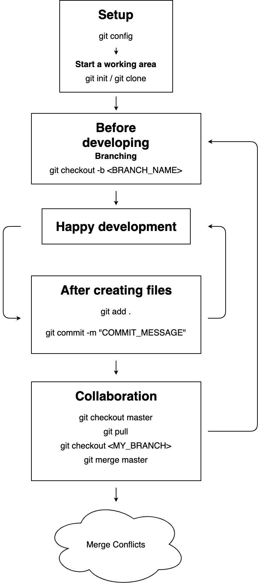

# 我的日常 Git 工作流程

> 原文：<https://levelup.gitconnected.com/my-daily-git-workflow-a176387d6cd>

## 从头到尾处理任何项目都需要知道的所有 git 命令


照片由[扬西·敏](https://unsplash.com/@yancymin?utm_source=medium&utm_medium=referral)在 [Unsplash](https://unsplash.com?utm_source=medium&utm_medium=referral) 上拍摄

Git 是我们发展自己或与同事合作时的好朋友。没有版本控制是很难想象的。但是，对于初学者来说，学习 git 命令可能是一场噩梦，因为有太多的 git 命令可以处理不同的情况。我经历过这个过程。

让我分享一下我在处理真实项目时的日常 git 工作流程。

**TL；下面是我处理大多数项目的日常 git 工作流程:**



我的日常 Git 工作流程

# 设置

如果您只是在自己的机器上安装 git，您可以用您的名字和电子邮件设置一个全局 git 配置文件，这样您机器上的所有 git 项目都可以使用默认的 git 配置。

```
git config --global user.name <YOUR_NAME>
git config --global user.email <YOUR_EMAIL>
```

使用上面的命令，。gitconfig 文件将在您的主目录中创建。要检查您的全局 git 配置，您可以使用:

```
git config --global -l
```

## 开始一个工作区

设置好全局 git 配置后，您就可以真正开始一个新的工作区了。

如果创建一个空存储库或将一个目录转换为 git 存储库，您可以使用:

```
git init
```

执行 git init 会在当前工作目录中创建一个. git 子目录，其中包含新存储库所需的所有 git 元数据。例如，对象和引用的一些子目录。还会创建一个头文件，它指向当前签出的提交。

如果您想使用现有的远程存储库，您可以使用:

```
git clone
```

在内部，git clone 首先调用 git init 来创建一个新的存储库。然后，它从现有的存储库中复制数据，并签出一组新的工作文件。

# 在开始对存储库进行更改之前

# 分支

分支在版本控制中起着重要的作用。它帮助我们创建独立的开发路线，并作为编辑/阶段/提交过程的抽象。新的提交被记录在当前分支的历史中，这导致了项目历史中的分叉。

[](https://www.atlassian.com/git/tutorials/using-branches) [## Git 分支|亚特兰大 Git 教程

### 这篇文档是对 git 分支命令的深入回顾，也是对整个 Git 分支模型的讨论…

www.atlassian.com](https://www.atlassian.com/git/tutorials/using-branches) 

要列出所有分支，包括本地和远程分支，您可以使用:

```
git branch -a
```

要仅列出所有本地分支，您可以使用:

```
git branch
```

要仅列出所有远程分支，您可以使用:

```
git branch -r
```

检查完所有可用的分支后，您可以创建一个新的分支或者切换到另一个分支。

要创建新分支，您可以使用:

```
git branch <BRANCH_NAME>
```

或者

```
git checkout -b <BRANCH_NAME>
```

要切换到另一个分支，您必须首先创建一个本地分支，以避免分离的头。您可以:

```
git checkout -b <LOCAL_BRANCH_NAME> <REMOTE_BRANCH_NAME>
```

现在，您可以开始开发和更改一堆文件。

# 创建和编辑文件后

git 基于您想要添加到提交的文件创建一个提交(非常像一个补丁文件)。

首先，您必须告诉 git 哪些文件将被提交。您对这些文件所做的任何更改都将包含在提交中。这就是所谓的分期。

要将包括新的未跟踪文件、已修改文件或已删除文件在内的所有文件添加到舞台，您可以使用:

```
git add .
```

要将所有一些文件仅转移到 Stage，您可以使用:

```
git add <FILE_NAME_1> <FILE_NAME_2> <FILE_NAME_3>
```

将文件添加到阶段后，可以使用提交消息创建新的提交。您可以使用:

```
git commit -m "COMMIT_MESSAGE"
```

在将提交的变更推送到远程存储库之前，您可能想要检查您当前的工作存储库。

要列出已转移、未转移和未跟踪的文件，您可以使用:

```
git status
```

它向您展示了 git add 和 git commit 发生了什么。状态消息还包括转移/取消转移文件的相关说明。

# 合作

git 是一个版本控制系统，旨在协调程序员之间的协作。您的同事可能同时在同一个 git 存储库上工作。大多数情况下，在将您的更改推送到远程存储库之前，您必须与其他人提交的更改保持同步。

要从远程存储库下载内容，您可以使用:

```
git fetch
```

您可以从远程存储库中获得所有更新，包括新的分支

如果您发现您正在处理的分支有一些更新，并且您想要确保您的分支是同步的，您可以使用:

```
git pull
```

这将从远程存储库中获取所有的变更，并将任何远程变更合并到当前的本地分支中。

要将本地存储库内容上传到远程存储库，您可以使用:

```
git push origin <BRANCH_NAME>
```

如果您想将分叉的分支放回主分支，您可以使用:

```
git checkout master
git pull
git checkout <BRANCH_NAME>
git merge master
```

## 合并冲突

有时，当您的同事也在发展时，工作分支在合并时可能会与主分支冲突。

以下是解决合并冲突的常规步骤:

1.  打开冲突文件并手动修改它们
2.  修改文件后，您可以使用 **git add** 来存放新合并的文件
3.  使用 **git commit** 命令创建带有消息的新提交
4.  使用 **git push** 将本地存储库内容上传到远程存储库

基本上，您知道所有足以处理日常任务的 git 命令。

要了解更多关于我的后端学习路径，请点击这里查看我的旅程:

[](https://mattchw.medium.com/my-backend-developer-learning-journey-%E6%88%91%E7%9A%84%E5%BE%8C%E7%AB%AF%E5%AD%B8%E7%BF%92%E4%B9%8B%E6%97%85-5315fe2fefc2) [## My Backend Developer Learning Journey 我的後端學習之旅

### 毕业一年多了。拥有 2 年以上的前端和后端工作经验…

mattchw.medium.com](https://mattchw.medium.com/my-backend-developer-learning-journey-%E6%88%91%E7%9A%84%E5%BE%8C%E7%AB%AF%E5%AD%B8%E7%BF%92%E4%B9%8B%E6%97%85-5315fe2fefc2)