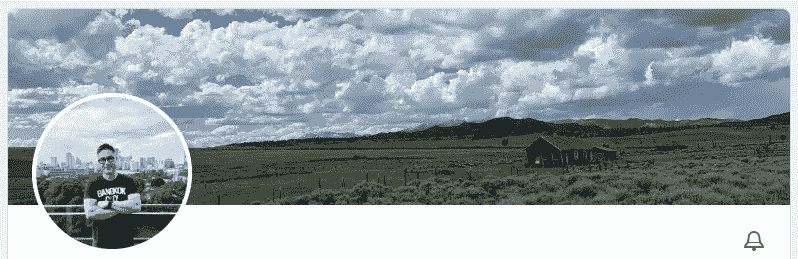
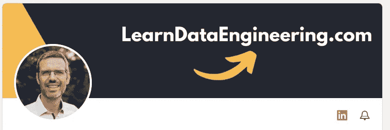
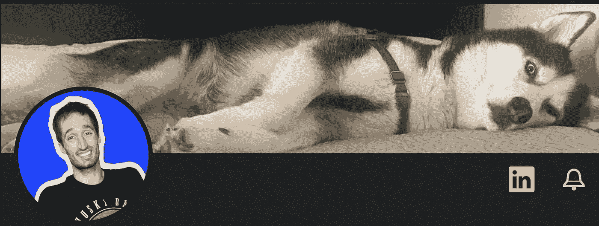
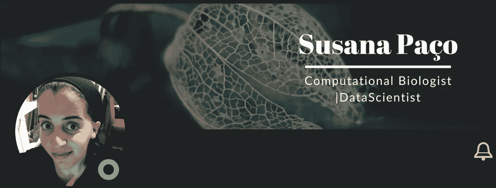
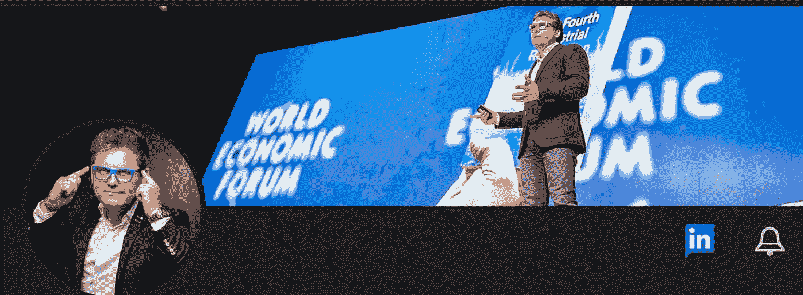

# 我在 Linkedin 上的数据科学和数据工程影响者

> 原文：<https://levelup.gitconnected.com/my-data-science-and-data-engineering-influencers-on-linkedin-ddc54c7fe732>

如果你想上场，你也应该跟着他们

[Linkedin](https://www.linkedin.com/) 的图标

每天，处理数据的人数都在增加。每个人都做数据可视化，使用机器学习模型预测 XYZ，或者是数据工程专家。

> 在一个充满“数据大师”的世界里，我们需要有一个批判的观点来过滤真正的数据专家。

在本文中，我将向您介绍一些专业人士，他们影响了我对数据的思考方式，并且/或者给了我一些关于数据科学和数据工程的绝妙建议。

在这个列表中，我将解释他们是谁，并阐明我为什么在 LinkedIn 上关注他们:

# 1.本杰明·罗戈扬(又名西雅图数据人)

[西雅图数据人员](https://www.linkedin.com/in/benjaminrogojan/)可能是我第一个影响数据的人，也是最有名的一个。

他有数百个视频解释了关于数据科学、数据工程、工具、IT 公司等多种东西。

想想关于数据的一件事，他已经做了一个视频。点击查看他的所有视频[。](https://www.youtube.com/c/SeattleDataGuy/videos)

# 2.阿列克谢·格里戈里耶夫

我的 OLX 同事 Alexey 是 DataTalksClub 的创始人，这是一个讨论数据的社区🙂这个社区目前有超过 23，000 名用户(在这里加入社区)。

我关注 Alexey，因为他向我展示了数据科学和数据工程所有领域的精彩视频、文章和课程(免费的[数据工程 Zoomcamp](https://github.com/DataTalksClub/data-engineering-zoomcamp) 将于 2023 年 1 月重启？).

# 3.吴恩达

我认为如果你已经在数据科学领域，Andrew 不需要太多的演示。

他是目前世界上最伟大的机器学习专家。

关注他的重要性显而易见，因为他总是分享关于机器学习最新进展的帖子。

# 4.乔·里斯

[Joe](https://www.linkedin.com/in/josephreis/) 是一名数据工程师、数据架构师，也是 O'Reilly 畅销书“[数据工程基础](https://www.oreilly.com/library/view/fundamentals-of-data/9781098108298/)”的合著者。

他的书是数据工程领域真正的游戏改变者，他在 LinkedIn 上的帖子让我重新思考数据工程。

# 5.安德烈亚斯·克雷茨

[安德里亚斯](https://www.linkedin.com/in/andreas-kretz/)是“[学习数据工程](https://www.linkedin.com/company/learn-data-engineering/)的创始人，第一个完全专注于数据工程的平台。

这个平台提供了一个付费的学院，但也提供了大量的免费视频或文章。

Andreas 在 LinkedIn 上非常活跃，发布了几个帖子、池或链接到该平台的功能。

# 6.扎克·威尔逊

扎克是 Airbnb 的一名数据工程师，已经在脸书和网飞两个 FAANG 工作过。

我追随他，因为他给了我一些关于数据工程的绝妙建议，一些关于 FAANG 工作方式的信息，以及关于“职业生活”与“个人生活”相关的心理健康的伟大建议。

此外，我喜欢他的幽默感。😁

# 7.苏珊娜·帕乔

Susana 是一名葡萄牙数据科学家，从事计算生物学家的工作。过去我还在努力找数据工作的时候就和她联系上了(她帮了我这个忙)。

我关注她是因为她向我展示了大量关于如何在自然领域使用数据科学的迷人知识。

# 8.马克·兰伯特

如果我们想了解更多关于气流的知识，你必须跟随马克。

他是天文学家公司的客户教育主管，该公司是 Apache Airflow 的驱动力。Marc 也是 Udemy 的顶级老师。

我关注他是因为他为我提供了关于这个神奇的数据编排工具的很棒的技巧和新闻。

# 9.维多利亚·佩雷斯·莫拉

[Victoria](https://www.linkedin.com/in/victoriaperezmola/) 是 [DBT 实验室](https://www.linkedin.com/company/dbtlabs/)的解决方案架构师，也是我在数据工程 Zoomcamp 的老师。

她发表了几篇关于 DBT(数据构建工具)的帖子，这是一个如今被“炒作”的数据转换工具，我完全理解为什么，因为我也爱 DBT。😁

# 10.马克·维达尔

Marc 是数字化转型领域的国际演讲者。

我认为他的 Linkedin 资料说明了一切“马克·维达尔被认为是西班牙数字经济中最具影响力的人物之一。数字化转型和工业 4.0 专家是一位享有盛誉的演讲者，最近被《企业家》杂志评为“领英 20 大影响者”，并获得了 2019 年领英最佳声音奖。”

我只是喜欢看他关于人工智能和其他技术的帖子。

谁是您的数据影响者？

你认为我应该从谁开始？

你已经在灵媒上跟踪我了？😁

你喜欢这篇文章吗？关注我更多关于[媒体](https://medium.com/@lgsoliveira)的文章。

## [阅读路易斯·奥利维拉(以及媒体上成千上万的其他作家)的每一个故事](https://medium.com/@lgsoliveira/membership)