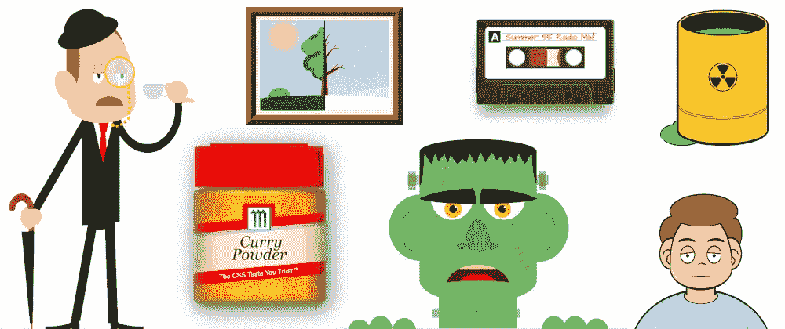
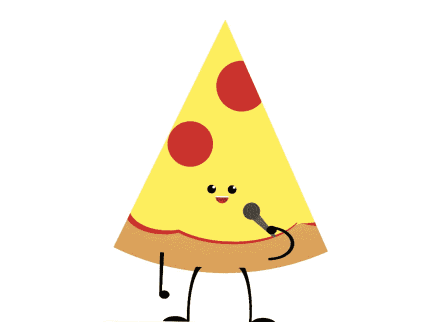

# 我的 Divtober 2021 图纸

> 原文：<https://levelup.gitconnected.com/my-divtober-2021-drawings-53f7c9b0affe>

## 这个 CSS 绘图集是 Divtober 挑战赛的一部分。

[林恩·费希尔](https://twitter.com/lynnandtonic)是一位了不起的 CSS 艺术家，她尤其擅长[只用一个 HTML 元素创作 CSS 图纸](https://a.singlediv.com/)在她做的许多其他项目中( [Nestflix](https://nestflix.fun/) 非常有趣！)

10 月，她组织了#divtober，这是一个为期一个月的挑战，她根据不同的主题绘制(并鼓励其他人也参与)CSS 艺术。**条件:只使用一个 HTML 元素**。今年的榜单发布在 Twitter 上:

过去，我做过 CSS 艺术，但是使用了多种元素，所以我决定加入这个挑战，用一个 HTML 元素来改变一下。这是我画的画:

# 第一天:范

这个 3D 外观的风扇是互动的:拉动绳子就能让它工作。

# 第二天:观察

# 第三天:快速

# 第四天:循环

一个关于`for`循环如何工作的动画解释(我知道，这不是一幅图*本身*，但是很有趣)

# 第五天:累

# 第六天:饥饿

# 第七天:有毒

我把这个过程录了下来，分享到 Youtube 上。后来，我对其他的画也做了同样的事情。

# 第八天:成长

# 第九天:同音异义

同音异义词是书写相同但意思不同的词。所以我画了一只沉在浴室水槽里的纸船。

# 第 10 天:有条理

20 世纪 20 年代有组织犯罪的成员。我喜欢这幅图，但它是一个使用 SVG 会更好、更容易 1000 倍的例子。

# 第 11 天:切片

我从这一天删除了演示，因为它有自动播放音频，它可能有点烦人。[这个链接](https://codepen.io/alvaromontoro/pen/qBXEdNp)可以看到直播。

# 第 12 天:吱吱叫

# 第 13 天:伪装

# 第 14 天:幻想

…以及如何做到这一点的视频:

# 第 15 天:漂浮

这幅漫画是基于我之前的一幅漫画(使用了多种元素)。这是如何做到的视频:

# 第 16 天:雪

我做了关于雪的条目。一个是可恶的雪人…

…另一个是使用单一元素的降雪动画(注意，你的电脑迷可能会开始过度使用它)。

# 第 17 天:堆叠

这一天和接下来的一天，我没有太多的想法，去了简单的绘画。

# 第 18 天:闪耀

# 第 19 天:怀旧

有什么比直接从收音机里录制音乐的卡带更怀旧的呢？

…以及如何做到这一点的视频:

# 第 20 天:旅程

这是一个奇怪的。我试图做一个绿野仙踪致敬，但最终的东西太抽象和简单。

# 第 21 天:魔法

CSS 和单个 HTML 元素的魔术。伟大的巫师艾尔会猜出你的牌并把它从牌堆中取出来吗？

# 第 22 天:小动物

而这只兔子(？)被抽到:

# 第 23 天:大声

这次我试着画一幅写实的画。一些“简单”的东西:一个音量调到 11 的旋钮。

# 第 24 天:发臭

愚蠢/幼稚的我决定用`<audio>`编写一个结合了#23(大声)和#24(难闻)的演示:

# 第 25 天:蘸酱

# 第 26 天:香料

另一个现实的尝试:一瓶香料。这可能需要一秒钟来加载:

…以及如何做到的:

# 第 27 天:电影

# 第 28 天:Dots

这有一个第二版本，只在 Chrome 上运行，我个人更喜欢它。

# 第 29 天:水果

另一天，我画了两幅画。首先，我尝试做一个静止的自然:

…但我不喜欢它的样子，所以我画了一个可爱的西瓜，并在 Youtube 上分享了这个过程。

# 第 30 天:对比

另一个有两幅画:

第二个是交互式的(向右和向左滑动滚动条，查看同一景观上夏季和冬季的对比):

# 第 31 天:怪异

万圣节，这个词是“幽灵”，我尝试了不同的东西，因为我不相信他们:

单词幽灵用头骨和鬼魂代替了 O:

一个幽灵(以及它是如何做到的):

最后是一个带有 CSS 和一个 HTML 元素的弗兰肯斯坦怪物:

…还有视频:

# 结论

完成挑战和尝试不同的 CSS 和背景渐变很有趣。我学到了一些新东西，发现了浏览器之间的一些差异，并喜欢看别人做的事情([查看 Twitter 上的#divtober 标签](https://twitter.com/search?q=%23divtober&src=typed_query&f=live))。

但是是时候休息一下了。这些挑战比它们看起来更费时费力。我将在未来制作更多的 CSS 艺术作品，但是现在，它将拥有不止一个 HTML 元素。

*原载于 2021 年 11 月 1 日*[*https://alvaromontoro.com*](https://alvaromontoro.com/blog/67991/my-divtober-2021-drawings)*。*