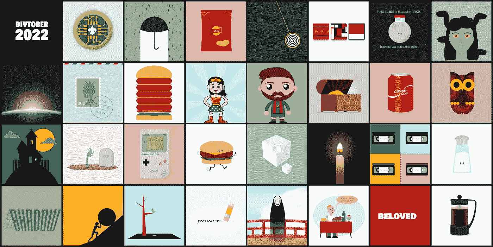

# 我的 Divtober 2022 图纸

> 原文：<https://levelup.gitconnected.com/my-divtober-2022-drawings-cc999c9c88e1>

## divtober'22 编码挑战赛的单元素 CSS 艺术部分的集合

十月过去了。与此同时，迪夫托博也结束了。Divtober 是由 Lynn Fisher 组织的一项编码挑战，于 10 月举行。它包括使用一个 HTML 元素用 CSS 绘制一些东西([与每日一词](https://a.singlediv.com/divtober2022/)相关)。这篇文章是我为 2022 版做的图纸的集合。

**这些图大部分都在**[**cssdrawings.com**](https://cssdrawings.com/)上，但是有些不太实用，没有加进去，所以我没有在网站上收录，但是在这篇文章里加了。我希望你喜欢它们。**如果你完成了一些挑战，请在评论中分享链接。我想看看他们**:)

# 那些画

## 1.标记

这张图是童子军荣誉徽章(如果你知道是哪一张的话会加分)。

## 2.干燥的

一把避雨的雨伞。一种“极简主义”的尝试

## 3.快餐

一袋薯片。

## 4.安静

想着一些安静的事，就想在太空里做点事(什么能更安静？)，所以我画了这幅外太空的日出。不过，可能有点跑题了。

## 5.邮票

盖有邮戳的邮票。

## 6.多肉的

这个汉堡会根据窗口大小变得多肉或少肉(打开演示，调整窗口大小):

## 7.想知道

神奇女侠卡哇伊主题绘画。我不太喜欢图片中的对称。

## 8.闹鬼的

鬼屋(显而易见的选择。)

## 9.升高

死人复活来了！

## 10.比赛

我为这个单词创建了两个演示(我在 Twitch 上流式播放了这个过程，但是质量不是很好)。一个是游戏少年的图纸(下图)，一个是[单元素迷宫游戏](https://codepen.io/alvaromontoro/pen/bGMQapB)。

## 11.汉堡包

我已经做了一个汉堡。我完成了一个新的，但这一次它正在运行，因为它是“快餐”

## 12.阴影

这幅画中的“影子”投射出一个影子。此演示没有任何字母；全部都是背景线——流程的延时[。](https://www.youtube.com/watch?v=34zyL-rNbZs)

## 13.永远

基于西西弗斯的神话，作为惩罚，他不得不永远带着一块巨石上山。

## 14.溅泼的量

这一个是非常生动的:一只鸟在地板上拉屎，溅起水花(一件愚蠢的事情)。我在 Twitch 上直播了。这里有一个[视频显示如何创建一个飞溅效果](https://www.youtube.com/watch?v=o9Z41vGvfOA)和一个[媒体文章](/creating-a-splash-effect-with-html-and-css-with-video-49d8921de97b)。

## 15.抹去

一支铅笔擦掉了单词“无力”中的“较少”部分。

## 16.安眠药

动画钟摆。是摇摆还是摇摆旋转？别被催眠了！

## 17.条纹

这个图可能有点牵强，但是就像他们说的，IFKYK。这是白线条乐团的前三张专辑封面(去掉人物之后。)

## 18.双关语

我对这幅漫画进行了现场编码。这很有趣，流媒体比上一次更好(但我不得不降低质量，以至于不值得在网上分享。)

## 19.虚构的

这幅美杜莎图也只有一个 HTML 元素。有一个编码过程的[视频。](https://www.youtube.com/watch?v=aDTl_hPm1Sc)

## 20.十

足球明星莱昂内尔·梅西在巴黎圣日耳曼穿着 30 号球衣，但在很长一段时间里，他在巴塞罗那俱乐部和阿根廷国家队都穿着 10 号球衣。这幅图是梅西的“摇头娃娃”漫画。

## 21.有价值的

百宝箱。

## 22.柔软的

我不太喜欢这种“软饮料”。比例不对，看起来也没那么好。但并不是所有的日子都会好(虽然这是连续两个疲软的日子。)

## 23.流行音乐

我有其他可以搭配“波普”的单一元素绘画(比如前一天的波普汽水)，但我喜欢这只波普艺术风格的猫头鹰。

## 24.立方

这种效果让我头晕。我的大脑在一个缺少一个外角的立方体和一个内角的立方体之间变化。不是我最好的演示😓

## 25.清楚的

我在 Twitch 上直播了这幅画。但我仍然有许多技术困难，所以我没有上传视频。

## 26.过时的

这部 VHS 卡通片本来可以在“流行”日播放。

## 27.小麦

对这幅画有所保留😅

## 28.巨大的

无脸是电影《千与千寻》中的幽灵/怪物。

## 29.自由的

一个傻傻的笑话变成了单元素 CSS 艺术，我应该加个蛋糕的。

## 30.心爱的

10 月 30 日是一个星期天。我没有太多时间画画，因为我一整天都和家人在户外活动。我不会为了一张 CSS 图而改变它。

## 31.啤酒

我在考虑重新利用汽水罐来做一个啤酒罐，但是相反，我选择了我真正的能量来源:咖啡！这种法国印刷机是一种快速绘图，只使用了一种元素，没有伪造品。我可能会花一些时间，使它更现实一点。

# 一些额外的

31 张图纸不够。十月份我又完成了几个单元素 CSS 图纸。有些与 divtober 挑战有关，有些是我休息一下，做一些不同的事情。

## 夜景

我画了这幅图的一个元素和一个零元素版本。在方形/纵向模式下看起来更好([点击此链接](https://codepen.io/alvaromontoro/pen/PoejgMd))

## 游戏角色

这是#24 的替代品:立方体。我还做了一个[三维魔方](https://codepen.io/alvaromontoro/pen/ZERzZEx)，但它是之前演示的翻拍。

## 比尔·赛弗

电视节目《重力瀑布》中的恶魔是 28 号怪物的替代品。我甚至[录下了这个过程，并在 Youtube](https://www.youtube.com/watch?v=upDI2Q7yIqE) 上分享。

# 结论

我在这一版中最喜欢的画是无脸(即使它对当天的话来说有点夸张，而且栏杆与画的其余部分不相配)。

我喜欢玩模糊对比效果。我以前很少使用它，但过去曾见过像 Temani Afif 或 Ana Tudor 这样的人掌握它。最后我用的有点多了(怎么办？效果不错！)

现在 divtober 已经结束了，它最重要的好处之一也开始了(至少对我来说):如果我能够每天抽出 30-60 分钟来画 CSS，我就可以继续抽出 30-60 分钟来做其他事情，比如阅读、学习或完成那个我总是以“没有时间”为借口的讨厌的课程。

当然，我不需要 divtober:时间和机会总是存在的。但是他们经常被埋在日常活动和优先事项中；随着时间的推移，我倾向于忘记它们。很高兴有这个提醒 CSS 艺术也有帮助。

如果你完成了 divtober 挑战赛(全部或部分)，我想听听你的意见，看看你的作品。请在评论中分享它们，或在 Twitter 上联系。总是很好，很有见地。

如果你正在寻找更多的 divtober 演示，[关注 Twitter 上的#divtober 标签](https://twitter.com/search?q=%23divtober)并关注这些了不起的人:

*   林恩·费希尔
*   [Temani Afif](https://twitter.com/ChallengesCss)
*   格雷格·罗伯托
*   马克西姆·马尔菲特
*   [雅格布·伊万诺娃](https://twitter.com/dzajew)