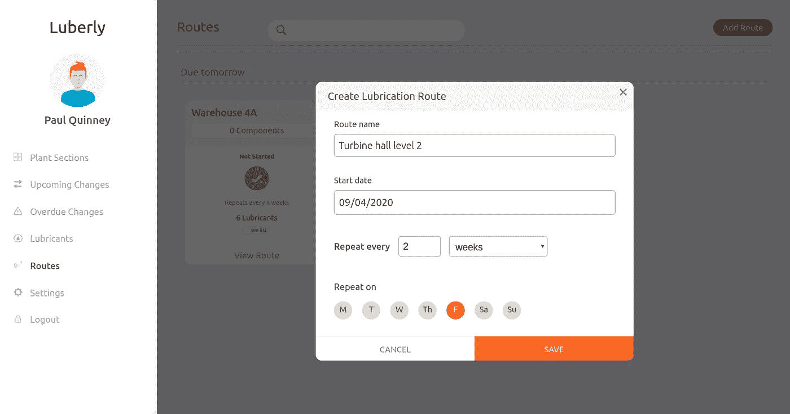
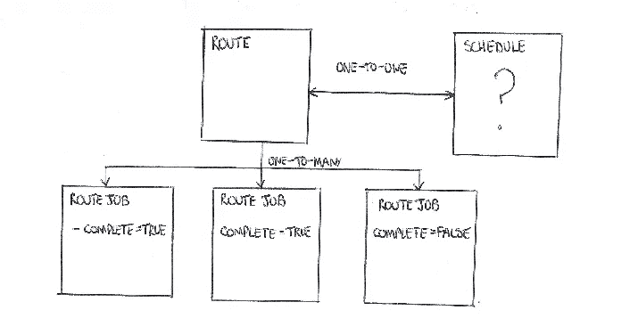
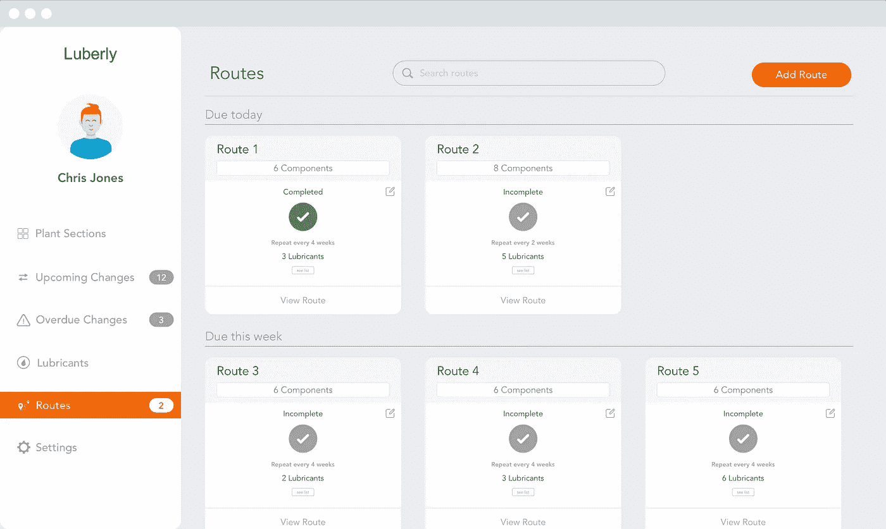
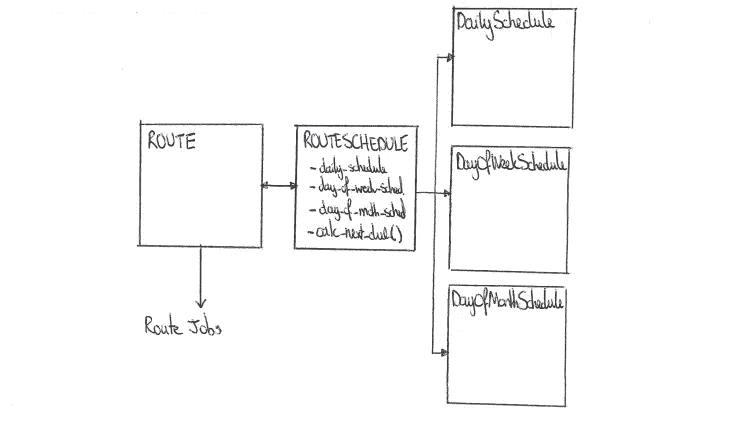

# 我的 Django 噩梦实现了一个应用内的日程安排功能

> 原文：<https://levelup.gitconnected.com/my-django-nightmare-implementing-an-in-app-scheduling-feature-a7d9d53cb153>

*注意:本文不是关于安排数据库备份等基础设施编程任务。相反，它侧重于应用内的功能，用户可以根据时间表设置要创建/到期的任意任务。*



图 1 —面向用户的调度功能实现

# 情况

我目前正在做的一个项目是大型工业场所的维护计划系统[(它叫做 Luberly，更多信息可以在这里找到)](https://www.luberly.com/)。最近，我们解决了一个看似复杂的任务，即允许用户设置定期完成的工作路线。这种工作路线的一个例子是:

> 每四周更换一次“建筑 A”中每台机器的油。

这篇文章在很大程度上应该是与技术无关的。然而，为了提供一些上下文，Luberly 是使用与 Python (Django)后端接口的 React 前端构建的。

*注意:在本文的其余部分，工作路线将被称为“路线”。*

# 我们的起点

在开始研究这个特性之前，我们已经有了下面定义的与路线相关的模型类。对于不熟悉 Python ORMs 的人来说，可以把模型想象成表示数据库表的 Python 类，它的实例表示数据库的记录。



图 2 —显示模型/表格如何相互连接的简单示意图

`Route`、`Schedule`和`RouteJob`被设计为协同工作，以存储和管理实现预定路线特征所需的数据。这些类中的每一个都有它自己的一套职责(解释如下),它们很乐意根据所述工作的性质将工作分配给每个类。

**`**RouteJob**`**型号****

*   **`RouteJob`的一个实例代表一条根据其创建者`Route`的一个实例`schedule`属性创建的路线。一个`RouteJob`有一个截止日期和它自己的完成状态。**
*   **当用户在应用程序中查看/完成即将到来的路线时(见下文)，他们正在与`RouteJobs`的实例进行交互。**

****

**图 3-即将到来的工作路线的应用内视图**

****`**Route**`**型号******

*   ****一个`Route`的实例存储任何关于一条路由的从不改变的数据，比如它的`name`和链接到一个`Schedule`实例的主键。****
*   ****负责通过`Route().create_route_job()`方法创建`RouteJobs`。****

******`**Schedule**`**型号********

*   ****负责存储时间表定义数据，并通过`Schedule().calculate_next_due_date(self)`方法通知`Route`下一个`RouteJob`时间表。****

****我们功能的成功实现必须能够处理以下调度类型:****

1.  *****每 x 天完成的路线*****
2.  *****路线将于每 x 周的周一、周三和 Fri 完成*****
3.  *****每 y 个月在 1 日、15 日和 30 日完成的路线*****

****`Schedule`模型类(及其子类)是本文的主题，我们正在探索:****

*   ****我们需要存储什么数据才能实现上面列出的三种时间表类型？****
*   ****我们应该如何存储这样的数据？****
*   ****我们如何实现逻辑来检索该数据并使用它来为后续的`RouteJobs`确定`due_dates`？****

****在追求编程卓越的过程中，`Schedule`模型不应该关心它正在调度什么，因此应该足够灵活，可以在应用程序的其他地方使用。****

****我们将概述我们考虑过的几种方法，然后最终向您展示我们选定的实现。****

# ****你将如何实现这样一个特性？****

****尽管我们多次重写了这个实现，但我仍然认为它远非完美。我们竭诚欢迎任何改进或替代方法的建议，请留下您的评论:)。****

# ****我们的第一个想法——cron 调度表达式****

****过去我曾与 cron jobs 合作安排数据库备份、自动化电子邮件和数据处理工作等任务，这是我在设计这个功能时使用的第一个工具。****

****当时，这种解决方案似乎是最佳的，因为它只需要一个单独的计划定义数据库字段`cron_string`。一个例子是`0 0 1,15 * *`表示在每个月的 1 号和 15 号运行任务的计划。****

****实现这一功能需要:****

1.  ****编写一个 JavaScript 实用程序，将用户输入的表单数据转换成 cron schedule 表达式。****
2.  ****编写或找到一个 Python 实用程序来解析调度的`cron_string`属性，并提取调度下一个任务所需的信息。****

****然而，很明显，cron 不能提供我们的时间表所需要的灵活性，而且编写解析器(尤其是前端代码)太耗费人力，所以我们寻找替代的解决方案。****

# ****我们的第二个想法——类继承****

****在决定不采用基于 cron 的方法后，基于一些良好的旧 StackOverflow 研究，下一个想法是将每种调度类型的存储和逻辑都分离到各自的模型类中。在我们的例子中，这样的类将是`DailySchedule`、`DayOfWeekSchedule`和`DayOfMonthSchedule`。****

****如下所示，每条路线都与一个`RouteSchedule`有一对一的关系，该【】有三个可选字段，可以与其中一个可用的时间表类型建立一对一的关系。`RouteSchedule`将负责确定正在使用哪种调度类型，然后与该调度类型交互以提取与调度相关的数据。****

********

****图 4 -显示模型与类继承方法关系的简单示意图****

****每个`DailySchedule`、`DayOfWeekSchedule`和`DayOfMonthSchedule`都有自己的内部工作机制来决定重要的信息，比如下一个事件应该安排在什么时候。尽管它们有所不同，但它们只公开了几个定义在抽象`Schedule`类(也称为接口)中的公共方法，它们都继承了这些方法。****

****这样`RouteSchedule`可以对它们一视同仁，当`Route`向`RouteSchedule`请求此类信息时，只需调用`calculate_next_due_date()`即可。****

****这个解决方案实际上工作得很好，在我看来，是抽象类继承的一个很好的用例。****

****然而，它需要大量的新代码和许多新的数据库表。就在我准备提交这部作品的 PR 时，我看到了`dateutils.rrule` [python 模块](https://dateutil.readthedocs.io/en/stable/rrule.html)，它改变了游戏规则…****

# ****我们的最终解决方案——规则****

****Python 的`dateutils.rrule`模块(类似的包也存在于`npm`中)是一个非常酷的实用程序，它完成了我在上面概述的类继承示例中手工实现的大部分繁重工作。****

****[文档](https://dateutil.readthedocs.io/en/stable/rrule.html)详细介绍了每一件事，但它就像通过传入一些与时间表相关的参数(如`frequency`、`interval`、`byweekday`)来实例化一个`rrule`对象一样简单。然后这个`rrule`对象可以根据这个时间表创建所有未来事件的流。太牛逼了！****

****因此，为了让我们实现规范中的调度类型(为了方便起见，在下面重复)，我们只需在数据库中保存适当的`rrule`参数。****

1.  *****每 x 天完成的路线*****
2.  *****每 x 周在 Fri 周一、周三完成的路线*****
3.  *****每 y 个月在 1 日、15 日和 30 日完成的路线*****

****我们的数据库结构不需要修改`Figure 2`的结构，只需要向`Schedule`模型添加一些属性和方法。****

****最终的`Schedule`模型类看起来如下所示(但是有更多的方法被下面包含的方法调用):****

```
**from typing import List, Dict
from django.db import models
from dateutil.rrule import rrule, DAILY, WEEKLY, MONTHLYclass Schedule(models.Model): YEARS_AHEAD_TO_LOOK_FOR_NEXT_DUE_DATE = 5
   FREQUENCY_CHOICES = (
      (DAILY, "daily"), 
      (WEEKLY, "weekly"), 
      (MONTHLY, "monthly")
   )

   rrule_frequency = models.IntegerField(choices=FREQUENCY_CHOICES)
   rrule_dstart = models.DateField(
   rrule_interval = models.IntegerField()
   rrule_byweekday_csv = models.CharField(max_length=124)
   rrule_bymonthday_csv = models.CharField(max_length=124)@classmethod
def create(cls, schedule_dict: Dict):
   <some logic here>def calculate_first_due_date(self):
   <some logic here using rrule object>def calculate_next_due_date(self):
   <some logic here using rrule object>def _get_rrule_object(self, count=None, until=None):
   <some logic here>def _convert_csv_field_to_list(self, csv_field: str) -> List:
   <some logic here>def _get_rrule_object(self, count=None, until=None):
   <some logic here>**
```

****最终，我们认为最终的解决方案是三个方案中最好的，因为它提供了实现强大、灵活和可扩展(如果需要，我们可以在以后向`Schedule`模型添加更多与 rrule 相关的字段)的调度功能的能力，同时只需要添加一个数据库表和相关的 python 类来维护。****

****我希望这篇文章至少是有趣的，并希望对其他即将开始构建应用内日程安排功能的人有所帮助。****

****另外，如果你想联系任何 Python/Django/React 项目，请随时通过我的网站联系我。****

****干杯！****

****斯科特****