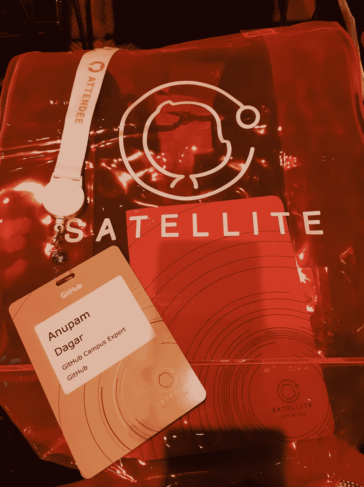

# 我参加柏林 GitHub Satellite 2019 的经历

> 原文：<https://levelup.gitconnected.com/my-experience-attending-github-satellite-2019-in-berlin-b85c35643603>

Nat Friedman、Katie Bouman 博士和 keynote 期间第一张黑色全图背后的完整团队

最近，我有机会参加 GitHub Satellite，这个会议为世界各地的城市带来了伟大的想法和令人难忘的内容。从最新的 GitHub 产品新闻到实践研讨会，GitHub Satellite 汇集了成千上万的开发人员来探索下一步的发展。

我在柏林勃兰登堡门

参加会议是一次非凡的经历。我作为 GitHub 校园专家参加了 GitHub Satellite，与来自世界各地的其他 10 人一起参加了印度的 GitHub。我在活动开始前很早就到达了柏林，有足够的时间去探索这座城市。所以第一天，我参加了柏林之旅，了解了与那里所有历史建筑相关的故事。

我和李克文

由于所有的校园专家都在他们的校园里建立社区，我们所有人都很难相互见面，而像这样的活动是一个交谈和相互了解的好机会。在卫星会议的前一天，我们举行了一次校园专家会议，在会上每个人都互相交谈，吃着美味的食物，发表他们预定的闪电演讲。

此外，我还遇到了超级酷的 Lieke，他是校园专家的开发者项目经理。

更不用说，Carlosgilmar 的素描笔记让所有人惊叹不已。

Carlosgilmar 为 GitHub 校园专家会议撰写的草图笔记

meetup 中的讨论包括从建立社区到组织活动，从软件中的黑暗模式到 javascript 做的奇怪事情。

第二天早上，表演时间到了。会议在柏林的发电厂乐团举行，离我住的地方有将近半小时的路程。

我在主题演讲前半个小时到达，亲自登记，登记台的 GitHub 工作人员递给我一个透明的霓虹灯手提袋，里面有限量版的贴纸包和记事本。令人惊讶的是，我在拿卫星门票时填写的所有细节都在我的与会者卡内，而在与赞助商互动时，我所要做的就是在他们的设备上点击我的卡，将我的细节提供给他们。

纳特·弗里德曼在台上做主题演讲

每个人都很准时，没有人想错过 Nat 的主题演讲。有一个标志着 GitHub 卫星关闭的令人惊讶的演讲，没有人知道它是什么，直到 Nat 在他的主题演讲中揭示了它。时钟终于敲响了 9:30，是时候开始主题演讲了。

Nat 走上舞台，欢迎大家来到卫星，并继续做主题发言。
主题演讲中包含了大量安全、企业和社区领域的功能发布。Nat 告诉 GitHub 称他们的 3600 万开发者用户为“GitHub 之家”。在讲述了开源社区和任何项目目前都有开源依赖之后，第一个重大突破或者我应该说是最期待的惊喜出现了，Katie Bouman 博士从波士顿通过卫星加入了 GitHub Satellite。几分钟后，另一个惊喜来了，黑洞图像背后的核心团队，安德鲁、石田和彦、莎拉、C.K、罗曼和呼唤加入了台上的主题演讲。一个又一个惊喜接踵而至，在黑洞图像完整依赖图的 21000 名贡献者中，有 Numpy、Matplotlib、Scipy、Astropy、Pandas、Python、Cython、Kiwisolver 等的维护者和核心贡献者。都在 GitHub 卫星上。在所有的惊喜展示之后，接下来轮到特写展示了。首先，Nat 揭示了社区贡献者和依赖的存储库特性，它让我们知道有多少直接和间接的贡献者参与了这个项目，以及有多少人使用了这个项目。

❤依赖机器人

安全特性是由 Shanku Niyogi 揭开的。与 whitesource 和 dependabot 的合作是 GitHub 的一部分。通过 dependabot 和 security advisory 实现的自动安全漏洞修复是安全功能的主要亮点。Dana Lawson 谈到了 GitHub Enterprise 中的新功能。

Devon Zuegel 宣布 GitHub 赞助商

最后，在接近尾声的时候，Devon Zuegel 想出了一个最可爱的特色，GitHub 赞助商。总结主题演讲和最终要展示的最好的东西，Nat 宣布 GitHub 匹配基金，即 200%的赞助资金转移。

主题演讲结束后，有一段休息时间，大多数人开始交流。和 Satellite，Circle CI，Travis，Whitesource，和 Snyk 的赞助商聊得很开心。

来自微软 Azure Devops 的团队正在会场上运行一个实验室，同时也在为 Azure 管道进行演示。

整整一天，我遇到了许多人，并与他们交谈。与他们所有人交谈，了解他们必须分享的所有新东西，这很棒。我见过 Slash Hackathon 的组织者，Slash 是柏林 CODE 应用科学大学的一个技术社区。与其他学生社团领袖会面，了解他们如何处理事情，以及他们对自己的社团有什么目标，这总是令人着迷的。

接下来，我有机会会见了许多来自专业服务团队、产品设计团队和其他团队的 hubbers。我遇到了令人难以置信的 Hector Alfaro，他告诉我，在校园专家计划的初始阶段，他一直与该计划密切合作。

最后，我见到了了不起的 Nat Friedman，并和他就主题演讲进行了一次简短的交谈。

我和纳特·弗里德曼

会场里摆满了很多很酷的东西等着结账。有一个 octocat 生成器，但没错，它不是任何其他的 octocat 生成器，这里生成的 octocat 被转换成贴纸给你。互联社区室很吸引人，它展示了 GitHub 追随者的形象，最棒的是它展示了互联社区的方式。视觉化是以空间的形式，每个用户都是一颗星星，但是被检查的用户是最亮的，在中心。现在跟随我的每个追随者都有自己的追随者。在这些星星的背后，可以看到远处的小点，代表被检出的用户和没有跟随它的用户之间的互联。

我的 GitHub 追随者形象化

在会议中，我参加了开源的好会议和闭幕会议“进入黑洞”所采取的黑洞小组。演讲中的许多东西很难理解，但它仍然为我提供了许多关于黑洞图像背后完整过程的新信息。知道为什么黑洞的图像看起来是现在这个样子真是太棒了。GitHub 卫星在黑洞团队的会议结束后以起立鼓掌结束。

接着是会后聚会，然后是为第二天召开的维护者大会做准备。在晚会之后，我看到了一些从未见过的东西，其中一个人正在用 Haskell 做 DJ，为音乐设置所有的 bpm。我不知道它是如何工作的，但第一眼看到它是令人难以置信的。之后，所有的校园专家点击了一张图片，最后是时候告别 GitHub 卫星了。

第二天是 GitHub 开发者关系团队组织的 Maintainerati 非会议时间。目的是为所有开发者创造一个开放的空间，尽可能多地交流，讨论开源问题以及如何克服它们。我谈到了如何让将近 100 个人开始他们的第一个拉请求，然后讨论了是什么让贡献者不成为维护者。我在这里遇到了唐·威尔逊，他也是我谈论话题的空间主持人。Don 在整个交流的开放空间会议中不断做笔记，笔记基本上更多的是指出每个人在开源中面临的共同问题。

维护者不一致

在维护者的努力下，为期 3 天的大会终于告一段落。那三天是我至今为止最难忘的日子，很难忘记。从每个人那里获得如此多的知识和想法，并了解每个人在开源中面临的问题，这真是太棒了。通过与其他专家交谈，我对不同的社区有不同的问题以及他们如何克服这些问题并根据他们的社区做不同的事情有了很好的了解。

**关于我:**
大家好，我是 Anupam Dagar，印度阿拉哈巴德信息技术学院信息技术本科学生。我是一名开源贡献者和全栈开发者。想了解我更多，请在 [Twitter](https://twitter.com/siriusdagar) 或 [GitHub](https://github.com/Anupam-dagar) 上联系我😄

GitHub 卫星的所有校园专家