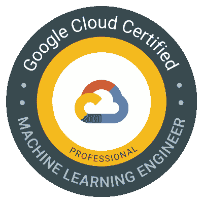
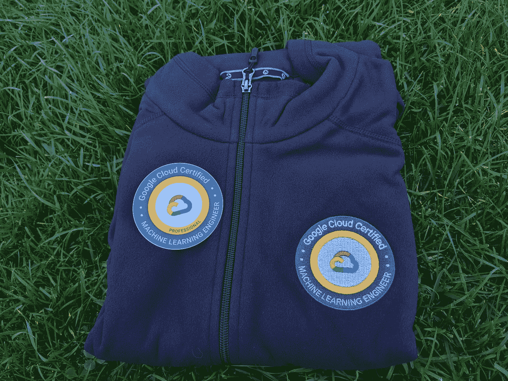

# 我通过谷歌云专业机器学习工程师证书考试的经历

> 原文：<https://levelup.gitconnected.com/my-experience-with-passing-the-google-cloud-professional-machine-learning-engineer-certificate-exam-2ccc700e7d08>

证书图标

> **序言**

我最近通过了[谷歌云专业机器学习工程师证书](https://cloud.google.com/certification/machine-learning-engineer)考试。我想我会为此写一篇博文。网上已经有一些关于这个话题的博文了。但是都是一两岁的。此外，我认为总的来说，关于参加考试的真实感受的内容太少了。这篇博文旨在分享最新最真实的备考和参加 Google Cloud 专业机器学习工程师证书考试的经验。

> **物流**

如果你像我一样，强调考试，考试后勤是你想要很好地掌握的东西。了解后勤细节有助于减少考试的不确定性，让你安心。

首先，你需要注册参加考试。你可以谷歌 GCP 专业 ML 工程师证书，并按照官方网站的链接。您可以在评估中心亲自参加考试，也可以通过适当的监考软件设置远程参加考试。我亲自做的。我建议你也这样做，因为设置远程考试环境相当麻烦，而且你还得担心网络/机器故障。评估中心有技术人员在现场，他们知道如何处理故障。

您所在的地区通常有多个评估中心。选择一个谷歌地图评论高的。要考虑的事情:日期/时间可用性，停车，他们是否有储物柜供你存放个人物品，洗手间，Covid 协议等。一些评估中心是学院/大学机构。那些往往运行良好。

我在我家附近的一所大学里选了一个。我比预定的考试时间提前了将近一个小时到达。那个评估中心好像并不在乎时间段。在基本的身份验证之后(你会从你的考试日程确认邮件中获得关于带什么的详细信息)，他们就让我参加考试了。

考试全部在电脑上完成。有 60 个问题。都是单选。你有 120 分钟。他们用的软件有倒计时器，很方便。每个问题都有自己的一页。您可以单击“下一页”或“上一页”浏览问题。您可以自由地来回提问，因为您对每个问题的回答都会自动保存。还有一个选项供您稍后标记问题。当您在最后一个问题上单击“下一步”时，系统会将您带到一个概述页面，显示您对所有 60 个问题的回答。那些被标记为以后的会有一个特殊的符号在上面。您可以点击并转到任何问题，查看和/或更改您的答案。每个问题上还有一个“查看全部”按钮，直接将您带到概述页面。

完成后，点击“提交”。你会瞬间看到你通过与否的最终结果。你现在可以给工作人员打电话了。他们会签字让你退出考试，你就可以走了。官方认证链接将在大约一周后通过电子邮件发送。该电子邮件还包含如何兑换特定考试奖品的说明。你可以按照说明要求你的津贴。这是我的一张照片。

赃物照片

> **我的背景**

在谈论考试本身之前，我应该先分享一下我的背景，这样你就可以将我的经历与你自己的情况进行对比。我在学校学的是计算机科学，毕业后成为了一名软件工程师。我认为自己是个多面手。我已经担任领导职务一段时间了，但我仍然可以参与编码和设计讨论并做出贡献。换句话说，我的实际操作技能可能有点生疏，但我仍然(至少我认为如此)拥有技术上的敏锐。

我主要做后台工作。我在学校学的是 ML，偶尔训练一些玩具模型玩玩。我从未为真正的生产使用做过任何 ML。我的团队使用 Google Cloud，所以我熟悉它的基础，但是不太了解它的 ML 功能，因为我的团队的工作不涉及 ML。

> **一些对你考试有帮助的指导原则**

一会儿我会分享我是如何准备考试的。在此之前，我想分享一些对你的考试有帮助的高级原则。你很可能会遇到不知道如何回答的问题。这样的话，我的建议是。想想 Google Cloud 想用这个证书实现什么？

首先，不要让考试变得超级难，这最符合谷歌云的利益。他们希望人们通过。毕竟，该证书的目的是推广谷歌云。所以他们不太可能问非常棘手的问题。如果你发现自己对问题中发现的一些“巧妙的暗示”吹毛求疵或过度索引，停下来。后退一步。你可能走得太远了。

其次，谷歌云希望客户在他们的平台上获得成功。事实上，很多问题都是以“你是 X 公司的 ML 工程师，想做 Y”开头的。所以，真的要设身处地为一个谷歌云 ML 用户着想。用你的技术直觉来指导你的选择。所有良好的工程实践都适用于此:抓住业务问题，从简单的事情开始，快速迭代，构建健壮的管道，良好的质量控制，良好的生产卫生，优化支出，等等。

第三，谷歌云拥有机器学习的服务和工具组合。总体理念是尽可能使用 GCP 管理的服务和工具。这对你来说更容易，因为你不需要处理大量的锅炉板。这对谷歌云也有好处，因为谷歌云能为你做的越多，对他们的业务就越有利。比如，当你只想对常见的句子做典型的情感分析时，就使用云自然语言 API。当您有一个带有自定义标签的小数据集，并且希望从 Google Cloud 的图像模型进行升级时，请使用 AutoML 图像分类。当您的数据已经在 BigQuery 中时，使用 BigQuery ML 创建简单的逻辑回归。使用 AI 平台 Hypertune 运行超参数实验，而不是自己启动和管理多个训练作业。最后，当您真正有专有依赖或特殊需求时，如从本地提升和转移，要知道 Google Cloud Kubernetes Engineer 和 Google Cloud VM 是通用计算平台，允许您做几乎任何事情。

最后，考试还测试一般的机器学习知识，如精度/召回、训练/测试分割、分类与回归、如何处理缺失数据、如何处理不平衡数据集、一些非常基础的 Tensorflow API 等。如果你觉得这是你的弱点，不要担心。记住，考试是给机器学习从业者的，不是给 ML 研究者的。只要你能接触到这些区域，你就会没事的。事实上，有些问题甚至可以用统计学上的常识来回答。

> **准备考试**

我花了大约 3 个月的时间，平均每周 5 小时。

我建议先复习一下[官方考试指南](https://cloud.google.com/certification/guides/machine-learning-engineer)，然后直奔试用[样题](https://cloud.google.com/certification/sample-questions/machine-learning-engineer)。他们帮助你对差距进行初步评估。

很多人推荐备考 GCP 机器学习工程师证书的 coursera 课程系列[。我确实看过了。就我个人而言，我不建议从头到尾关注那个系列。那里的大部分内容对于有基本 ML 知识的人来说都太初级了。更糟糕的是，该课程系列中的许多 GCP 服务和工具不在范围之内。所以你会浪费很多时间。](https://www.coursera.org/professional-certificates/preparing-for-google-cloud-machine-learning-engineer-professional-certificate)

对于 ML 知识部分，我推荐使用 Scikit-Learn 和 Tensorflow 的[动手 ML。它很好地结合了理论和实际应用。这对你的考试需求来说已经足够了，但对于 ML 从业者来说，这仍然是一个很好的复习资源。我强烈推荐的另一个来源是](https://www.amazon.com/Hands-Machine-Learning-Scikit-Learn-TensorFlow-ebook/dp/B06XNKV5TS) [Tensorflow 官方教程](https://www.tensorflow.org/tutorials)。它们非常容易理解。他们将让您熟悉 Tensorflow API 和一些深度神经网络的现代开发。

对于 GCP ML 服务和工具，作为一名工程师，我认为学习堆栈的最佳方式是卷起袖子亲自尝试。我就是这么做的。你可以关注我的[博客系列](https://betterprogramming.pub/a-step-by-step-guide-to-train-a-model-on-google-clouds-vertex-ai-47faafae1330)，它包含了关于训练、调整和操作模型，以及组织 GCP 的各种管道阶段的逐步说明。它还包括像 AutoML 和 BigQuery ML 这样的托管 ML 工具的内容。重要的是你必须亲自动手在 GCP 上编码、调试、部署和自动化 ML。没有捷径！

最后，给 coursera 课程一些学分，我认为 [MLOps](https://www.coursera.org/learn/mlops-fundamentals?specialization=preparing-for-google-cloud-machine-learning-engineer-professional-certificate) 是相关的，你通常不会接触到它，除非你在真实的生产中做 ML。[生产 ML 系统](https://www.coursera.org/learn/gcp-production-ml-systems?specialization=preparing-for-google-cloud-machine-learning-engineer-professional-certificate)也很有趣，尤其是谈论生产 ML 中可能出错的部分。这也是你不做生产 ML 就不会知道的事情。

最后，这里有一些你应该知道的 Google Cloud 上的常用服务和工具的亮点。如果你是谷歌云的用户，你可能已经遇到过很多了。他们都只是一个谷歌搜索，所以我不为他们添加链接。

*   自动化:云构建，云合成器
*   数据处理:批处理/流模式的数据流，Dataproc
*   存储选择:云存储、BigQuery、云 BigTable、云 SQL
*   基于事件的服务:云发布/订阅、云功能
*   推理服务:云视觉 API、云视频 API、云翻译 API、云自然语言 API
*   易于培训的服务:AutoML、BigQuery ML
*   定制培训服务:带有预建/定制容器的人工智能平台培训，人工智能平台 Hypertune
*   部署服务:人工智能平台端点、人工智能平台在线/批量预测
*   通用计算:谷歌 Kubernetes 引擎，谷歌计算引擎
*   重要框架:Tensorflow，TFDV，Kubeflow

> **总结**

我希望这是有用的。祝你考试好运。记住，当你被困在考试中时，回顾一下我在这篇博文中列出的指导原则。他们将帮助对考试问题做出最好的选择。