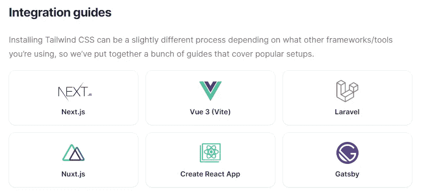
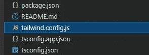

# 我对顺风 CSS 和 Angular 的体验

> 原文：<https://levelup.gitconnected.com/my-experience-with-tailwind-css-and-angular-b5f40eeda838>

## 你应该尝试一个实用至上的 CSS 框架


由[穆拉特·乌斯顿塔斯](https://unsplash.com/@ustuntas?utm_source=medium&utm_medium=referral)在 [Unsplash](https://unsplash.com?utm_source=medium&utm_medium=referral) 上拍摄的照片

最近，我决定尝试使用 [Tailwind CSS](https://tailwindcss.com/) 框架来构建一个简单的东西——我的个人页面。该框架于 2017 年由 [Adam Wathan](https://adamwathan.me/) 发布，并迅速受到欢迎。到底是什么？

> 这是一个实用的 CSS 框架，包含 flex、pt-4、text-center 和 rotate-90 等类，可以直接在你的标记中构建任何设计。

看完这个定义，你可能会想到 [Bootstrap](https://getbootstrap.com/) ，因为它为我们提供了类似的类。例如`mt-0`代表`margin-top: 0`。Bootstrap 当然更加健壮，并且包含其他部分，而不仅仅是实用程序类。

我总是喜欢我自己的类是可重用的，HTML 尽可能保持干净。有时这并不容易，但是将许多类放到 HTML 中会产生臃肿的代码，这不是我的事情，我一直在努力避免。

顺风 CSS 似乎就是这么做的。在您的标记中编写类，这样您就根本不需要创建任何单独的样式表。如果它违背了我刚才提到的个人偏好，我为什么要使用它呢？Adam 写了一篇文章 [CSS 实用程序类和“关注点分离”](https://adamwathan.me/css-utility-classes-and-separation-of-concerns/),其中他推理出了顺风 CSS 的创建和构思。他描述了我们在设计网站时面临的许多障碍，这样我就能理解了。

尽管有许多 CSS 框架。在大约 15 年的时间里，我在没有任何嵌套的情况下编写 CSS，然后使用像 [Sass](https://sass-lang.com/) 这样的预处理程序，尝试各种方法和面向对象的架构，像 [DoCSSa](https://mlarcher.github.io/docssa/) 或[iocss](https://www.iotacss.com/)，在 flex 和 grid 出现之前使用 [Susy](https://susy.readthedocs.io/) 框架。人们可以欣赏测试所有这些技术的进展，并探索新的东西。

让我们把怀旧放在一边，专注于顺风。

# 角度积分

我已经有一段时间没有用 Angular 做东西了，所以我决定用它创建一个简单的页面。截至发稿时，Angular 还没有 Tailwind CSS 安装指南。到目前为止，他们列出了基于 React 和 Vue 的框架:



没关系，安装 Tailwind 到 Angular 就像安装另一个 dev 依赖到`package.json`一样简单。

```
npm install -D tailwindcss@latest postcss@latest autoprefixer@latest
```

我安装了最新版本的 node.js 和 Angular:`node --version`输出`v16.4.1`，Angular 是 v12。

确保您的应用程序的根文件夹中有`tailwind.config.js`文件。



该文件的内容可能如下所示:

```
module.exports = {
  mode: 'jit',
  purge: {
    enabled: true,
    // enabled: process.env.TAILWIND_MODE === 'build',
    content: ['./src/**/*.{html,ts}']
  },
  darkMode: 'media', // or 'media' or 'class'
  theme: {
    container: {
      padding: '2rem',
    },
    fontFamily: {
      'sans': ['Open Sans', 'ui-sans-serif', 'system-ui'],
    }
  },
  variants: {},
  plugins: [],
};
```

更多信息请参考[定制文档](https://tailwindcss.com/docs/configuration)。

在`src/styles.scss`包括以下内容:

```
@import "tailwindcss/base";
@import "tailwindcss/components";
@import "tailwindcss/utilities";
```

现在一切都正常了，我们准备写一些代码。

# 顺风 CSS 的额外津贴

真正让我兴奋的是在 2.1 版本之后添加到 Tailwind 的一些特性。您可以在配置文件中看到它们，我们可以在那里设置它们。

## 准时制模式

想象一下 bootstrap.css 文件。它包含所有可以用来帮助您设计布局和组件样式的类。所以文件并不小。在开发过程中，由于巨大的文件大小，Tailwind 有一些性能问题，因为与 Bootstrap 不同，您可以只使用类来设计几乎任何东西。这意味着有渐变，悬停，动画，变换，光标，你能想到的类。当然，这产生了大约 12MB 的文件大小，导致浏览器运行缓慢。

为了解决这个问题，JIT 模式被引入，它按需为 CSS 服务。网格只需要类吗？你只能得到这个。这样，开发速度更快，更新也更快。

当然，如果你是为生产而构建，默认情况下[未使用的样式](https://tailwindcss.com/docs/optimizing-for-production#removing-unused-css)会被移除。

## 深色模式

另一个很酷的东西是黑暗模式。一些操作系统现在支持这一功能，所以如果你想利用这一点，并相应地设置你的网站的情绪，顺风已经覆盖了你。默认情况下不启用，但我们可以手动启用。有两个选项:

*   媒体
*   班级

`media`选项使用媒体查询`prefers-color-scheme`，根据操作系统的设置，在类前增加了暗变量:`dark:{class}`

```
<div class="bg-white dark:bg-gray-800">
```

`class`选项适用于您想要手动切换黑暗模式的情况

## 动态值

我会让你只看这个视频:-)如果你想跳过我已经描述过的 JIT，从 7:18 开始。

# 结论

到目前为止，我认为它是快速原型开发的一个很好的工具，特别是如果你喜欢直接在代码中摆弄设计，而不是使用合适的工具进行设计。这也取决于你从事的项目。这个框架也可能适合较大的团队，在这些团队中，开发人员只从事功能性工作，后端有时不得不干涉设计，而 Tailwind 给了他们所需要的一切来做出一些修正，而无需先询问其他人。

你可以在 [mairo.eu](https://mairo.eu/) 上看到我的个人网站


这些类的名字很简洁，这个设计也很简约，所以我喜欢这个过程。文档也很好，你可以很快找到任何你需要的东西，使你的网站更加完美。我还尝试了黑暗模式，这很酷，很容易集成。然而，标记可能会很快变得臃肿，尤其是如果您决定添加所有的转场、悬停等。作为类。看看这个例子:

`class="relative mt-20 py-16 bg-[#3F3D56] text-white dark:bg-white dark:text-gray-700"`

有 7 个类，它仍然是一个非常简单的组件。当然，你没有义务在你的 HTML 中只使用顺风来编写你的风格。您可以使用单独样式表，提高代码的可读性。

有什么是你找不到或者做不到的？扩展并编写自己的实用程序。

有许多功能我没有描述，因为我甚至还没有尝试过。但是 Tailwind CSS 看起来是一个非常强大的工具。他们有很多想法让它变得更好，这非常令人兴奋！

试一试，让我知道你的想法。