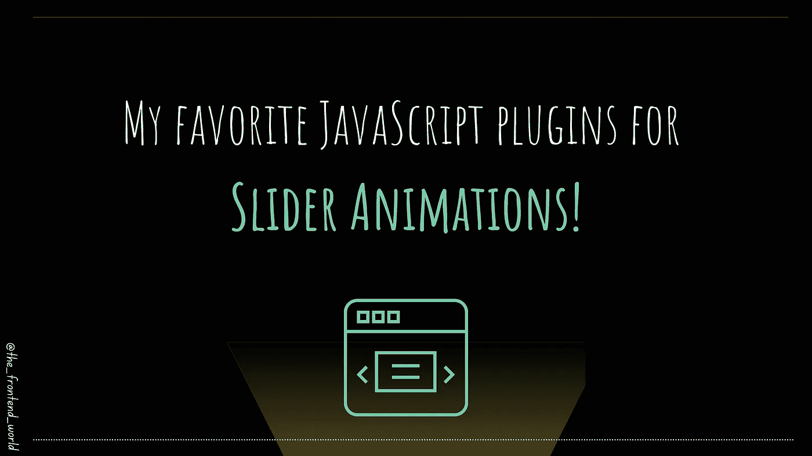

# 我最喜欢的滑块动画 JavaScript 插件

> 原文：<https://levelup.gitconnected.com/my-favorite-javascript-plugins-for-slider-animations-e11e60f07071>

## 你的应用程序前端最好的滑块工具

作者:FAM

滑块现在很受欢迎。它们以一种轻松的方式呈现大量数据，不会让用户对信息量感到不舒服。

当你需要在你的应用中添加一个辅助系统时，在一些地方有好的参考是很有帮助的😉。在这篇文章中，我收集了我的最爱！

# Swiper

Swiper 是一个现代化的免费移动触摸滑块，具有硬件加速过渡和出色的本机行为。这很好，因为现在移动用户的比例很高。此滑块旨在用于移动原生或混合应用程序。

 [## swiper——最现代的移动触摸滑块

### Swiper 是最现代的免费移动触摸滑块，具有硬件加速过渡和惊人的本地行为。

swiperjs.com](https://swiperjs.com/) 

## 支持

它支持现代的库和框架，如 Angular，ReactJs，Svelt，vue js…等等。它的重点是现代应用和平台，以带来最佳的体验和简单性。

## 民众

 [## Swiper 演示

### Swiper 是最现代的免费移动触摸滑块，具有硬件加速过渡和惊人的本地行为。

swiperjs.com](https://swiperjs.com/demos) 

> 我给它一个⭐️奖，因为它的文档太棒了！

# Slidr.js

js 是一个轻量级的 javascript 库。它是独立的，不依赖其他库工作。如果您寻求简单性和小应用程序的大小，这是完美的选择。

 [## slidr.js —添加一些幻灯片效果。

### 功能—* *根据需要添加任意数量的 Slidr * *—*甚至可以将它们放在一起。*—* *动态调整大小* *—*适应…

www.bchanx.com](http://www.bchanx.com/slidr) 

> 我给它一个⭐️奖，因为它简单，效果棒，体积小！

# 光滑滑块

一个反应灵敏的滑块，有很多选项可以定制你的滑块。

 [## 滑头——你需要的最后一个旋转木马

### slick 是一个响应式 carousel jQuery 插件，支持多个断点、CSS3 转换、触摸事件/滑动…

kenwheeler.github.io](http://kenwheeler.github.io/slick/) 

## 民众

 [## 滑头——你需要的最后一个旋转木马

### slick 是一个响应式 carousel jQuery 插件，支持多个断点、CSS3 转换、触摸事件/滑动…

kenwheeler.github.io](http://kenwheeler.github.io/slick/) 

> 我给它一个⭐️奖，因为它有各种各样的选择！

# 狡猾的滑块

JavaScript 库。它只关注单向滚动。

 [## 狡猾的

### JavaScript 库，支持基于项目的单向滚动导航。

达尔萨.因](https://darsa.in/sly/) 

如果你的 app 只需要这个一维动画，那么这可能是你的完美选择。

> 我给它的视差模式调整一个⭐️

# 轻佻

现有的一个很好的 carousel 库，有一个普通的 js 选项。适合 WordPress 应用和使用 jQuery 和普通 JavaScript 的应用。

 [## 轻佻

### 直接链接到 unpkg 上的 Flickity 文件。用 npm 安装:npm 安装 flickity 用 bower 安装:Bower 安装…

flickity.metafizzy.co](https://flickity.metafizzy.co/) 

> 给它一个⭐️控件，它给你定制你的旋转木马

## 民众

 [## 应用程序接口

### 方法是由 Flickity 实例完成的动作。使用 jQuery，方法遵循 jQuery UI 模式＄carousel . flickity(…

flickity.metafizzy.co](https://flickity.metafizzy.co/api.html) 

我喜欢第一和第二个滑块。第一个在它提供给你的建议和选择方面是丰富的。第二个选择也给你不可思议的结果，体积很轻。这是一个极简主义的解决方案，我喜欢。 ***你呢？***

> 我今天的故事到此结束，我希望你喜欢它，并从中吸取教训，❤

[如果你喜欢看我的文章……♥️](https://famzil.medium.com/subscribe)

 [## 如果你喜欢看我的文章… ♥️

### 如果你喜欢读我的文章… ♥️，当我的文章发表时，欢迎你第一个得到通知…

famzil.medium.com](https://famzil.medium.com/subscribe) 

> 谢谢你，❤

如果你有兴趣成为付费会员，你可以使用我的推荐链接。下次见

亲爱的读者，感谢你在我生命中的存在。下面就让**在** [**中**](https://medium.com/@famzil/)**[**Linkedin**](https://www.linkedin.com/in/fatima-amzil-9031ba95/)**[**脸书**](https://www.facebook.com/The-Front-End-World)**[**insta gram**](https://www.instagram.com/the_frontend_world/)**[**YouTube**](https://www.youtube.com/channel/UCaxr-f9r6P1u7Y7SKFHi12g)**或**上取得联系吧************

**参见我的关于网络要素和一般文化的电子书。**