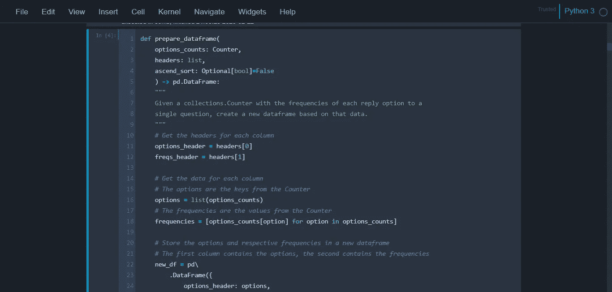

# 作为新手我最喜欢的 Jupyter 笔记本快捷键

> 原文：<https://levelup.gitconnected.com/my-favorite-jupyter-notebook-shortcuts-as-a-newbie-5edf6c9be082>


[(来源)](https://unsplash.com/photos/gZB-i-dA6ns)

在花了两周时间用 Jupyter Notebook 用 Python 进行数据分析后，我决定编辑一个我最喜欢的键盘快捷键/我最常用的快捷键的简短列表。

对于这些快捷键，请记住，您可以通过按`Esc`进入命令模式(以执行笔记本级别的操作),并且可以通过按`Enter`返回编辑模式(也就是回到在单元格中书写)。如果一个快捷键需要命令模式，我会指定`Esc`为第一键。

*   运行当前单元格:`Ctrl` + `Enter`
*   运行当前单元格并移动到下一个:`Shift` + `Enter`
*   删除当前单元格:`Esc` + `D` + `D`(双击)
*   在当前单元格上方插入新的(编码)单元格:`Esc` + `A`
*   在当前单元格下插入新的(编码)单元格:`Esc` + `B`
*   将当前单元格的类型改为降价:`Esc` + `M`
*   将当前单元格的类型改为编码:`Esc` + `Y`
*   折叠所有单元格:`Ctrl` + `Shift` +左箭头
*   取消折叠所有单元格:`Ctrl` + `Shift` +右箭头

除了默认的键盘快捷键，您还可以定义一些自己的快捷键。这是通过访问笔记本菜单选项中的“帮助”>“编辑键盘快捷键”来完成的。在对话框中滚动，直到找到您想要的操作，然后在“添加快捷方式”输入框中键入组合键。请注意，您需要用连字符(-)来分隔这些键。不要忘记点击加号按钮来保存新的快捷方式！

所以，这些是我用得最多的自定义快捷键:

*   重启内核并运行所有单元:`Shift` + `R`
*   切换折叠的所有单元格输出(折叠所有单元格的输出):`Ctrl` + `Shift` + `O`
*   清除所有单元输出:`Ctrl` + `Shift` + `Alt` + `O`

这里有一个奖励:黑暗模式主题。首先你需要安装 Jupyter 笔记本主题，在命令行上输入简单的`pip install`:

```
pip install jupyterthemes
```

要更改为黑暗模式主题，请使用此命令(将笔记本主题更改为切斯特风格主题):

```
jt -t chesterish
```

重启 Jupyter 服务器，瞧。您的笔记本现在将如下所示:



jupyterthemes 切斯特主题预览

关于 jupyterthemes 包的更多信息，你可以在这里找到它的 GitHub 库[。](https://github.com/dunovank/jupyter-themes)

希望这个快捷方式列表有用。当我开始使用 Jupyter Notebook 时，我首先查找的是键盘快捷键，所以我决定写下并分享这个列表，因为我已经花了一些时间来使用它。

请随意分享您喜欢的键盘快捷键来改进此列表:)