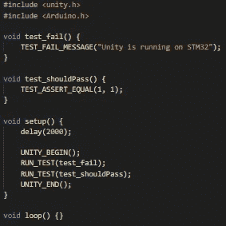
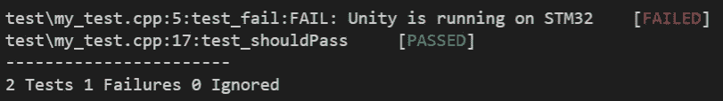
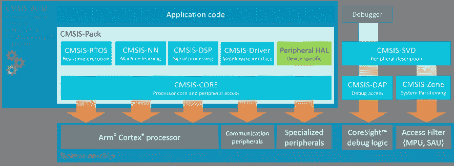

# 我最喜欢的嵌入式系统库

> 原文：<https://levelup.gitconnected.com/my-favorite-libraries-for-embedded-systems-a65ff0afc3dc>

## 推荐四个牛逼的图书馆。

作为一名充满激情的嵌入式系统开发人员，我面临过很多不得不重新发明轮子的情况。
在这种情况下，我只是告诉自己，对于我正在使用的平台，没有这样的库可用，或者，如果有什么有用的东西，不幸的是，它充斥着大量 Arduino delay()函数调用…即使它是一个用于二叉树处理的库。

但是我承认有独角兽存在:跨平台的、文档完善的、(几乎)无 bug 的库，它们不依赖于特定于架构的代码，因此可以原样放入您的嵌入式项目中！

## *今天，我将与您分享 4 个最好的 C/C++库，它们非常非常可能与您正在使用的微控制器兼容！*

## 好吧，我们继续。

# 1.一致

H 你曾经在 Arduino 上体验过[测试驱动开发(TDD)](https://en.wikipedia.org/wiki/Test-driven_development) 吗？
如果是这样，我相信你已经使用过 [Unity](https://github.com/ThrowTheSwitch/Unity) 测试库了。

尽管 TDD 的其他替代方案确实存在(例如[*cputest*](https://cpputest.github.io/))，但它的一个主要优势来自于 Unity 是一个普通的老式 C 库:如果运气好的话，它可以很容易地集成到你的项目中。

但是它是如何工作的呢？首先，您定义自己的函数来访问标准输出:这些函数将用于打印测试结果。

然后，你写一堆单元测试，除了 void 函数什么都不是，用一个实用方法把它们添加到 Unity 测试列表中。例如，看一下这段代码:

Unity 测试示例— test_fail()和 test_shouldPass()在 Arduino setup()函数中运行

当我在微控制器上刷新并运行程序时，它会打印出这样的信息:

通过 PlatformIO 内核运行 Unity 测试(在 STM32F401RE 上)

# 2.CMSIS

好吧，这可能是基于 ARM 的微控制器最广泛的一段代码，我们中的一些人已经利用了很长时间，甚至不知道它的存在。

[通用微控制器系统接口标准](https://www.arm.com/why-arm/technologies/cmsis) (CMSIS)是由 ARM 定义的一套接口，旨在提高不同厂商生产的微控制器之间的互操作性。

CMSIS 概述。来源:ARM 网站

使用 CMSIS，您可以访问标准化的 RTOS、HAL 甚至神经网络包，这些包可以在完全不同的设备之间完全移植。有兴趣的话，也有简化“裸机”C 编程的仅头文件、特定于供应商的包(看看[设备](https://www.keil.com/pack/doc/CMSIS/Core/html/device_h_pg.html))。

我想值得指出的是，ARM 并不负责实现过程。因此，这是很常见的，例如，提供了 RTOS 的实现，但没有一个哈尔。

换句话说，你必须看看是否有人实现了你要找的模块。引用我最喜欢的电影之一:

> 这是一个英雄，不是我们应得的英雄，而是我们需要的英雄。

# 3.弗里托斯

Fre ertos 是一个开源的实时操作系统，已经移植到大量的微控制器上。它为并发编程和访问共享资源提供了各种实用工具，例如任务、队列、互斥和非阻塞延迟！

然而，它的杀手锏之一是其庞大的社区:无论你有什么问题，只要在谷歌搜索栏中键入一串单词，你很可能会找到一个现成的解决方案。

因此，如果你愿意接受嵌入式操作系统的强大功能，而不必绑定到任何封闭的专有解决方案，那么可以考虑尝试一下 FreeRTOS。

# 4.嵌入式模板库

作为一个 C++爱好者，我一直梦想有一种方法可以在我的嵌入式代码中去掉普通的 C 数组…
你知道，也许可以使用类似于 [STL](https://en.wikipedia.org/wiki/Standard_Template_Library) 的东西！

我很自豪地宣布，解决方案终于出来了。
由 John Wellbelove 开发的[嵌入式模板库(ETL)](https://www.etlcpp.com/home.html) 是易用性和效率之间的折衷，同时保持代码一如既往的确定性。事实上，每个 ETL 容器都有在编译时确定的固定容量:根本没有 malloc/free！

这个包还包括一些标准设计模式的参考实现，比如 GoF Visitor 和 Observer。

它绝对配得上 GitHub 上的一颗星！

感谢您阅读至此。如果你有任何关于适合嵌入式系统的花哨的 C/C++库的额外推荐，请在评论区发表！