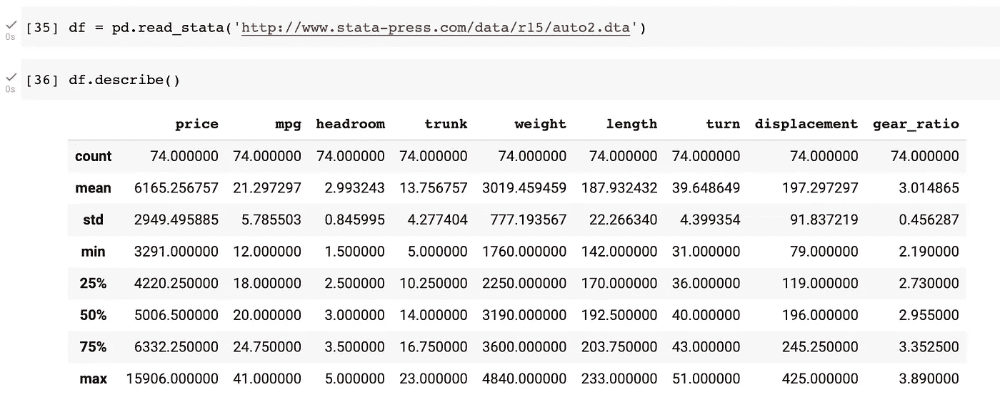
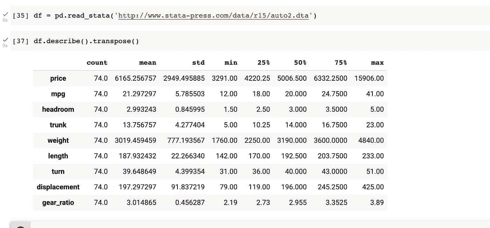
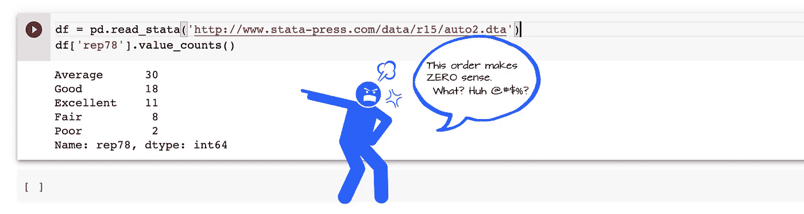
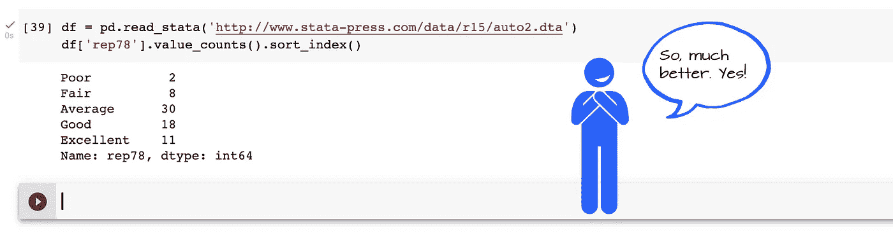
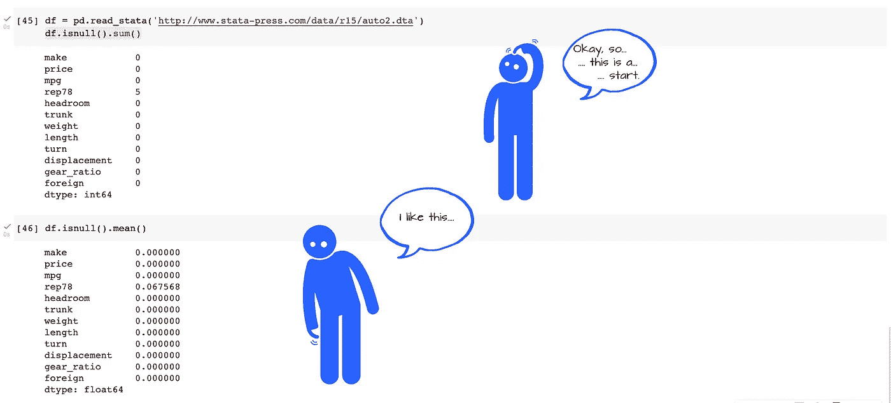
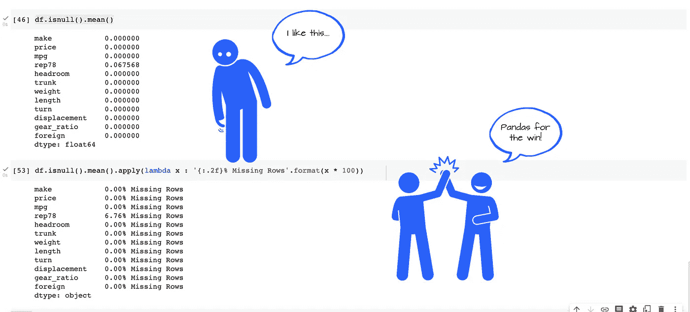

# 我最喜欢的熊猫方法链

> 原文：<https://levelup.gitconnected.com/my-favorite-pandas-method-chains-1cf36483e6c9>


作者插图。

## 熊猫的超级连锁店赢了！

## 我使用(和重用)方法链是因为它们以编程的方式很有帮助和富有诗意

# 介绍

当我开始写这篇文章时，我原本打算分享一些我自己使用的常用方法链。没见别人用。我有一种预感，它们可能对其他人有用。

在起草的最后，我意识到这已经变成了对熊猫的颂歌。你有没有发现自己也在代码中发现了诗意？

下面是我不能没有的三个(半)方法链。我希望你也会觉得它们有用。

开始之前，请务必像往常一样`import pandas as pd`。

## 旋转熊猫描述输出

Pandas `describe()`的默认输出将数据框列放在顶部，将统计数据放在侧面和行上。例如:

```
# For the convenience of copy-paste:
df = pd.read_stata('http://www.stata-press.com/data/r15/auto2.dta')
```



作者的屏幕截图。

我的大脑就是不这样工作！另一个问题是，对于较宽的集合(许多列)，输出不太适合显示空间。下面的方法链提供了一个简单的修复方法:

```
df.describe().transpose()
```

给你:



作者的屏幕截图。

这样更容易阅读。此外，在显示(和读取)输出时，您不会耗尽水平屏幕空间。

## 让价值计数更具可读性

当`df['col_name'].value_counts()`方法产生的输出不按键/索引列排序时，你会讨厌吗？比如说。



作者插图。

为什么*优秀的*排在中间？还有为什么*平均*在最上面？这毫无意义。下面的方法链提供了一个简单的修复方法:

```
df['col_name'].value_counts().sort_index()
```

给你:



作者插图。

## 检查丢失的数据

所有最好的教程都建议将`df.isnull().sum()`作为检查缺失数据的有用方法。这很有效。但是让我们看看稍微不那么直观的`df.isnull().mean()`。当你找到一个二进制数的平均值时会发生什么？你得到平均真实。因此，您看到的不是每一列中缺失的计数，而是每一列中缺失的比例。例如:



作者插图。

让我们更进一步。让我们使输出更加明确。下面的方法链(和 lambda 函数)可以做到这一点。

```
df.isnull().mean().apply(lambda x : 
                         '{:.2f}% Missing'.format(x * 100))
```

该链提供:



作者插图。

[](https://adamrossnelson.medium.com/membership) [## 加入我的介绍链接媒体-亚当罗斯纳尔逊

### 作为一个媒体会员，你的会员费的一部分会给你阅读的作家，你可以完全接触到每一个故事…

adamrossnelson.medium.com](https://adamrossnelson.medium.com/membership) 

# 结论

在这篇即兴的*熊猫颂*中，我分享了三个(半个)我离不开的方法链。这些方法链是优雅的一行程序，使您的工作更容易，您的输出更可读。他们帮助你完成工作。

让我知道我可能错过了什么？留下你的想法和改进意见。

当我凝视窗外时，我想做的另一件事更容易:移动熊猫柱。来自其他工具，我总是惊讶于这是多么困难。关于该主题的更多信息:

[](https://towardsdatascience.com/reordering-pandas-dataframe-columns-thumbs-down-on-standard-solutions-1ff0bc2941d5) [## 重新排序熊猫数据框列:否定标准解决方案

### 简化更改数据框列顺序过程的解决方案

towardsdatascience.com](https://towardsdatascience.com/reordering-pandas-dataframe-columns-thumbs-down-on-standard-solutions-1ff0bc2941d5) 

# 感谢阅读

感谢阅读。把你的想法和主意发给我。你可以写信只是为了说声嗨。我期待着尽快聊天。推特:[@ adamrossnelson](https://twitter.com/adamrossnelson)LinkedIn:[亚当·罗斯·尼尔森在推特](https://www.linkedin.com/in/arnelson)和脸书:[亚当·罗斯·尼尔森在脸书](https://www.facebook.com/adamrossnelson)。