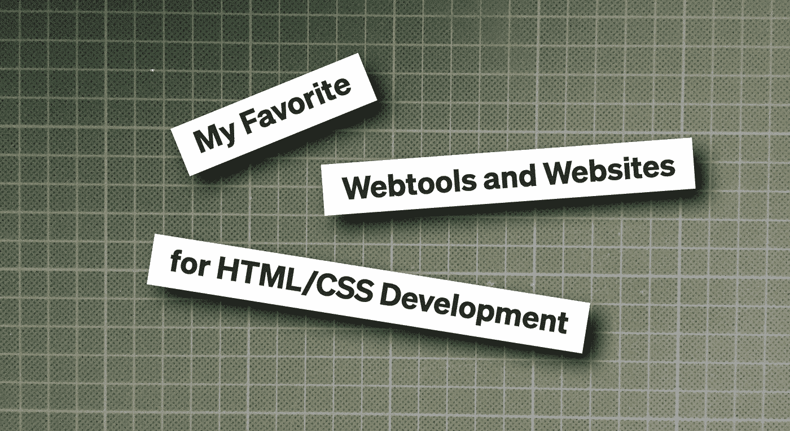

# 我最喜欢的 HTML/CSS 开发工具和网站

> 原文：<https://levelup.gitconnected.com/my-favorite-webtools-and-websites-for-html-css-developement-f5a13219da99>

## 这里有一些对前端开发非常有帮助的网站



作者提供的图片

我几乎每天都在使用一些网络开发的在线工具。也许其中一个对你也有帮助。

# 非常酷的 CSS 网站

我最喜欢的电影之一是 caniuse.com。如果你想知道某个浏览器是否能显示你的 CSS 代码，你可以在那里找到。

一些生成器仅使用 CSS 创建框阴影、flex 代码或三角形:

*   https://www.cssmatic.com/box-shadow
*   【https://the-echoplex.net/flexyboxes/ 
*   [http://apps.eky.hk/css-triangle-generator/](http://apps.eky.hk/css-triangle-generator/)

这些工具经常节省我很多时间。您可以试验代码，然后将其复制/粘贴到您的项目中。

## **电子邮件客户端的 CSS**

如果你曾经不得不为 HTML 邮件编写模板，这是一个很好的关于什么样的 CSS 可以或者不可以工作的集合:

[https://www.campaignmonitor.com/css/](https://www.campaignmonitor.com/css/)

剧透:接下来我会写一系列关于我编写 HTML 邮件的经历，所以你可以期待。

# 初学者和高级开发人员的资源

关于 HTML、CSS、Javascript 和更多内容的概述、教程和更深入的信息可以在这里找到:[https://www.w3schools.com/](https://www.w3schools.com/)。

在这里，您可以找到非常有趣的长期浏览器统计数据:

[https://www.w3schools.com/browsers/](https://www.w3schools.com/browsers/)

但是，请记住，这些数字不一定适用于您的网站或 web 应用程序。用户和他们使用的设备/浏览器取决于您的内容。

一个历史悠久的类似网站可以追溯到 2000 年:

[https://wiki.selfhtml.org/](https://wiki.selfhtml.org/)

作为初学者，我真的很喜欢它，但它只有德语版。

# 各种移动设备的屏幕尺寸

今天的网站需要对几乎所有的移动设备做出响应。但是它们的屏幕尺寸是多少呢？

你可以在这里找到答案:[https://www.mydevice.io/](https://www.mydevice.io/)

在页面顶部，你会发现很多关于你自己的设备和浏览器的信息。如果你向下滚动，你会看到各种智能手机，平板电脑，甚至谷歌眼镜(点击其他设备)的非常详细的概述。

在这里你可以找到对开发很重要的物理尺寸和 CSS 尺寸，但是记住这些值代表了设备的整个屏幕。

浏览器 app 总是有一个顶栏和一个底栏，移动 OS 在顶部也有一个小栏，所以 CSS 高度总是低于 mydevice.io 上指定的高度，不要误会:mydevice.io 是正确的，针对整个屏幕！

# Base64 工具

如果您想使用“数据/图像”而不是“”，通常会将图像转换为 base64 代码，并将其用作图像的“src ”:

```

```

CSS 背景图片也是如此:

```
background-image: url('data:image/png base64,iVBORw0KGgoAAAANSUhEUgAAAC...');
```

这里有一个完美的工具:[https://www.base64-image.de/](https://www.base64-image.de/)。只需拖放你的图像，然后你就可以复制/粘贴代码，用于< IMG >标签或 CSS 背景图像。

有时我为没有真正的网络根目录的应用程序编写前端程序。如果只需要一个徽标，嵌入它是一个简单的方法，后端开发人员很高兴不必在后端的服务器上设置到图像目录的路径。

## **解码编码 Base64**

有时我需要处理电子邮件的原始源代码，不幸的是 HTML 部分经常是一场灾难，邮件客户端或服务器从原始代码中制作出一些奇怪的代码，因此无法进一步处理。不过 Base64 部分还可以，这里可以解码:[https://www.base64decode.org/](https://www.base64decode.org/)

# 两个更有趣的工具

想找一个很酷的加载动画？你可以在这里找到它:[https://loading.io/](https://loading.io/)。

几年前我发现了它，当时只有少量的固定形状和颜色选择。但现在有一个巨大的选择，旋转形状与发电机改变形状，颜色和更多，以满足您的需求。

有限制使用的免费计划和每月或每年的计划。

如果你正在处理 JSON 代码，这可能是有帮助的:[https://jsoneditoronline.org/](https://jsoneditoronline.org/)。

只需粘贴您的 JSON 并检查代码是否正确，或者编辑它以纠正它。

# 遗言

我在互联网上做了很长时间的 web 开发人员，发现了所有这些工具、生成器和教程。没人付钱让我在这里发表。我只是想与他人分享这些帮助页面。我希望他们能为你节省和我一样多的开发时间。

编码快乐！