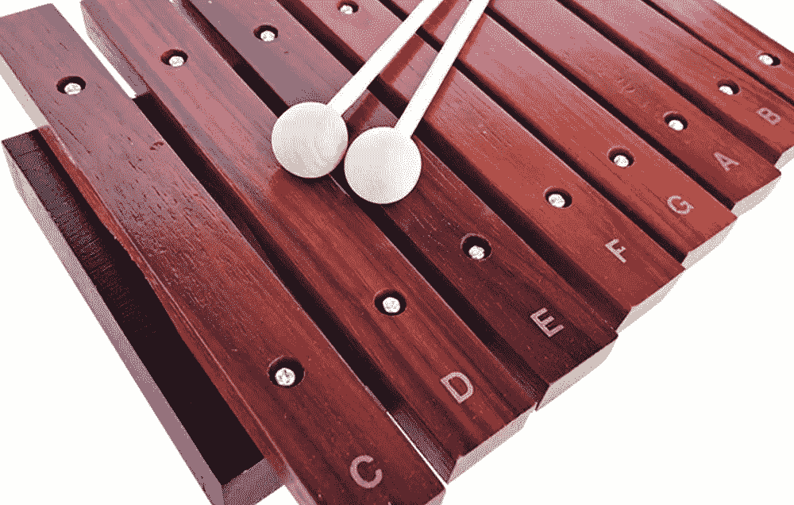
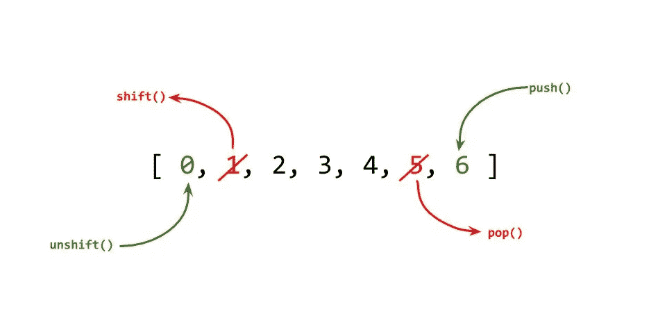
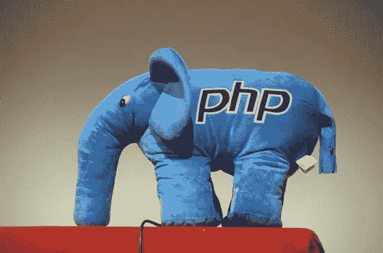

# 我最喜欢的 Web 开发人员面试问题:你真的了解数组吗？

> 原文：<https://levelup.gitconnected.com/my-favourite-web-developer-interview-question-do-you-really-understand-arrays-dd9a45f9ce32>


太阳能电池板阵列(图片:[美国公共电力协会](https://unsplash.com/@publicpowerorg?utm_source=unsplash&utm_medium=referral&utm_content=creditCopyText) via Unsplash)

在我的 web 开发领域，我们希望 web 开发人员既熟悉 PHP 又熟悉 Javascript。我发现这个*一个简单的问题*告诉我一个开发人员是否真正了解他们每天使用的工具:

> **问:Javascript 和 PHP 中数组的异同？**

能砍代码是一回事。能够理解你所使用的语言的精髓完全是另一回事。

这个问题告诉了我很多。看，几乎每种主要的编程语言都有数组，很容易假设它们都或多或少相同。很多程序员都这样。

这是一个不正确的假设，会导致过多的细微错误、浪费代码，以及无法最有效地利用语言的优势。

# 母语中的数组— C

c 不是第一编程语言，但它是最有影响力的。很多开发人员第一次学习 C 是在大学。PHP 和 Javascript 都源于 c 语言，至少部分源于 c 语言。所以有一点相似之处，这是展示数组自 1972 年以来发展的一个很好的参考点。

在 C #中，数组是强类型的，长度固定。

```
int myArray[10];
int fibonacci[10] = {0, 1, 1, 2, 3, 5, 8, 13, 21, 34};
```

这是一个数组。它只能保存*、*整数，最多可以保存 10 个元素。

为了使用这个数组，我们使用 for 循环对它进行迭代——这种模式在各种编程语言中被不必要地重复了:

```
int i, sum;
for (i = 0; i < 9; i++) {
  sum += fibonacci[i];
}
```

对于 Javascript 或 PHP 开发人员来说，这看起来并不陌生，这就是危险所在。

# Javascript 中的数组



如果您认为 Javascript 中的数组是相似的，那也情有可原:

```
let myArray = [];
let fibonacci = [0, 1, 1, 2, 3, 5, 8, 13, 21, 34];
```

他们不是。这在 C 语言中显然是不可能的:

```
myArray[0] = 5;
myArray[1] = 5.5;
myArray[2] = 'cat';
myArray[3] = [1,2,3];
myArray[4] = (a,b) => {a+b};
myArray[1000] = 'mind blown';// myArray = [5, 5.5, 'cat', [1,2,3], (a,b) => {a+b}];
```

在 Javascript 中，数组有*变量*长度，内容*无类型*——就像 Javascript 中的任何其他变量一样。这种语言负责内存管理，所以我们的数组可以增长和收缩而不用担心 Javascript 中的数组实际上是一个列表。

迭代数组可能做得很糟糕(或者很幼稚):

```
let sum = 0;
for (i = 0; i < fibonacci.length; i++) {
  sum += fibonacci[i];
}
```

但是老式的 C 方法迭代数组是不必要的。有不必要的中间变量，有可能因未定义或无效的值而产生错误(实际上在`fibonacci[10]`中有定义的值吗？它是整数吗？)

但是 Javascript 比这更好。数组不仅仅是数组——就像函数一样，它们是 Javascript 中的一级对象，它们有处理这类事情的类方法:

```
let sum = fibonacci
   .filter(Number.isInteger)
   .reduce(
      (x,y) => {return x+y}, 0
    );
```

那就好多了！



此外，Javascript 数组不像 C 数组那样长度固定，这允许它们以有趣的方式增长。你可以*将一个数组的最后一个元素*弹出，然后*将*元素推入。您可以通过*移动、*从前面移除元素，或者通过*取消移动来添加元素。*根据您的用例，您可以使用不同的组合将 Javascript 数组视为堆栈或队列。

# PHP 中的数组



大象(图片:[曼纽尔·巴尔达萨里](https://www.flickr.com/photos/kea42/4372405053)，来自 Flickr)

PHP 中的数组看起来几乎像 Javascript。

像 Javascript 一样，它们是可变长度的，弱类型的。你可能会认为它们是一样的。

```
$myArray = [];
$fibonacci = [0, 1, 1, 2, 3, 5, 8, 13, 21, 34];$myArray[0] = 5;
$myArray[1] = 5.5;
$myArray[2] = 'cat';
$myArray[3] = [1,2,3];
$myArray[4] = function($a, $b) { return $a + $b; };
```

Lambda 函数不像 Javascript(从 ES6 开始)那么优雅，但它在功能上等同于我们之前的示例。

你也可以使用 Javascript 的 push 和 pop ( `array_push`、`array_pop`)以及 shift 和 unshift(`array_shift`、`array_unshift`)


一本字典(照片:[约书亚·赫内](https://unsplash.com/@mrthetrain?utm_source=unsplash&utm_medium=referral&utm_content=creditCopyText)在 [Unsplash](https://unsplash.com/s/photos/dictionary?utm_source=unsplash&utm_medium=referral&utm_content=creditCopyText) 上)

但是在 Javascript(或 C)中不能这样做:

```
$myArray['banana'] = 'yellow fruit';
$myArray[5] = 'is alive';
$myArray[0.02] = 'the 2%';
```

在 PHP 中，数组在技术上是哈希表或字典。它们使用*键*来存储*值，*键可以是任何原语:比如 int、float 或 strings。因为它是一个字典，通过任何键查找一个值都是非常高效的——它发生在 *O(1)* 时间。

这意味着 PHP 数组可以作为一个简单的查找表。

```
$colours = [
  'red' => '#FF0000',
  'green' => '#00FF00',
  'blue' => '#0000FF',
  'orange' => '#FF6600',
];
```

PHP 数组给了你各种各样的灵活性。PHP 数组可以按键排序，也可以按值排序。您可以翻转数组，反转键和值，这可以提高各种查找效率。在一个常规的未排序数组中寻找一个特定的值是非常困难的，因为你需要检查数组中的每一个值。

在 PHP 中找到一个特定的值可以非常容易:

```
$users = [
  1 => 'Andi',
  2 => 'Benny',
  3 => 'Cara',
  4 => 'Danny',
  5 => 'Emily',
];
$lookupTable = array_flip($users);
return $lookupTable['Benny'];
```

当然，您可以在 Javascript 中完成这类事情，但是数组不会帮您完成—您需要使用一个*对象*。但是这也有它自己的权衡:你不能得到像排序和推送/弹出/移位这样的常规数组操作。

PHP 数组的迭代也更加简单和安全。你*可以*像在 C 语言中一样使用`for`循环，但是你为什么要这样做呢？PHP 通过给你`foreach`循环来解决可变长度和类型的问题:

```
$sum = 0;
foreach ($myArray as $key => $value) {
  $sum += is_numeric($value) ? $value : 0;
}
```

循环同时析构键和值，所以你可以操作这两者。

声明一下，您*可以*像在上面的 Javascript 中一样使用更高级的函数，但是在 PHP 中，数组*不是*一级对象，所以它需要一些核心方法:

```
$sum = 
  array_reduce(
    array_filter($fibonacci, 'is_numeric'),
    function ($x, $y) { return $x + $y; },
    0
  }; 
```

这是功能性的——一语双关——但不够优雅。如果你想用这种方式编码(有一些很好的理由)，你可以求助于图书馆，比如 Laravel 的收藏。但是 PHP 也允许你创建像数组一样运行*的对象(你可以在`foreach`循环中使用)。*

如果 PHP 是您的主要编程语言，您可能经常会忘记这种最基本的语言结构到底有多少功能。

**但是简单地说:数组是 PHP 更被低估和谦逊的超能力。**

# TL；博士？

**问:Javascript 和 PHP 中数组的异同？**

**答:在 PHP 和 Javascript 中，数组是可变长度的弱类型列表。在 Javascript 中，数组是由整数键控和排序的。在 PHP 中，数组是可排序的列表和可搜索的字典。键可以是任何基本类型，数组可以按键或值排序。**